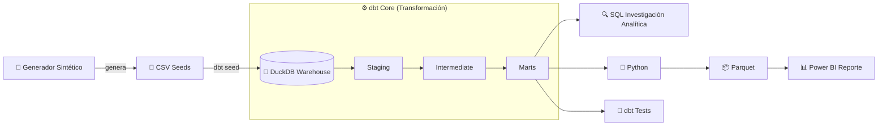

# 🛒 E-commerce Analytics

### Introducción:
Este proyecto abarca el ciclo completo de un proceso de analítica de datos moderno: desde la **generación de un dataset sintético con una narrativa de negocio deliberada**, la construcción de un **Pipeline ELT con dbt Core + DuckDB**, una **Investigación Analítica SQL** sobre el datawarehouse con DBeaver, hasta la elaboración de un **Reporte Interactivo en Power BI**.

### Objetivo:
Identificar las causas raíz de la caída de facturación y, sobre todo, de la rentabilidad de una empresa de retail tecnológico entre 2025 y 2026, y elaborar recomendaciones estratégicas basadas en evidencia para apoyar la toma de decisiones ejecutivas.

### Stack Técnico Principal:

     

---

### 🗺️ Índice
- [📉 Problema de Negocio](#-problema-de-negocio)
- [📊 Hallazgos del Análisis en Power BI](#-hallazgos-del-análisis-en-power-bi)
- [🎯 Recomendaciones Estratégicas](#-recomendaciones-estratégicas-basadas-en-evidencia)
- [🔄 Flujo de Datos (Arquitectura Pipeline)](#-flujo-de-datos-arquitectura-pipeline)
- [🛠️ Desarrollo Técnico & Módulos](#%EF%B8%8F-desarrollo-técnico--módulos)
  - [⚙️ Pipeline ELT con dbt Core + DuckDB](#%EF%B8%8F-2-pipeline-elt-con-dbt-core--duckDB)
  - [🔍 Investigación Analítica SQL](#-3-investigación-analítica-sql)
  - [🐍 Script de Exportación en Python](#-4-script-de-exportación-en-python)
  - [📊 Modelo de Datos & BI (Power BI)](#-5-modelo-de-datos--reporte-en-power-bi)
- [📂 Estructura del Repositorio y Guía de Replicación](#-estructura-del-repositorio--guía-de-replicación-local)
- [👤 Autor](#-autor)

---

> ⚠️ Para priorizar la perspectiva de negocio, este README presenta primero los hallazgos respaldados con el Reporte en Power BI junto con las recomendaciones estratégicas, y posteriormente la arquitectura técnica que permitió obtenerlos.

---

## 📉 Problema de Negocio

A pesar de haber alcanzado un volumen récord de transacciones entre 2025 y 2026 (**+4.30% en pedidos**), la compañía enfrenta un severo deterioro financiero. 

Las **Ventas Netas cayeron un -38.85%** como consecuencia de un desplome directo en el **Ticket Promedio Comercial (-41.37%)**. Sobre esta menor base de ingresos, la presión de la estructura de costos provocó que la **Ganancia Neta colapsara un -66.20%**, reduciendo el margen neto de la empresa del **18.53% al 10.66%**.

El objetivo de este proyecto es identificar las causas raíz detrás de la caída de ingresos y la compresión de márgenes, evaluando el impacto del mix de productos, los descuentos y la estructura de costos para proponer recomendaciones estratégicas basadas en evidencia.

---
---

## 📊 Hallazgos del Análisis en Power BI 

<details>
<summary><b>1. Vista Ejecutiva — ¿Qué pasó con el negocio? (Clic para expandir)</b></summary><br>

<!-- Aqui pongo los hallazgos -->


</details>

<!-- Y asi repito con las otras hojas de BI -->

---
---

## 🎯 Recomendaciones Estratégicas Basadas en Evidencia

<!-- Aqui van las recomendaciones estrategicas -->

---
---

## 🔄 Flujo de Datos (Arquitectura Pipeline)



---
---

## 🛠️ Desarrollo Técnico & Módulos

A continuación se detalla la arquitectura técnica que da soporte al análisis de negocio. Cada módulo cuenta con su propio directorio y documentación dedicada.

---
---

### ⚙️ 2. Pipeline ELT con dbt Core + DuckDB
Construcción del Data Warehouse analítico. Se transforma la información desde fuentes CSV crudas hacia un modelo dimensional (**Star Schema**) optimizado para BI, aplicando pruebas de calidad de datos y buenas prácticas de ingeniería.
* 📁 **Directorio:** [`/dbt_core_pipeline`](./dbt_core_pipeline)
* 📄 **Documentación:** [Ver README técnico de dbt](./dbt_core_pipeline/README.md)

---
---

### 🔍 3. Investigación Analítica SQL
Catálogo de consultas exploratorias y complejas ejecutadas con DBeaver sobre DuckDB. Permitió auditar la evolución interanual, desglosar la estructura de P&L, analizar el comportamiento por cohortes y validar la causa raíz de la caída de margen antes del diseño de dashboards.
* 📁 **Directorio:** [`/sql_business_analysis`](./sql_business_analysis)
* 📄 **Documentación:** [Ver Catálogo de Consultas SQL](./sql_business_analysis/README.md)

---
---

### 🐍 4. Script de Exportación en Python
Script automatizado que extrae los datos modelados en los Marts de DuckDB y los convierte a archivos optimizados en formato Parquet para una ingesta eficiente desde Power BI.
* 📁 **Directorio:** [`/scripts`](./scripts)
* 📄 **Documentación:** [Ver README de scripts](./scripts/README.md)

---
---

### 📊 5. Modelo de Datos & Reporte en Power BI
Diseño de la capa de visualización analítica sobre los archivos Parquet. Incluye la arquitectura del modelo de datos en estrella (Star Schema), implementación de medidas DAX avanzadas (Time Intelligence, KPIs dinámicos, análisis YoY), optimización del rendimiento y diseño de UX/UI enfocado en decisiones ejecutivas.
* 📁 **Directorio:** [`/power_bi_analytics`](./power_bi_analytics)
* 📄 **Documentación:** [Ver README técnico de Power BI](./power_bi_analytics/README.md)

---
---

## 📂 Estructura del Repositorio & Guía de Replicación Local

<details>
<summary><b>🛠️ Ver Árbol de Carpetas y Pasos de Instalación (Clic para expandir)</b></summary><br>

### Estructura del Repositorio

```text
dbt_elt_analytics/
├── .gitignore                    # Exclusión de binarios y entornos
├── README.md                     # Documentación principal del proyecto
├── requirements.txt              # Dependencias de Python (dbt-duckdb, pandas, pyarrow)
│
├── data_generation/              # Generador del dataset sintético
│   ├── generate_dataset.py       # Script generador (reglas de negocio, crisis 2026)
│   └── README.md                 # Documentación de los supuestos de diseño
│
├── dbt_core_pipeline/             # Módulo dbt Core (Modelado ELT)
│   ├── dbt_project.yml           # Configuración global de dbt
│   ├── profiles.yml.example      # Plantilla de conexión local a DuckDB
│   ├── seeds/                    # Fuentes de datos crudas (CSV)
│   ├── models/                   # Capas Staging, Intermediate y Marts
│   ├── tests/                    # Pruebas de calidad y reglas de negocio
│   └── README.md                 # Documentación técnica del módulo dbt
│
├── sql_business_analysis/        # Investigaciones SQL
│   ├── README.md                 # Catálogo de consultas y preguntas de negocio
│   └── *.sql                     # Scripts de análisis (evolución, rentabilidad, envíos)
│
├── power_bi_analytics/            # Capa de BI y Reportes
│   ├── README.md                 # Documentación del modelo de datos y medidas DAX
│   └── *.pbix                    # Dashboard ejecutable de Power BI
│
├── scripts/                       # Scripts de automatización
│   ├── README.md                 # Documentación de utilidad
│   └── export_marts_to_parquet.py # Exportador de DuckDB a formato Parquet
│
├── database/                     # Generado localmente (ignorado por Git)
│   └── warehouse.duckdb          # Base de datos analítica DuckDB
│
└── data_marts_parquet/           # Generado por script (ignorado por Git)
    └── *.parquet                 # Tablas dimensionales optimizadas para BI
```

### Guía de Replicación Local

### Requisitos Previos
* **Python 3.8+**
* **DuckDB embebido:** No requiere instalar ni levantar servidores de bases de datos externos.

### Paso a Paso

1. **Clonar el repositorio y configurar el entorno:**
   ```bash
   git clone https://github.com/tu_usuario/dbt_elt_analytics.git
   cd dbt_elt_analytics

   # Crear y activar entorno virtual
   python -m venv venv

   # En Windows:
   venv\Scripts\activate
   # En Linux/macOS:
   source venv/bin/activate

   # Instalar dependencias
   pip install -r requirements.txt
   ```

2. **Configurar el perfil de conexión dbt:**
   ```bash
   # Linux/macOS:
   cp dbt_core_pipeline/profiles.yml.example ~/.dbt/profiles.yml

   # Windows (PowerShell):
   copy dbt_core_pipeline\profiles.yml.example $env:USERPROFILE\.dbt\profiles.yml
   ```

3. **Ejecutar la canalización ELT:**
   ```bash
   cd dbt_core_pipeline
   dbt seed   # Crea database/warehouse.duckdb e ingesta CSVs
   dbt run    # Construye Staging, Intermediate y Marts
   dbt test   # Valida reglas de negocio y calidad de datos
   ```

4. **Exportar Marts a Parquet:**
   ```bash
   cd ..
   python scripts/export_marts_to_parquet.py
   ```

Los archivos `.parquet` se guardarán en `data_marts_parquet/` para ser consumidos desde **Power BI**, Excel o Python.

</details>

---
---

## 👤 Autor

<!-- Tu nombre, LinkedIn y/o portfolio -->


