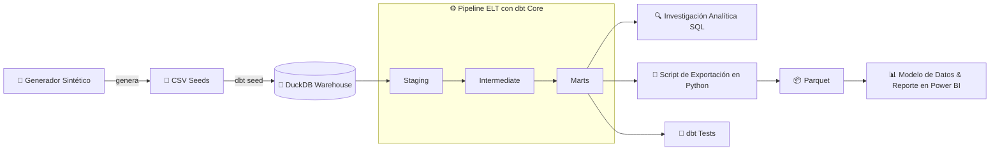

# 🛒 Proyecto de Analítica End-to-End sobre Retail de Tecnología

### Introducción:
Este proyecto abarca el ciclo completo de un proceso de analítica de datos moderno: desde la **generación de un dataset sintético con una narrativa de negocio deliberada**, la construcción de un **Pipeline ELT con dbt Core + DuckDB**, una **Investigación Analítica SQL** sobre el datawarehouse con DBeaver, hasta la elaboración de un **Reporte Interactivo en Power BI**.

### Objetivo:
Identificar las causas raíz de la caída de facturación y, sobre todo, de la rentabilidad de una empresa de retail tecnológico entre 2025 y 2026, y elaborar recomendaciones estratégicas basadas en evidencia para apoyar la toma de decisiones ejecutivas.

### Stack Técnico Principal:

     

---

## 🔄 Flujo de los Datos Completo (Arquitectura Pipeline)



---

> ⚠️ Para priorizar la perspectiva de negocio, este README presenta primero el problema, los principales hallazgos obtenidos con el Reporte en Power BI y las recomendaciones estratégicas. A continuación, se detallan los **módulos y componentes que conforman el proyecto**, junto con sus respectivas documentaciones, dejando para el final la estructura del repositorio y la guía de replicación.

---

### 🗺️ Índice
- [Problema de Negocio](#-problema-de-negocio)
- [Hallazgos del Análisis en Power BI](#-hallazgos-del-análisis-en-power-bi)
- [Recomendaciones Estratégicas](#-recomendaciones-estratégicas-basadas-en-evidencia)
- [Desarrollo Técnico & Módulos](#%EF%B8%8F-desarrollo-técnico--módulos)
  - [1. Pipeline ELT con dbt Core + DuckDB](#%EF%B8%8F-1-pipeline-elt-con-dbt-core--duckDB)
  - [2. Investigación Analítica SQL](#-2-investigación-analítica-sql)
  - [3. Script de Exportación en Python](#-3-script-de-exportación-en-python)
  - [4. Modelo de Datos & Reporte en Power BI](#-4-modelo-de-datos--reporte-en-power-bi)
- [Estructura del Repositorio y Guía de Replicación](#-estructura-del-repositorio--guía-de-replicación-local)
- [Autor](#-autor)

---

## 📉 Problema de Negocio

A pesar de haber alcanzado un volumen récord de transacciones entre 2025 y 2026 (**+4.30% en pedidos**), la compañía enfrenta un severo deterioro financiero. 

Las **Ventas Netas cayeron un -38.85%** como consecuencia de un desplome directo en el **Ticket Promedio Comercial (-41.37%)**. Sobre esta menor base de ingresos, la presión de la estructura de costos provocó que la **Ganancia Neta colapsara un -66.20%**, reduciendo el margen neto de la empresa del **18.53% al 10.66%**.

El objetivo de este proyecto es identificar las causas raíz detrás de la caída de ingresos y la compresión de márgenes, evaluando el impacto del mix de productos, los descuentos y la estructura de costos para proponer recomendaciones estratégicas basadas en evidencia.

---
---

## 📊 Hallazgos del Análisis en Power BI 

<details>
<summary><b>1. Vista Ejecutiva — ¿Qué pasó con el negocio? (Clic para expandir)</b></summary><br>

<!-- Aqui pongo los hallazgos -->


</details>

<!-- Y asi repito con las otras hojas de BI -->

---
---

## 🎯 Recomendaciones Estratégicas

<!-- Aqui van las recomendaciones estrategicas -->

---
---

## 🛠️ Desarrollo Técnico & Módulos

A continuación se detallan los módulos técnicos que dan soporte al análisis de negocio, junto con sus respectivas documentaciones.

---
---

## ⚙️ 1. Pipeline ELT con dbt Core + DuckDB

Construcción de una capa analítica reproducible sobre **DuckDB**, utilizando **dbt Core** para transformar datos transaccionales en un **Modelo Dimensional (Star Schema)** preparado para el análisis de negocio y el consumo en Power BI.

El pipeline organiza las transformaciones en tres capas, separando progresivamente la limpieza de datos, la aplicación de lógica de negocio y la construcción del modelo analítico final:

**CSV Raw → Staging → Intermediate → Marts**

**Principales componentes:**

* **Staging:** limpieza, estandarización de nombres y casteo de tipos sobre las fuentes raw.
* **Intermediate:** aplicación de lógica de negocio, enriquecimiento de datos, prorrateo de costos logísticos y cálculo de métricas de margen.
* **Marts:** construcción del modelo dimensional compuesto por tablas de hechos y dimensiones para el análisis posterior.

**Reglas de negocio destacadas:**

* Los pedidos cancelados conservan sus montos brutos para analizar demanda perdida, pero sus ventas netas se establecen en $0.
* Los costos de envío se prorratean a nivel de línea de pedido según su participación sobre el valor bruto de la orden.
* Las devoluciones ajustan las ventas netas finales y el COGS para reflejar el impacto económico del stock devuelto.

**Calidad y reproducibilidad:**

* Implementación de tests de **unicidad, no nulidad, integridad referencial y valores permitidos** mediante dbt.
* Validaciones SQL personalizadas para controlar la coherencia temporal y la consistencia de métricas y montos.
* Pipeline completamente reproducible mediante comandos `dbt seed`, `dbt run`, `dbt test` y `dbt build`.

📁 **Directorio:** [`/dbt_core_pipeline`](./dbt_core_pipeline)
📄 **Documentación:** [Ver README técnico del módulo dbt](./dbt_core_pipeline/README.md)

---
---

## 🔍 2. Investigación Analítica SQL

Investigación progresiva realizada con SQL y DBeaver sobre el Data Warehouse en DuckDB, orientada a explicar el deterioro comercial y financiero observado entre 2025 y 2026.

La investigación parte de un **diagnóstico macro (Q1)** y profundiza progresivamente en dos dimensiones: el **desempeño comercial**, mediante la descomposición del Ticket Promedio y el análisis de sus drivers (**Q2–Q3**), y la **rentabilidad**, mediante el análisis de la estructura del P&L y un **PVM formal de Ganancia Bruta** (**Q4–Q5**).

**Estructura del diagnóstico:**

* **Q1 — Diagnóstico Macro:** evolución de pedidos, ventas, devoluciones, rentabilidad y Ticket Comercial.
* **Q2 — Descomposición del Ticket:** análisis de UPT (unidades por pedido) y ASP (precio promedio por unidad).
* **Q3 — Drivers del ASP:** análisis del ASP Bruto, descuentos y composición por categoría, incluyendo cambios de mix y evolución del ASP dentro de cada categoría.
* **Q4 — Rentabilidad y P&L:** evolución de Ventas Netas Finales, COGS, Ganancia Bruta, logística, Ganancia Neta y márgenes.
* **Q5 — PVM de Ganancia Bruta:** descomposición formal de la variación de Ganancia Bruta entre **Volumen, Mix, Precio, Costo, Lanzamientos y Discontinuados**, con profundización a nivel de **Empresa → Categoría → SKU**.

**Metodología destacada:**

* Todas las consultas utilizan un universo consistente de pedidos con estado `delivered`.
* El análisis comercial trabaja con métricas **pre-devoluciones**, mientras que el análisis de rentabilidad incorpora el efecto de las devoluciones mediante las métricas finales.
* El PVM reconcilia exactamente la variación de Ganancia Bruta entre 2025 y 2026 (**−$185,4 M**), separando los efectos de productos continuos de los productos nuevos y discontinuados.
* La descomposición se mantiene en tres niveles de profundidad: **consolidado, categoría y SKU**, permitiendo pasar del diagnóstico general a la localización de los principales efectos dentro del portafolio.

**Principales hallazgos:**

* El deterioro del Ticket Comercial en 2026 (**−41,37%**) surge de dos componentes de magnitud similar: una reducción de las unidades por pedido (**UPT −23,67%**) y una caída del precio promedio por unidad (**ASP −23,18%**).

* La caída del ASP combina un deterioro del **ASP Bruto (−20,65%)**, un aumento de la **Tasa de Descuento (+3,10 pp)** y cambios en la composición del mix. A nivel de categoría, **Computación** presenta una caída de ASP del **−32,74%**, mientras que **Audio** incrementa su participación en unidades en **+7,92 pp**.

* El deterioro de la rentabilidad ya era visible en 2025: mientras las Ventas Netas Finales crecieron **+26,09%**, la Ganancia Bruta prácticamente no varió y el Margen Bruto cayó **5,12 pp**. En 2026, el Margen Bruto descendió nuevamente hasta **13,44%**, acompañado por un aumento de la participación del COGS de **6,19 pp**.

* El PVM descompone la caída de **$185,4 M** de Ganancia Bruta entre seis efectos. Los mayores efectos negativos individuales corresponden a **Mix (−$74,8 M), Volumen (−$71,1 M) y Costo (−$64,6 M)**, mientras que **Precio (+$9,9 M)** y **Lanzamientos (+$15,2 M)** compensan parcialmente la caída.

* El análisis por categoría permite identificar dónde se concentran los efectos negativos de la variación de Ganancia Bruta. **TV y Video** presenta el mayor efecto PVM negativo (**−$100,9 M**), seguida por **Computación (−$32,3 M)** y **Telefonía (−$22,1 M)**.

* A nivel SKU, los efectos negativos se concentran especialmente en productos como **TCL Monitor TV 21, TCL Chromecast 25 y Acer Memoria RAM 2**. A su vez, algunos lanzamientos y productos con efectos positivos de volumen generan compensaciones parciales frente a los componentes negativos.

* 📁 **Directorio:** [`/sql_business_analysis`](./sql_business_analysis)

* 📄 **Documentación:** [Ver Catálogo de Consultas SQL](./sql_business_analysis/README.md)

---
---

## 🐍 3. Script de Exportación en Python
Script automatizado que extrae los datos modelados en los Marts de DuckDB y los convierte a archivos optimizados en formato Parquet para una ingesta eficiente desde Power BI.
* 📁 **Directorio:** [`/scripts`](./scripts)
* 📄 **Documentación:** [Ver README de scripts](./scripts/README.md)

---
---

## 📊 4. Modelo de Datos & Reporte en Power BI
Diseño de la capa de visualización analítica sobre los archivos Parquet. Incluye la arquitectura del modelo de datos en estrella (Star Schema), implementación de medidas DAX avanzadas (Time Intelligence, KPIs dinámicos, análisis YoY), optimización del rendimiento y diseño de UX/UI enfocado en decisiones ejecutivas.
* 📁 **Directorio:** [`/power_bi_analytics`](./power_bi_analytics)
* 📄 **Documentación:** [Ver README técnico de Power BI](./power_bi_analytics/README.md)

---
---

## 📂 Estructura del Repositorio & Guía de Replicación Local

<details>
<summary><b>🛠️ Ver Árbol de Carpetas y Pasos de Instalación (Clic para expandir)</b></summary><br>

### Estructura del Repositorio

```text
dbt_elt_analytics/
├── .gitignore                       # Exclusión de binarios y entornos
├── README.md                        # Documentación principal del proyecto
├── requirements.txt                 # Dependencias de Python (dbt-duckdb, pandas, pyarrow)
│
├── dbt_core_pipeline/               # Módulo dbt Core (Modelado ELT)
│   ├── dbt_project.yml              # Configuración global de dbt
│   ├── profiles.yml.example         # Plantilla de conexión local a DuckDB
│   ├── seeds/                       # Fuentes de datos crudas (CSV)
│   ├── models/                      # Capas Staging, Intermediate y Marts
│   ├── tests/                       # Pruebas de calidad y reglas de negocio
│   └── README.md                    # Documentación técnica del módulo dbt
│
├── sql_business_analysis/           # Investigaciones SQL
│   ├── README.md                    # Documentación de la investigación
│   └── *.sql                        # Scripts de investigación y análisis de negocio
│
├── power_bi_analytics/              # Capa de BI y Reportes
│   ├── README.md                    # Documentación del modelo de datos y medidas DAX
│   └── *.pbix                       # Dashboard ejecutable de Power BI
│
├── scripts/                         # Scripts de automatización
│   ├── README.md                    # Documentación de utilidad
│   └── export_marts_to_parquet.py   # Exportador de DuckDB a formato Parquet
│
├── database/                        # Generado localmente (ignorado por Git)
│   └── warehouse.duckdb             # Base de datos analítica DuckDB
│
└── data_marts_parquet/              # Generado por script (ignorado por Git)
    └── *.parquet                    # Tablas dimensionales optimizadas para BI
```

### Guía de Replicación Local

### Requisitos Previos
* **Python 3.8+**
* **DuckDB embebido:** No requiere instalar ni levantar servidores de bases de datos externos.

### Paso a Paso

1. **Clonar el repositorio y configurar el entorno:**
   ```bash
   git clone https://github.com/tu_usuario/dbt_elt_analytics.git
   cd dbt_elt_analytics

   # Crear y activar entorno virtual
   python -m venv venv

   # En Windows:
   venv\Scripts\activate
   # En Linux/macOS:
   source venv/bin/activate

   # Instalar dependencias
   pip install -r requirements.txt
   ```

2. **Configurar el perfil de conexión dbt:**
   ```bash
   # Linux/macOS:
   cp dbt_core_pipeline/profiles.yml.example ~/.dbt/profiles.yml

   # Windows (PowerShell):
   copy dbt_core_pipeline\profiles.yml.example $env:USERPROFILE\.dbt\profiles.yml
   ```

3. **Ejecutar la canalización ELT:**
   ```bash
   cd dbt_core_pipeline
   dbt seed   # Crea database/warehouse.duckdb e ingesta CSVs
   dbt run    # Construye Staging, Intermediate y Marts
   dbt test   # Valida reglas de negocio y calidad de datos
   ```

4. **Exportar Marts a Parquet:**
   ```bash
   cd ..
   python scripts/export_marts_to_parquet.py
   ```

Los archivos `.parquet` se guardarán en `data_marts_parquet/` para ser consumidos desde **Power BI**, Excel o Python.

</details>

---
---

## 👤 Autor

<!-- Tu nombre, LinkedIn y/o portfolio -->


