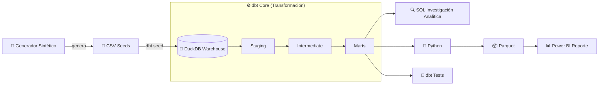

# 🛒 E-commerce Analytics

### Introducción:
Este proyecto abarca el ciclo completo de un proceso de analítica de datos moderno: desde la **generación de un dataset sintético con una narrativa de negocio deliberada**, la construcción de un **Pipeline ELT con dbt Core + DuckDB**, una **Investigación Analítica SQL** sobre el datawarehouse con DBeaver, hasta la elaboración de un **Reporte Interactivo en Power BI**.

### Objetivo:
Identificar las causas raíz de la caída de facturación y, sobre todo, de la rentabilidad de una empresa de retail tecnológico entre 2025 y 2026, y elaborar recomendaciones estratégicas basadas en evidencia para apoyar la toma de decisiones ejecutivas.

### Stack Técnico Principal:

     

---

### 🗺️ Índice
- [Flujo de Datos](#flujo-de-datos-arquitectura-pipeline)
- [Problema de Negocio](#-problema-de-negocio)
- [Hallazgos del Análisis en Power BI](#-hallazgos-del-análisis-en-power-bi)
- [Recomendaciones Estratégicas](#-recomendaciones-estratégicas-basadas-en-evidencia)
- [Módulos del Proyecto](#-módulos-del-proyecto--detalles-técnicos)
- [Estructura y Replicación Local](#-4-estructura-del-repositorio--guía-de-replicación-local)
- [Autor](#-autor)

---

> ⚠️ Para priorizar la perspectiva de negocio, este README presenta primero los hallazgos respaldados con el Reporte en Power BI junto con las recomendaciones estratégicas, y posteriormente la arquitectura técnica que permitió obtenerlos (generación del dataset, Pipeline ELT con dbt Core + DuckDB e Investigación Analítica SQL). Al final se detalla la Estructura del Repositorio y la Guía de Replicación Local.

---

## 🔄 Flujo de Datos (Arquitectura Pipeline):



---

## 📉 Problema de Negocio

A pesar de haber alcanzado un volumen récord de transacciones entre 2025 y 2026 (**+4.30% en pedidos**), la compañía enfrenta un severo deterioro financiero. 

Las **Ventas Netas cayeron un -38.85%** como consecuencia de un desplome directo en el **Ticket Promedio Comercial (-41.37%)**. Sobre esta menor base de ingresos, la presión de la estructura de costos provocó que la **Ganancia Neta colapsara un -66.20%**, reduciendo el margen neto de la empresa del **18.53% al 10.66%**.

El objetivo de este proyecto es identificar las causas raíz detrás de la caída de ingresos y la compresión de márgenes, evaluando el impacto del mix de productos, los descuentos y la estructura de costos para proponer recomendaciones estratégicas basadas en evidencia.

---

## 📊 Hallazgos del Análisis en Power BI 

<details>
<summary><b>1. Vista Ejecutiva — ¿Qué pasó con el negocio? (Clic para expandir)</b></summary><br>

<!-- Aqui pongo los hallazgos -->


</details>

<!-- Y asi repito con las otras hojas de BI -->

---

## 🎯 Recomendaciones Estratégicas Basadas en Evidencia

<!-- Aqui van las recomendaciones estrategicas -->

---

## 📂 Módulos del Proyecto & Detalles Técnicos

A continuación se detalla la arquitectura técnica que da soporte al análisis de negocio. Cada módulo contiene su propia documentación específica.

<details>
<summary><b>🧪 1. Generación del Dataset Sintético</b></summary><br>

El dataset no proviene de una fuente externa: fue diseñado desde cero con una narrativa económica deliberada (inflación diferenciada por categoría según exposición a importación, deterioro logístico progresivo, backlog de pedidos sin resolver al cierre del período, comportamiento de cliente heterogéneo). Esta capa documenta las reglas y supuestos de negocio detrás de cada tabla generada.
* 📁 **Directorio:** [`/data_generation`](./data_generation)
* 📄 **Documentación:** [Ver README del generador](./data_generation/README.md)
</details>

<details>
<summary><b>⚙️ 2. Pipeline ELT con dbt Core + DuckDB</b></summary><br>

Aquí se encuentra toda la lógica de transformación de datos. Pasamos de archivos CSV crudos a un modelo dimensional (Star Schema) listo para el consumo analítico, aplicando tests de calidad y buenas prácticas de modelado.
* 📁 **Directorio:** [`/dbt_core_pipeline`](./dbt_core_pipeline)
* 📄 **Documentación:** [Ver README técnico de dbt](./dbt_core_pipeline/README.md)
</details>

<details>
<summary><b>🔍 3. Investigación Analítica SQL</b></summary><br>

En este módulo se documentan las consultas de investigación realizadas sobre el Data Warehouse (DuckDB) utilizando DBeaver: evolución interanual del negocio y desglose de la estructura de costos y rentabilidad, entre otras, que sirvieron como base exploratoria antes de la visualización.
* 📁 **Directorio:** [`/sql_business_analysis`](./sql_business_analysis)
* 📄 **Documentación:** [Ver Catálogo de Consultas SQL](./sql_business_analysis/README.md)
</details>

<details>
<summary><b>🐍 4. Script de Automatización y Exportación en Python</b></summary><br>

Aquí se encuentran todos los scripts.
* 📁 **Directorio:** [`/scripts`](./scripts)
* 📄 **Documentación:** [Ver README de scripts](./scripts/README.md)
</details>

<details>
<summary><b>🛠️ 5. Estructura del Repositorio & Guía de Replicación Local</b></summary><br>

Instrucciones paso a paso para clonar este repositorio, instalar las dependencias (Python, dbt, DuckDB) y ejecutar el pipeline completo en tu propia máquina.

### Estructura del Repositorio

```text
dbt_elt_analytics/
├── .gitignore                    # Exclusión de binarios y entornos
├── README.md                     # Documentación principal del proyecto
├── requirements.txt              # Dependencias de Python (dbt-duckdb, pandas, pyarrow)
│
├── data_generation/               # Generador del dataset sintético
│   ├── generate_dataset.py       # Script generador (reglas de negocio, crisis 2026)
│   └── README.md                 # Documentación de los supuestos de diseño
│
├── dbt_core_pipeline/             # Módulo dbt Core (Modelado ELT)
│   ├── dbt_project.yml           # Configuración global de dbt
│   ├── profiles.yml.example      # Plantilla de conexión local a DuckDB
│   ├── seeds/                    # Fuentes de datos crudas (CSV)
│   ├── models/                   # Capas Staging, Intermediate y Marts
│   ├── tests/                    # Pruebas de calidad y reglas de negocio
│   └── README.md                 # Documentación técnica del módulo dbt
│
├── sql_business_analysis/         # Investigaciones SQL
│   ├── README.md                 # Catálogo de consultas y preguntas de negocio
│   └── *.sql                     # Scripts de análisis (evolución, rentabilidad, envíos)
│
├── power_bi_analytics/            # Capa de BI y Reportes
│   ├── README.md                 # Documentación del modelo de datos y medidas DAX
│   └── *.pbix                    # Dashboard ejecutable de Power BI
│
├── scripts/                       # Scripts de automatización
│   ├── README.md                 # Documentación de utilidad
│   └── export_marts_to_parquet.py # Exportador de DuckDB a formato Parquet
│
├── database/                      # Generado localmente (ignorado por Git)
│   └── warehouse.duckdb          # Base de datos analítica DuckDB
│
└── data_marts_parquet/            # Generado por script (ignorado por Git)
    └── *.parquet                 # Tablas dimensionales optimizadas para BI
```

### Guía de Replicación Local

### Requisitos Previos
* **Python 3.8+**
* **DuckDB embebido:** No requiere instalar ni levantar servidores de bases de datos externos.

### Paso a Paso

1. **Clonar el repositorio y configurar el entorno:**
   ```bash
   git clone https://github.com/tu_usuario/dbt_elt_analytics.git
   cd dbt_elt_analytics

   # Crear y activar entorno virtual
   python -m venv venv

   # En Windows:
   venv\Scripts\activate
   # En Linux/macOS:
   source venv/bin/activate

   # Instalar dependencias
   pip install -r requirements.txt
   ```

2. **Configurar el perfil de conexión dbt:**
   ```bash
   # Linux/macOS:
   cp dbt_core_pipeline/profiles.yml.example ~/.dbt/profiles.yml

   # Windows (PowerShell):
   copy dbt_core_pipeline\profiles.yml.example $env:USERPROFILE\.dbt\profiles.yml
   ```

3. **Ejecutar la canalización ELT:**
   ```bash
   cd dbt_core_pipeline
   dbt seed   # Crea database/warehouse.duckdb e ingesta CSVs
   dbt run    # Construye Staging, Intermediate y Marts
   dbt test   # Valida reglas de negocio y calidad de datos
   ```

4. **Exportar Marts a Parquet:**
   ```bash
   cd ..
   python scripts/export_marts_to_parquet.py
   ```

Los archivos `.parquet` se guardarán en `data_marts_parquet/` para ser consumidos desde **Power BI**, Excel o Python.

</details>

---

## 👤 Autor

<!-- Tu nombre, LinkedIn y/o portfolio -->


