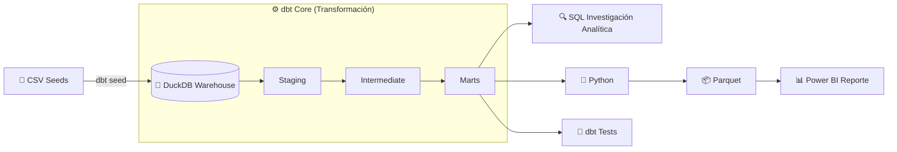
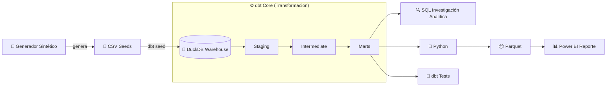
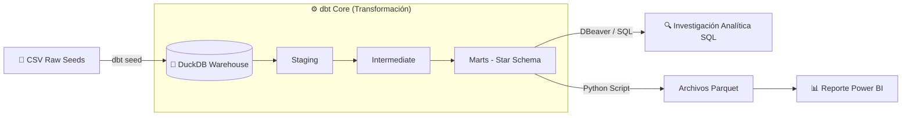
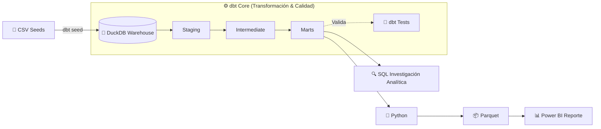
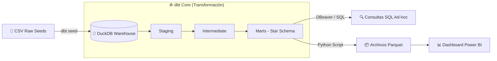

# 🛒 E-commerce Analytics 

### Introducción:  
Este proyecto abarca el ciclo completo de un proceso de analítica de datos moderno: desde la construcción de un **Pipeline ELT con dbt Core + DuckDB**, pasando por una **Investigación Analítica SQL** sobre el datawarehouse con DBeaver, hasta la elaboración de un **Reporte Interactivo en Power BI**.  

### Stack Técnico Principal:

     

---

 ### Objetivo: 
Identificar las causas raíz de la caída de facturación y, mayor aún de la rentabilidad de una empresa de retail tecnológico entre 2025 y 2026 y elaborar recomendaciones estratégicas basadas en evidencia para apoyar la toma de decisiones ejecutivas.  

> ⚠️ Para priorizar la perspectiva de negocio, este README presenta primero los hallazgos respaldados con el Reporte en Power BI junto con las recomendaciones estratégicas, y posteriormente la arquitectura técnica que permitió obtenerlos (Pipeline ELT con dbt Core + DuckDB) junto con la Investigación Analítica SQL. Al final se detalla la Estructura del Repositorio y la Guía de Replicación Local

---

### Flujo de Datos (Arquitectura Pipeline):  



---

## 📉 Problema de Negocio
Pongo cual es el problema

## 📊 Storytelling de Negocio — Hallazgos del Análisis en Power BI

<details>
<summary><b>1. Vista Ejecutiva — ¿Qué pasó con el negocio? (Clic para expandir)</b></summary><br>

Aqui pongo los hallazgos 

 
</details>

Y asi repito con las otras hojas de BI

---

## 🎯 Recomendaciones Estratégicas Basadas en Evidencia

Aqui van las recomendaciones estrategicas

----

## 📂 Módulos del Proyecto & Detalles Técnicos

A continuación se detalla la arquitectura técnica que da soporte al análisis de negocio. Cada módulo contiene su propia documentación específica.

<details>
<summary><b>⚙️ 1. Pipeline ELT con dbt Core + DuckDB</b></summary><br>

Aquí se encuentra toda la lógica de transformación de datos. Pasamos de archivos CSV crudos a un modelo dimensional (Star Schema) listo para el consumo analítico, aplicando tests de calidad y buenas prácticas de modelado.
* 📁 **Directorio:** [`/dbt_core_pipeline`](./dbt_core_pipeline)
* 📄 **Documentación:** [Ver README técnico de dbt](./dbt_core_pipeline/README.md)
</details>

<details>
<summary><b>🔍 2. Investigación Analítica SQL</b></summary><br>

En este módulo se documentan las consultas avanzadas realizadas sobre el Data Warehouse (DuckDB) utilizando DBeaver. Incluye análisis profundos (RFM, cohortes, rentabilidad) que sirvieron como base exploratoria antes de la visualización.
* 📁 **Directorio:** [`/sql_business_analysis`](./sql_business_analysis)
* 📄 **Documentación:** [Ver Catálogo de Consultas SQL](./sql_business_analysis/README.md)
</details>

<details>
<summary><b>🐍 3. Script de Automatización y Exportación en Python </b></summary><br>

Aquí se encuentran todos los scripts. 
* 📁 **Directorio:** [`/scripts`](./scripts)
* 📄 **Documentación:** [Ver README de scripts](./scripts/README.md)
</details>

<details>
<summary><b>🛠️ 4. Estructura del Repositorio & Guía de Replicación Local</b></summary><br>

Instrucciones paso a paso para clonar este repositorio, instalar las dependencias (Python, dbt, DuckDB) y ejecutar el pipeline completo en tu propia máquina.

### Estructura del Repositorio  

```text
dbt_elt_analytics/
├── .gitignore                    # Exclusión de binarios y entornos
├── README.md                     # Documentación principal del proyecto
├── requirements.txt              # Dependencias de Python (dbt-duckdb, pandas, pyarrow)
│
├── dbt_core_pipeline/            # Módulo dbt Core (Modelado ELT)
│   ├── dbt_project.yml           # Configuración global de dbt
│   ├── profiles.yml.example      # Plantilla de conexión local a DuckDB
│   ├── seeds/                    # Fuentes de datos crudas (CSV)
│   ├── models/                   # Capas Staging, Intermediate y Marts
│   ├── tests/                    # Pruebas de calidad y reglas de negocio
│   └── README.md                 # Documentación técnica del módulo dbt
│
├── sql_business_analysis/        # Investigaciones SQL 
│   ├── README.md                 # Catálogo de consultas y preguntas de negocio
│   └── *.sql                     # Scripts de análisis (RFM, Cohortes, Envíos)
│
├── power_bi_analytics/           # Capa de BI y Reportes
│   ├── README.md                 # Documentación del modelo de datos y medidas DAX
│   └── *.pbix                    # Dashboard ejecutable de Power BI
│
├── scripts/                      # Scripts de automatización
│   ├── README.md                 # Documentación de utilidad
│   └── export_marts_to_parquet.py # Exportador de DuckDB a formato Parquet
│
├── database/                     # Generado localmente (ignorado por Git)
│   └── warehouse.duckdb          # Base de datos analítica DuckDB
│
└── data_marts_parquet/           # Generado por script (ignorado por Git)
    └── *.parquet                 # Tablas dimensionales optimizadas para BI
```

###  Guía de Replicación Local

### Requisitos Previos
* **Python 3.8+**
* **DuckDB embebido:** No requiere instalar ni levantar servidores de bases de datos externos.

### Paso a Paso

1. **Clonar el repositorio y configurar el entorno:**
   ```bash
   git clone [https://github.com/tu_usuario/dbt_elt_analytics.git](https://github.com/tu_usuario/dbt_elt_analytics.git)
   cd dbt_elt_analytics

   # Crear y activar entorno virtual
   python -m venv venv
   
   # En Windows:
   venv\Scripts\activate
   # En Linux/macOS:
   source venv/bin/activate

   # Instalar dependencias
   pip install -r requirements.txt
   ```

2. **Configurar el perfil de conexión dbt:**
   ```bash
   # Linux/macOS:
   cp dbt_project/profiles.yml.example ~/.dbt/profiles.yml

   # Windows (PowerShell):
   copy dbt_project/profiles.yml.example $env:USERPROFILE\.dbt\profiles.yml
   ```

3. **Ejecutar la canalización ELT:**
   ```bash
   cd dbt_project
   dbt seed   # Crea database/warehouse.duckdb e ingesta CSVs
   dbt run    # Construye Staging, Intermediate y Marts
   dbt test   # Valida reglas de negocio y calidad de datos
   ```

4. **Exportar Marts a Parquet:**
   ```bash
   cd ..
   python scripts/export_marts_to_parquet.py
   ```
</details>


---

# 🛒 E-commerce Analytics

### Índice
- [Introducción](#-e-commerce-analytics)
- [Objetivo](#-objetivo)
- [Flujo de Datos](#flujo-de-datos-arquitectura-pipeline)
- [Problema de Negocio](#-problema-de-negocio)
- [Storytelling de Negocio](#-storytelling-de-negocio--hallazgos-del-análisis-en-power-bi)
- [Recomendaciones Estratégicas](#-recomendaciones-estratégicas-basadas-en-evidencia)
- [Módulos del Proyecto](#-módulos-del-proyecto--detalles-técnicos)
- [Estructura y Replicación Local](#-4-estructura-del-repositorio--guía-de-replicación-local)
- [Autor](#-autor)

> Nota: verificá que los links de arriba salten bien una vez que GitHub renderice el archivo — la generación automática de anclas con emojis a veces varía.

### Introducción:
Este proyecto abarca el ciclo completo de un proceso de analítica de datos moderno: desde la **generación de un dataset sintético con una narrativa de negocio deliberada**, la construcción de un **Pipeline ELT con dbt Core + DuckDB**, una **Investigación Analítica SQL** sobre el datawarehouse con DBeaver, hasta la elaboración de un **Reporte Interactivo en Power BI**.

### Stack Técnico Principal:

     

---

### 🎯 Objetivo:
Identificar las causas raíz de la caída de facturación y, sobre todo, de la rentabilidad de una empresa de retail tecnológico entre 2025 y 2026, y elaborar recomendaciones estratégicas basadas en evidencia para apoyar la toma de decisiones ejecutivas.

> ⚠️ Para priorizar la perspectiva de negocio, este README presenta primero los hallazgos respaldados con el Reporte en Power BI junto con las recomendaciones estratégicas, y posteriormente la arquitectura técnica que permitió obtenerlos (generación del dataset, Pipeline ELT con dbt Core + DuckDB e Investigación Analítica SQL). Al final se detalla la Estructura del Repositorio y la Guía de Replicación Local.

---

### Flujo de Datos (Arquitectura Pipeline):



---

## 📉 Problema de Negocio
<!-- Pongo cual es el problema -->

## 📊 Storytelling de Negocio — Hallazgos del Análisis en Power BI

<details>
<summary><b>1. Vista Ejecutiva — ¿Qué pasó con el negocio? (Clic para expandir)</b></summary><br>

<!-- Aqui pongo los hallazgos -->


</details>

<!-- Y asi repito con las otras hojas de BI -->

---

## 🎯 Recomendaciones Estratégicas Basadas en Evidencia

<!-- Aqui van las recomendaciones estrategicas -->

---

## 📂 Módulos del Proyecto & Detalles Técnicos

A continuación se detalla la arquitectura técnica que da soporte al análisis de negocio. Cada módulo contiene su propia documentación específica.

<details>
<summary><b>🧪 1. Generación del Dataset Sintético</b></summary><br>

El dataset no proviene de una fuente externa: fue diseñado desde cero con una narrativa económica deliberada (inflación diferenciada por categoría según exposición a importación, deterioro logístico progresivo, backlog de pedidos sin resolver al cierre del período, comportamiento de cliente heterogéneo). Esta capa documenta las reglas y supuestos de negocio detrás de cada tabla generada.
* 📁 **Directorio:** [`/data_generation`](./data_generation)
* 📄 **Documentación:** [Ver README del generador](./data_generation/README.md)
</details>

<details>
<summary><b>⚙️ 2. Pipeline ELT con dbt Core + DuckDB</b></summary><br>

Aquí se encuentra toda la lógica de transformación de datos. Pasamos de archivos CSV crudos a un modelo dimensional (Star Schema) listo para el consumo analítico, aplicando tests de calidad y buenas prácticas de modelado.
* 📁 **Directorio:** [`/dbt_core_pipeline`](./dbt_core_pipeline)
* 📄 **Documentación:** [Ver README técnico de dbt](./dbt_core_pipeline/README.md)
</details>

<details>
<summary><b>🔍 3. Investigación Analítica SQL</b></summary><br>

En este módulo se documentan las consultas de investigación realizadas sobre el Data Warehouse (DuckDB) utilizando DBeaver: evolución interanual del negocio y desglose de la estructura de costos y rentabilidad, entre otras, que sirvieron como base exploratoria antes de la visualización.
* 📁 **Directorio:** [`/sql_business_analysis`](./sql_business_analysis)
* 📄 **Documentación:** [Ver Catálogo de Consultas SQL](./sql_business_analysis/README.md)
</details>

<details>
<summary><b>🐍 4. Script de Automatización y Exportación en Python</b></summary><br>

Aquí se encuentran todos los scripts.
* 📁 **Directorio:** [`/scripts`](./scripts)
* 📄 **Documentación:** [Ver README de scripts](./scripts/README.md)
</details>

<details>
<summary><b>🛠️ 5. Estructura del Repositorio & Guía de Replicación Local</b></summary><br>

Instrucciones paso a paso para clonar este repositorio, instalar las dependencias (Python, dbt, DuckDB) y ejecutar el pipeline completo en tu propia máquina.

### Estructura del Repositorio

```text
dbt_elt_analytics/
├── .gitignore                    # Exclusión de binarios y entornos
├── README.md                     # Documentación principal del proyecto
├── requirements.txt              # Dependencias de Python (dbt-duckdb, pandas, pyarrow)
│
├── data_generation/               # Generador del dataset sintético
│   ├── generate_dataset.py       # Script generador (reglas de negocio, crisis 2026)
│   └── README.md                 # Documentación de los supuestos de diseño
│
├── dbt_core_pipeline/             # Módulo dbt Core (Modelado ELT)
│   ├── dbt_project.yml           # Configuración global de dbt
│   ├── profiles.yml.example      # Plantilla de conexión local a DuckDB
│   ├── seeds/                    # Fuentes de datos crudas (CSV)
│   ├── models/                   # Capas Staging, Intermediate y Marts
│   ├── tests/                    # Pruebas de calidad y reglas de negocio
│   └── README.md                 # Documentación técnica del módulo dbt
│
├── sql_business_analysis/         # Investigaciones SQL
│   ├── README.md                 # Catálogo de consultas y preguntas de negocio
│   └── *.sql                     # Scripts de análisis (evolución, rentabilidad, envíos)
│
├── power_bi_analytics/            # Capa de BI y Reportes
│   ├── README.md                 # Documentación del modelo de datos y medidas DAX
│   └── *.pbix                    # Dashboard ejecutable de Power BI
│
├── scripts/                       # Scripts de automatización
│   ├── README.md                 # Documentación de utilidad
│   └── export_marts_to_parquet.py # Exportador de DuckDB a formato Parquet
│
├── database/                      # Generado localmente (ignorado por Git)
│   └── warehouse.duckdb          # Base de datos analítica DuckDB
│
└── data_marts_parquet/            # Generado por script (ignorado por Git)
    └── *.parquet                 # Tablas dimensionales optimizadas para BI
```

### Guía de Replicación Local

### Requisitos Previos
* **Python 3.8+**
* **DuckDB embebido:** No requiere instalar ni levantar servidores de bases de datos externos.

### Paso a Paso

1. **Clonar el repositorio y configurar el entorno:**
   ```bash
   git clone https://github.com/tu_usuario/dbt_elt_analytics.git
   cd dbt_elt_analytics

   # Crear y activar entorno virtual
   python -m venv venv

   # En Windows:
   venv\Scripts\activate
   # En Linux/macOS:
   source venv/bin/activate

   # Instalar dependencias
   pip install -r requirements.txt
   ```

2. **Configurar el perfil de conexión dbt:**
   ```bash
   # Linux/macOS:
   cp dbt_core_pipeline/profiles.yml.example ~/.dbt/profiles.yml

   # Windows (PowerShell):
   copy dbt_core_pipeline\profiles.yml.example $env:USERPROFILE\.dbt\profiles.yml
   ```

3. **Ejecutar la canalización ELT:**
   ```bash
   cd dbt_core_pipeline
   dbt seed   # Crea database/warehouse.duckdb e ingesta CSVs
   dbt run    # Construye Staging, Intermediate y Marts
   dbt test   # Valida reglas de negocio y calidad de datos
   ```

4. **Exportar Marts a Parquet:**
   ```bash
   cd ..
   python scripts/export_marts_to_parquet.py
   ```
</details>

---

## 👤 Autor

<!-- Tu nombre, LinkedIn y/o portfolio -->





---

## 📐 Flujo de Datos (Arquitectura Pipeline)  


---





# 🛒 E-commerce Analytics 

## Proyecto End-to-End que incluye: **Pipeline ELT con dbt Core + DuckDB, Investigacion y Consultas SQL sobre Data Warehouse y Dashboard Interactivo en Power BI con Hallazgos y recomendaciones Estratégicas**

---

> ⚠️ *Para priorizar la perspectiva de negocio, este README presentará primero las capturas del dashboard en Power BI, los principales hallazgos y las recomendaciones accionables para luego pasar a los demás directorios, dejando para el final Arquitectura y Estructura del Ecosistema y la Guía de Replicación Local.


## 📐 Arquitectura General del Repositorio



---

## 📌 Resumen Ejecutivo, Hallazgos & Recomendaciones Estratégicas

> ⚠️ *Para priorizar la perspectiva de negocio, esta sección incluirá las capturas del dashboard en Power BI, los principales hallazgos de rentabilidad y las recomendaciones accionables una vez finalizado el modelo visual.*

```text
[ Próximamente: Dashboard Hero Image / Capturas de Tableros ]
```

---

## 📁 Estructura del Repositorio y Guía de Replicación Local

```text
dbt_elt_analytics/
├── .gitignore                    # Exclusión de binarios y entornos
├── README.md                     # Documentación principal del proyecto
├── requirements.txt              # Dependencias de Python (dbt-duckdb, pandas, pyarrow)
│
├── dbt_core_pipeline/            # Módulo dbt Core (Modelado ELT)
│   ├── dbt_project.yml           # Configuración global de dbt
│   ├── profiles.yml.example      # Plantilla de conexión local a DuckDB
│   ├── seeds/                    # Fuentes de datos crudas (CSV)
│   ├── models/                   # Capas Staging, Intermediate y Marts
│   ├── tests/                    # Pruebas de calidad y reglas de negocio
│   └── README.md                 # Documentación técnica del módulo dbt
│
├── sql_business_analysis/        # Investigaciones SQL 
│   ├── README.md                 # Catálogo de consultas y preguntas de negocio
│   └── *.sql                     # Scripts de análisis (RFM, Cohortes, Envíos)
│
├── power_bi_analytics/           # Capa de BI y Reportes
│   ├── README.md                 # Documentación del modelo de datos y medidas DAX
│   └── *.pbix                    # Dashboard ejecutable de Power BI
│
├── scripts/                      # Scripts de automatización
│   ├── README.md                 # Documentación de utilidad
│   └── export_marts_to_parquet.py # Exportador de DuckDB a formato Parquet
│
├── database/                     # Generado localmente (ignorado por Git)
│   └── warehouse.duckdb          # Base de datos analítica DuckDB
│
└── data_marts_parquet/           # Generado por script (ignorado por Git)
    └── *.parquet                 # Tablas dimensionales optimizadas para BI
```

---

## 🚀 Guía de Replicación Local

### Requisitos Previos
* **Python 3.8+**
* **DuckDB embebido:** No requiere instalar ni levantar servidores de bases de datos externos.

### Paso a Paso

1. **Clonar el repositorio y configurar el entorno:**
   ```bash
   git clone [https://github.com/tu_usuario/dbt_elt_analytics.git](https://github.com/tu_usuario/dbt_elt_analytics.git)
   cd dbt_elt_analytics

   # Crear y activar entorno virtual
   python -m venv venv
   
   # En Windows:
   venv\Scripts\activate
   # En Linux/macOS:
   source venv/bin/activate

   # Instalar dependencias
   pip install -r requirements.txt
   ```

2. **Configurar el perfil de conexión dbt:**
   ```bash
   # Linux/macOS:
   cp dbt_project/profiles.yml.example ~/.dbt/profiles.yml

   # Windows (PowerShell):
   copy dbt_project/profiles.yml.example $env:USERPROFILE\.dbt\profiles.yml
   ```

3. **Ejecutar la canalización ELT:**
   ```bash
   cd dbt_project
   dbt seed   # Crea database/warehouse.duckdb e ingesta CSVs
   dbt run    # Construye Staging, Intermediate y Marts
   dbt test   # Valida reglas de negocio y calidad de datos
   ```

4. **Exportar Marts a Parquet:**
   ```bash
   cd ..
   python scripts/export_marts_to_parquet.py
   ```

---

## 📂 Módulos del Proyecto y Documentación Técnica

<details>
<summary>🏗️ <b>1. Módulo dbt Core & Pipeline ELT</b></summary>

<br>

Transformación de datos en 3 capas (Staging, Intermediate y Marts) estructurada en Esquema Estrella y respaldada por una suite de pruebas automáticas.

* **Highlights:** Modelado de hechos y dimensiones, prorrateo de costos logísticos a nivel de ítem y reglas estricta para ventas netas en pedidos cancelados.
* 📂 **Ver documentación completa:** [`/dbt_project/README.md`](./dbt_project/README.md)

</details>

<details>
<summary>🔍 <b>2. Investigaciones y Consultas SQL (Data Warehouse)</b></summary>

<br>

Análisis exploratorio ad-hoc y consultas avanzadas en SQL dialecto DuckDB (ejecutadas desde DBeaver) sobre la capa dimensional de Marts.

* **Highlights:** Segmentación de clientes RFM, análisis de cohortes de retención y rentabilidad por tipo de envío.
* 📂 **Ver catálogo de queries:** [`/sql_queries/README.md`](./sql_queries/README.md)

</details>

<details>
<summary>📊 <b>3. Power BI Dashboard & Modelo DAX</b></summary>

<br>

Modelo semántico conectado a los archivos `.parquet`, relaciones dimensionales y tablero interactivo orientado a la toma de decisiones.

* **Highlights:** Medidas DAX avanzadas (ventas netas, AOV, margen %, retención) y diseño enfocado en la experiencia del usuario de negocio.
* 📂 **Ver modelo y medidas DAX:** [`/power_bi_dashboard/README.md`](./power_bi_dashboard/README.md)

</details>


# 🛒 TechnoShop Analytics End-to-End: De la Ingeniería ELT al Impacto de Negocio

Pipeline ELT con dbt Core + DuckDB, Consultas SQL Avanzadas sobre Data Warehouse y Dashboard Interactivo con Hallazgos Estratégicos. 

## 📐 Arquitectura General del Repositorio


---
Para priorizar la perspectiva de negocio, este README presenta primero los hallazgos, el impacto y las recomendaciones estratégicas.

---
ESTA PARTE VAMOS A DEJAR PARA CUANDO TENGA LA CAPTURA DEL DASHBOARD, LOS INSIGHTS Y RECOMENDACIONES ESTRATEGICAS
---

ahora creo que podria poner los desplegables. pero no se como encarar esto. Quizas asi:

1. Estructura del Repositorio
   incluiria esto mas detalles que te voy a pasar ahora sobre las consultas sql. se va a ir completando mientras cargue las carpetas sql_queries y power_bi_dashboard:
   ```text
dbt_elt_analytics/
├── .gitignore                    # Exclusión de binarios y entornos
├── README.md                     # Documentación principal
├── requirements.txt              # Dependencias de Python (dbt-duckdb, pandas, etc.)
│
├── dbt_project/                  # Proyecto dbt Core
│   ├── dbt_project.yml
│   ├── profiles.yml.example      # Plantilla de conexión local
│   ├── seeds/                    # Fuentes en CSV
│   ├── models/                   # Capas Staging, Intermediate y Marts
│   ├── tests/                    # Tests singulares en SQL
│   └── README.md                 # Documentación técnica de dbt
│
├── scripts/                      # Scripts de automatización
│   ├── README.md
│   └── export_marts_to_parquet.py # Exportador de Marts a Parquet
│
├── database/                     # Creado localmente (ignorado por Git)
│   └── warehouse.duckdb          # Base analítica DuckDB
│
└── data_marts_parquet/           # Creado por script (ignorado por Git)
    └── *.parquet                 # Tablas dimensionales listas para BI
```
2. Guía de Replicación Local
con todos los requisitos y todo lo que ya hicimos sobre como clonar el proyecto
3. Pipeline ELT (dbt)
aca no se... una especie de resumen corto mas el linbk a la carpeta y readme especifico de dbt_project
4. Investigacion SQl
tambien un resumen y el link que lleve a sql_queries y readme especifico
5. Power Bi dashboard
resumen y accesoa  la carpeta power_bi_dashboard y readme especifico que va a tener algunas dax, relaciones y demas cosas

o quizas deberia tener 1. Estructura del Repositorio y 2. Guía de Replicación Local
con todos los requisitos y todo lo que ya hicimos sobre como clonar el proyecto a lo ultimo o sepaardos.


---

## 📐 Arquitectura General del Repositorio

```text
  [ CSV Seeds / Raw Data ]
             │
             ▼
   [ DuckDB (Warehouse) ] ◄─── dbt seed (Inicializa la base local)
             │
             ▼
      [ dbt Staging ]    ───► Limpieza, casteos y nombres estándar
             │
             ▼
   [ dbt Intermediate ]  ───► Reglas de negocio, prorrateo y margen
             │
             ▼
       [ dbt Marts ]     ───► Modelo Dimensional (Fact & Dim)
             │
             ▼
  [ Parquet Export Script ] ──► Archivos .parquet para Power BI / BI
```

---

## 📁 Estructura del Repositorio

```text
dbt_elt_analytics/
├── .gitignore                    # Exclusión de binarios y entornos
├── README.md                     # Documentación principal
├── requirements.txt              # Dependencias de Python (dbt-duckdb, pandas, etc.)
│
├── dbt_project/                  # Proyecto dbt Core
│   ├── dbt_project.yml
│   ├── profiles.yml.example      # Plantilla de conexión local
│   ├── seeds/                    # Fuentes en CSV
│   ├── models/                   # Capas Staging, Intermediate y Marts
│   ├── tests/                    # Tests singulares en SQL
│   └── README.md                 # Documentación técnica de dbt
│
├── scripts/                      # Scripts de automatización
│   ├── README.md
│   └── export_marts_to_parquet.py # Exportador de Marts a Parquet
│
├── database/                     # Creado localmente (ignorado por Git)
│   └── warehouse.duckdb          # Base analítica DuckDB
│
└── data_marts_parquet/           # Creado por script (ignorado por Git)
    └── *.parquet                 # Tablas dimensionales listas para BI
```

---

## 🛠️ Requisitos Previos

* **Python 3.8+**
* **Sin base de datos externa:** DuckDB funciona como motor analítico embebido de alto rendimiento desde Python. No requiere instalación de servidores de bases de datos.

---

## 🚀 Guía de Replicación Local

### 1. Clonar el repositorio y configurar el entorno

```bash
git clone [https://github.com/tu_usuario/dbt_elt_analytics.git](https://github.com/tu_usuario/dbt_elt_analytics.git)
cd dbt_elt_analytics

# Crear y activar entorno virtual
python -m venv venv

# Windows:
venv\Scripts\activate
# Linux/macOS:
source venv/bin/activate

# Instalar dependencias
pip install -r requirements.txt
```

### 2. Configurar perfil de conexión (`profiles.yml`)

```bash
# Linux/macOS:
cp dbt_project/profiles.yml.example ~/.dbt/profiles.yml

# Windows (PowerShell):
copy dbt_project/profiles.yml.example $env:USERPROFILE\.dbt\profiles.yml
```

### 3. Ejecutar el Pipeline (dbt)

```bash
cd dbt_project

# Cargar CSVs y crear la base DuckDB
dbt seed

# Construir capas analíticas
dbt run

# Ejecutar tests de calidad
dbt test
```

### 4. Exportar Tablas a Parquet (para BI)

```bash
cd ..
python scripts/export_marts_to_parquet.py
```

Los archivos `.parquet` se guardarán en `data_marts_parquet/` para ser consumidos desde **Power BI**, Excel o Python.

---

## 📊 Consumo en Power BI / BI

Las tablas exportadas corresponden al Esquema Estrella listo para modelado:
* **Dimensiones:** `dim_customers`, `dim_products`, `dim_date`.
* **Tablas de Hechos:** `fact_orders`, `fact_order_items`, `fact_payments`, `fact_shipments`, `fact_returns`.
