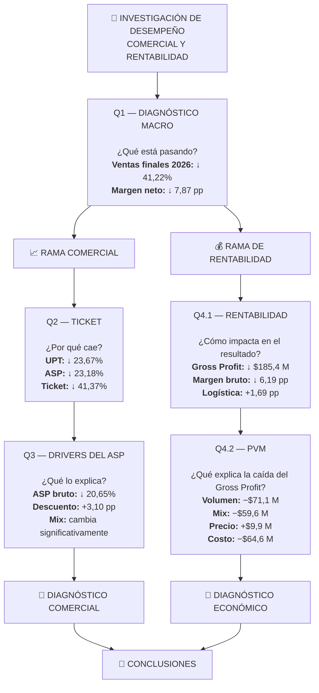

# 🔎 Investigación de desempeño comercial y rentabilidad

## 📌 Introducción

Esta investigación analiza la evolución comercial y económica de un ecommerce entre **2024 y 2026**, con el objetivo de identificar los principales factores asociados al deterioro observado en ventas, ticket y rentabilidad.

El análisis parte de un diagnóstico macro y se divide posteriormente en dos ramas:

* **Rama comercial:** busca explicar la evolución del ticket y del valor promedio de las unidades vendidas.
* **Rama de rentabilidad:** busca explicar cómo estos cambios se traducen en la evolución de la ganancia y los márgenes.

La investigación busca responder cuatro preguntas:

1. **¿Qué cambió en el desempeño general del negocio?**
2. **¿Por qué cambió el ticket comercial?**
3. **¿Qué factores explican la evolución del valor promedio por unidad?**
4. **¿Qué componentes explican el deterioro de la rentabilidad y de la ganancia bruta?**

El análisis avanza desde indicadores agregados hacia explicaciones cada vez más específicas y finaliza con un **PVM (Price–Volume–Mix)** que descompone la variación de Gross Profit entre 2025 y 2026.

## 🧭 Metodología y criterios de análisis

Para mantener consistencia entre las distintas etapas se establecen los siguientes criterios.

### Universo de análisis

* Toda la investigación —tanto el diagnóstico comercial (Q1–Q3) como el de rentabilidad (Q4)— utiliza `order_status = 'delivered'` como filtro único y consistente en todas las consultas.
* Se eligió este criterio para garantizar comparabilidad entre etapas: todos los indicadores se calculan sobre el mismo universo de pedidos efectivamente entregados, aunque cada rama aplica métricas y tratamientos económicos diferentes según su objetivo.
* ⚠️ **Nota sobre 2026:** a diferencia de 2024 y 2025 (años cerrados, donde prácticamente la totalidad de los pedidos no cancelados ya alcanzó el estado `delivered`), 2026 es un año en curso y aún tiene pedidos en estados `processing` y `shipped` al momento del corte de datos. Estos pedidos no están incluidos en ninguna métrica de este informe. Por lo tanto, las variaciones interanuales reportadas para 2026 reflejan únicamente la porción de la actividad que ya completó su ciclo, y podrían ajustarse a medida que esos pedidos pendientes se entreguen.

### Ventas y devoluciones

* **Ventas brutas:** valor de los productos antes de descuentos.
* **Ventas netas:** ventas después de descuentos y antes de devoluciones.
* **Ventas netas finales:** ventas netas después de devoluciones aprobadas.
* En los análisis de rentabilidad, las unidades y costos asociados a devoluciones también se ajustan para reflejar el resultado final de la operación.

### Rentabilidad

* **Ganancia bruta** = Ventas netas finales − Costo de ventas.
* **Ganancia neta** = Ganancia bruta − Costo logístico.
* Los márgenes se calculan sobre las ventas netas finales.

### Métricas comerciales

Para analizar el comportamiento del ticket se utilizan:

* **Ticket comercial** = Ventas netas / Pedidos.
* **UPT (Units Per Transaction)** = Unidades / Pedidos.
* **ASP comercial** = Ventas netas / Unidades.

Estas métricas se calculan antes de devoluciones, manteniendo el foco de Q2 y Q3 en el comportamiento comercial.

## 🗺️ Mapa de la investigación

La investigación parte de un **diagnóstico macro común (Q1)** y luego se divide en dos ramas especializadas.

La **rama comercial** profundiza en el ticket y el ASP, mientras que la **rama de rentabilidad** analiza el comportamiento de costos, márgenes y Gross Profit.

---

# Q1 — Diagnóstico Macro YoY

## 🎯 Objetivo

Evaluar la evolución interanual del negocio entre 2024 y 2026 para identificar cambios relevantes en volumen, ventas, devoluciones, ticket y rentabilidad, y detectar qué dimensiones requieren una investigación más profunda.

## 🔎 Consulta SQL

[Ver consulta →](./sql/q1_diagnostico_macro_yoy.sql)

## 📊 Resultados observados

| Métrica              |       2024 |       2025 |     YoY 2025 |       2026 |     YoY 2026 |
| -------------------- | ---------: | ---------: | -----------: | ---------: | -----------: |
| Pedidos              |      1.365 |      1.581 |  **+15,82%** |      1.649 |   **+4,30%** |
| Ventas brutas        | $1.316,5 M | $1.684,4 M |  **+27,95%** | $1.064,0 M |  **−36,83%** |
| Ventas netas         | $1.290,5 M | $1.633,9 M |  **+26,62%** |   $999,1 M |  **−38,85%** |
| Tasa de devolución   |      2,88% |      3,28% | **+0,40 pp** |      7,03% | **+3,75 pp** |
| Ventas netas finales | $1.253,3 M | $1.580,3 M |  **+26,09%** |   $928,9 M |  **−41,22%** |
| Ganancia neta        |   $297,6 M |   $292,8 M |   **−1,59%** |    $99,0 M |  **−66,20%** |
| Margen neto          |     23,74% |     18,53% | **−5,21 pp** |     10,66% | **−7,87 pp** |
| Ticket comercial     |   $945.397 | $1.033.477 |   **+9,32%** |   $605.891 |  **−41,37%** |

> El ticket comercial corresponde a ventas netas después de descuentos y antes de devoluciones.

## 💡 Hallazgos clave

### 1. El deterioro de 2026 ocurre pese al crecimiento de los pedidos

Entre 2025 y 2026 los pedidos aumentaron un **4,30%**, pasando de 1.581 a 1.649. Sin embargo, las ventas netas disminuyeron **38,85%** y las ventas netas finales **41,22%**.

El problema, por lo tanto, no puede explicarse únicamente por una caída en la cantidad de pedidos.

### 2. El ticket presenta una caída pronunciada en 2026

El ticket comercial pasó de $1.033.477 en 2025 a $605.891 en 2026, una disminución interanual del **41,37%**.

Esto permite plantear una primera hipótesis de investigación: la caída de ventas está relacionada con una reducción significativa del valor generado por pedido.

### 3. Las devoluciones agravan la caída de ventas finales

La tasa de devolución aumentó de **3,28% a 7,03%**, un incremento de **3,75 puntos porcentuales**.

Como consecuencia, las ventas netas finales disminuyeron **41,22%**, una caída superior a la observada en las ventas netas antes de devoluciones (−38,85%).

### 4. El deterioro de rentabilidad comienza antes del desplome de 2026

En 2025 los pedidos crecieron **15,82%** y las ventas netas **26,62%**, pero la ganancia neta prácticamente no creció (−1,59%).

Al mismo tiempo, el margen neto cayó de **23,74% a 18,53%**, una reducción de **5,21 pp**.

En 2026 el deterioro se profundiza: la ganancia neta cae **66,20%** y el margen neto alcanza **10,66%**.

Esto indica que la investigación no debe limitarse a explicar la caída de ventas de 2026, sino también identificar qué factores fueron erosionando la rentabilidad desde 2025.

## 🧭 Puente analítico → Q2

El diagnóstico macro identifica dos señales principales que requieren explicación:

1. una fuerte caída del **ticket comercial** en 2026 pese al crecimiento de los pedidos;
2. un deterioro sostenido de la **rentabilidad**, que comienza en 2025 y se profundiza en 2026.

El siguiente paso es descomponer el comportamiento del ticket para determinar si su variación responde principalmente a cambios en la **cantidad de unidades por pedido** y/o en el **valor promedio de las unidades vendidas**.

Por eso, Q2 profundiza en la estructura del ticket mediante **basket depth (UPT) y ASP comercial**.

# Q2 — Descomposición del ticket comercial

## 🎯 Objetivo

Determinar qué componentes explican la fuerte caída del ticket comercial detectada en el diagnóstico macro: si está asociada principalmente a una menor cantidad de unidades por pedido, a un menor precio promedio por unidad, o a ambos factores.

## 🔎 Consulta SQL

[Ver consulta →](./sql/q2_descomposicion_ticket.sql)

## 📊 Resultados observados

| Métrica                   |     2024 |       2025 |   YoY 2025 |     2026 |    YoY 2026 |
| ------------------------- | -------: | ---------: | ---------: | -------: | ----------: |
| Pedidos                   |    1.365 |      1.581 |    +15,82% |    1.649 |      +4,30% |
| Unidades totales          |    3.946 |      4.746 |    +20,27% |    3.778 |     −20,40% |
| Unidades por pedido (UPT) |     2,89 |       3,00 | **+3,81%** |     2,29 | **−23,67%** |
| ASP comercial             | $327.032 |   $344.275 | **+5,27%** | $264.456 | **−23,18%** |
| Ticket comercial          | $945.397 | $1.033.477 | **+9,32%** | $605.891 | **−41,37%** |

> El ASP corresponde a ventas netas comerciales por unidad, después de descuentos y antes de devoluciones. El ticket comercial corresponde a ventas netas comerciales por pedido.

## 💡 Hallazgos clave

### 1. La caída del ticket tiene dos componentes

Entre 2025 y 2026, el ticket comercial cayó **41,37%**.

La caída ocurre simultáneamente en:

* **Unidades por pedido:** −23,67%
* **ASP comercial:** −23,18%

Por lo tanto, la reducción del ticket no parece explicarse por un único componente: tanto la cantidad de unidades compradas por pedido como el valor promedio de cada unidad disminuyeron significativamente.

### 2. El comportamiento de 2025 fue exactamente el contrario

Entre 2024 y 2025, tanto las unidades por pedido como el ASP aumentaron:

* UPT: **+3,81%**
* ASP: **+5,27%**
* Ticket: **+9,32%**

Esto refuerza la lectura de que el deterioro observado en 2026 representa un cambio en el comportamiento comercial respecto del año anterior.

### 3. El crecimiento de pedidos no se tradujo en mayor volumen de unidades

Aunque los pedidos aumentaron **4,30%** en 2026, las unidades totales vendidas disminuyeron **20,40%**.

La diferencia se explica por la reducción de unidades por pedido: cada pedido pasó, en promedio, de contener **3,00 unidades en 2025 a 2,29 en 2026**.

Esto indica que el crecimiento de pedidos no implicó un crecimiento equivalente del volumen comercial.

### 4. El ASP también se deterioró significativamente

El precio promedio comercial por unidad cayó **23,18%**, pasando de $344.275 a $264.456.

Esto abre una segunda línea de investigación: determinar si la caída del ASP responde a cambios en los productos y categorías vendidos, a variaciones de precios, a mayores descuentos o a una combinación de estos factores.

## 🧭 Puente analítico → Q3

La descomposición del ticket muestra que el deterioro de 2026 tiene dos dimensiones:

**menor cantidad de unidades por pedido + menor valor promedio por unidad.**

Sin embargo, estas métricas todavía describen el fenómeno, pero no explican sus causas.

La siguiente etapa profundiza en el **mix comercial y los drivers del ASP**, analizando la evolución de categorías junto con sus precios y descuentos, para determinar qué cambios en la composición y en las condiciones comerciales están detrás de la caída observada.

# Q3 — Drivers comerciales del ASP

## 🎯 Objetivo

Profundizar en la caída del ASP comercial identificada en Q2 y determinar si está asociada a una reducción del valor bruto por unidad, a una mayor presión de descuentos y/o a cambios en la composición de las categorías vendidas.

### Q3.1 — ASP bruto y descuentos

[Ver consulta →](./sql/q3_1_asp_y_descuentos.sql)

#### 📊 Resultados observados

| Métrica           |     2025 |     2026 |    Variación |
| ----------------- | -------: | -------: | -----------: |
| ASP bruto         | $354.911 | $281.632 |  **−20,65%** |
| Tasa de descuento |    3,00% |    6,10% | **+3,10 pp** |
| ASP neto          | $344.275 | $264.456 |  **−23,18%** |

#### 💡 Hallazgos

La caída del ASP neto no se explica únicamente por el aumento de los descuentos. El ASP bruto ya había disminuido **20,65%** antes de aplicar descuentos.

Al mismo tiempo, la tasa de descuento aumentó **3,10 pp**, profundizando la reducción hasta un **23,18%** en el ASP neto.

Esto indica que existen al menos dos señales comerciales simultáneas: menor valor bruto promedio por unidad y mayor presión promocional.

### Q3.2 — Mix y comportamiento por categoría

[Ver consulta →](./sql/q3_2_mix_y_asp_por_categoria.sql)

#### 📊 Resultados observados

> **Nota:** el Δ Mix representa el cambio en la participación del volumen vendido por categoría. No corresponde al *mix effect* formal utilizado posteriormente en el análisis PVM.

| Categoría   | Mix 2025 | Mix 2026 |        Δ Mix |     ASP YoY | Δ Descuento |
| ----------- | -------: | -------: | -----------: | ----------: | ----------: |
| Hogar       |   21,07% |   24,88% | **+3,81 pp** |      +2,73% |    +4,00 pp |
| Audio       |   14,90% |   22,82% | **+7,92 pp** |      +0,87% |    +4,05 pp |
| Accesorios  |   25,75% |   20,70% | **−5,05 pp** |      +5,02% |    +3,73 pp |
| Computación |   16,16% |   18,26% | **+2,10 pp** | **−32,74%** |    +2,82 pp |
| TV y Video  |   16,67% |   10,64% | **−6,03 pp** |      −4,11% |    +2,73 pp |
| Telefonía   |    5,46% |    2,70% | **−2,76 pp** |      +6,00% |    +1,45 pp |

#### 💡 Hallazgos clave

**1. El cambio de composición fue significativo.**

Audio aumentó su participación en **7,92 pp**, mientras que TV y Video perdió **6,03 pp** y Accesorios **5,05 pp**.

Esto confirma que la composición del volumen vendido cambió considerablemente entre 2025 y 2026.

**2. El deterioro del ASP no fue homogéneo entre categorías.**

Mientras Hogar, Accesorios y Telefonía registraron aumentos de ASP, Computación presentó una caída de **32,74%** y TV y Video una caída de **4,11%**.

Por lo tanto, la reducción del ASP global no puede interpretarse como una caída generalizada de precios en todas las categorías.

**3. Computación aparece como un punto de atención.**

Computación aumentó su participación de volumen **2,10 pp**, pero simultáneamente su ASP cayó **32,74%** y su tasa de descuento aumentó **2,82 pp**.

La combinación de mayor participación y menor ASP identifica a esta categoría como una de las principales áreas a considerar al interpretar el deterioro comercial.

**4. El aumento de descuentos fue generalizado.**

Todas las categorías incrementaron su tasa de descuento entre 2025 y 2026.

Los mayores incrementos se observaron en Audio (**+4,05 pp**), Hogar (**+4,00 pp**) y Accesorios (**+3,73 pp**).

Sin embargo, el comportamiento del ASP demuestra que el aumento de descuentos no explica por sí solo la evolución del valor por unidad: algunas categorías aumentaron su ASP a pesar de aplicar mayores descuentos.

## 🧭 Puente analítico → Q4

El análisis comercial permite identificar un cambio importante en la estructura del negocio: menor volumen por pedido, menor ASP global, mayores descuentos y una composición de categorías diferente.

Sin embargo, el análisis comercial todavía no determina cómo estos cambios se traducen en rentabilidad.

El siguiente paso cambia la pregunta:

> **¿Cómo impactaron estos cambios sobre la ganancia y el margen del negocio?**

Q4 aborda la rentabilidad desde dos niveles: primero, la evolución agregada de ventas, costos, logística y margen; luego, una descomposición PVM del cambio en Gross Profit para cuantificar los efectos de **volumen, mix, precio y costo**.

# Q4.1 — Diagnóstico de rentabilidad

## 🎯 Objetivo

Evaluar cómo evolucionó la rentabilidad del negocio entre 2024 y 2026, identificando la evolución de las ventas finales, los costos, la ganancia bruta, la logística y los márgenes.

El objetivo es determinar cómo se deterioró la rentabilidad antes de descomponer sus causas mediante el análisis PVM.

## 🔎 Consulta SQL

[Ver consulta →](./sql/q4_1_diagnostico_rentabilidad.sql)

## 📊 Resultados observados

| Métrica                  |       2024 |       2025 |     YoY 2025 |     2026 |     YoY 2026 |
| ------------------------ | ---------: | ---------: | -----------: | -------: | -----------: |
| Ventas netas finales     | $1.253,3 M | $1.580,3 M |  **+26,09%** | $928,9 M |  **−41,22%** |
| Costo de ventas          |   $943,1 M | $1.270,0 M |            — | $804,0 M |            — |
| Ganancia bruta           |   $310,2 M |   $310,2 M |            — | $124,9 M |            — |
| Costo de ventas / ventas |     75,25% |     80,37% | **+5,12 pp** |   86,56% | **+6,19 pp** |
| Margen bruto             |     24,75% |     19,63% | **−5,12 pp** |   13,44% | **−6,19 pp** |
| Costo logístico / ventas |      1,01% |      1,10% | **+0,09 pp** |    2,79% | **+1,69 pp** |
| Ganancia neta            |   $297,6 M |   $292,8 M |   **−1,59%** |  $99,0 M |  **−66,20%** |
| Margen neto              |     23,74% |     18,53% | **−5,21 pp** |   10,66% | **−7,87 pp** |

> La ganancia bruta se calcula como ventas netas finales menos costo de ventas. El margen bruto representa la ganancia bruta como porcentaje de las ventas netas finales.

## 💡 Hallazgos clave

### 1. La rentabilidad comienza a deteriorarse en 2025

Entre 2024 y 2025, las ventas netas finales crecieron **26,09%**, pero la ganancia bruta prácticamente no cambió: pasó de $310,2 M a $310,2 M.

Como consecuencia, el margen bruto cayó de **24,75% a 19,63%**, una reducción de **5,12 pp**.

El deterioro, por lo tanto, comienza antes de la fuerte caída de ventas observada en 2026.

### 2. En 2026 el deterioro se profundiza

Entre 2025 y 2026, las ventas netas finales disminuyeron **41,22%**, mientras que la ganancia bruta cayó de $310,2 M a **$124,9 M**.

Esto representa una reducción de aproximadamente **$185,4 M en Gross Profit**.

El margen bruto pasó de **19,63% a 13,44%**, una caída adicional de **6,19 pp**.

### 3. El costo de ventas absorbe una proporción creciente de los ingresos

La participación del costo de ventas sobre las ventas finales aumentó de:

**75,25% → 80,37% → 86,56%**

entre 2024 y 2026.

Esto implica que una proporción cada vez mayor de cada peso vendido queda destinada a cubrir el costo de los productos, reduciendo el margen disponible.

### 4. La presión logística también aumenta

El costo logístico representaba **1,01%** de las ventas en 2024 y alcanzó **2,79%** en 2026.

Entre 2025 y 2026 aumentó **1,69 pp**, agregando presión adicional sobre la rentabilidad después de la ganancia bruta.

### 5. La caída termina trasladándose a la ganancia neta

La ganancia neta pasó de **$297,6 M en 2024** a **$292,8 M en 2025** y luego a **$99,0 M en 2026**.

El margen neto cayó de **23,74% a 18,53% y finalmente a 10,66%**.

Por lo tanto, Q4.1 establece dos dimensiones del deterioro:

* una fuerte reducción del **Gross Profit**, asociada a ventas, volumen, mix, precios y costos;
* una presión adicional de los **costos logísticos** sobre el resultado final.

## 🧭 Puente analítico → Q4.2

Q4.1 permite cuantificar el deterioro, pero todavía no permite determinar qué componentes explican la caída de la ganancia bruta.

Entre 2025 y 2026, el **Gross Profit disminuyó $185,4 M**.

El siguiente paso es descomponer esta variación mediante un **PVM (Price–Volume–Mix)**, separando el impacto asociado al volumen, al cambio en la composición de productos, al precio realizado y al costo unitario.

# Q4.2 — PVM del Gross Profit

## 🎯 Objetivo

Descomponer la variación de la **ganancia bruta entre 2025 y 2026** para identificar cuánto de la variación observada se explica por cambios en:

* **Volumen**
* **Mix de productos**
* **Precio realizado**
* **Costo unitario**

El análisis busca construir un puente cuantitativo entre la ganancia bruta de 2025 y la ganancia bruta observada en 2026.

## 🔎 Consulta SQL

[Ver consulta →](./sql/q4_2_pvm.sql)

## 🧮 Metodología

El análisis se realiza sobre operaciones **entregadas (`order_status = 'delivered'`)** de 2025 y 2026.

Para reflejar el resultado económico final de las operaciones se utilizan **unidades efectivas**, definidas como:

> Unidades efectivas = unidades vendidas − unidades devueltas

A partir de ellas se calculan:

* **Precio realizado por unidad** = Ventas netas finales / Unidades efectivas
* **Costo unitario** = Costo de ventas final / Unidades efectivas
* **Margen unitario** = Precio realizado − Costo unitario

Los productos se clasifican según su presencia en ambos años:

* **Continuo:** presente en 2025 y 2026.
* **Nuevo:** presente solamente en 2026.
* **Discontinuado:** presente solamente en 2025.

El PVM descompone la variación del Gross Profit mediante cuatro componentes:

* **Volumen:** cambio en las unidades totales manteniendo la estructura de mix y el margen unitario de 2025.
* **Mix:** cambio en la composición de productos, manteniendo los márgenes de referencia definidos por la metodología.
* **Precio:** variación del precio realizado de los productos continuos.
* **Costo:** variación del costo unitario de los productos continuos.

La suma de los cuatro componentes debe coincidir con la variación real del Gross Profit.

## 📊 Resultados observados

| Métrica                      |     2025 |     2026 |     Variación |
| ---------------------------- | -------: | -------: | ------------: |
| Ganancia bruta               | $310,2 M | $124,9 M | **−$185,4 M** |
| Unidades efectivas           |    4.586 |    3.535 |    **−1.051** |
| Efecto volumen               |        — |        — |  **−$71,1 M** |
| Efecto mix                   |        — |        — |  **−$59,6 M** |
| Efecto precio                |        — |        — |   **+$9,9 M** |
| Efecto costo                 |        — |        — |  **−$64,6 M** |
| Variación explicada por PVM  |        — |        — | **−$185,4 M** |
| Diferencia de reconciliación |        — |        — |      **≈ $0** |

> La diferencia de reconciliación observada es de aproximadamente $0,00000006 y corresponde a precisión numérica de punto flotante.

## 💡 Hallazgos clave

### 1. La ganancia bruta disminuye $185,4 M

Entre 2025 y 2026, el Gross Profit pasó de **$310,2 M a $124,9 M**, una reducción de **$185,4 M**.

El PVM permite reconstruir íntegramente esta variación a partir de los cuatro componentes analizados.

### 2. La reducción del volumen genera un impacto negativo

Las unidades efectivas disminuyeron de **4.586 a 3.535**, una reducción de **1.051 unidades**.

Manteniendo la estructura de mix y los márgenes de referencia de 2025, esta reducción representa un efecto volumen de **−$71,1 M** sobre el Gross Profit.

### 3. El cambio en la composición de productos también afecta negativamente

El cambio en el mix genera un efecto de **−$59,6 M**.

Esto indica que, además de vender menos unidades, la composición de las unidades vendidas en 2026 fue menos favorable bajo la estructura de márgenes utilizada por el PVM.

### 4. El precio realizado aporta un efecto positivo

El efecto precio alcanza **+$9,9 M**.

Por lo tanto, el deterioro del Gross Profit no se explica por una caída generalizada del precio realizado de los productos continuos.

Dentro del puente PVM, el efecto positivo del precio compensa parcialmente los impactos negativos de volumen, mix y costo.

### 5. El aumento del costo unitario genera una presión significativa

El efecto costo es de **−$64,6 M**.

Esto refleja un aumento de los costos unitarios de los productos continuos, reduciendo el margen obtenido por las unidades vendidas en 2026.

### 6. El PVM reconcilia exactamente la variación observada

La suma de:

* Volumen: **−$71,1 M**
* Mix: **−$59,6 M**
* Precio: **+$9,9 M**
* Costo: **−$64,6 M**

produce una variación de **−$185,4 M**, coincidente con la diferencia real entre el Gross Profit de 2025 y 2026.

La ganancia bruta de 2026 reconstruida mediante el PVM es **$124,9 M**, con una diferencia de reconciliación prácticamente nula.

## 🔬 Detalle por producto

El PVM agregado permite identificar los componentes de la variación total, pero no muestra qué productos contribuyen principalmente a cada componente.

Para profundizar el diagnóstico se utiliza una consulta complementaria a nivel producto:

[Ver detalle PVM por producto →](./sql/q4_2_pvm_producto.sql)

Esta consulta mantiene la misma metodología del PVM agregado y permite observar, para cada producto:

* evolución de unidades efectivas;
* participación en el mix;
* precio realizado;
* costo unitario;
* margen unitario;
* contribución al efecto volumen;
* contribución al efecto mix;
* contribución al efecto precio;
* contribución al efecto costo;
* contribución total al PVM.

### Principales contribuciones negativas

Entre los productos con mayor contribución negativa al PVM aparecen:

| Producto              |   Efecto PVM |
| --------------------- | -----------: |
| TCL Monitor TV 21     | **−$44,8 M** |
| TCL Chromecast 25     | **−$26,9 M** |
| Acer Memoria RAM 2    | **−$21,2 M** |
| TCL Monitor TV 19     | **−$14,2 M** |
| Lenovo Mouse 1        | **−$12,7 M** |
| Samsung Smart TV 20   |  **−$9,9 M** |
| ASUS Notebook 5       |  **−$7,2 M** |
| Samsung Smartphone 14 |  **−$6,7 M** |

En varios de estos productos se observa simultáneamente una reducción importante de unidades y un deterioro del costo unitario, mientras que el precio realizado se mantiene estable o incluso aumenta.

### Productos nuevos

La consulta también identifica productos incorporados durante 2026.

Entre los nuevos productos con contribución positiva aparecen:

* **Philips Equipo de Audio 30:** +$7,6 M
* **Sony Equipo de Audio 33:** +$3,5 M
* **Acer Notebook 7:** +$2,8 M
* **HP Mouse 10:** +$2,4 M

Estos productos contribuyen positivamente al Gross Profit mediante el componente de mix asociado a su incorporación en 2026.

### Un caso de mejora relevante

**ASUS Webcam 6** presenta una contribución PVM positiva de aproximadamente **+$5,2 M**.

Su volumen aumentó de **19 a 56 unidades** y su participación en el mix pasó de **0,41% a 1,58%**, generando un aporte positivo significativo por mix.

Sin embargo, el aumento del costo unitario reduce parcialmente ese beneficio.

## 🧭 Puente → Conclusiones

El PVM permite pasar del diagnóstico agregado de rentabilidad a una explicación más específica de los componentes que deterioraron el Gross Profit.

La caída de **$185,4 M** entre 2025 y 2026 se explica por una combinación de **menor volumen, cambio desfavorable en el mix y aumento de costos**, parcialmente compensada por un efecto positivo del precio realizado.

El detalle por producto permite identificar qué referencias concentran estos impactos y completa el diagnóstico económico de la investigación.

A partir de estos resultados se consolidan las conclusiones generales de la investigación.

