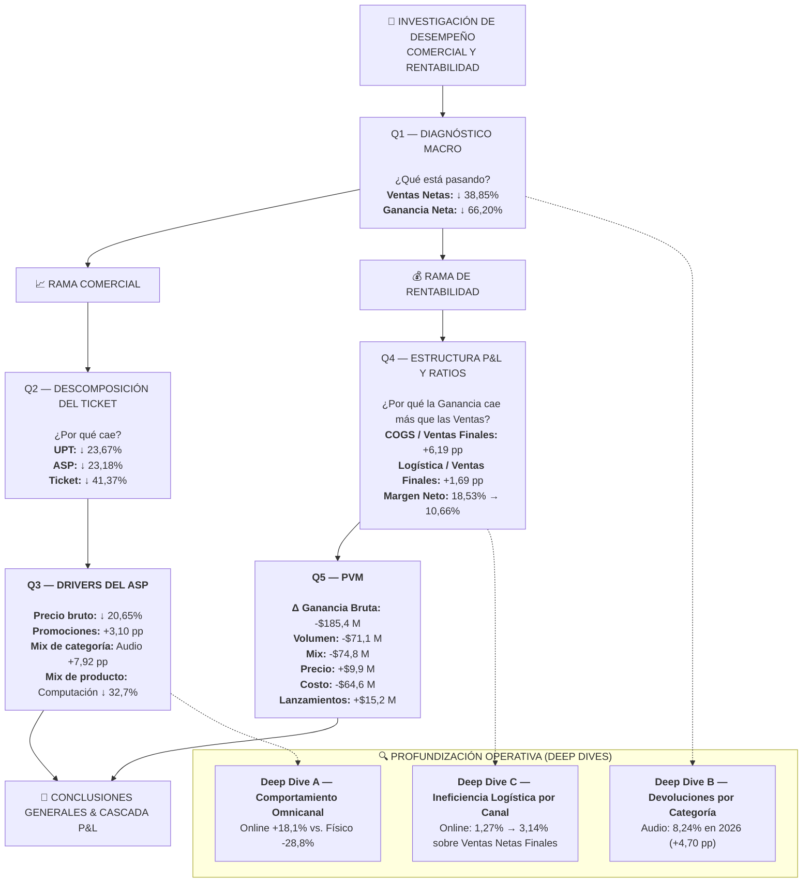

# 🔎 Investigación Analítica SQL

Esta investigación forma parte de un proyecto analítico End-to-End.  
🔗 **Proyecto completo:** https://github.com/manticafacundoelian/dbt_elt_analytics

---

## 📌 Introducción

Esta investigación analiza la evolución comercial y económica de un retail de tecnología entre **2024 y 2026**, con el objetivo de identificar los principales factores asociados al deterioro observado en ventas, ticket y rentabilidad.

El análisis parte de un diagnóstico macro y se divide posteriormente en dos ramas:

* **Rama comercial:** descompone la caída del ticket en sus dos variables fundamentales (**UPT** y **ASP**) y profundiza en los factores que explican el comportamiento del valor unitario (**precio bruto, promociones y cambios de mix por categoría**).
* **Rama de rentabilidad:** analiza cómo estos cambios impactan en la masa de margen, desglosando la estructura de costos P&L y reconciliando la variación de la ganancia bruta mediante un modelo PVM (Price–Volume–Mix), con apertura del componente Mix a nivel de producto.

---

## 🗺️ Hoja de Ruta Ejecutiva & Resumen de Diagnóstico

---

## 🔎 Investigación y Desarrollo 

La investigación busca responder **cinco preguntas principales de diagnóstico**, complementadas por **tres análisis operativos de profundización (*Deep Dives*)**:

### Preguntas Core del Diagnóstico 

#### ┌─ 🔹 Q1 — Diagnóstico Macro: ¿Qué cambió en el desempeño general del negocio?

<strong>Ver desarrollo de Q1</strong>
  
     

[Ver Consulta SQL →](./sql_business_analysis/q1_diagnostico_macro_yoy.sql)
  

#### 🔹 Resultados

| Métrica                    |       2024 |       2025 |     YoY 2025 |       2026 |     YoY 2026 |
| :------------------------- | ---------: | ---------: | -----------: | ---------: | -----------: |
| **Pedidos**                |      1.365 |      1.581 |  **+15,82%** |      1.649 |   **+4,30%** |
| **Ventas Brutas**          | $1.316,5 M | $1.684,4 M |  **+27,95%** | $1.064,0 M |  **−36,83%** |
| **Ventas Netas**           | $1.290,5 M | $1.633,9 M |  **+26,62%** |   $999,1 M |  **−38,85%** |
| Devoluciones ($)           |    $37,2 M |    $53,7 M |  **+44,45%** |    $70,3 M |  **+30,90%** |
| **Tasa de Devolución (%)** |      2,88% |      3,28% | **+0,40 pp** |      7,03% | **+3,75 pp** |
| **Ventas Netas Finales**   | $1.253,3 M | $1.580,3 M |  **+26,09%** |   $928,9 M |  **−41,22%** |
| **Ganancia Neta**          |   $297,6 M |   $292,8 M |   **−1,59%** |    $99,0 M |  **−66,20%** |
| **Margen Neto (%)**        |     23,74% |     18,53% | **−5,21 pp** |     10,66% | **−7,87 pp** |
| **Ticket Comercial**       |   $945.397 | $1.033.477 |   **+9,32%** |   $605.891 |  **−41,37%** |

> *Nota: El Ticket Comercial se calcula sobre Ventas Netas, antes de devoluciones, para analizar el comportamiento comercial de las órdenes independientemente de las devoluciones posteriores.*

#### 🔹 Hallazgos

**1. La caída de ventas se explica por una fuerte reducción del ticket**

En 2026 se registraron **1.649 pedidos, un 4,30% más que en 2025**, mientras que las Ventas Netas disminuyeron **38,85%**.

Dado que las ventas resultan de la cantidad de pedidos y el valor promedio de cada pedido, la diferencia se explica por la fuerte caída del **Ticket Comercial, que disminuyó 41,37%**, pasando de $1.033.477 a $605.891.

**2. El deterioro de la rentabilidad ya estaba presente en 2025**

En 2025, las Ventas Netas crecieron **26,62%**, mientras que la Ganancia Neta disminuyó **1,59%**.

Durante el mismo período, el Margen Neto pasó de **23,74% a 18,53%**, una reducción de **5,21 pp**.

**3. Las devoluciones tienen una mayor incidencia en 2026**

La Tasa de Devolución pasó de **3,28% en 2025 a 7,03% en 2026**, un aumento de **3,75 pp**.

Como resultado, las Ventas Netas Finales disminuyeron **41,22%**, frente a una caída de **38,85%** en las Ventas Netas antes de devoluciones.

**4. La ganancia cae más que las ventas**

En 2026, las Ventas Netas disminuyeron **38,85%**, mientras que la Ganancia Neta cayó **66,20%**.

El Margen Neto pasó de **18,53% a 10,66%**, una reducción adicional de **7,87 pp**.

La diferencia entre la evolución de ventas y rentabilidad requiere analizar la estructura de costos y márgenes, que será abordada en la **Rama de Rentabilidad**.

#### 🔹 Puente analítico → Q2

El diagnóstico muestra que en 2026 la cantidad de pedidos se mantiene relativamente estable, mientras que el valor promedio de cada pedido disminuye significativamente.

**Q2 descompone el Ticket Comercial en sus dos componentes: UPT y ASP**, para determinar cuánto de esta caída se relaciona con una menor cantidad de unidades por pedido y cuánto con el valor promedio de cada unidad.

#### ├─ 🔹 Q2 — Descomposición del Ticket: ¿Por qué cayó el ticket comercial? (UPT vs. ASP)

<strong>Ver desarrollo de Q2</strong>
  
     

[Ver Consulta SQL →](./sql_business_analysis/q2_descomposicion_ticket.sql)  

#### 🔹 Resultados

| Métrica                       |       2024 |       2025 |    YoY 2025 |     2026 |    YoY 2026 |
| :---------------------------- | ---------: | ---------: | ----------: | -------: | ----------: |
| **Pedidos**                   |      1.365 |      1.581 | **+15,82%** |    1.649 |  **+4,30%** |
| **Unidades Totales**          |      3.946 |      4.746 | **+20,27%** |    3.778 | **−20,41%** |
| **Ventas Netas Comerciales**  | $1.290,5 M | $1.633,9 M | **+26,62%** | $999,1 M | **−38,85%** |
| **Unidades por Pedido (UPT)** |       2,89 |       3,00 |  **+3,81%** |     2,29 | **−23,67%** |
| **ASP Comercial**             |   $327.032 |   $344.275 |  **+5,27%** | $264.456 | **−23,18%** |
| **Ticket Comercial**          |   $945.397 | $1.033.477 |  **+9,32%** | $605.891 | **−41,37%** |

> *Nota: **Ticket Comercial = UPT × ASP**, donde UPT representa las unidades promedio por pedido y ASP el valor promedio por unidad.*

#### 🔹 Hallazgos

**1. El ticket cae por dos vías simultáneas**

Entre 2025 y 2026, el Ticket Comercial disminuyó **41,37%**. La descomposición muestra una caída prácticamente equivalente en sus dos componentes: **UPT −23,67%** y **ASP −23,18%**.

Esto indica que en 2026 los clientes compraron **menos unidades por pedido y, además, a un menor valor promedio por unidad**.

**2. El ASP requiere una investigación específica**

La caída del ASP abre una nueva pregunta: **¿qué cambió en el valor de las unidades vendidas?**

Q3 profundiza en **precio bruto, descuentos/promociones y mix de categorías y productos** para explicar este deterioro.

#### 🔹 Puente analítico → Q3

**Q2 identifica los dos componentes del deterioro del ticket; Q3 profundiza en los drivers del ASP.**

#### ├─ 🔹 Q3 — Drivers del ASP y Categorías: ¿Qué explica la caída del ASP? (Precio bruto, Descuentos y Mix)

<strong>Ver desarrollo de Q3</strong>
  
     

**Q3.1 — ASP bruto y descuentos**

[Ver Consulta SQL →](./sql_business_analysis/q3_1_asp_bruto_descuentos.sql)  

#### 🔹 Resultados

| Métrica                |     2025 |     2026 |    Variación |
| :--------------------- | -------: | -------: | -----------: |
| **ASP Bruto**          | $354.911 | $281.632 |  **−20,65%** |
| **Tasa de Descuento**  |    3,00% |    6,10% | **+3,10 pp** |
| **ASP Neto Comercial** | $344.275 | $264.456 |  **−23,18%** |

#### 🔹 Hallazgos — Q3.1

El deterioro del ASP no se explica únicamente por una mayor presión de descuentos. Entre 2025 y 2026, el **ASP Bruto cayó 20,65%**, mientras que la **Tasa de Descuento aumentó 3,10 pp**, llevando el ASP Neto Comercial a una caída del **23,18%**.

La caída del **ASP Bruto** constituye, por lo tanto, un **driver central a investigar**, ya que el deterioro del valor unitario se produce antes de considerar el efecto adicional de los descuentos.
 

**Q3.2 — Mix y comportamiento por categoría**

[Ver Consulta SQL →](./sql_business_analysis/q3_2_mix_categorias.sql)  

#### 🔹 Resultados

| Categoría       | Share U. 2025 | Share U. 2026 |   Cambio Mix |   ASP 2025 |   ASP 2026 |     ASP YoY | Δ Descuento |
| :-------------- | ------------: | ------------: | -----------: | ---------: | ---------: | ----------: | ----------: |
| **Hogar**       |        21,07% |        24,88% | **+3,81 pp** |   $109.885 |   $112.885 |  **+2,73%** |    +4,00 pp |
| **Audio**       |        14,90% |        22,82% | **+7,92 pp** |   $221.366 |   $223.283 |  **+0,87%** |    +4,05 pp |
| **Accesorios**  |        25,75% |        20,70% | **−5,05 pp** |    $79.856 |    $83.864 |  **+5,02%** |    +3,73 pp |
| **Computación** |        16,16% |        18,26% | **+2,10 pp** |   $316.965 |   $213.195 | **−32,74%** |    +2,82 pp |
| **TV y Video**  |        16,67% |        10,64% | **−6,03 pp** | $1.071.105 | $1.027.052 |  **−4,11%** |    +2,73 pp |
| **Telefonía**   |         5,46% |         2,70% | **−2,76 pp** |   $693.426 |   $735.022 |  **+6,00%** |    +1,45 pp |

#### 🔹 Hallazgos — Q3.2

El deterioro del ASP combina dos fenómenos: **cambios en el mix entre categorías** y **cambios en el ASP dentro de cada categoría**.

Entre 2025 y 2026, **Audio gana 7,92 pp de participación** y **TV y Video pierde 6,03 pp**, modificando la composición de las unidades vendidas. Al mismo tiempo, algunas categorías presentan un deterioro significativo de su propio valor unitario: **Computación reduce su ASP 32,74%**, mientras que TV y Video lo hace un 4,11%.

Esto muestra que la caída del ASP consolidado no responde únicamente a *qué categorías se venden más*, sino también a **cómo evoluciona el valor unitario dentro de cada categoría**.

#### 🔹 Síntesis de Q3

La caída del ASP Comercial en 2026 surge de **tres dimensiones que deben analizarse conjuntamente**: el deterioro del **ASP Bruto**, el aumento de los **descuentos** y los cambios de **mix entre categorías**, junto con la evolución del ASP **dentro de cada categoría**.

El principal punto de profundización queda planteado en el **deterioro del ASP Bruto**, mientras que el análisis de mix permite identificar dónde se concentra el cambio y qué categorías presentan además un deterioro propio de su valor unitario.

#### 🔹 Puente analítico → Q4

Q3 explica el deterioro del valor comercial por unidad. El siguiente paso es analizar **cómo este deterioro, junto con la evolución de los costos, termina impactando la rentabilidad del negocio**.

**Q4 aborda la estructura de P&L, COGS, logística y márgenes para explicar por qué la ganancia cae más que las ventas.**

#### ├─ 🔹 Q4 — Estructura de Rentabilidad y Ratios P&L: ¿Por qué la rentabilidad se deterioró mucho más que las ventas?

<strong>Ver desarrollo de Q4</strong>
  
 

[Ver Consulta SQL →](./sql_business_analysis/q4_rentabilidad_ratios_pnl.sql)  

#### 🔹 Resultados

| Métrica                      |       2024 |       2025 |     YoY 2025 |     2026 |     YoY 2026 |
| :--------------------------- | ---------: | ---------: | -----------: | -------: | -----------: |
| **Ventas Netas Finales**     | $1.253,3 M | $1.580,3 M |  **+26,09%** | $928,9 M |  **−41,22%** |
| **Costo de Ventas**          |   $943,1 M | $1.270,0 M |  **+34,60%** | $804,0 M |  **−36,69%** |
| **Costo de Ventas / Ventas** |     75,25% |     80,37% | **+5,12 pp** |   86,56% | **+6,19 pp** |
| **Margen Bruto**             |     24,75% |     19,63% | **−5,12 pp** |   13,44% | **−6,19 pp** |
| **Costo Logístico / Ventas** |      1,01% |      1,10% | **+0,09 pp** |    2,79% | **+1,69 pp** |
| **Ganancia Neta**            |   $297,6 M |   $292,8 M |   **−1,59%** |  $99,0 M |  **−66,20%** |
| **Margen Neto**              |     23,74% |     18,53% | **−5,21 pp** |   10,66% | **−7,87 pp** |

#### 🔹 Hallazgos

**1. El costo de ventas absorbe una proporción cada vez mayor de los ingresos**

Entre 2025 y 2026, el **Costo de Ventas / Ventas** aumentó **6,19 pp**, pasando de 80,37% a 86,56%.

Como consecuencia, el **Margen Bruto** se redujo en la misma magnitud, de 19,63% a 13,44%.

**2. La presión logística también se intensifica**

El **Costo Logístico / Ventas** pasó de 1,10% a 2,79%, un aumento de **1,69 pp**.

Este incremento agrega presión adicional sobre la rentabilidad después del deterioro del margen bruto.

**3. La rentabilidad cae más que las ventas**

Mientras las **Ventas Netas Finales disminuyeron 41,22%**, la **Ganancia Neta cayó 66,20%**.

El **Margen Neto** pasó de 18,53% a 10,66%, una reducción de **7,87 pp**.

El deterioro observado requiere profundizar en los componentes que explican la evolución de la **Ganancia Bruta**, particularmente el efecto del volumen, mix, precio y costo.

#### 🔹 Puente analítico → Q5

Q4 identifica un deterioro significativo de la estructura de rentabilidad, principalmente por el aumento del peso del **Costo de Ventas** y, adicionalmente, por una mayor presión del **Costo Logístico**.

**Q5 descompone la variación de la Ganancia Bruta mediante un PVM formal —Volumen → Mix → Precio → Costo—**, para determinar qué componentes explican cuantitativamente el deterioro entre 2025 y 2026.

#### └─ 🔹 Q5 — PVM: ¿Qué componentes explican la caída de la Ganancia Bruta?

<strong>Ver desarrollo de Q5</strong>
  
 

#### Q5.1 — PVM Consolidado: ¿Qué explica la variación total?

[Ver Consulta SQL →](./sql_business_analysis/q5_pvm_consolidado.sql)  

#### 🔹 Resultados

| Factor              | Efecto sobre la Ganancia Bruta | Participación |
| :------------------ | -----------------------------: | ------------: |
| **Volumen**         |                       −$71,1 M |        38,36% |
| **Mix**             |                       −$74,8 M |        40,33% |
| **Precio**          |                        +$9,9 M |        −5,33% |
| **Costo**           |                       −$64,6 M |        34,83% |
| **Lanzamientos**    |                       +$15,2 M |        −8,19% |
| **Discontinuados**  |                         $0,0 M |         0,00% |
| **Variación total** |                  **−$185,4 M** |   **100,00%** |

**Ganancia Bruta 2025:** $310,2 M
**Ganancia Bruta 2026:** $124,9 M
**Variación:** **−$185,4 M**

> *Nota: Los porcentajes representan la contribución de cada efecto a la variación total de la Ganancia Bruta. Los efectos positivos aparecen con participación porcentual negativa porque compensan parcialmente una variación total negativa.*

> *En productos continuos, la variación se descompone en Volumen, Mix, Precio y Costo. Los productos nuevos y discontinuados se aíslan mediante los efectos específicos de Lanzamientos y Discontinuados. Esta estructura se mantiene en los niveles de categoría y SKU.*

#### 🔹 Hallazgos

**1. Los mayores efectos negativos corresponden a Mix, Volumen y Costo**

El **Mix (−$74,8 M)**, el **Volumen (−$71,1 M)** y el **Costo (−$64,6 M)** presentan los mayores efectos negativos sobre la variación de la Ganancia Bruta.

**2. El Mix presenta el mayor efecto negativo individual**

El Mix genera un efecto de **−$74,8 M**, ligeramente superior al impacto del Volumen (**−$71,1 M**).

Esto refleja que el cambio en la composición de los productos vendidos tuvo un efecto negativo significativo sobre la evolución de la Ganancia Bruta.

**3. Precio y lanzamientos compensan parcialmente la caída**

El efecto Precio aporta **+$9,9 M**, mientras que los nuevos productos aportan **+$15,2 M**.

Ambos efectos compensan parcialmente los efectos negativos, aunque no alcanzan para revertir la caída consolidada.

#### 🔹 Reconciliación

El PVM explica exactamente la variación observada en la Ganancia Bruta:

**−$71,1 M − $74,8 M + $9,9 M − $64,6 M + $15,2 M = −$185,4 M**

La diferencia de reconciliación es **$0,00**.

#### Q5.2 — PVM por Categoría: ¿Dónde se concentra el deterioro?

[Ver Consulta SQL →](./sql_business_analysis/q5_pvm_por_categoria.sql)  

#### 🔹 Resultados

| Categoría       | Unidades 2025 | Unidades 2026 |      Volumen |          Mix |      Precio |        Costo | Lanzamientos | Discontinuados |    Efecto PVM |
| :-------------- | ------------: | ------------: | -----------: | -----------: | ----------: | -----------: | -----------: | -------------: | ------------: |
| **TV y Video**  |           764 |           375 |     −$32,6 M |     −$42,9 M |     +$4,4 M |     −$29,7 M |       $0,0 M |         $0,0 M | **−$100,9 M** |
| **Computación** |           741 |           647 |     −$14,1 M |     −$18,5 M |     +$0,9 M |      −$6,0 M |      +$5,3 M |         $0,0 M |  **−$32,3 M** |
| **Telefonía**   |           248 |            94 |      −$7,3 M |     −$12,4 M |     +$1,5 M |      −$4,0 M |      +$0,2 M |         $0,0 M |  **−$22,1 M** |
| **Accesorios**  |         1.183 |           734 |      −$4,1 M |      −$2,8 M |     +$0,7 M |      −$5,8 M |      +$0,7 M |         $0,0 M |  **−$11,3 M** |
| **Audio**       |           682 |           791 |      −$7,4 M |      −$2,7 M |     +$1,6 M |     −$10,4 M |      +$9,1 M |         $0,0 M |   **−$9,8 M** |
| **Hogar**       |           968 |           894 |      −$5,6 M |      +$4,5 M |     +$0,8 M |      −$8,6 M |       $0,0 M |         $0,0 M |   **−$8,9 M** |
| **Total**       |     **4.586** |     **3.535** | **−$71,1 M** | **−$74,8 M** | **+$9,9 M** | **−$64,6 M** | **+$15,2 M** |     **$0,0 M** | **−$185,4 M** |

#### 🔹 Hallazgos

**1. TV y Video concentra el mayor efecto PVM negativo**

TV y Video registra un efecto PVM de **−$100,9 M**, con efectos negativos especialmente relevantes de **Mix (−$42,9 M)**, **Volumen (−$32,6 M)** y **Costo (−$29,7 M)**. El efecto Precio aporta **+$4,4 M**.

**2. Computación y Telefonía presentan los siguientes mayores efectos negativos**

Computación registra **−$32,3 M** y Telefonía **−$22,1 M**.

En ambas categorías, los efectos negativos de **Mix y Volumen** se combinan con un efecto negativo de Costo. Los **Lanzamientos** generan compensaciones positivas parciales, especialmente en Computación.

**3. Audio incrementa sus unidades, pero presenta un efecto PVM negativo**

Audio aumenta sus unidades de **682 a 791**, pero registra un efecto PVM de **−$9,8 M**.

El efecto positivo de **Lanzamientos (+$9,1 M)** y el efecto Precio (**+$1,6 M**) compensan parcialmente los efectos negativos de **Costo (−$10,4 M)**, Volumen y Mix.

**4. Hogar presenta un efecto Mix favorable**

Hogar es la única categoría con un **efecto Mix positivo (+$4,5 M)**.

Sin embargo, los efectos negativos de **Costo (−$8,6 M)** y Volumen (**−$5,6 M**) llevan el efecto PVM total a **−$8,9 M**.

#### 🔹 Reconciliación por categoría

La suma de los efectos PVM de todas las categorías reproduce exactamente la variación consolidada de Ganancia Bruta:

**−$185,4 M**

La descomposición por categoría mantiene la reconciliación del PVM a nivel empresa.

#### Q5.3 — PVM por SKU: ¿Qué productos explican el deterioro?

[Ver Consulta SQL →](./sql_business_analysis/q5_pvm_por_sku.sql)  

#### 🔹 Resultados

Los principales efectos negativos se concentran en un grupo reducido de SKUs:

| Producto              | Categoría   |   Efecto PVM |
| :-------------------- | :---------- | -----------: |
| TCL Monitor TV 21     | TV y Video  | **−$44,8 M** |
| TCL Chromecast 25     | TV y Video  | **−$26,9 M** |
| Acer Memoria RAM 2    | Computación | **−$21,2 M** |
| TCL Monitor TV 19     | TV y Video  | **−$14,2 M** |
| Lenovo Mouse 1        | Computación | **−$12,7 M** |
| Samsung Smart TV 20   | TV y Video  |  **−$9,9 M** |
| ASUS Notebook 5       | Computación |  **−$7,2 M** |
| Samsung Smartphone 14 | Telefonía   |  **−$6,7 M** |

Los principales efectos positivos incluyen nuevos productos y algunos SKUs continuos con crecimiento de volumen:

| Producto                   | Categoría   | Estado   |  Efecto PVM |
| :------------------------- | :---------- | :------- | ----------: |
| Philips Equipo de Audio 30 | Audio       | Nuevo    | **+$7,6 M** |
| ASUS Webcam 6              | Computación | Continuo | **+$5,2 M** |
| Sony Equipo de Audio 33    | Audio       | Nuevo    | **+$3,5 M** |
| Acer Notebook 7            | Computación | Nuevo    | **+$2,8 M** |
| HP Mouse 10                | Computación | Nuevo    | **+$2,4 M** |

#### 🔹 Hallazgos

**1. El deterioro está fuertemente concentrado en determinados SKUs**

Los mayores impactos negativos corresponden principalmente a productos de **TV y Video** y **Computación**, en línea con el análisis realizado a nivel categoría.

Los dos principales SKUs —**TCL Monitor TV 21** y **TCL Chromecast 25**— generan conjuntamente un efecto PVM de aproximadamente **−$71,7 M**.

**2. La caída de unidades es recurrente entre los principales SKUs negativos**

Los productos con mayor impacto negativo presentan fuertes reducciones de unidades vendidas, aunque el PVM permite separar ese efecto de los impactos adicionales de **Mix, Precio y Costo**.

**3. Los lanzamientos compensan parcialmente el deterioro**

Entre los principales efectos positivos aparece **Philips Equipo de Audio 30**, cuyo lanzamiento aporta aproximadamente **+$7,6 M** de Ganancia Bruta.

También se observan contribuciones positivas relevantes de nuevos productos de Audio y Computación.

**4. El crecimiento de volumen puede compensar otros efectos negativos**

**ASUS Webcam 6** presenta un efecto Volumen de aproximadamente **+$7,7 M**, que compensa sus efectos negativos de Mix, Precio y Costo y lleva su efecto PVM total a **+$5,2 M**.

Esto muestra la utilidad del PVM para distinguir entre los distintos mecanismos que explican la evolución de la Ganancia Bruta a nivel producto.

#### 🔹 Cierre del análisis PVM

El análisis permite descomponer la caída de la Ganancia Bruta entre 2025 y 2026 en tres niveles de profundidad:

**Empresa → Categoría → SKU**

A nivel consolidado, los mayores efectos negativos corresponden a **Mix, Volumen y Costo**.
A nivel categoría, el deterioro se concentra especialmente en **TV y Video, Computación y Telefonía**.
A nivel SKU, un grupo reducido de productos explica una parte significativa de esos efectos, mientras que **nuevos lanzamientos y algunos productos con crecimiento de volumen compensan parcialmente la caída**.

### Profundización Operativa (Deep Dives)

#### ├─ 🔹 Deep Dive A — Comportamiento Omnicanal: Online vs. Físico.

<strong>Ver desarrollo del Deep Dive A</strong>
  
 

[Ver Consulta SQL →](./sql_business_analysis/deep_dive_a_canal.sql)  

#### 🔹 Objetivo

Determinar si el deterioro comercial observado en 2026 presenta el mismo comportamiento en los canales **Online y Físico**, analizando la evolución de pedidos, Ticket Comercial, ASP Neto y tasa de descuento.

#### 🔹 Resultados

| Métrica                      | Online 2025 | Online 2026 |          YoY | Físico 2025 | Físico 2026 |          YoY |
| :--------------------------- | ----------: | ----------: | -----------: | ----------: | ----------: | -----------: |
| **Pedidos**                  |       1.116 |       1.318 |  **+18,10%** |         465 |         331 |  **−28,82%** |
| **Participación en pedidos** |      70,59% |      79,93% | **+9,34 pp** |      29,41% |      20,07% | **−9,34 pp** |
| **Ticket Comercial**         |  $1.055.898 |    $602.436 |  **−42,95%** |    $979.667 |    $619.651 |  **−36,75%** |
| **ASP Neto**                 |    $349.876 |    $263.879 |  **−24,58%** |    $330.584 |    $266.716 |  **−19,32%** |
| **Tasa de Descuento**        |       2,98% |       6,04% | **+3,06 pp** |       3,03% |       6,31% | **+3,29 pp** |

#### 🔹 Hallazgos

**1. El crecimiento de pedidos de 2026 se concentra exclusivamente en Online**

El canal **Online aumentó sus pedidos un 18,10%**, mientras que el canal **Físico se contrajo un 28,82%**.

Como resultado, la participación del canal Online sobre el total de pedidos pasó de **70,59% a 79,93%**, mientras que el canal Físico disminuyó de **29,41% a 20,07%**.

**2. El crecimiento de Online no se traduce en un mayor valor por pedido**

A pesar del aumento de pedidos, el canal Online registra una caída del **42,95% en el Ticket Comercial**, pasando de $1.055.898 a $602.436.

El canal Físico también presenta un deterioro significativo, aunque de menor magnitud, con una caída del **36,75%**.

**3. El ASP Neto disminuye en ambos canales**

El valor promedio generado por unidad también se reduce en ambos canales.

El **ASP Neto Online cae 24,58%**, mientras que el canal Físico registra una disminución del **19,32%**.

Esto indica que la caída del Ticket no está asociada únicamente a la cantidad de unidades por pedido, sino que también existe un menor valor promedio por unidad comercializada.

**4. La tasa de descuento aumenta de forma similar en ambos canales**

La Tasa de Descuento aumenta **3,06 pp en Online** y **3,29 pp en Físico**, alcanzando aproximadamente un **6%** en ambos canales durante 2026.

Por lo tanto, el incremento de los descuentos se presenta como un fenómeno transversal a los canales y no como una diferencia exclusiva del canal Online.

**5. El deterioro comercial es transversal, aunque la composición por canal cambia**

En 2026 se observa una fuerte recomposición del volumen de pedidos hacia Online, mientras que **ambos canales experimentan una reducción significativa del valor generado por pedido y por unidad**.

La evolución por canal permite complementar el diagnóstico general: el crecimiento de Online modifica la estructura comercial, pero no evita el deterioro del valor promedio de las operaciones.

#### ├─ 🔹 Deep Dive B — Devoluciones por Categoría.

<strong>Ver desarrollo del Deep Dive B</strong>
  
 

[Ver Consulta SQL →](./sql_business_analysis/deep_dive_b_devoluciones_por_categoria.sql)  

#### 🔹 Objetivo

Identificar cómo evolucionó la **tasa de devolución por categoría** entre 2025 y 2026 y determinar dónde se concentra el deterioro observado en las devoluciones.

#### 🔹 Resultados

| Categoría       | Unidades Vendidas 2025 | Devueltas 2025 | Tasa 2025 | Unidades Vendidas 2026 | Devueltas 2026 | Tasa 2026 |    Variación |
| :-------------- | ---------------------: | -------------: | --------: | ---------------------: | -------------: | --------: | -----------: |
| **Audio**       |                    707 |             25 |     3,54% |                    862 |             71 | **8,24%** | **+4,70 pp** |
| **Accesorios**  |                  1.222 |             39 |     3,19% |                    782 |             48 | **6,14%** | **+2,95 pp** |
| **Hogar**       |                  1.000 |             32 |     3,20% |                    940 |             46 | **4,89%** | **+1,69 pp** |
| **Computación** |                    767 |             26 |     3,39% |                    690 |             43 | **6,23%** | **+2,84 pp** |
| **TV y Video**  |                    791 |             27 |     3,41% |                    402 |             27 | **6,72%** | **+3,30 pp** |
| **Telefonía**   |                    259 |             11 |     4,25% |                    102 |              8 | **7,84%** | **+3,60 pp** |

#### 🔹 Hallazgos

**1. La tasa de devolución aumenta en todas las categorías**

Entre 2025 y 2026, **todas las categorías presentan un incremento de su tasa de devolución**.

Esto indica que el deterioro observado a nivel general no se concentra exclusivamente en una única categoría, sino que tiene un comportamiento transversal.

**2. Audio presenta el mayor deterioro**

La categoría **Audio** registra el mayor incremento de la tasa de devolución, pasando de **3,54% a 8,24%**, un aumento de **4,70 pp**.

Además, las unidades devueltas aumentan de **25 a 71**, mientras que las unidades vendidas también crecen de 707 a 862.

**3. TV y Video también presenta un incremento significativo**

La tasa de devolución de **TV y Video** aumenta de **3,41% a 6,72%**, equivalente a **+3,30 pp**.

En este caso, las unidades vendidas disminuyen prácticamente a la mitad, de 791 a 402, mientras que las unidades devueltas se mantienen en **27 unidades**.

**4. Telefonía mantiene una de las tasas más elevadas**

Telefonía pasa de una tasa de devolución de **4,25% a 7,84%**, un incremento de **3,60 pp**.

Sin embargo, su volumen absoluto es reducido: las devoluciones pasan de 11 a 8 unidades, por lo que la tasa debe interpretarse considerando el bajo volumen de operaciones de la categoría.

**5. El deterioro también alcanza categorías de mayor volumen**

**Accesorios** y **Computación** presentan incrementos de **2,95 pp** y **2,84 pp**, respectivamente.

En 2026, Accesorios registra **48 unidades devueltas** y Computación **43**, por lo que ambas categorías contribuyen de manera relevante al volumen total de devoluciones.

**6. El deterioro de las devoluciones es transversal, pero con distinta intensidad**

El análisis muestra un aumento generalizado de la tasa de devolución, aunque con comportamientos diferentes según la categoría.

**Audio presenta el mayor incremento relativo de la tasa**, mientras que **Accesorios concentra el mayor número de unidades devueltas entre las categorías analizadas**.

Por lo tanto, la evolución de las devoluciones debe considerarse tanto desde la **tasa** como desde el **volumen absoluto de unidades devueltas**, evitando interpretar una categoría únicamente por uno de estos indicadores.

#### ├─ 🔹 Deep Dive C — Ineficiencia Logística por Canal.

<strong>Ver desarrollo del Deep Dive C</strong>
  
 

[Ver Consulta SQL →](./sql_business_analysis/deep_dive_c_ineficiencia_logistica_por_canal.sql)  

#### 🔹 Objetivo

Evaluación del **costo logístico asignado sobre las ventas netas** por canal de venta entre 2025 y 2026, para identificar dónde se generan las principales ineficiencias de envío dentro de las órdenes entregadas.

#### 🔹 Resultados

| Canal | Costo Logístico 2025 | Ventas Netas 2025 | Log. % Ventas 2025 | Costo Logístico 2026 | Ventas Netas 2026 | Log. % Ventas 2026 | Var. Nominal Costo | Variación |
| :--- | ---: | ---: | ---: | ---: | ---: | ---: | ---: | ---: |
| **Online** | $14.520.471,20 | $1.140.257.590,43 | 1,27% | $23.094.500,11 | $735.444.420,87 | **3,14%** | +$8.574.028,91 | **+1,87 pp** |
| **Physical** | $2.879.697,07 | $439.996.862,33 | 0,65% | $2.779.564,05 | $193.412.452,48 | **1,44%** | -$100.133,02 | **+0,78 pp** |

#### 🔹 Hallazgos

**1. El impacto logístico sobre las ventas se incrementó en ambos canales**

A pesar de la caída generalizada en el volumen de ventas netas entre 2025 y 2026, **el porcentaje del costo logístico sobre la facturación aumentó de manera transversal** tanto en el canal Digital (**Online**) como en el presencial (**Physical**).

**2. El canal Online concentra la mayor ineficiencia operativa**

El costo logístico en **Online** no solo creció en términos relativos pasando del **1,27% al 3,14%** (+1,87 pp), sino que sufrió un importante incremento nominal: el gasto total de envío aumentó en **+$8.574.028,91** (+59,05%) aun cuando las ventas netas del canal cayeron un **35,50%**.

**3. El canal Físico sostiene su costo total, pero pierde eficiencia sobre facturación**

En **Physical**, el costo logístico nominal se mantuvo prácticamente estable (con un leve descenso de **-$100.133,02**). Sin embargo, debido a una reducción drástica de sus ventas netas (de **$439,99M a $193,41M**), la incidencia logística sobre la facturación se duplicó, pasando de **0,65% a 1,44%** (+0,78 pp).

**4. Desconexión entre facturación y costos de envío en la operación digital**

El análisis evidencia que el canal **Online** absorbió incrementos tarifarios o ineficiencias en el despacho de mercadería que no acompañaron la escala comercial de 2026, convirtiéndose en el principal driver del aumento de costos operativos globales.

---

## 🧩 Conclusión Unificadora del Diagnóstico

El deterioro observado en 2026 no responde a un único factor, sino a la combinación de un **deterioro comercial**, una **compresión sostenida de la rentabilidad** y mayores **presiones operativas**.

#### 1. Lado Comercial: Caída del Ticket y Deterioro Transversal

* **Pérdida de valor por pedido:** Aunque la cantidad de pedidos se mantuvo relativamente estable (**+4,30%**), las unidades vendidas cayeron un **−20,41%**, reduciendo las **unidades por pedido (UPT −23,67%)**. En paralelo, el **ASP Comercial cayó un −23,18%**. La combinación de menor cantidad de unidades por pedido y menor valor promedio por unidad llevó a una caída del **Ticket Comercial del −41,37%**.

* **Drivers del ASP:** La caída del ASP no deriva directamente de la menor cantidad de unidades vendidas, sino de una combinación de factores que afectan el valor promedio de esas unidades. El **ASP Bruto cayó un −20,65%**, mientras que la **Tasa de Descuento aumentó +3,10 pp** *(el ASP Neto de esta descomposición equivale al ASP Comercial usado en el resto del diagnóstico; se lo nombra "Neto" aquí para aislar el efecto de los descuentos y mostrar que el deterioro ya estaba presente antes de aplicarlos)*. A esto se sumaron **cambios en el mix de productos**, que modificaron la composición y, por lo tanto, el valor promedio consolidado de las unidades vendidas.

* **Comportamiento Omnicanal:** La participación de **Online** sobre las órdenes aumentó del **70,59% al 79,93%**, pero este cambio en la composición de canales no evitó el deterioro comercial. En Online, el **Ticket cayó un −42,95%** y el **ASP Comercial un −24,58%**; en el canal Físico también se observaron caídas relevantes. Esto indica que la pérdida de valor por operación fue **transversal a ambos canales**, aunque con distinta magnitud.

#### 2. Lado Financiero: Compresión de Márgenes y Descomposición del PVM

* **Deterioro previo a 2026:** La presión sobre la rentabilidad ya estaba presente en 2025. Mientras las **Ventas Netas crecieron un +26,62%**, la **Ganancia Neta cayó un −1,59%** y el **Margen Neto retrocedió 5,21 pp**, mostrando que el crecimiento comercial no se tradujo proporcionalmente en rentabilidad.

* **Profundización en 2026:** El deterioro se intensificó. El **Costo de Ventas sobre Ventas aumentó +6,19 pp**, llevando el **Margen Bruto al 13,44%**. En paralelo, la **Ganancia Neta se contrajo un −66,20%**, una caída considerablemente superior a la reducción de las ventas.

* **Drivers de la Ganancia Bruta:** El PVM permite **cuantificar y reconciliar exactamente la caída de la Ganancia Bruta de −$185,4 M**. Los principales efectos negativos fueron **Mix (−$74,8 M)**, **Volumen (−$71,1 M)** y **Costo (−$64,6 M)**. Los efectos positivos de **Precio (+$9,9 M)** y **Lanzamientos (+$15,2 M)** compensaron parcialmente la pérdida, pero no fueron suficientes para revertirla. El deterioro se concentró especialmente en **TV y Video, Computación y Telefonía**, junto con un conjunto reducido de productos que explican una parte importante del impacto.

#### 3. Presiones Operativas: Devoluciones y Logística

* **Aumento de las devoluciones:** La **Tasa de Devolución general aumentó del 3,28% al 7,03%**, y todas las categorías registraron incrementos. **Audio** presentó el mayor deterioro en términos relativos (**+4,70 pp**), mientras que otras categorías también aportaron un volumen relevante de unidades devueltas.

* **Mayor incidencia logística:** En el canal Online, el **Costo Logístico sobre Ventas Netas aumentó del 1,27% al 3,14%**, en un contexto en el que las ventas del canal se contrajeron. El fenómeno también se observó en el canal Físico, aunque con una variación menor. Esto señala un **aumento del peso relativo de la logística sobre la facturación**, especialmente marcado en Online.

> **Síntesis:** Las devoluciones y el aumento del peso relativo de la logística no explican por sí solas la caída del Ticket Comercial, pero **amplifican el deterioro de la rentabilidad final**. En conjunto, los hallazgos muestran que el problema no se limita a una caída de ventas, sino que involucra simultáneamente el **valor generado por pedido, la composición de las ventas y la estructura de costos**.

## 🧩 Conclusión Unificadora del Diagnóstico

El deterioro observado en 2026 no responde a un único factor, sino a la combinación de un **deterioro comercial**, una **compresión sostenida de la rentabilidad** y mayores **presiones operativas**.

#### 1. Lado Comercial: Caída del Ticket y Deterioro Transversal

* **Pérdida de valor por pedido:** Aunque la cantidad de pedidos se mantuvo relativamente estable (**+4,30%**), las unidades vendidas cayeron un **−20,41%**, reduciendo las **unidades por pedido (UPT −23,67%)**. En paralelo, el **ASP Comercial cayó un −23,18%**. La combinación de menor cantidad de unidades por pedido y menor valor promedio por unidad llevó a una caída del **Ticket Comercial del −41,37%**.

* **Drivers del ASP:** La caída del ASP no deriva directamente de la menor cantidad de unidades vendidas, sino de una combinación de factores que afectan el valor promedio de esas unidades. El **ASP Bruto cayó un −20,65%**, mientras que la **Tasa de Descuento aumentó +3,10 pp**. A esto se sumaron **cambios en el mix de productos**, que modificaron la composición y, por lo tanto, el valor promedio consolidado de las unidades vendidas.

* **Comportamiento Omnicanal:** La participación de **Online** sobre las órdenes aumentó del **70,59% al 79,93%**, pero este cambio en la composición de canales no evitó el deterioro comercial. En Online, el **Ticket cayó un −42,95%** y el **ASP Comercial un −24,58%**; en el canal Físico también se observaron caídas relevantes. Esto indica que la pérdida de valor por operación fue **transversal a ambos canales**, aunque con distinta magnitud.

#### 2. Lado Financiero: Compresión de Márgenes y Descomposición del PVM

* **Deterioro previo a 2026:** La presión sobre la rentabilidad ya estaba presente en 2025. Mientras las **Ventas Netas crecieron un +26,62%**, la **Ganancia Neta cayó un −1,59%** y el **Margen Neto retrocedió 5,21 pp**, mostrando que el crecimiento comercial no se tradujo proporcionalmente en rentabilidad.

* **Profundización en 2026:** El deterioro se intensificó. El **Costo de Ventas sobre Ventas aumentó +6,19 pp**, llevando el **Margen Bruto al 13,44%**. En paralelo, la **Ganancia Neta se contrajo un −66,20%**, una caída considerablemente superior a la reducción de las ventas.

* **Drivers de la Ganancia Bruta:** El PVM permite **cuantificar y reconciliar exactamente la caída de la Ganancia Bruta de −$185,4 M**. Los principales efectos negativos fueron **Mix (−$74,8 M)**, **Volumen (−$71,1 M)** y **Costo (−$64,6 M)**. Los efectos positivos de **Precio (+$9,9 M)** y **Lanzamientos (+$15,2 M)** compensaron parcialmente la pérdida, pero no fueron suficientes para revertirla. El deterioro se concentró especialmente en **TV y Video, Computación y Telefonía**, junto con un conjunto reducido de productos que explican una parte importante del impacto.

#### 3. Presiones Operativas: Devoluciones y Logística

* **Aumento de las devoluciones:** La **Tasa de Devolución general aumentó del 3,28% al 7,03%**, y todas las categorías registraron incrementos. **Audio** presentó el mayor deterioro en términos relativos (**+4,70 pp**), mientras que otras categorías también aportaron un volumen relevante de unidades devueltas.

* **Mayor incidencia logística:** En el canal Online, el **Costo Logístico sobre Ventas Netas aumentó del 1,27% al 3,14%**, en un contexto en el que las ventas del canal se contrajeron. El fenómeno también se observó en el canal Físico, aunque con una variación menor. Esto señala un **aumento del peso relativo de la logística sobre la facturación**, especialmente marcado en Online.

> **Síntesis:** El diagnóstico muestra un deterioro comercial originado por la combinación de **menor UPT y menor ASP**, acompañado por una creciente presión sobre la rentabilidad. En 2026, la contracción de la Ganancia Bruta estuvo explicada principalmente por **volumen, mix y costo**, mientras que los mayores niveles de **devoluciones y de incidencia logística** agregaron presión sobre el resultado final. En conjunto, los hallazgos muestran que el problema no se limita a una caída de ventas, sino que involucra simultáneamente el **valor generado por pedido, la composición de las ventas y la estructura de costos**.

## 🧩 Conclusión Unificadora del Diagnóstico

El deterioro observado en 2026 no responde a un único factor, sino a la combinación de un **deterioro comercial** y una **compresión estructural de la rentabilidad**.

#### 1. Lado Comercial: Caída del Ticket y Transversalidad de Canales

* **Pérdida de valor por pedido:** Aunque la cantidad de pedidos se mantuvo estable (**+4,30%**), las unidades vendidas cayeron un **−20,41%**. Esto redujo las unidades por pedido (**UPT −23,67%**) y el valor promedio por unidad (**ASP Comercial −23,18%**), derivando en una caída del **Ticket Comercial (−41,37%)**.
* **Efectos en precios y descuentos:** La caída del ASP combina una reducción del precio bruto (**−20,65%**), un aumento de la **Tasa de Descuento (+3,10 pp)** y variaciones en la composición del mix de productos.
* **Comportamiento Omnicanal:** La migración hacia **Online** (que pasó del 70,59% al 79,93% de las órdenes) no frenó la caída. En Online, el Ticket cayó un **42,95%** y el ASP Neto un **24,58%**. Dado que el canal Físico también presentó caídas significativas, la pérdida de valor por operación es **transversal a toda la compañía**.

#### 2. Lado Financiero: Compresión de Márgenes y Explicación del PVM

* **Deterioro previo:** La presión sobre la rentabilidad ya era visible en 2025: con Ventas Netas creciendo **+26,62%**, la Ganancia Neta cayó **−1,59%** y el Margen Neto retrocedió **5,21 pp**.
* **Profundización en 2026:** El Costo de Ventas sobre Ventas subió **+6,19 pp**, el Margen Bruto cayó al **13,44%** y la Ganancia Neta se contrajo un **−66,20%**.
* **Drivers del PVM (Ganancia Bruta −$185,4 M):** La pérdida se explica principalmente por impactos negativos en **Mix (−$74,8 M)**, **Volumen (−$71,1 M)** y **Costo (−$64,6 M)**. Los aportes positivos de **Precio (+$9,9 M)** y **Lanzamientos (+$15,2 M)** resultaron insuficientes. La contracción se concentró especialmente en **TV y Video, Computación y Telefonía**.

#### 3. Presiones Operativas: Devoluciones y Logística

* **Aumento de Devoluciones:** La tasa general subió del **3,28% al 7,03%**, con incrementos en todas las categorías y el mayor deterioro relativo en **Audio**.
* **Presión Logística:** En el canal Online, el costo logístico sobre Ventas Netas aumentó del **1,27% al 3,14%** en un contexto de menor facturación.

> **Síntesis:** Las devoluciones y el aumento del peso relativo de la logística no explican por sí solos la caída del Ticket Comercial, pero **amplifican el deterioro de la rentabilidad final**.

---

## 🎯 Recomendaciones Estratégicas Basadas en Evidencia

**1. Recuperar el valor por pedido antes que perseguir únicamente crecimiento en volumen**

El principal deterioro comercial está en la pérdida simultánea de **UPT y ASP**. La estrategia comercial debería orientarse a recuperar unidades por pedido y valor por operación mediante estrategias de *cross-selling*, bundles, venta complementaria y una arquitectura de promociones que incentive la ampliación de la cesta sin depender exclusivamente de descuentos generalizados.

**2. Revisar el mix y el desempeño del portafolio por categoría y SKU**

El PVM muestra que **Mix, Volumen y Costo** concentran los mayores efectos negativos, con una fuerte incidencia de **TV y Video, Computación y Telefonía**. Se recomienda revisar la composición del portafolio, el posicionamiento de precios, la rotación y la rentabilidad por SKU, utilizando el nivel de producto para identificar aquellos casos donde la reducción de volumen, el cambio de mix o la estructura de costos están erosionando la Ganancia Bruta.

**3. Revisar la política de descuentos y protección de margen**

La tasa de descuento prácticamente se duplica entre 2025 y 2026, mientras el ASP Bruto también cae. Se recomienda evaluar promociones por categoría, producto y canal, diferenciando descuentos que generan volumen incremental de aquellos que simplemente reducen el valor de las operaciones existentes.

**4. Atacar la ineficiencia logística del canal Online**

El canal Online concentra el crecimiento de pedidos, pero al mismo tiempo presenta un fuerte incremento del costo logístico relativo y absoluto. Se recomienda revisar tarifas y condiciones con operadores logísticos, costos por pedido, políticas de envío y posibilidades de consolidación de órdenes, buscando desacoplar el crecimiento del costo logístico de la caída de la facturación.

**5. Reducir devoluciones mediante análisis por categoría y SKU**

El aumento de la tasa de devolución es transversal al portafolio y alcanza niveles especialmente elevados en determinadas categorías. Se recomienda profundizar en las causas de devolución por **SKU, categoría y canal**, identificando patrones asociados a calidad, expectativa del producto, información comercial, embalaje o experiencia de entrega, para intervenir sobre los productos y procesos que concentran mayores tasas y volúmenes.

**6. Incorporar un seguimiento ejecutivo integrado**

Para monitorear la recuperación, el negocio debería seguir de manera conjunta indicadores de **Pedidos, UPT, ASP, Ticket, Mix, Tasa de Descuento, Margen Bruto, Costo Logístico y Tasa de Devolución**. El seguimiento integrado permite evitar que una mejora en una métrica —por ejemplo, volumen de pedidos— oculte un deterioro simultáneo en valor por operación o rentabilidad.

---

## 🧭 Metodología y criterios de análisis

Para mantener consistencia entre las distintas etapas se establecen los siguientes criterios:

### Universo de análisis

* Toda la investigación utiliza `order_status = 'delivered'` como filtro único y consistente en todas las consultas.
* Se eligió este criterio para garantizar comparabilidad entre etapas: todos los indicadores se calculan sobre el mismo universo de pedidos efectivamente entregados.
* ⚠️ **Nota sobre 2026:** a diferencia de 2024 y 2025 (años cerrados), 2026 es un año en curso y aún tiene pedidos en estados `processing` y `shipped` al momento del corte de datos. Estos pedidos no están incluidos en ninguna métrica. Por lo tanto, las variaciones interanuales reportadas para 2026 reflejan únicamente la porción de la actividad completada.

### Ventas y devoluciones

* **Ventas Brutas:** valor de los productos antes de descuentos.
* **Ventas Netas:** ventas después de descuentos y antes de devoluciones.
* **Ventas Netas Finales:** ventas netas después de devoluciones aprobadas.
* En los análisis de rentabilidad, las unidades, ingresos y costos asociados a devoluciones se ajustan para reflejar el resultado final de la operación.

### Rentabilidad

* **Ganancia Bruta** = Ventas netas finales − Costo de mercadería vendida (COGS).
* **Ganancia Neta** = Ganancia bruta − Costo logístico asignado.
* Los márgenes se calculan sobre las ventas netas finales.

### Métricas comerciales (Q2 y Q3)

Para analizar el comportamiento del ticket se utilizan:

* **Ticket Comercial** = Ventas Netas / Pedidos.
* **UPT (Units Per Transaction)** = Unidades / Pedidos.
* **ASP Comercial** = Ventas Netas / Unidades.

Estas métricas se calculan antes de devoluciones para aislar el comportamiento puramente comercial de la intención de compra.

---

## 🧩 Conclusión Unificadora del Diagnóstico (prueba)

El análisis muestra que el deterioro de 2026 no responde a un único factor, sino a la **combinación de un deterioro comercial y una compresión progresiva de la rentabilidad**.

Por un lado, el negocio mantiene un volumen de pedidos relativamente estable (**+4,30%**), pero registra una fuerte caída en las unidades comercializadas (**−20,41%**). Esto se traduce en una reducción de las **Unidades por Pedido (UPT) de 23,67%** y del **ASP Comercial de 23,18%**, provocando una caída del **41,37% en el Ticket Comercial**. La contracción del ASP, además, combina una reducción del **ASP Bruto de 20,65%**, un aumento de la tasa de descuento de **3,10 pp** y cambios tanto en el mix de categorías como en el valor unitario dentro de determinadas categorías.
El análisis por canal muestra que la transformación del negocio hacia Online no resolvió este deterioro. El canal Online concentra el crecimiento de pedidos y pasa de representar **70,59% a 79,93%** de las órdenes, pero simultáneamente su Ticket Comercial cae **42,95%** y su ASP Neto **24,58%**. El canal Físico también presenta una caída significativa de Ticket y ASP. Por lo tanto, el problema no puede atribuirse únicamente a una cuestión de canal: **la pérdida de valor por operación es transversal al negocio**.

Por otro lado, la presión sobre la rentabilidad ya era visible en 2025. Mientras las Ventas Netas crecieron **26,62%**, la Ganancia Neta prácticamente no avanzó (**−1,59%**) y el Margen Neto cayó **5,21 pp**. En 2026, el deterioro se profundiza: el **Costo de Ventas sobre Ventas aumenta 6,19 pp**, el **Margen Bruto cae hasta 13,44%** y el **Costo Logístico sobre Ventas aumenta 1,69 pp**, llevando la caída de la Ganancia Neta hasta **66,20%**.

El **PVM de Ganancia Bruta** permite cuantificar esta pérdida de rentabilidad y muestra que la caída de **$185,4 M** entre 2025 y 2026 se explica principalmente por efectos negativos de **Mix (−$74,8 M), Volumen (−$71,1 M) y Costo (−$64,6 M)**. Los efectos positivos de **Precio (+$9,9 M)** y **Lanzamientos (+$15,2 M)** compensan parcialmente la caída, pero no logran revertirla. El deterioro se concentra especialmente en **TV y Video, Computación y Telefonía**, y a nivel SKU en un grupo reducido de productos.
Finalmente, las **devoluciones y la logística amplifican la presión sobre el resultado final**. La tasa de devolución aumenta de **3,28% a 7,03%** y el deterioro se observa en todas las categorías, con especial incremento en Audio. En paralelo, el canal Online lleva el costo logístico desde **1,27% hasta 3,14% de sus Ventas Netas**, mientras su facturación cae. Estos factores no explican por sí solos la caída del Ticket Comercial, pero sí agravan el impacto económico sobre la rentabilidad final.

