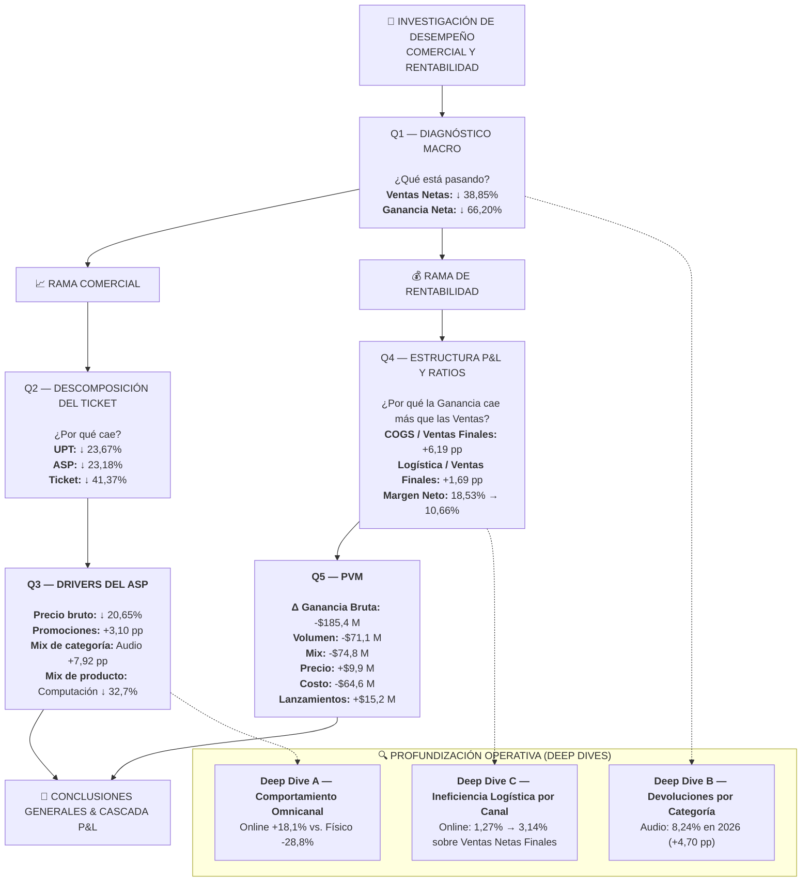
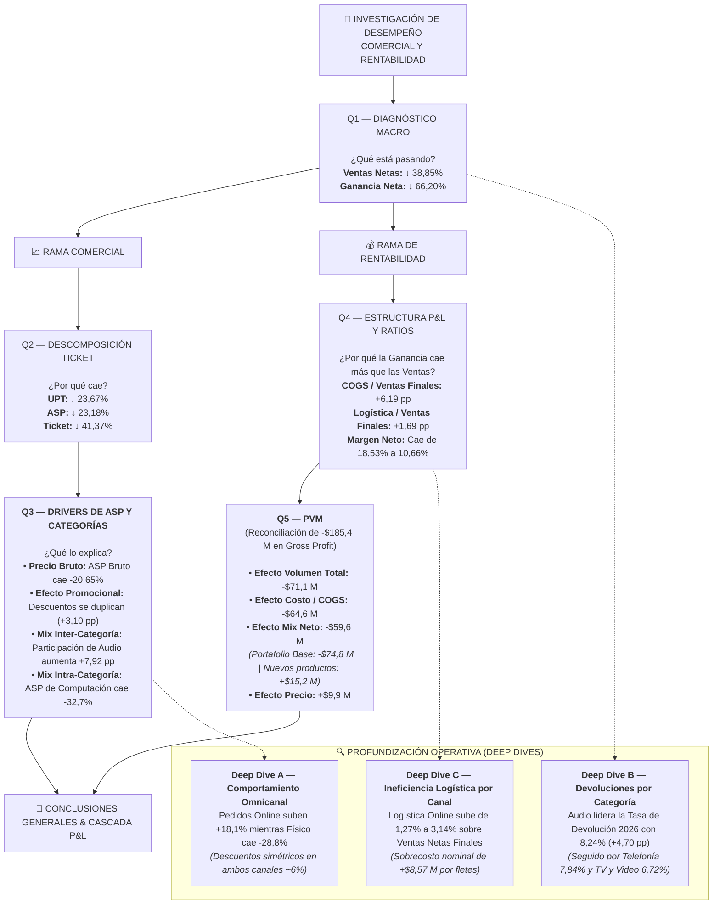
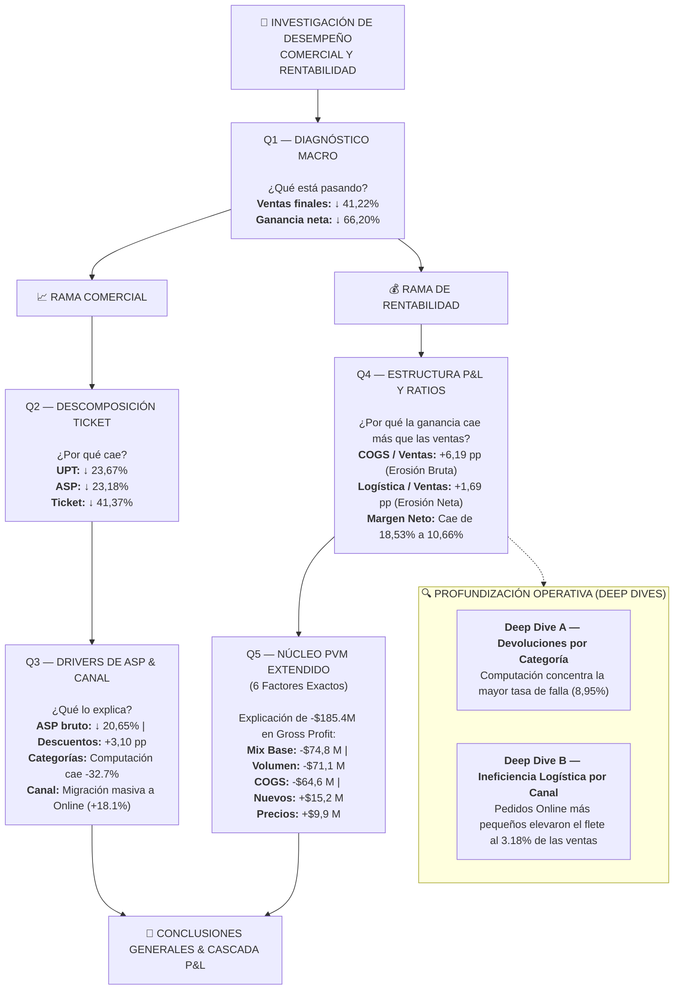
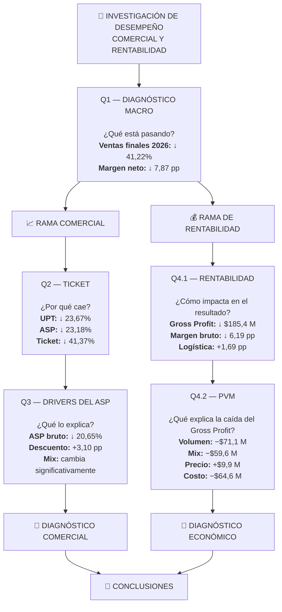

# 🔎 Investigación Analítica SQL

Esta investigación forma parte de un proyecto analítico End-to-End.  
🔗 **Proyecto completo:** https://github.com/manticafacundoelian/dbt_elt_analytics

---

## 📌 Introducción

Esta investigación analiza la evolución comercial y económica de un retail de tecnología entre **2024 y 2026**, con el objetivo de identificar los principales factores asociados al deterioro observado en ventas, ticket y rentabilidad.

El análisis parte de un diagnóstico macro y se divide posteriormente en dos ramas:

* **Rama comercial:** descompone la caída del ticket en sus dos variables fundamentales (**UPT** y **ASP**) y profundiza en los factores que explican el comportamiento del valor unitario (**precio bruto, promociones y cambios de mix por categoría**).
* **Rama de rentabilidad:** analiza cómo estos cambios impactan en la masa de margen, desglosando la estructura de costos P&L y reconciliando la variación de la ganancia bruta mediante un modelo PVM (Price–Volume–Mix), con apertura del componente Mix a nivel de producto.

---

## 🗺️ Hoja de Ruta Ejecutiva & Resumen de Diagnóstico

---

## 🔎 Investigación y Desarrollo 

La investigación busca responder **cinco preguntas principales de diagnóstico**, complementadas por **tres análisis operativos de profundización (*Deep Dives*)**:

### Preguntas Core del Diagnóstico 

### ┌─ Q1 — Diagnóstico Macro: ¿Qué cambió en el desempeño general del negocio?

<strong>Ver desarrollo de Q1</strong>
  
     

[Ver Consulta SQL →](./sql_business_analysis/q1_diagnostico_macro_yoy.sql)
  

#### 🔹 Resultados

| Métrica                    |       2024 |       2025 |     YoY 2025 |       2026 |     YoY 2026 |
| :------------------------- | ---------: | ---------: | -----------: | ---------: | -----------: |
| **Pedidos**                |      1.365 |      1.581 |  **+15,82%** |      1.649 |   **+4,30%** |
| **Ventas Brutas**          | $1.316,5 M | $1.684,4 M |  **+27,95%** | $1.064,0 M |  **−36,83%** |
| **Ventas Netas**           | $1.290,5 M | $1.633,9 M |  **+26,62%** |   $999,1 M |  **−38,85%** |
| Devoluciones ($)           |    $37,2 M |    $53,7 M |  **+44,45%** |    $70,3 M |  **+30,90%** |
| **Tasa de Devolución (%)** |      2,88% |      3,28% | **+0,40 pp** |      7,03% | **+3,75 pp** |
| **Ventas Netas Finales**   | $1.253,3 M | $1.580,3 M |  **+26,09%** |   $928,9 M |  **−41,22%** |
| **Ganancia Neta**          |   $297,6 M |   $292,8 M |   **−1,59%** |    $99,0 M |  **−66,20%** |
| **Margen Neto (%)**        |     23,74% |     18,53% | **−5,21 pp** |     10,66% | **−7,87 pp** |
| **Ticket Comercial**       |   $945.397 | $1.033.477 |   **+9,32%** |   $605.891 |  **−41,37%** |

> *Nota: El Ticket Comercial se calcula sobre Ventas Netas, antes de devoluciones, para analizar el comportamiento comercial de las órdenes independientemente de las devoluciones posteriores.*

#### 🔹 Hallazgos

**1. La caída de ventas se explica por una fuerte reducción del ticket**

En 2026 se registraron **1.649 pedidos, un 4,30% más que en 2025**, mientras que las Ventas Netas disminuyeron **38,85%**.

Dado que las ventas resultan de la cantidad de pedidos y el valor promedio de cada pedido, la diferencia se explica por la fuerte caída del **Ticket Comercial, que disminuyó 41,37%**, pasando de $1.033.477 a $605.891.

**2. El deterioro de la rentabilidad ya estaba presente en 2025**

En 2025, las Ventas Netas crecieron **26,62%**, mientras que la Ganancia Neta disminuyó **1,59%**.

Durante el mismo período, el Margen Neto pasó de **23,74% a 18,53%**, una reducción de **5,21 pp**.

**3. Las devoluciones tienen una mayor incidencia en 2026**

La Tasa de Devolución pasó de **3,28% en 2025 a 7,03% en 2026**, un aumento de **3,75 pp**.

Como resultado, las Ventas Netas Finales disminuyeron **41,22%**, frente a una caída de **38,85%** en las Ventas Netas antes de devoluciones.

**4. La ganancia cae más que las ventas**

En 2026, las Ventas Netas disminuyeron **38,85%**, mientras que la Ganancia Neta cayó **66,20%**.

El Margen Neto pasó de **18,53% a 10,66%**, una reducción adicional de **7,87 pp**.

La diferencia entre la evolución de ventas y rentabilidad requiere analizar la estructura de costos y márgenes, que será abordada en la **Rama de Rentabilidad**.

#### 🔹 Puente analítico → Q2

El diagnóstico muestra que en 2026 la cantidad de pedidos se mantiene relativamente estable, mientras que el valor promedio de cada pedido disminuye significativamente.

**Q2 descompone el Ticket Comercial en sus dos componentes: UPT y ASP**, para determinar cuánto de esta caída se relaciona con una menor cantidad de unidades por pedido y cuánto con el valor promedio de cada unidad.

### ├─ Q2 — Descomposición del Ticket: ¿Por qué cayó el ticket comercial? (UPT vs. ASP)

<strong>Ver desarrollo de Q2</strong>
  
     

[Ver Consulta SQL →](./sql_business_analysis/q2_descomposicion_ticket.sql)  

#### 🔹 Resultados

| Métrica                       |       2024 |       2025 |    YoY 2025 |     2026 |    YoY 2026 |
| :---------------------------- | ---------: | ---------: | ----------: | -------: | ----------: |
| **Pedidos**                   |      1.365 |      1.581 | **+15,82%** |    1.649 |  **+4,30%** |
| **Unidades Totales**          |      3.946 |      4.746 | **+20,27%** |    3.778 | **−20,41%** |
| **Ventas Netas Comerciales**  | $1.290,5 M | $1.633,9 M | **+26,62%** | $999,1 M | **−38,85%** |
| **Unidades por Pedido (UPT)** |       2,89 |       3,00 |  **+3,81%** |     2,29 | **−23,67%** |
| **ASP Comercial**             |   $327.032 |   $344.275 |  **+5,27%** | $264.456 | **−23,18%** |
| **Ticket Comercial**          |   $945.397 | $1.033.477 |  **+9,32%** | $605.891 | **−41,37%** |

> *Nota: **Ticket Comercial = UPT × ASP**, donde UPT representa las unidades promedio por pedido y ASP el valor promedio por unidad.*

#### 🔹 Hallazgos

**1. El ticket cae por dos vías simultáneas**

Entre 2025 y 2026, el Ticket Comercial disminuyó **41,37%**. La descomposición muestra una caída prácticamente equivalente en sus dos componentes: **UPT −23,67%** y **ASP −23,18%**.

Esto indica que en 2026 los clientes compraron **menos unidades por pedido y, además, a un menor valor promedio por unidad**.

**2. El ASP requiere una investigación específica**

La caída del ASP abre una nueva pregunta: **¿qué cambió en el valor de las unidades vendidas?**

Q3 profundiza en **precio bruto, descuentos/promociones y mix de categorías y productos** para explicar este deterioro.

#### 🔹 Puente analítico → Q3

**Q2 identifica los dos componentes del deterioro del ticket; Q3 profundiza en los drivers del ASP.**

### ├─ Q3 — Drivers del ASP y Categorías: ¿Qué explica la caída del ASP? (Precio bruto, Descuentos y Mix)

<strong>Ver desarrollo de Q3</strong>
  
     

**Q3.1 — ASP bruto y descuentos**

[Ver Consulta SQL →](./sql_business_analysis/q3_1_asp_bruto_descuentos.sql)  

#### 🔹 Resultados

| Métrica                |     2025 |     2026 |    Variación |
| :--------------------- | -------: | -------: | -----------: |
| **ASP Bruto**          | $354.911 | $281.632 |  **−20,65%** |
| **Tasa de Descuento**  |    3,00% |    6,10% | **+3,10 pp** |
| **ASP Neto Comercial** | $344.275 | $264.456 |  **−23,18%** |

#### 🔹 Hallazgos — Q3.1

El deterioro del ASP no se explica únicamente por una mayor presión de descuentos. Entre 2025 y 2026, el **ASP Bruto cayó 20,65%**, mientras que la **Tasa de Descuento aumentó 3,10 pp**, llevando el ASP Neto Comercial a una caída del **23,18%**.

La caída del **ASP Bruto** constituye, por lo tanto, un **driver central a investigar**, ya que el deterioro del valor unitario se produce antes de considerar el efecto adicional de los descuentos.
 

**Q3.2 — Mix y comportamiento por categoría**

[Ver Consulta SQL →](./sql_business_analysis/q3_2_mix_categorias.sql)  

#### 🔹 Resultados

| Categoría       | Share U. 2025 | Share U. 2026 |   Cambio Mix |   ASP 2025 |   ASP 2026 |     ASP YoY | Δ Descuento |
| :-------------- | ------------: | ------------: | -----------: | ---------: | ---------: | ----------: | ----------: |
| **Hogar**       |        21,07% |        24,88% | **+3,81 pp** |   $109.885 |   $112.885 |  **+2,73%** |    +4,00 pp |
| **Audio**       |        14,90% |        22,82% | **+7,92 pp** |   $221.366 |   $223.283 |  **+0,87%** |    +4,05 pp |
| **Accesorios**  |        25,75% |        20,70% | **−5,05 pp** |    $79.856 |    $83.864 |  **+5,02%** |    +3,73 pp |
| **Computación** |        16,16% |        18,26% | **+2,10 pp** |   $316.965 |   $213.195 | **−32,74%** |    +2,82 pp |
| **TV y Video**  |        16,67% |        10,64% | **−6,03 pp** | $1.071.105 | $1.027.052 |  **−4,11%** |    +2,73 pp |
| **Telefonía**   |         5,46% |         2,70% | **−2,76 pp** |   $693.426 |   $735.022 |  **+6,00%** |    +1,45 pp |

#### 🔹 Hallazgos — Q3.2

El deterioro del ASP combina dos fenómenos: **cambios en el mix entre categorías** y **cambios en el ASP dentro de cada categoría**.

Entre 2025 y 2026, **Audio gana 7,92 pp de participación** y **TV y Video pierde 6,03 pp**, modificando la composición de las unidades vendidas. Al mismo tiempo, algunas categorías presentan un deterioro significativo de su propio valor unitario: **Computación reduce su ASP 32,74%**, mientras que TV y Video lo hace un 4,11%.

Esto muestra que la caída del ASP consolidado no responde únicamente a *qué categorías se venden más*, sino también a **cómo evoluciona el valor unitario dentro de cada categoría**.

#### 🔹 Síntesis de Q3

La caída del ASP Comercial en 2026 surge de **tres dimensiones que deben analizarse conjuntamente**: el deterioro del **ASP Bruto**, el aumento de los **descuentos** y los cambios de **mix entre categorías**, junto con la evolución del ASP **dentro de cada categoría**.

El principal punto de profundización queda planteado en el **deterioro del ASP Bruto**, mientras que el análisis de mix permite identificar dónde se concentra el cambio y qué categorías presentan además un deterioro propio de su valor unitario.

#### 🔹 Puente analítico → Q4

Q3 explica el deterioro del valor comercial por unidad. El siguiente paso es analizar **cómo este deterioro, junto con la evolución de los costos, termina impactando la rentabilidad del negocio**.

**Q4 aborda la estructura de P&L, COGS, logística y márgenes para explicar por qué la ganancia cae más que las ventas.**

### ├─ Q4 — Estructura de Rentabilidad y Ratios P&L: ¿Por qué la rentabilidad se deterioró mucho más que las ventas?

<strong>Ver desarrollo de Q4</strong>
  
 

[Ver Consulta SQL →](./sql_business_analysis/q4_rentabilidad_ratios_pnl.sql)  

#### 🔹 Resultados

| Métrica                      |       2024 |       2025 |     YoY 2025 |     2026 |     YoY 2026 |
| :--------------------------- | ---------: | ---------: | -----------: | -------: | -----------: |
| **Ventas Netas Finales**     | $1.253,3 M | $1.580,3 M |  **+26,09%** | $928,9 M |  **−41,22%** |
| **Costo de Ventas**          |   $943,1 M | $1.270,0 M |  **+34,60%** | $804,0 M |  **−36,69%** |
| **Costo de Ventas / Ventas** |     75,25% |     80,37% | **+5,12 pp** |   86,56% | **+6,19 pp** |
| **Margen Bruto**             |     24,75% |     19,63% | **−5,12 pp** |   13,44% | **−6,19 pp** |
| **Costo Logístico / Ventas** |      1,01% |      1,10% | **+0,09 pp** |    2,79% | **+1,69 pp** |
| **Ganancia Neta**            |   $297,6 M |   $292,8 M |   **−1,59%** |  $99,0 M |  **−66,20%** |
| **Margen Neto**              |     23,74% |     18,53% | **−5,21 pp** |   10,66% | **−7,87 pp** |

#### 🔹 Hallazgos

**1. El costo de ventas absorbe una proporción cada vez mayor de los ingresos**

Entre 2025 y 2026, el **Costo de Ventas / Ventas** aumentó **6,19 pp**, pasando de 80,37% a 86,56%.

Como consecuencia, el **Margen Bruto** se redujo en la misma magnitud, de 19,63% a 13,44%.

**2. La presión logística también se intensifica**

El **Costo Logístico / Ventas** pasó de 1,10% a 2,79%, un aumento de **1,69 pp**.

Este incremento agrega presión adicional sobre la rentabilidad después del deterioro del margen bruto.

**3. La rentabilidad cae más que las ventas**

Mientras las **Ventas Netas Finales disminuyeron 41,22%**, la **Ganancia Neta cayó 66,20%**.

El **Margen Neto** pasó de 18,53% a 10,66%, una reducción de **7,87 pp**.

El deterioro observado requiere profundizar en los componentes que explican la evolución de la **Ganancia Bruta**, particularmente el efecto del volumen, mix, precio y costo.

#### 🔹 Puente analítico → Q5

Q4 identifica un deterioro significativo de la estructura de rentabilidad, principalmente por el aumento del peso del **Costo de Ventas** y, adicionalmente, por una mayor presión del **Costo Logístico**.

**Q5 descompone la variación de la Ganancia Bruta mediante un PVM formal —Volumen → Mix → Precio → Costo—**, para determinar qué componentes explican cuantitativamente el deterioro entre 2025 y 2026.

### └─ Q5 — PVM: ¿Qué componentes explican la caída de la Ganancia Bruta?

<strong>Ver desarrollo de Q5</strong>
  
 

#### Q5.1 — PVM Consolidado: ¿Qué explica la variación total?

[Ver Consulta SQL →](./sql_business_analysis/q5_pvm_consolidado.sql)  

#### 🔹 Resultados

| Factor              | Efecto sobre la Ganancia Bruta | Participación |
| :------------------ | -----------------------------: | ------------: |
| **Volumen**         |                       −$71,1 M |        38,36% |
| **Mix**             |                       −$74,8 M |        40,33% |
| **Precio**          |                        +$9,9 M |        −5,33% |
| **Costo**           |                       −$64,6 M |        34,83% |
| **Lanzamientos**    |                       +$15,2 M |        −8,19% |
| **Discontinuados**  |                         $0,0 M |         0,00% |
| **Variación total** |                  **−$185,4 M** |   **100,00%** |

**Ganancia Bruta 2025:** $310,2 M
**Ganancia Bruta 2026:** $124,9 M
**Variación:** **−$185,4 M**

> *Nota: Los porcentajes representan la contribución de cada efecto a la variación total de la Ganancia Bruta. Los efectos positivos aparecen con participación porcentual negativa porque compensan parcialmente una variación total negativa.*

> *En productos continuos, la variación se descompone en Volumen, Mix, Precio y Costo. Los productos nuevos y discontinuados se aíslan mediante los efectos específicos de Lanzamientos y Discontinuados. Esta estructura se mantiene en los niveles de categoría y SKU.*

#### 🔹 Hallazgos

**1. Los mayores efectos negativos corresponden a Mix, Volumen y Costo**

El **Mix (−$74,8 M)**, el **Volumen (−$71,1 M)** y el **Costo (−$64,6 M)** presentan los mayores efectos negativos sobre la variación de la Ganancia Bruta.

**2. El Mix presenta el mayor efecto negativo individual**

El Mix genera un efecto de **−$74,8 M**, ligeramente superior al impacto del Volumen (**−$71,1 M**).

Esto refleja que el cambio en la composición de los productos vendidos tuvo un efecto negativo significativo sobre la evolución de la Ganancia Bruta.

**3. Precio y lanzamientos compensan parcialmente la caída**

El efecto Precio aporta **+$9,9 M**, mientras que los nuevos productos aportan **+$15,2 M**.

Ambos efectos compensan parcialmente los efectos negativos, aunque no alcanzan para revertir la caída consolidada.

#### 🔹 Reconciliación

El PVM explica exactamente la variación observada en la Ganancia Bruta:

**−$71,1 M − $74,8 M + $9,9 M − $64,6 M + $15,2 M = −$185,4 M**

La diferencia de reconciliación es **$0,00**.

#### Q5.2 — PVM por Categoría: ¿Dónde se concentra el deterioro?

[Ver Consulta SQL →](./sql_business_analysis/q5_pvm_por_categoria.sql)  

#### 🔹 Resultados

| Categoría       | Unidades 2025 | Unidades 2026 |      Volumen |          Mix |      Precio |        Costo | Lanzamientos | Discontinuados |    Efecto PVM |
| :-------------- | ------------: | ------------: | -----------: | -----------: | ----------: | -----------: | -----------: | -------------: | ------------: |
| **TV y Video**  |           764 |           375 |     −$32,6 M |     −$42,9 M |     +$4,4 M |     −$29,7 M |       $0,0 M |         $0,0 M | **−$100,9 M** |
| **Computación** |           741 |           647 |     −$14,1 M |     −$18,5 M |     +$0,9 M |      −$6,0 M |      +$5,3 M |         $0,0 M |  **−$32,3 M** |
| **Telefonía**   |           248 |            94 |      −$7,3 M |     −$12,4 M |     +$1,5 M |      −$4,0 M |      +$0,2 M |         $0,0 M |  **−$22,1 M** |
| **Accesorios**  |         1.183 |           734 |      −$4,1 M |      −$2,8 M |     +$0,7 M |      −$5,8 M |      +$0,7 M |         $0,0 M |  **−$11,3 M** |
| **Audio**       |           682 |           791 |      −$7,4 M |      −$2,7 M |     +$1,6 M |     −$10,4 M |      +$9,1 M |         $0,0 M |   **−$9,8 M** |
| **Hogar**       |           968 |           894 |      −$5,6 M |      +$4,5 M |     +$0,8 M |      −$8,6 M |       $0,0 M |         $0,0 M |   **−$8,9 M** |
| **Total**       |     **4.586** |     **3.535** | **−$71,1 M** | **−$74,8 M** | **+$9,9 M** | **−$64,6 M** | **+$15,2 M** |     **$0,0 M** | **−$185,4 M** |

#### 🔹 Hallazgos

**1. TV y Video concentra el mayor efecto PVM negativo**

TV y Video registra un efecto PVM de **−$100,9 M**, con efectos negativos especialmente relevantes de **Mix (−$42,9 M)**, **Volumen (−$32,6 M)** y **Costo (−$29,7 M)**. El efecto Precio aporta **+$4,4 M**.

**2. Computación y Telefonía presentan los siguientes mayores efectos negativos**

Computación registra **−$32,3 M** y Telefonía **−$22,1 M**.

En ambas categorías, los efectos negativos de **Mix y Volumen** se combinan con un efecto negativo de Costo. Los **Lanzamientos** generan compensaciones positivas parciales, especialmente en Computación.

**3. Audio incrementa sus unidades, pero presenta un efecto PVM negativo**

Audio aumenta sus unidades de **682 a 791**, pero registra un efecto PVM de **−$9,8 M**.

El efecto positivo de **Lanzamientos (+$9,1 M)** y el efecto Precio (**+$1,6 M**) compensan parcialmente los efectos negativos de **Costo (−$10,4 M)**, Volumen y Mix.

**4. Hogar presenta un efecto Mix favorable**

Hogar es la única categoría con un **efecto Mix positivo (+$4,5 M)**.

Sin embargo, los efectos negativos de **Costo (−$8,6 M)** y Volumen (**−$5,6 M**) llevan el efecto PVM total a **−$8,9 M**.

#### 🔹 Reconciliación por categoría

La suma de los efectos PVM de todas las categorías reproduce exactamente la variación consolidada de Ganancia Bruta:

**−$185,4 M**

La descomposición por categoría mantiene la reconciliación del PVM a nivel empresa.

#### Q5.3 — PVM por SKU: ¿Qué productos explican el deterioro?

[Ver Consulta SQL →](./sql_business_analysis/q5_pvm_por_sku.sql)  

#### 🔹 Resultados

Los principales efectos negativos se concentran en un grupo reducido de SKUs:

| Producto              | Categoría   |   Efecto PVM |
| :-------------------- | :---------- | -----------: |
| TCL Monitor TV 21     | TV y Video  | **−$44,8 M** |
| TCL Chromecast 25     | TV y Video  | **−$26,9 M** |
| Acer Memoria RAM 2    | Computación | **−$21,2 M** |
| TCL Monitor TV 19     | TV y Video  | **−$14,2 M** |
| Lenovo Mouse 1        | Computación | **−$12,7 M** |
| Samsung Smart TV 20   | TV y Video  |  **−$9,9 M** |
| ASUS Notebook 5       | Computación |  **−$7,2 M** |
| Samsung Smartphone 14 | Telefonía   |  **−$6,7 M** |

Los principales efectos positivos incluyen nuevos productos y algunos SKUs continuos con crecimiento de volumen:

| Producto                   | Categoría   | Estado   |  Efecto PVM |
| :------------------------- | :---------- | :------- | ----------: |
| Philips Equipo de Audio 30 | Audio       | Nuevo    | **+$7,6 M** |
| ASUS Webcam 6              | Computación | Continuo | **+$5,2 M** |
| Sony Equipo de Audio 33    | Audio       | Nuevo    | **+$3,5 M** |
| Acer Notebook 7            | Computación | Nuevo    | **+$2,8 M** |
| HP Mouse 10                | Computación | Nuevo    | **+$2,4 M** |

#### 🔹 Hallazgos

**1. El deterioro está fuertemente concentrado en determinados SKUs**

Los mayores impactos negativos corresponden principalmente a productos de **TV y Video** y **Computación**, en línea con el análisis realizado a nivel categoría.

Los dos principales SKUs —**TCL Monitor TV 21** y **TCL Chromecast 25**— generan conjuntamente un efecto PVM de aproximadamente **−$71,7 M**.

**2. La caída de unidades es recurrente entre los principales SKUs negativos**

Los productos con mayor impacto negativo presentan fuertes reducciones de unidades vendidas, aunque el PVM permite separar ese efecto de los impactos adicionales de **Mix, Precio y Costo**.

**3. Los lanzamientos compensan parcialmente el deterioro**

Entre los principales efectos positivos aparece **Philips Equipo de Audio 30**, cuyo lanzamiento aporta aproximadamente **+$7,6 M** de Ganancia Bruta.

También se observan contribuciones positivas relevantes de nuevos productos de Audio y Computación.

**4. El crecimiento de volumen puede compensar otros efectos negativos**

**ASUS Webcam 6** presenta un efecto Volumen de aproximadamente **+$7,7 M**, que compensa sus efectos negativos de Mix, Precio y Costo y lleva su efecto PVM total a **+$5,2 M**.

Esto muestra la utilidad del PVM para distinguir entre los distintos mecanismos que explican la evolución de la Ganancia Bruta a nivel producto.

#### 🔹 Cierre del análisis PVM

El análisis permite descomponer la caída de la Ganancia Bruta entre 2025 y 2026 en tres niveles de profundidad:

**Empresa → Categoría → SKU**

A nivel consolidado, los mayores efectos negativos corresponden a **Mix, Volumen y Costo**.
A nivel categoría, el deterioro se concentra especialmente en **TV y Video, Computación y Telefonía**.
A nivel SKU, un grupo reducido de productos explica una parte significativa de esos efectos, mientras que **nuevos lanzamientos y algunos productos con crecimiento de volumen compensan parcialmente la caída**.

### Profundización Operativa (Deep Dives)

#### ├─ Deep Dive A — Comportamiento Omnicanal: Online vs. Físico.
#### ├─ Deep Dive B — Devoluciones por Categoría.
#### ├─ Deep Dive C — Ineficiencia Logística por Canal.

---

## 🧭 Metodología y criterios de análisis

Para mantener consistencia entre las distintas etapas se establecen los siguientes criterios:

### Universo de análisis

* Toda la investigación utiliza `order_status = 'delivered'` como filtro único y consistente en todas las consultas.
* Se eligió este criterio para garantizar comparabilidad entre etapas: todos los indicadores se calculan sobre el mismo universo de pedidos efectivamente entregados.
* ⚠️ **Nota sobre 2026:** a diferencia de 2024 y 2025 (años cerrados), 2026 es un año en curso y aún tiene pedidos en estados `processing` y `shipped` al momento del corte de datos. Estos pedidos no están incluidos en ninguna métrica. Por lo tanto, las variaciones interanuales reportadas para 2026 reflejan únicamente la porción de la actividad completada.

### Ventas y devoluciones

* **Ventas Brutas:** valor de los productos antes de descuentos.
* **Ventas Netas:** ventas después de descuentos y antes de devoluciones.
* **Ventas Netas Finales:** ventas netas después de devoluciones aprobadas.
* En los análisis de rentabilidad, las unidades, ingresos y costos asociados a devoluciones se ajustan para reflejar el resultado final de la operación.

### Rentabilidad

* **Ganancia Bruta** = Ventas netas finales − Costo de mercadería vendida (COGS).
* **Ganancia Neta** = Ganancia bruta − Costo logístico asignado.
* Los márgenes se calculan sobre las ventas netas finales.

### Métricas comerciales (Q2 y Q3)

Para analizar el comportamiento del ticket se utilizan:

* **Ticket Comercial** = Ventas Netas / Pedidos.
* **UPT (Units Per Transaction)** = Unidades / Pedidos.
* **ASP Comercial** = Ventas Netas / Unidades.

Estas métricas se calculan antes de devoluciones para aislar el comportamiento puramente comercial de la intención de compra.

---

## Desarrollo SQL

### Q1 — Diagnóstico Macro YoY

<strong>Ver desarrollo de Q1</strong>

### 🎯 Objetivo

Establecer una línea base del desempeño comercial y financiero entre 2024 y 2026, observando la evolución interanual de los pedidos, las ventas, las devoluciones y la rentabilidad.

### 🔎 Consulta SQL

[Ver consulta →](./sql/q1_diagnostico_macro_yoy.sql)

### 📊 Resultados observados

| Métrica                    |       2024 |       2025 |     YoY 2025 |       2026 |     YoY 2026 |
| :------------------------- | ---------: | ---------: | -----------: | ---------: | -----------: |
| **Pedidos**                |      1.365 |      1.581 |  **+15,82%** |      1.649 |   **+4,30%** |
| **Ventas Brutas**          | $1.316,5 M | $1.684,4 M |  **+27,95%** | $1.064,0 M |  **−36,83%** |
| **Ventas Netas**           | $1.290,5 M | $1.633,9 M |  **+26,62%** |   $999,1 M |  **−38,85%** |
| Devoluciones ($)           |    $37,2 M |    $53,7 M |  **+44,45%** |    $70,3 M |  **+30,90%** |
| **Tasa de Devolución (%)** |      2,88% |      3,28% | **+0,40 pp** |      7,03% | **+3,75 pp** |
| **Ventas Netas Finales**   | $1.253,3 M | $1.580,3 M |  **+26,09%** |   $928,9 M |  **−41,22%** |
| **Ganancia Neta**          |   $297,6 M |   $292,8 M |   **−1,59%** |    $99,0 M |  **−66,20%** |
| **Margen Neto (%)**        |     23,74% |     18,53% | **−5,21 pp** |     10,66% | **−7,87 pp** |
| **Ticket Comercial**       |   $945.397 | $1.033.477 |   **+9,32%** |   $605.891 |  **−41,37%** |

> *Nota: El Ticket Comercial se calcula sobre Ventas Netas, antes de devoluciones, para analizar el comportamiento comercial de las órdenes independientemente de las devoluciones posteriores.*

### 💡 Hallazgos clave

#### 1. La caída de ventas se explica por una fuerte reducción del ticket

En 2026 se registraron **1.649 pedidos, un 4,30% más que en 2025**, mientras que las Ventas Netas disminuyeron **38,85%**.

Dado que las ventas resultan de la cantidad de pedidos y el valor promedio de cada pedido, la diferencia se explica por la fuerte caída del **Ticket Comercial, que disminuyó 41,37%**, pasando de $1.033.477 a $605.891.

#### 2. El deterioro de la rentabilidad ya estaba presente en 2025

En 2025, las Ventas Netas crecieron **26,62%**, mientras que la Ganancia Neta disminuyó **1,59%**.

Durante el mismo período, el Margen Neto pasó de **23,74% a 18,53%**, una reducción de **5,21 pp**.

#### 3. Las devoluciones tienen una mayor incidencia en 2026

La Tasa de Devolución pasó de **3,28% en 2025 a 7,03% en 2026**, un aumento de **3,75 pp**.

Como resultado, las Ventas Netas Finales disminuyeron **41,22%**, frente a una caída de **38,85%** en las Ventas Netas antes de devoluciones.

#### 4. La ganancia cae más que las ventas

En 2026, las Ventas Netas disminuyeron **38,85%**, mientras que la Ganancia Neta cayó **66,20%**.

El Margen Neto pasó de **18,53% a 10,66%**, una reducción adicional de **7,87 pp**.

La diferencia entre la evolución de ventas y rentabilidad requiere analizar la estructura de costos y márgenes, que será abordada en la **Rama de Rentabilidad**.

#### 🧭 Puente analítico → Q2

El diagnóstico muestra que en 2026 la cantidad de pedidos se mantiene relativamente estable, mientras que el valor promedio de cada pedido disminuye significativamente.

**Q2 descompone el Ticket Comercial en sus dos componentes: UPT y ASP**, para determinar cuánto de esta caída se relaciona con una menor cantidad de unidades por pedido y cuánto con el valor promedio de cada unidad.

## 🗺️ Executive Roadmap & Resumen de Diagnóstico

# 🔎 Investigación de desempeño comercial y rentabilidad

## 📌 Introducción

Esta investigación analiza la evolución comercial y económica de un ecommerce entre **2024 y 2026**, con el objetivo de identificar los principales factores asociados al deterioro observado en ventas, ticket y rentabilidad.

El análisis parte de un diagnóstico macro y se divide posteriormente en dos ramas:

* **Rama comercial:** descompone la caída del ticket en sus dos variables fundamentales (**UPT** y **ASP**) y profundiza en los factores que erosionan el valor unitario (**precios de lista, promociones y cambios de mix por categoría**).
* **Rama de rentabilidad:** analiza cómo estos cambios impactan en la masa de margen, desglosando la estructura de costos P&L y reconciliando la variación de la ganancia bruta mediante un modelo PVM (Price–Volume–Mix), con apertura del componente Mix a nivel de producto.

La investigación busca responder **cinco preguntas principales de diagnóstico**, complementadas por **tres análisis operativos de profundización (*Deep Dives*)**:

### 📌 Preguntas Core del Diagnóstico (Flujo Central)
**Q1 — Diagnóstico Macro:** ¿Qué cambió en el desempeño general del negocio?
**Q2 — Descomposición del Ticket:** ¿Por qué cayó el ticket comercial? (UPT vs. ASP)
**Q3 — Drivers del ASP y Categorías:** ¿Qué explica la caída del ASP? (Precios brutos, Descuentos y Mix)
**Q4 — Estructura de Rentabilidad y Ratios P&L:** ¿Por qué la rentabilidad se deterioró mucho más que las ventas entre 2025 y 2026?
**Q5 — Núcleo PVM Extendido (Consolidado, Categoría y SKU):** ¿Qué componentes explican matemáticamente la caída de la Ganancia Bruta?

### 🔍 Profundización Operativa (Deep Dives por Rama)
* **Deep Dive A (Rama Comercial):** Comportamiento Omnicanal (Online vs. Físico).
* **Deep Dive B (Fuga Macro):** Auditoría de Devoluciones por Categoría.
* **Deep Dive C (Rama Rentabilidad):** Ineficiencia del Costo Logístico por Canal.

---

## 🧭 Metodología y criterios de análisis

Para mantener consistencia entre las distintas etapas se establecen los siguientes criterios:

### Universo de análisis

* Toda la investigación utiliza `order_status = 'delivered'` como filtro único y consistente en todas las consultas.
* Se eligió este criterio para garantizar comparabilidad entre etapas: todos los indicadores se calculan sobre el mismo universo de pedidos efectivamente entregados.
* ⚠️ **Nota sobre 2026:** a diferencia de 2024 y 2025 (años cerrados), 2026 es un año en curso y aún tiene pedidos en estados `processing` y `shipped` al momento del corte de datos. Estos pedidos no están incluidos en ninguna métrica. Por lo tanto, las variaciones interanuales reportadas para 2026 reflejan únicamente la porción de la actividad completada.

### Ventas y devoluciones

* **Ventas Brutas:** valor de los productos antes de descuentos.
* **Ventas Netas:** ventas después de descuentos y antes de devoluciones.
* **Ventas Netas Finales:** ventas netas después de devoluciones aprobadas.
* En los análisis de rentabilidad, las unidades, ingresos y costos asociados a devoluciones se ajustan para reflejar el resultado final de la operación.

### Rentabilidad

* **Ganancia Bruta** = Ventas netas finales − Costo de mercadería vendida (COGS).
* **Ganancia Neta** = Ganancia bruta − Costo logístico asignado.
* Los márgenes se calculan sobre las ventas netas finales.

### Métricas comerciales (Q2 y Q3)

Para analizar el comportamiento del ticket se utilizan:
* **Ticket Comercial** = Ventas Netas / Pedidos.
* **UPT (Units Per Transaction)** = Unidades / Pedidos.
* **ASP Comercial** = Ventas Netas / Unidades.

Estas métricas se calculan antes de devoluciones para aislar el comportamiento puramente comercial de la intención de compra.

---

## 🗺️ Executive Roadmap & Resumen de Diagnóstico

---

# Q1 — Diagnóstico Macro YoY

## 🎯 Objetivo

Establecer la línea base del desempeño comercial y financiero de la compañía entre 2024 y 2026, evaluando la evolución interanual de la demanda (pedidos), la masa de ingresos (brutos, netos y finales) y la rentabilidad neta para identificar las anomalías estructurales del negocio.

## 🔎 Consulta SQL

[Ver consulta →](./sql/q1_diagnostico_macro_yoy.sql)

## 📊 Resultados observados

| Métrica | 2024 | 2025 | YoY 2025 | 2026 | YoY 2026 |
| :--- | ---: | ---: | ---: | ---: | ---: |
| **Pedidos** | 1.365 | 1.581 | **+15,82%** | 1.649 | **+4,30%** |
| **Ventas Brutas** | $1.316,5 M | $1.684,4 M | **+27,95%** | $1.064,0 M | **−36,83%** |
| **Ventas Netas** | $1.290,5 M | $1.633,9 M | **+26,62%** | $999,1 M | **−38,85%** |
| Devoluciones ($) | $37,2 M | $53,7 M | **+44,45%** | $70,3 M | **+30,90%** |
| **Tasa de Devolución (%)** | 2,88% | 3,28% | **+0,40 pp** | 7,03% | **+3,75 pp** |
| **Ventas Netas Finales** | $1.253,3 M | $1.580,3 M | **+26,09%** | $928,9 M | **−41,22%** |
| **Ganancia Neta** | $297,6 M | $292,8 M | **−1,59%** | $99,0 M | **−66,20%** |
| **Margen Neto (%)** | 23,74% | 18,53% | **−5,21 pp** | 10,66% | **−7,87 pp** |
| **Ticket Comercial** | $945.397 | $1.033.477 | **+9,32%** | $605.891 | **−41,37%** |

> *Nota: El ticket comercial se calcula sobre Ventas Netas (antes de devoluciones) para aislar la intención de compra real.*

## 💡 Hallazgos clave

### 1. Desconexión entre volumen de transacciones e ingresos en 2026
En 2026, la operación alcanza un máximo histórico en cantidad de órdenes (**1.649 pedidos, +4,30% YoY**). Sin embargo, las **Ventas Netas se desploman un −38,85%** ($999,1 M vs. $1.633,9 M en 2025). El estancamiento o la falta de volumen transaccional no explica la contracción del negocio; el cliente sigue comprando, pero genera drásticamente menos ingresos por transacción.

### 2. Colapso del Ticket Comercial
El **ticket promedio comercial cae un −41,37%** en 2026, pasando de **$1.033.477 a $605.891**. Esta reducción invalida la dinámica de expansión observada en 2025 (+9,32%) y se consolida como el principal *driver* del deterioro comercial antes de la etapa de devoluciones.

### 3. Fuga incremental de ingresos por Devoluciones
Las devoluciones aumentan sostenidamente tanto en términos nominales ($70,3 M) como porcentuales. La **Tasa de Devolución escala del 3,28% al 7,03% (+3,75 pp)** sobre ventas netas en 2026. Esta fricción operativa amplifica la contracción comercial, llevando la caída de las **Ventas Netas Finales al −41,22%**.

### 4. Deterioro estructural de rentabilidad previo al desplome de ventas
El desgaste del modelo de negocio comenzó en 2025: a pesar de un crecimiento de ingresos del **+26,62%**, la **Ganancia Neta cayó un −1,59%** y el **Margen Neto perdió 5,21 pp** (23,74% $\rightarrow$ 18,53%). En 2026, el apalancamiento operativo inverso acelera la sangría: la Ganancia Neta colapsa un **−66,20%** ($99,0 M), comprimiendo el Margen Neto al **10,66%** (perdiendo **7,87 pp** adicionales).

## 🧭 Puente analítico → Q2

El diagnóstico macro confirma que la pérdida de facturación no proviene de una caída en la cantidad de pedidos, sino de una **severa contracción en el valor promedio de cada orden (−41,37%)**. 

Para entender las causas comerciales detrás de este fenómeno, el análisis se desplaza a la **Rama Comercial en Q2**, donde se descompone matemáticamente el Ticket Comercial en sus dos dimensiones fundamentales: **cantidad de unidades por transacción (UPT)** y **precio promedio por unidad vendida (ASP)**.

# 🔎 Investigación de desempeño comercial y rentabilidad

## 📌 Introducción

Esta investigación analiza la evolución comercial y económica de un ecommerce entre **2024 y 2026**, con el objetivo de identificar los principales factores asociados al deterioro observado en ventas, ticket y rentabilidad.

El análisis parte de un diagnóstico macro y se divide posteriormente en dos ramas:

* **Rama comercial:** busca explicar la evolución del ticket, la composición del pedido, el valor promedio de las unidades vendidas, las políticas de descuento y la dinámica omnicanal.
* **Rama de rentabilidad:** analiza cómo estos cambios impactan en la masa de margen, desglosando la fuga por devoluciones, la descomposición de la ganancia bruta mediante un modelo PVM y el arrastre del costo logístico.

La investigación busca responder siete preguntas:

1. **Q1 — Diagnóstico Macro: ¿Qué cambió en el desempeño general del negocio?**
2. **Q2 — Descomposición del Ticket: ¿Por qué cambió el ticket comercial?**
3. **Q3 — Drivers Comerciales y Canales: ¿Qué factores explican la caída del ASP y cómo influyen los descuentos y la omnicanalidad?**
4. **Q4 — Estructura de Rentabilidad y Ratios P&L: ¿Por qué la rentabilidad se deterioró mucho más que las ventas entre 2025 y 2026?**
5. **Q5 — Fuga Pre-PVM: ¿Cómo impacta el incremento de devoluciones por categoría antes de consolidar la venta neta?**
6. **Q6 — Núcleo PVM Extendido (Consolidado, Categoría y SKU): ¿Qué componentes explican matemáticamente la caída de la Ganancia Bruta a nivel macro y a nivel de producto?**
7. **Q7 — Arrastre Post-PVM: ¿Cómo impacta la ineficiencia del costo logístico en la utilidad neta final?**

El análisis avanza desde indicadores agregados hacia explicaciones operativas específicas y finaliza con un **PVM (Price–Volume–Mix)** de 6 factores que reconcilia exactamente al $0,00 la variación de Gross Profit entre 2025 y 2026.

## 🧭 Metodología y criterios de análisis

Para mantener consistencia entre las distintas etapas se establecen los siguientes criterios.

### Universo de análisis

* Toda la investigación utiliza `order_status = 'delivered'` como filtro único y consistente en todas las consultas.
* Se eligió este criterio para garantizar comparabilidad entre etapas: todos los indicadores se calculan sobre el mismo universo de pedidos efectivamente entregados.
* ⚠️ **Nota sobre 2026:** a diferencia de 2024 y 2025 (años cerrados, donde prácticamente la totalidad de los pedidos no cancelados ya alcanzó el estado `delivered`), 2026 es un año en curso y aún tiene pedidos en estados `processing` y `shipped` al momento del corte de datos. Estos pedidos no están incluidos en ninguna métrica de este informe. Por lo tanto, las variaciones interanuales reportadas para 2026 reflejan únicamente la porción de la actividad que ya completó su ciclo, y podrían ajustarse a medida que esos pedidos pendientes se entreguen.

### Ventas y devoluciones

* **Ventas brutas:** valor de los productos antes de descuentos.
* **Ventas netas:** ventas después de descuentos y antes de devoluciones.
* **Ventas netas finales:** ventas netas después de devoluciones aprobadas.
* En los análisis de rentabilidad (Q4 a Q6), las unidades y costos asociados a devoluciones también se ajustan para reflejar el resultado final de la operación.

### Rentabilidad

* **Ganancia bruta** = Ventas netas finales − Costo de ventas.
* **Ganancia neta** = Ganancia bruta − Costo logístico.
* Los márgenes se calculan sobre las ventas netas finales.

### Métricas comerciales (Q2 y Q3)

Para analizar el comportamiento del ticket se utilizan:

* **Ticket comercial** = Ventas netas / Pedidos.
* **UPT (Units Per Transaction)** = Unidades / Pedidos.
* **ASP comercial** = Ventas netas / Unidades.

Estas métricas se calculan antes de devoluciones para aislar el comportamiento puramente comercial de la intención de compra.

## 🗺️ Mapa de la investigación

La investigación parte de un **diagnóstico macro común (Q1)** y luego se divide en dos ramas especializadas.

La **rama comercial** profundiza en el ticket y el ASP, mientras que la **rama de rentabilidad** analiza el comportamiento de costos, márgenes y Gross Profit.

---
# Q1 — Diagnóstico Macro YoY

## 🎯 Objetivo

Establecer la línea base del desempeño comercial y financiero de la compañía entre 2024 y 2026, evaluando la evolución interanual de la demanda (pedidos), la masa de ingresos (brutos, netos y finales) y la rentabilidad neta para identificar las anomalías estructurales del negocio.

## 🔎 Consulta SQL

[Ver consulta →](./sql/q1_diagnostico_macro_yoy.sql)

## 📊 Resultados observados

| Métrica | 2024 | 2025 | YoY 2025 | 2026 | YoY 2026 |
| :--- | ---: | ---: | ---: | ---: | ---: |
| **Pedidos** | 1.365 | 1.581 | **+15,82%** | 1.649 | **+4,30%** |
| **Ventas Brutas** | $1.316,5 M | $1.684,4 M | **+27,95%** | $1.064,0 M | **−36,83%** |
| **Ventas Netas** | $1.290,5 M | $1.633,9 M | **+26,62%** | $999,1 M | **−38,85%** |
| Devoluciones ($) | $37,2 M | $53,7 M | **+44,45%** | $70,3 M | **+30,90%** |
| **Tasa de Devolución (%)** | 2,88% | 3,28% | **+0,40 pp** | 7,03% | **+3,75 pp** |
| **Ventas Netas Finales** | $1.253,3 M | $1.580,3 M | **+26,09%** | $928,9 M | **−41,22%** |
| **Ganancia Neta** | $297,6 M | $292,8 M | **−1,59%** | $99,0 M | **−66,20%** |
| **Margen Neto (%)** | 23,74% | 18,53% | **−5,21 pp** | 10,66% | **−7,87 pp** |
| **Ticket Comercial** | $945.397 | $1.033.477 | **+9,32%** | $605.891 | **−41,37%** |

> *Nota: El ticket comercial se calcula sobre Ventas Netas (antes de devoluciones) para aislar la intención de compra real.*

## 💡 Hallazgos clave

### 1. Desconexión entre volumen de transacciones e ingresos en 2026
En 2026, la operación alcanza un máximo histórico en cantidad de órdenes (**1.649 pedidos, +4,30% YoY**). Sin embargo, las **Ventas Netas se desploman un −38,85%** ($999,1 M vs. $1.633,9 M en 2025). El estancamiento o la falta de volumen transaccional no explica la contracción del negocio; el cliente sigue comprando, pero genera drásticamente menos ingresos por transacción.

### 2. Colapso del Ticket Comercial
El **ticket promedio comercial cae un −41,37%** en 2026, pasando de **$1.033.477 a $605.891**. Esta reducción invalida la dinámica de expansión observada en 2025 (+9,32%) y se consolida como el principal *driver* del deterioro comercial antes de la etapa de devoluciones.

### 3. Fuga incremental de ingresos por Devoluciones
Las devoluciones aumentan sostenidamente tanto en términos nominales ($70,3 M) como porcentuales. La **Tasa de Devolución escala del 3,28% al 7,03% (+3,75 pp)** sobre ventas netas en 2026. Esta fricción operativa amplifica la contracción comercial, llevando la caída de las **Ventas Netas Finales al −41,22%**.

### 4. Deterioro estructural de rentabilidad previo al desplome de ventas
El desgaste del modelo de negocio comenzó en 2025: a pesar de un crecimiento de ingresos del **+26,62%**, la **Ganancia Neta cayó un −1,59%** y el **Margen Neto perdió 5,21 pp** (23,74% $\rightarrow$ 18,53%). En 2026, el apalancamiento operativo inverso acelera la sangría: la Ganancia Neta colapsa un **−66,20%** ($99,0 M), comprimiendo el Margen Neto al **10,66%** (perdiendo **7,87 pp** adicionales).

## 🧭 Puente analítico → Q2

El diagnóstico macro confirma que la pérdida de facturación no proviene de una caída en la cantidad de pedidos, sino de una **severa contracción en el valor promedio de cada orden (−41,37%)**. 

Para entender las causas comerciales detrás de este fenómeno, el análisis se desplaza a la **Rama Comercial en Q2**, donde se descompone matemáticamente el Ticket Comercial en sus dos dimensiones fundamentales: **cantidad de unidades por transacción (UPT)** y **precio promedio por unidad vendida (ASP)**.

---

# Q1 — Diagnóstico Macro YoY

## 🎯 Objetivo

Evaluar la evolución interanual del negocio entre 2024 y 2026 para identificar cambios relevantes en volumen, ventas, devoluciones, ticket y rentabilidad, y detectar qué dimensiones requieren una investigación más profunda.

## 🔎 Consulta SQL

[Ver consulta →](./sql/q1_diagnostico_macro_yoy.sql)

## 📊 Resultados observados

| Métrica              |       2024 |       2025 |     YoY 2025 |       2026 |     YoY 2026 |
| -------------------- | ---------: | ---------: | -----------: | ---------: | -----------: |
| Pedidos              |      1.365 |      1.581 |  **+15,82%** |      1.649 |   **+4,30%** |
| Ventas brutas        | $1.316,5 M | $1.684,4 M |  **+27,95%** | $1.064,0 M |  **−36,83%** |
| Ventas netas         | $1.290,5 M | $1.633,9 M |  **+26,62%** |   $999,1 M |  **−38,85%** |
| Tasa de devolución   |      2,88% |      3,28% | **+0,40 pp** |      7,03% | **+3,75 pp** |
| Ventas netas finales | $1.253,3 M | $1.580,3 M |  **+26,09%** |   $928,9 M |  **−41,22%** |
| Ganancia neta        |   $297,6 M |   $292,8 M |   **−1,59%** |    $99,0 M |  **−66,20%** |
| Margen neto          |     23,74% |     18,53% | **−5,21 pp** |     10,66% | **−7,87 pp** |
| Ticket comercial     |   $945.397 | $1.033.477 |   **+9,32%** |   $605.891 |  **−41,37%** |

> El ticket comercial corresponde a ventas netas después de descuentos y antes de devoluciones.

## 💡 Hallazgos clave

### 1. El deterioro de 2026 ocurre pese al crecimiento de los pedidos

Entre 2025 y 2026 los pedidos aumentaron un **4,30%**, pasando de 1.581 a 1.649. Sin embargo, las ventas netas disminuyeron **38,85%** y las ventas netas finales **41,22%**.

El problema, por lo tanto, no puede explicarse únicamente por una caída en la cantidad de pedidos.

### 2. El ticket presenta una caída pronunciada en 2026

El ticket comercial pasó de $1.033.477 en 2025 a $605.891 en 2026, una disminución interanual del **41,37%**.

Esto permite plantear una primera hipótesis de investigación: la caída de ventas está relacionada con una reducción significativa del valor generado por pedido.

### 3. Las devoluciones agravan la caída de ventas finales

La tasa de devolución aumentó de **3,28% a 7,03%**, un incremento de **3,75 puntos porcentuales**.

Como consecuencia, las ventas netas finales disminuyeron **41,22%**, una caída superior a la observada en las ventas netas antes de devoluciones (−38,85%).

### 4. El deterioro de rentabilidad comienza antes del desplome de 2026

En 2025 los pedidos crecieron **15,82%** y las ventas netas **26,62%**, pero la ganancia neta prácticamente no creció (−1,59%).

Al mismo tiempo, el margen neto cayó de **23,74% a 18,53%**, una reducción de **5,21 pp**.

En 2026 el deterioro se profundiza: la ganancia neta cae **66,20%** y el margen neto alcanza **10,66%**.

Esto indica que la investigación no debe limitarse a explicar la caída de ventas de 2026, sino también identificar qué factores fueron erosionando la rentabilidad desde 2025.

## 🧭 Puente analítico → Q2

El diagnóstico macro identifica dos señales principales que requieren explicación:

1. una fuerte caída del **ticket comercial** en 2026 pese al crecimiento de los pedidos;
2. un deterioro sostenido de la **rentabilidad**, que comienza en 2025 y se profundiza en 2026.

El siguiente paso es descomponer el comportamiento del ticket para determinar si su variación responde principalmente a cambios en la **cantidad de unidades por pedido** y/o en el **valor promedio de las unidades vendidas**.

Por eso, Q2 profundiza en la estructura del ticket mediante **basket depth (UPT) y ASP comercial**.

# Q2 — Descomposición del ticket comercial

## 🎯 Objetivo

Determinar qué componentes explican la fuerte caída del ticket comercial detectada en el diagnóstico macro: si está asociada principalmente a una menor cantidad de unidades por pedido, a un menor precio promedio por unidad, o a ambos factores.

## 🔎 Consulta SQL

[Ver consulta →](./sql/q2_descomposicion_ticket.sql)

## 📊 Resultados observados

| Métrica                   |     2024 |       2025 |   YoY 2025 |     2026 |    YoY 2026 |
| ------------------------- | -------: | ---------: | ---------: | -------: | ----------: |
| Pedidos                   |    1.365 |      1.581 |    +15,82% |    1.649 |      +4,30% |
| Unidades totales          |    3.946 |      4.746 |    +20,27% |    3.778 |     −20,40% |
| Unidades por pedido (UPT) |     2,89 |       3,00 | **+3,81%** |     2,29 | **−23,67%** |
| ASP comercial             | $327.032 |   $344.275 | **+5,27%** | $264.456 | **−23,18%** |
| Ticket comercial          | $945.397 | $1.033.477 | **+9,32%** | $605.891 | **−41,37%** |

> El ASP corresponde a ventas netas comerciales por unidad, después de descuentos y antes de devoluciones. El ticket comercial corresponde a ventas netas comerciales por pedido.

## 💡 Hallazgos clave

### 1. La caída del ticket tiene dos componentes

Entre 2025 y 2026, el ticket comercial cayó **41,37%**.

La caída ocurre simultáneamente en:

* **Unidades por pedido:** −23,67%
* **ASP comercial:** −23,18%

Por lo tanto, la reducción del ticket no parece explicarse por un único componente: tanto la cantidad de unidades compradas por pedido como el valor promedio de cada unidad disminuyeron significativamente.

### 2. El comportamiento de 2025 fue exactamente el contrario

Entre 2024 y 2025, tanto las unidades por pedido como el ASP aumentaron:

* UPT: **+3,81%**
* ASP: **+5,27%**
* Ticket: **+9,32%**

Esto refuerza la lectura de que el deterioro observado en 2026 representa un cambio en el comportamiento comercial respecto del año anterior.

### 3. El crecimiento de pedidos no se tradujo en mayor volumen de unidades

Aunque los pedidos aumentaron **4,30%** en 2026, las unidades totales vendidas disminuyeron **20,40%**.

La diferencia se explica por la reducción de unidades por pedido: cada pedido pasó, en promedio, de contener **3,00 unidades en 2025 a 2,29 en 2026**.

Esto indica que el crecimiento de pedidos no implicó un crecimiento equivalente del volumen comercial.

### 4. El ASP también se deterioró significativamente

El precio promedio comercial por unidad cayó **23,18%**, pasando de $344.275 a $264.456.

Esto abre una segunda línea de investigación: determinar si la caída del ASP responde a cambios en los productos y categorías vendidos, a variaciones de precios, a mayores descuentos o a una combinación de estos factores.

## 🧭 Puente analítico → Q3

La descomposición del ticket muestra que el deterioro de 2026 tiene dos dimensiones:

**menor cantidad de unidades por pedido + menor valor promedio por unidad.**

Sin embargo, estas métricas todavía describen el fenómeno, pero no explican sus causas.

La siguiente etapa profundiza en el **mix comercial y los drivers del ASP**, analizando la evolución de categorías junto con sus precios y descuentos, para determinar qué cambios en la composición y en las condiciones comerciales están detrás de la caída observada.

# Q3 — Drivers comerciales del ASP

## 🎯 Objetivo

Profundizar en la caída del ASP comercial identificada en Q2 y determinar si está asociada a una reducción del valor bruto por unidad, a una mayor presión de descuentos y/o a cambios en la composición de las categorías vendidas.

### Q3.1 — ASP bruto y descuentos

[Ver consulta →](./sql/q3_1_asp_y_descuentos.sql)

#### 📊 Resultados observados

| Métrica           |     2025 |     2026 |    Variación |
| ----------------- | -------: | -------: | -----------: |
| ASP bruto         | $354.911 | $281.632 |  **−20,65%** |
| Tasa de descuento |    3,00% |    6,10% | **+3,10 pp** |
| ASP neto          | $344.275 | $264.456 |  **−23,18%** |

#### 💡 Hallazgos

La caída del ASP neto no se explica únicamente por el aumento de los descuentos. El ASP bruto ya había disminuido **20,65%** antes de aplicar descuentos.

Al mismo tiempo, la tasa de descuento aumentó **3,10 pp**, profundizando la reducción hasta un **23,18%** en el ASP neto.

Esto indica que existen al menos dos señales comerciales simultáneas: menor valor bruto promedio por unidad y mayor presión promocional.

### Q3.2 — Mix y comportamiento por categoría

[Ver consulta →](./sql/q3_2_mix_y_asp_por_categoria.sql)

#### 📊 Resultados observados

> **Nota:** el Δ Mix representa el cambio en la participación del volumen vendido por categoría. No corresponde al *mix effect* formal utilizado posteriormente en el análisis PVM.

| Categoría   | Mix 2025 | Mix 2026 |        Δ Mix |     ASP YoY | Δ Descuento |
| ----------- | -------: | -------: | -----------: | ----------: | ----------: |
| Hogar       |   21,07% |   24,88% | **+3,81 pp** |      +2,73% |    +4,00 pp |
| Audio       |   14,90% |   22,82% | **+7,92 pp** |      +0,87% |    +4,05 pp |
| Accesorios  |   25,75% |   20,70% | **−5,05 pp** |      +5,02% |    +3,73 pp |
| Computación |   16,16% |   18,26% | **+2,10 pp** | **−32,74%** |    +2,82 pp |
| TV y Video  |   16,67% |   10,64% | **−6,03 pp** |      −4,11% |    +2,73 pp |
| Telefonía   |    5,46% |    2,70% | **−2,76 pp** |      +6,00% |    +1,45 pp |

#### 💡 Hallazgos clave

**1. El cambio de composición fue significativo.**

Audio aumentó su participación en **7,92 pp**, mientras que TV y Video perdió **6,03 pp** y Accesorios **5,05 pp**.

Esto confirma que la composición del volumen vendido cambió considerablemente entre 2025 y 2026.

**2. El deterioro del ASP no fue homogéneo entre categorías.**

Mientras Hogar, Accesorios y Telefonía registraron aumentos de ASP, Computación presentó una caída de **32,74%** y TV y Video una caída de **4,11%**.

Por lo tanto, la reducción del ASP global no puede interpretarse como una caída generalizada de precios en todas las categorías.

**3. Computación aparece como un punto de atención.**

Computación aumentó su participación de volumen **2,10 pp**, pero simultáneamente su ASP cayó **32,74%** y su tasa de descuento aumentó **2,82 pp**.

La combinación de mayor participación y menor ASP identifica a esta categoría como una de las principales áreas a considerar al interpretar el deterioro comercial.

**4. El aumento de descuentos fue generalizado.**

Todas las categorías incrementaron su tasa de descuento entre 2025 y 2026.

Los mayores incrementos se observaron en Audio (**+4,05 pp**), Hogar (**+4,00 pp**) y Accesorios (**+3,73 pp**).

Sin embargo, el comportamiento del ASP demuestra que el aumento de descuentos no explica por sí solo la evolución del valor por unidad: algunas categorías aumentaron su ASP a pesar de aplicar mayores descuentos.

## 🧭 Puente analítico → Q4

El análisis comercial permite identificar un cambio importante en la estructura del negocio: menor volumen por pedido, menor ASP global, mayores descuentos y una composición de categorías diferente.

Sin embargo, el análisis comercial todavía no determina cómo estos cambios se traducen en rentabilidad.

El siguiente paso cambia la pregunta:

> **¿Cómo impactaron estos cambios sobre la ganancia y el margen del negocio?**

Q4 aborda la rentabilidad desde dos niveles: primero, la evolución agregada de ventas, costos, logística y margen; luego, una descomposición PVM del cambio en Gross Profit para cuantificar los efectos de **volumen, mix, precio y costo**.

# Q4.1 — Diagnóstico de rentabilidad

## 🎯 Objetivo

Evaluar cómo evolucionó la rentabilidad del negocio entre 2024 y 2026, identificando la evolución de las ventas finales, los costos, la ganancia bruta, la logística y los márgenes.

El objetivo es determinar cómo se deterioró la rentabilidad antes de descomponer sus causas mediante el análisis PVM.

## 🔎 Consulta SQL

[Ver consulta →](./sql/q4_1_diagnostico_rentabilidad.sql)

## 📊 Resultados observados

| Métrica                  |       2024 |       2025 |     YoY 2025 |     2026 |     YoY 2026 |
| ------------------------ | ---------: | ---------: | -----------: | -------: | -----------: |
| Ventas netas finales     | $1.253,3 M | $1.580,3 M |  **+26,09%** | $928,9 M |  **−41,22%** |
| Costo de ventas          |   $943,1 M | $1.270,0 M |            — | $804,0 M |            — |
| Ganancia bruta           |   $310,2 M |   $310,2 M |            — | $124,9 M |            — |
| Costo de ventas / ventas |     75,25% |     80,37% | **+5,12 pp** |   86,56% | **+6,19 pp** |
| Margen bruto             |     24,75% |     19,63% | **−5,12 pp** |   13,44% | **−6,19 pp** |
| Costo logístico / ventas |      1,01% |      1,10% | **+0,09 pp** |    2,79% | **+1,69 pp** |
| Ganancia neta            |   $297,6 M |   $292,8 M |   **−1,59%** |  $99,0 M |  **−66,20%** |
| Margen neto              |     23,74% |     18,53% | **−5,21 pp** |   10,66% | **−7,87 pp** |

> La ganancia bruta se calcula como ventas netas finales menos costo de ventas. El margen bruto representa la ganancia bruta como porcentaje de las ventas netas finales.

## 💡 Hallazgos clave

### 1. La rentabilidad comienza a deteriorarse en 2025

Entre 2024 y 2025, las ventas netas finales crecieron **26,09%**, pero la ganancia bruta prácticamente no cambió: pasó de $310,2 M a $310,2 M.

Como consecuencia, el margen bruto cayó de **24,75% a 19,63%**, una reducción de **5,12 pp**.

El deterioro, por lo tanto, comienza antes de la fuerte caída de ventas observada en 2026.

### 2. En 2026 el deterioro se profundiza

Entre 2025 y 2026, las ventas netas finales disminuyeron **41,22%**, mientras que la ganancia bruta cayó de $310,2 M a **$124,9 M**.

Esto representa una reducción de aproximadamente **$185,4 M en Gross Profit**.

El margen bruto pasó de **19,63% a 13,44%**, una caída adicional de **6,19 pp**.

### 3. El costo de ventas absorbe una proporción creciente de los ingresos

La participación del costo de ventas sobre las ventas finales aumentó de:

**75,25% → 80,37% → 86,56%**

entre 2024 y 2026.

Esto implica que una proporción cada vez mayor de cada peso vendido queda destinada a cubrir el costo de los productos, reduciendo el margen disponible.

### 4. La presión logística también aumenta

El costo logístico representaba **1,01%** de las ventas en 2024 y alcanzó **2,79%** en 2026.

Entre 2025 y 2026 aumentó **1,69 pp**, agregando presión adicional sobre la rentabilidad después de la ganancia bruta.

### 5. La caída termina trasladándose a la ganancia neta

La ganancia neta pasó de **$297,6 M en 2024** a **$292,8 M en 2025** y luego a **$99,0 M en 2026**.

El margen neto cayó de **23,74% a 18,53% y finalmente a 10,66%**.

Por lo tanto, Q4.1 establece dos dimensiones del deterioro:

* una fuerte reducción del **Gross Profit**, asociada a ventas, volumen, mix, precios y costos;
* una presión adicional de los **costos logísticos** sobre el resultado final.

## 🧭 Puente analítico → Q4.2

Q4.1 permite cuantificar el deterioro, pero todavía no permite determinar qué componentes explican la caída de la ganancia bruta.

Entre 2025 y 2026, el **Gross Profit disminuyó $185,4 M**.

El siguiente paso es descomponer esta variación mediante un **PVM (Price–Volume–Mix)**, separando el impacto asociado al volumen, al cambio en la composición de productos, al precio realizado y al costo unitario.

# Q4.2 — PVM del Gross Profit

## 🎯 Objetivo

Descomponer la variación de la **ganancia bruta entre 2025 y 2026** para identificar cuánto de la variación observada se explica por cambios en:

* **Volumen**
* **Mix de productos**
* **Precio realizado**
* **Costo unitario**

El análisis busca construir un puente cuantitativo entre la ganancia bruta de 2025 y la ganancia bruta observada en 2026.

## 🔎 Consulta SQL

[Ver consulta →](./sql/q4_2_pvm.sql)

## 🧮 Metodología

El análisis se realiza sobre operaciones **entregadas (`order_status = 'delivered'`)** de 2025 y 2026.

Para reflejar el resultado económico final de las operaciones se utilizan **unidades efectivas**, definidas como:

> Unidades efectivas = unidades vendidas − unidades devueltas

A partir de ellas se calculan:

* **Precio realizado por unidad** = Ventas netas finales / Unidades efectivas
* **Costo unitario** = Costo de ventas final / Unidades efectivas
* **Margen unitario** = Precio realizado − Costo unitario

Los productos se clasifican según su presencia en ambos años:

* **Continuo:** presente en 2025 y 2026.
* **Nuevo:** presente solamente en 2026.
* **Discontinuado:** presente solamente en 2025.

El PVM descompone la variación del Gross Profit mediante cuatro componentes:

* **Volumen:** cambio en las unidades totales manteniendo la estructura de mix y el margen unitario de 2025.
* **Mix:** cambio en la composición de productos, manteniendo los márgenes de referencia definidos por la metodología.
* **Precio:** variación del precio realizado de los productos continuos.
* **Costo:** variación del costo unitario de los productos continuos.

La suma de los cuatro componentes debe coincidir con la variación real del Gross Profit.

## 📊 Resultados observados

| Métrica                      |     2025 |     2026 |     Variación |
| ---------------------------- | -------: | -------: | ------------: |
| Ganancia bruta               | $310,2 M | $124,9 M | **−$185,4 M** |
| Unidades efectivas           |    4.586 |    3.535 |    **−1.051** |
| Efecto volumen               |        — |        — |  **−$71,1 M** |
| Efecto mix                   |        — |        — |  **−$59,6 M** |
| Efecto precio                |        — |        — |   **+$9,9 M** |
| Efecto costo                 |        — |        — |  **−$64,6 M** |
| Variación explicada por PVM  |        — |        — | **−$185,4 M** |
| Diferencia de reconciliación |        — |        — |      **≈ $0** |

> La diferencia de reconciliación observada es de aproximadamente $0,00000006 y corresponde a precisión numérica de punto flotante.

## 💡 Hallazgos clave

### 1. La ganancia bruta disminuye $185,4 M

Entre 2025 y 2026, el Gross Profit pasó de **$310,2 M a $124,9 M**, una reducción de **$185,4 M**.

El PVM permite reconstruir íntegramente esta variación a partir de los cuatro componentes analizados.

### 2. La reducción del volumen genera un impacto negativo

Las unidades efectivas disminuyeron de **4.586 a 3.535**, una reducción de **1.051 unidades**.

Manteniendo la estructura de mix y los márgenes de referencia de 2025, esta reducción representa un efecto volumen de **−$71,1 M** sobre el Gross Profit.

### 3. El cambio en la composición de productos también afecta negativamente

El cambio en el mix genera un efecto de **−$59,6 M**.

Esto indica que, además de vender menos unidades, la composición de las unidades vendidas en 2026 fue menos favorable bajo la estructura de márgenes utilizada por el PVM.

### 4. El precio realizado aporta un efecto positivo

El efecto precio alcanza **+$9,9 M**.

Por lo tanto, el deterioro del Gross Profit no se explica por una caída generalizada del precio realizado de los productos continuos.

Dentro del puente PVM, el efecto positivo del precio compensa parcialmente los impactos negativos de volumen, mix y costo.

### 5. El aumento del costo unitario genera una presión significativa

El efecto costo es de **−$64,6 M**.

Esto refleja un aumento de los costos unitarios de los productos continuos, reduciendo el margen obtenido por las unidades vendidas en 2026.

### 6. El PVM reconcilia exactamente la variación observada

La suma de:

* Volumen: **−$71,1 M**
* Mix: **−$59,6 M**
* Precio: **+$9,9 M**
* Costo: **−$64,6 M**

produce una variación de **−$185,4 M**, coincidente con la diferencia real entre el Gross Profit de 2025 y 2026.

La ganancia bruta de 2026 reconstruida mediante el PVM es **$124,9 M**, con una diferencia de reconciliación prácticamente nula.

## 🔬 Detalle por producto

El PVM agregado permite identificar los componentes de la variación total, pero no muestra qué productos contribuyen principalmente a cada componente.

Para profundizar el diagnóstico se utiliza una consulta complementaria a nivel producto:

[Ver detalle PVM por producto →](./sql/q4_2_pvm_producto.sql)

Esta consulta mantiene la misma metodología del PVM agregado y permite observar, para cada producto:

* evolución de unidades efectivas;
* participación en el mix;
* precio realizado;
* costo unitario;
* margen unitario;
* contribución al efecto volumen;
* contribución al efecto mix;
* contribución al efecto precio;
* contribución al efecto costo;
* contribución total al PVM.

### Principales contribuciones negativas

Entre los productos con mayor contribución negativa al PVM aparecen:

| Producto              |   Efecto PVM |
| --------------------- | -----------: |
| TCL Monitor TV 21     | **−$44,8 M** |
| TCL Chromecast 25     | **−$26,9 M** |
| Acer Memoria RAM 2    | **−$21,2 M** |
| TCL Monitor TV 19     | **−$14,2 M** |
| Lenovo Mouse 1        | **−$12,7 M** |
| Samsung Smart TV 20   |  **−$9,9 M** |
| ASUS Notebook 5       |  **−$7,2 M** |
| Samsung Smartphone 14 |  **−$6,7 M** |

En varios de estos productos se observa simultáneamente una reducción importante de unidades y un deterioro del costo unitario, mientras que el precio realizado se mantiene estable o incluso aumenta.

### Productos nuevos

La consulta también identifica productos incorporados durante 2026.

Entre los nuevos productos con contribución positiva aparecen:

* **Philips Equipo de Audio 30:** +$7,6 M
* **Sony Equipo de Audio 33:** +$3,5 M
* **Acer Notebook 7:** +$2,8 M
* **HP Mouse 10:** +$2,4 M

Estos productos contribuyen positivamente al Gross Profit mediante el componente de mix asociado a su incorporación en 2026.

### Un caso de mejora relevante

**ASUS Webcam 6** presenta una contribución PVM positiva de aproximadamente **+$5,2 M**.

Su volumen aumentó de **19 a 56 unidades** y su participación en el mix pasó de **0,41% a 1,58%**, generando un aporte positivo significativo por mix.

Sin embargo, el aumento del costo unitario reduce parcialmente ese beneficio.

## 🧭 Puente → Conclusiones

El PVM permite pasar del diagnóstico agregado de rentabilidad a una explicación más específica de los componentes que deterioraron el Gross Profit.

La caída de **$185,4 M** entre 2025 y 2026 se explica por una combinación de **menor volumen, cambio desfavorable en el mix y aumento de costos**, parcialmente compensada por un efecto positivo del precio realizado.

El detalle por producto permite identificar qué referencias concentran estos impactos y completa el diagnóstico económico de la investigación.

A partir de estos resultados se consolidan las conclusiones generales de la investigación.

---

## 🔎 Investigación y Desarrollo

La investigación busca responder **cinco preguntas principales de diagnóstico**, complementadas por **tres análisis operativos de profundización (*Deep Dives*)**.

### Preguntas Core del Diagnóstico

#### Q1 — Diagnóstico Macro: ¿Qué cambió en el desempeño general del negocio?

<strong>Ver desarrollo de Q1</strong>

##### 🎯 Objetivo

Establecer una línea base del desempeño comercial y financiero entre 2024 y 2026, observando la evolución interanual de los pedidos, las ventas, las devoluciones y la rentabilidad.

##### 🔎 Consulta SQL

[Ver consulta →](./sql/q1_diagnostico_macro_yoy.sql)

##### 📊 Resultados observados

[tabla]

##### 💡 Hallazgos clave

###### 1. La caída de ventas se explica por una fuerte reducción del ticket

...

###### 2. El deterioro de la rentabilidad ya estaba presente en 2025

...

###### 3. Las devoluciones tienen una mayor incidencia en 2026

...

###### 4. La ganancia cae más que las ventas

...

##### 🧭 Puente analítico → Q2

...

#### Q2 — Descomposición del Ticket: ¿Por qué cayó el ticket comercial? (UPT vs. ASP?)

...

#### Q3 — Drivers del ASP y Categorías: ¿Qué explica la caída del ASP? (Precio bruto, Descuentos y Mix)

...

#### Q4 — Estructura de Rentabilidad y Ratios P&L: ¿Por qué la rentabilidad se deterioró mucho más que las ventas entre 2025 y 2026?

...

#### Q5 — PVM: ¿Qué componentes explican matemáticamente la caída de la Ganancia Bruta a nivel consolidado, categoría y SKU?

...

### Profundización Operativa (Deep Dives)

#### Deep Dive A — Comportamiento Omnicanal

...

#### Deep Dive B — Devoluciones por Categoría

...

#### Deep Dive C — Ineficiencia Logística por Canal

...

