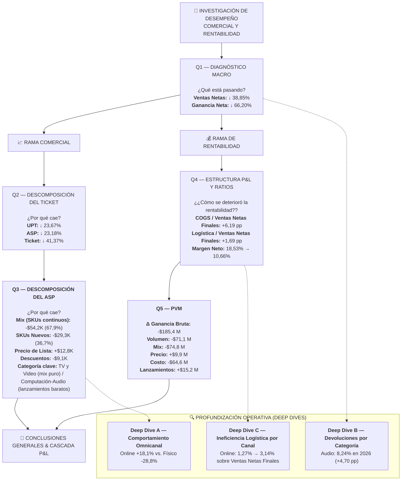

# 🔎 Investigación Analítica SQL

Esta investigación forma parte de un proyecto analítico End-to-End.  
🔗 **Proyecto completo:** https://github.com/manticafacundoelian/dbt_elt_analytics

---

## 📌 Introducción

Esta investigación analiza la evolución comercial y económica de un retail de tecnología entre **2024 y 2026**, con el objetivo de identificar los principales factores asociados al deterioro observado en ventas, ticket y rentabilidad.

El análisis parte de un diagnóstico macro y se divide posteriormente en dos ramas:

* **Rama comercial:** descompone la caída del ticket en sus dos variables fundamentales (**UPT** y **ASP**) y profundiza en los factores que explican el comportamiento del valor unitario (**precio bruto, promociones y cambios de mix por categoría**).
* **Rama de rentabilidad:** analiza cómo estos cambios impactan en la masa de margen, desglosando la estructura de costos P&L y reconciliando la variación de la ganancia bruta mediante un modelo PVM (Price–Volume–Mix), con apertura del componente Mix a nivel de producto.

---

## 🗺️ Hoja de Ruta Ejecutiva & Resumen de Diagnóstico

```mermaid
flowchart TD
    A["🔎 INVESTIGACIÓN DE DESEMPEÑO<br/>COMERCIAL Y RENTABILIDAD"]

    A --> B["Q1 — DIAGNÓSTICO MACRO<br/><br/>¿Qué está pasando?<br/><b>Ventas Netas:</b> ↓ 38,85%<br/><b>Ganancia Neta:</b> ↓ 66,20%"]

    B --> C["📈 RAMA COMERCIAL"]
    B --> D["💰 RAMA DE RENTABILIDAD"]

    C --> C1["Q2 — DESCOMPOSICIÓN DEL TICKET<br/><br/>¿Por qué cae?<br/><b>UPT:</b> ↓ 23,67%<br/><b>ASP:</b> ↓ 23,18%<br/><b>Ticket:</b> ↓ 41,37%"]

    C1 --> C2["<b>Q3 — DESCOMPOSICIÓN DEL ASP</b><br/><br/>¿Por qué cae?<br/><b>Mix (SKUs continuos):</b> -$54,2K (67,9%)<br/><b>SKUs Nuevos:</b> -$29,3K (36,7%)<br/><b>Precio de Lista:</b> +$12,8K<br/><b>Descuentos:</b> -$9,1K<br/><b>Categoría clave:</b> TV y Video (mix puro) / Computación-Audio (lanzamientos baratos)"]

    D --> D1["Q4 — ESTRUCTURA P&L Y RATIOS<br/><br/>¿¿Cómo se deterioró la rentabilidad??<br/><b>COGS / Ventas Netas Finales:</b> +6,19 pp<br/><b>Logística / Ventas Netas Finales:</b> +1,69 pp<br/><b>Margen Neto:</b> 18,53% → 10,66%"]

    D1 --> D2["<b>Q5 — PVM</b><br/><br/><b>Δ Ganancia Bruta:</b> -$185,4 M<br/><b>Volumen:</b> -$71,1 M<br/><b>Mix:</b> -$74,8 M<br/><b>Precio:</b> +$9,9 M<br/><b>Costo:</b> -$64,6 M<br/><b>Lanzamientos:</b> +$15,2 M"]

    C2 --> E["🎯 CONCLUSIONES GENERALES & CASCADA P&L"]
    D2 --> E

    subgraph DEEP_DIVES ["🔍 PROFUNDIZACIÓN OPERATIVA (DEEP DIVES)"]
        DDA["<b>Deep Dive A — Comportamiento Omnicanal</b><br/>Online +18,1% vs. Físico -28,8%"]

        DDB["<b>Deep Dive B — Devoluciones por Categoría</b><br/>Audio: 8,24% en 2026 (+4,70 pp)"]
 
        DDC["<b>Deep Dive C — Ineficiencia Logística por Canal</b><br/>Online: 1,27% → 3,14% sobre Ventas Netas Finales"]
    end

    C2 -.-> DDA
    B -.-> DDB
    D1 -.-> DDC
```

---

## 🔎 Investigación y Desarrollo 

La investigación busca responder **cinco preguntas principales de diagnóstico**, complementadas por **tres análisis operativos de profundización (*Deep Dives*)**:

### Preguntas Core del Diagnóstico 

#### ┌─ 🔹 Q1 — Diagnóstico Macro: ¿Qué cambió en el desempeño general del negocio?

<strong>Ver desarrollo de Q1</strong>
  
     

[Ver Consulta SQL →](./sql_business_analysis/q1_diagnostico_macro_yoy.sql)
  

#### 🔹 Resultados

| Métrica                    |       2024 |       2025 |     YoY 2025 |       2026 |     YoY 2026 |
| :------------------------- | ---------: | ---------: | -----------: | ---------: | -----------: |
| **Pedidos**                |      1.365 |      1.581 |  **+15,82%** |      1.649 |   **+4,30%** |
| **Ventas Brutas**          | $1.316,5 M | $1.684,4 M |  **+27,95%** | $1.064,0 M |  **−36,83%** |
| **Ventas Netas Comerciales**           | $1.290,5 M | $1.633,9 M |  **+26,62%** |   $999,1 M |  **−38,85%** |
| Devoluciones ($)           |    $37,2 M |    $53,7 M |  **+44,45%** |    $70,3 M |  **+30,90%** |
| **Tasa de Devolución (%)** |      2,88% |      3,28% | **+0,40 pp** |      7,03% | **+3,75 pp** |
| **Ventas Netas Finales**   | $1.253,3 M | $1.580,3 M |  **+26,09%** |   $928,9 M |  **−41,22%** |
| **Ganancia Neta**          |   $300,1 M |   $295,7 M |   **−1,47%** |    $101,8 M |  **−65,58%** |
| **Margen Neto (%)**        |     23,95% |     18,71% | **−5,24 pp** |     10,96% | **−7,75 pp** |
| **Ticket Comercial**       |   $945.397 | $1.033.477 |   **+9,32%** |   $605.891 |  **−41,37%** |

> *Nota: El Ticket Comercial se calcula sobre Ventas Netas, antes de devoluciones, para analizar el comportamiento comercial de las órdenes independientemente de las devoluciones posteriores.*

#### 🔹 Hallazgos

**1. Diagnóstico Comercial: Desplome del ticket promedio y mayor impacto de devoluciones**

* **Crecimiento en pedidos con caída de facturación:** En 2026 se registraron **1.649 pedidos (+4,30% YoY)**, mientras que las Ventas Netas Comerciales cayeron un **−38,85%**.
* **Contracción del Ticket Comercial:** La caída de ingresos se explica por la reducción del ticket promedio, que disminuyó un **−41,37%**, pasando de **$1.033.477 a $605.891**.
* **Mayor incidencia de devoluciones:** La Tasa de Devolución aumentó de **3,28% a 7,03% (+3,75 pp)**, profundizando la caída de las Ventas Netas Finales hasta un **−41,22%**.

> *Este comportamiento justifica la apertura de la **Rama Comercial**, donde Q2 descompone la evolución del ticket promedio y Q3 profundiza en sus principales componentes.*

**2. Diagnóstico de Rentabilidad: Caída acelerada de la ganancia y deterioro previo**

* **La ganancia cae más que las ventas:** En 2026, la Ganancia Neta cayó un **−65,58%**, frente a una caída del **−38,85%** en Ventas Netas. Como consecuencia, el Margen Neto se redujo del **18,71% al 10,96% (−7,75 pp)**.
* **Deterioro de rentabilidad previo:** El problema de rentabilidad antecede a la caída de facturación de 2026. En 2025, a pesar de un crecimiento del **+26,62%** en Ventas Netas, la Ganancia Neta cayó un **−1,47%** y el Margen Neto perdió **−5,24 pp**.

> *La desconexión entre la evolución de los ingresos y la ganancia fundamenta la apertura de la **Rama de Rentabilidad**, donde Q4 analiza la estructura del P&L y Q5 descompone la variación de la Ganancia Bruta mediante un PVM formal.*

 

#### 🔹 Puente analítico → Q2

El diagnóstico muestra que en 2026 la cantidad de pedidos se mantiene relativamente estable, mientras que el valor promedio de cada pedido disminuye significativamente.

**Q2 descompone el Ticket Comercial en sus dos componentes: UPT y ASP**, para determinar cuánto de esta caída se relaciona con una menor cantidad de unidades por pedido y cuánto con el valor promedio de cada unidad.  

 

#### ├─ 🔹 Q2 — Descomposición del Ticket: ¿Por qué cayó el ticket comercial? (UPT vs. ASP)

<strong>Ver desarrollo de Q2</strong>
  
     

[Ver Consulta SQL →](./sql_business_analysis/q2_descomposicion_ticket.sql)  

#### 🔹 Resultados

| Métrica                       |       2024 |       2025 |    YoY 2025 |     2026 |    YoY 2026 |
| :---------------------------- | ---------: | ---------: | ----------: | -------: | ----------: |
| **Pedidos**                   |      1.365 |      1.581 | **+15,82%** |    1.649 |  **+4,30%** |
| **Unidades Totales**          |      3.946 |      4.746 | **+20,27%** |    3.778 | **−20,41%** |
| **Ventas Netas Comerciales**  | $1.290,5 M | $1.633,9 M | **+26,62%** | $999,1 M | **−38,85%** |
| **Unidades por Pedido (UPT)** |       2,89 |       3,00 |  **+3,81%** |     2,29 | **−23,67%** |
| **ASP Comercial**             |   $327.032 |   $344.275 |  **+5,27%** | $264.456 | **−23,18%** |
| **Ticket Comercial**          |   $945.397 | $1.033.477 |  **+9,32%** | $605.891 | **−41,37%** |

> *Nota: **Ticket Comercial = UPT × ASP**, donde UPT representa las unidades promedio por pedido y ASP el valor promedio por unidad.*

#### 🔹 Hallazgos

**1. El ticket cae por dos vías simultáneas**

Entre 2025 y 2026, el Ticket Comercial disminuyó **41,37%**. La descomposición muestra una caída prácticamente equivalente en sus dos componentes: **UPT −23,67%** y **ASP −23,18%**.

Esto indica que en 2026 los clientes compraron **menos unidades por pedido y, además, a un menor valor promedio por unidad**.  

 

#### 🔹 Puente analítico → Q3

La caída del ASP puede deberse a distintas causas: cambios en el precio de lista, en los descuentos otorgados, o en qué productos efectivamente se vendieron.
**Q3 descompondrá el ASP en sus componentes (Mix, Precio, Descuento y Lanzamientos)** para identificar cuál de esas causas explica el deterioro.  

 

#### ├─ 🔹 Q3 — Descomposición del ASP: ¿Por qué cayó el precio promedio?

<strong>Ver desarrollo de Q3</strong>
  

 

#### 🔹 Síntesis

El ASP cayó **−$79.819 (−23,2%)** entre 2025 y 2026, explicado principalmente por dos efectos: el **Mix de productos continuos (−67,9%)** y la **entrada de SKUs nuevos a precios bajos (−36,7%)**. Los efectos de **Precio de Lista y Descuento casi se cancelan entre sí** (+$3.690 neto), por lo que no explican en términos netos la caída del ASP.

Al bajar a categoría, aparecen **dos historias distintas detrás del mismo número**:

- **TV y Video** (−49,0% del Δ ASP) cae por **pérdida pura de mix**: perdió 6 puntos de share sin ningún lanzamiento nuevo. Los clientes simplemente compraron menos de esta categoría.
- **Computación y Audio**, en cambio, **ganaron participación** pero fueron hundidas por sus propios **lanzamientos 2026**, que entraron a precios por debajo del promedio. El mix, en estas categorías, no es el problema — incluso ayuda en Audio.
- **Hogar** es la única categoría que empuja el ASP hacia arriba, con el mecanismo inverso al de TV y Video: ganó mix sin lanzar productos nuevos.

A nivel SKU, la caída está **muy concentrada**: 5 productos explican el 72,6% del total, con **TCL Monitor TV 21** como el caso más extremo (−$19.439, el 24,4% de toda la caída), producto de una pérdida de más de la mitad de sus unidades vendidas.

**Conclusión:** el ASP no bajó por una causa única. Es la superposición de un problema de demanda en categorías tradicionales (TV y Video) y precios de entrada bajos en las categorías con lanzamientos nuevos (Computación, Audio). Cualquier acción correctiva debería tratarlas por separado, porque responden a problemas de negocio distintos.

 

#### 🔸 Q3.1 — Bridge Agregado (Mix + Precio + Descuento + Nuevos + Descontinuados)

[Ver Consulta SQL →](./sql_business_analysis/q3_1_descomposicion_asp_agregada.sql)  

#### 🔹 Resultados

| Métrica                    |       2025 |       2026 |            Δ |
| :-------------------------- | ---------: | ---------: | -----------: |
| **ASP Comercial**           |   $344.275 |   $264.456 | **−$79.819** |
| **SKUs Continuos**          |         37 |         37 |             — |
| **SKUs Nuevos**             |          — |         11 |             — |
| **SKUs Descontinuados**     |          0 |          — |             — |

**Descomposición del Δ ASP ($79.819 de caída):**

| Efecto                          |    Impacto ($) | % del Δ Total |
| :------------------------------- | --------------: | -------------: |
| **Mix (SKUs continuos)**         |     −$54.180,70 |    **67,9%** |
| **SKUs Nuevos**                  |     −$29.328,29 |    **36,7%** |
| **Precio de Lista**              |      $12.778,52 |   **−16,0%** |
| **Descuentos**                   |      −$9.088,17 |    **11,4%** |
| **SKUs Descontinuados**          |           $0,00 |        0,0% |
| **Total (chequeo de residuo)**   |     **$0,00** ✅ |      100,0% |

> *Nota metodológica: el efecto Mix se valúa a precio del año base (2025) y los efectos Precio y Descuento se ponderan con el volumen del año actual (2026). Esta convención asegura que el puente cierre exacto (residuo $0), a costa de que la interacción entre cambio de mix y cambio de precio quede incluida dentro del efecto Precio.*

#### 🔹 Hallazgos

**1. La caída del ASP es principalmente un problema de mix, no de precios**

El efecto **Mix explica el 67,9%** de la caída, y los **SKUs Nuevos otro 36,7%**. Juntos superan el 100% del Δ, porque **Precio de Lista (+$12.778,52) y Descuento (−$9.088,17) casi se cancelan entre sí** (saldo neto: +$3.690,35). En otras palabras: la política de precios y descuentos, en neto, no explica la caída; el problema está en qué se vendió, no en cuánto se cobró por lo mismo.

**2. No hubo bajas de catálogo**

Los **0 SKUs descontinuados** confirman que toda la caída se explica por mix y por lanzamientos, no por pérdida de líneas existentes.

 

#### 🔸 Q3.2 — Bridge por Categoría

[Ver Consulta SQL →](./sql_business_analysis/q3_2_descomposicion_asp_categoria.sql)  

#### 🔹 Resultados

| Categoría | Unid. 2025 | Unid. 2026 | Share 2025 | Share 2026 | Δ Share (pp) | Mix | Precio | Descuento | Nuevos | Total | % del Δ ASP |
| :--- | ---: | ---: | ---: | ---: | ---: | ---: | ---: | ---: | ---: | ---: | ---: |
| **TV y Video** | 791 | 402 | 16,67% | 10,64% | **−6,03** | −40.717,38 | 5.642,40 | −4.004,87 | 0,00 | **−39.079,85** | **49,0%** |
| **Computación** | 767 | 690 | 16,16% | 18,26% | +2,10 | −15.885,31 | 1.348,05 | −971,26 | −17.671,74 | **−33.180,25** | **41,6%** |
| **Telefonía** | 259 | 102 | 5,46% | 2,70% | −2,76 | −13.908,97 | 830,43 | −300,51 | 438,49 | **−12.940,57** | **16,2%** |
| **Audio** | 707 | 862 | 14,90% | 22,82% | +7,92 | 3.587,54 | 2.000,85 | −1.397,46 | −9.056,35 | **−4.865,42** | **6,1%** |
| **Accesorios** | 1.222 | 782 | 25,75% | 20,70% | −5,05 | 338,66 | 1.115,33 | −851,29 | −3.038,69 | **−2.435,99** | **3,1%** |
| **Hogar** | 1.000 | 940 | 21,07% | 24,88% | +3,81 | 12.404,76 | 1.841,45 | −1.562,78 | 0,00 | **+12.683,43** | **−15,9%** |
| **Total (chequeo)** | — | — | — | — | — | — | — | — | — | **−79.818,65** ✅ | 100,0% |

#### 🔹 Hallazgos

**1. Dos categorías explican el 90,6% de la caída, por mecanismos opuestos**

**TV y Video** (−49,0%) cae por **pérdida pura de mix**: perdió 6 puntos de share, sin ningún SKU nuevo, y ni precio ni descuento lo compensan. **Computación** (−41,6%), en cambio, **ganó participación** (+2,10 pp) pero fue hundida por sus propios **lanzamientos 2026**, que entraron por debajo del promedio (−$17.671,74). El mismo patrón se repite en **Audio**, que ganó +7,92 pp de share (la mayor suba de todas) y aun así cae, arrastrada por sus lanzamientos.

**2. Hogar es la única categoría que empuja el ASP hacia arriba**

Ganó share (+3,81 pp) con mix positivo (+$12.404,76) y sin lanzamientos, el espejo exacto de TV y Video.

 

#### 🔸 Q3.3 — Bridge por SKU (Detalle y Ranking de Impacto)

[Ver Consulta SQL →](./sql_business_analysis/q3_3_descomposicion_asp_sku.sql)  

#### 🔹 Resultados — Top 5 Mayor Impacto Negativo

| Producto | Categoría | Estado | Δ Share (pp) | Mix | Precio | Descuento | Nuevos | Total |
| :--- | :--- | :--- | ---: | ---: | ---: | ---: | ---: | ---: |
| TCL Monitor TV 21 | TV y Video | Continuo | −2,616 | −20.173,53 | 2.265,13 | −1.530,49 | 0,00 | **−19.438,89** |
| Acer Memoria RAM 2 | Computación | Continuo | −3,132 | −11.108,52 | 197,11 | −95,52 | 0,00 | **−11.006,93** |
| Lenovo Mouse 1 | Computación | Continuo | −4,073 | −10.436,40 | 332,19 | −189,48 | 0,00 | **−10.293,69** |
| TCL Chromecast 25 | TV y Video | Continuo | −1,342 | −9.111,00 | 1.173,26 | −905,27 | 0,00 | **−8.843,01** |
| Acer Notebook 7 | Computación | Nuevo 2026 | +4,579 | 0,00 | 0,00 | 0,00 | −8.347,11 | **−8.347,11** |

#### 🔹 Resultados — Top 5 Mayor Impacto Positivo

| Producto | Categoría | Estado | Δ Share (pp) | Mix | Precio | Descuento | Nuevos | Total |
| :--- | :--- | :--- | ---: | ---: | ---: | ---: | ---: | ---: |
| Liliana Cafetera 46 | Hogar | Continuo | +6,315 | 12.338,22 | 1.171,32 | −1.043,51 | 0,00 | **12.466,03** |
| ASUS Webcam 6 | Computación | Continuo | +1,167 | 7.423,10 | 406,13 | −391,52 | 0,00 | **7.437,70** |
| Philips Barra de Sonido 28 | Audio | Continuo | +0,013 | 3.595,60 | 793,89 | −469,45 | 0,00 | **3.920,04** |
| Samsung Monitor TV 23 | TV y Video | Continuo | +0,365 | 3.313,49 | 487,24 | −353,18 | 0,00 | **3.447,55** |
| Logitech Funda 40 | Accesorios | Continuo | +0,561 | 1.273,05 | 121,81 | −90,70 | 0,00 | **1.304,16** |

> *Detalle completo de los 48 SKUs disponible en la salida de la consulta SQL vinculada arriba.*

#### 🔹 Hallazgos

**1. El impacto está muy concentrado, y el caso extremo confirma Q3.2**

Los 5 productos de mayor impacto negativo explican el **72,6%** de la caída total. El más extremo, **TCL Monitor TV 21**, perdió más de la mitad de sus unidades (295 → 136) y explica por sí solo el **24,4%** de la caída del ASP — la manifestación a nivel producto de la pérdida de mix que ya vimos en TV y Video.  

 

#### 🔹 Puente analítico → Rama de Rentabilidad

El diagnóstico comercial explica la caída de las Ventas Netas, pero no todavía por qué la Ganancia Neta cayó más que proporcionalmente (−66,20% vs. −38,85%).

**Q4 y Q5 abordan la Rama de Rentabilidad**, analizando la estructura de costos y márgenes para entender esa brecha.  

 

#### ├─ 🔹 Q4 — Estructura de Rentabilidad y Ratios P&L: ¿Cómo se deterioró la rentabilidad?

<strong>Ver desarrollo de Q4</strong>
  
 

[Ver Consulta SQL →](./sql_business_analysis/q4_rentabilidad_ratios_pnl.sql)  

#### 🔹 Criterio metodológico

Para el análisis de rentabilidad se toma como base la **Venta Neta Final**, es decir, la venta después de devoluciones aprobadas.

Esta decisión busca medir la rentabilidad sobre el **ingreso económico efectivamente retenido por la empresa**. En consecuencia, los ratios de costos y márgenes de Q4 se calculan sobre esta base.

#### 🔹 Resultados

| Métrica                      |       2024 |       2025 |     YoY 2025 |     2026 |     YoY 2026 |
| :--------------------------- | ---------: | ---------: | -----------: | -------: | -----------: |
| **Ventas Netas Finales**     | $1.253,3 M | $1.580,3 M |  **+26,09%** | $928,9 M |  **−41,22%** |
| **Costo de Ventas**          |   $943,1 M | $1.270,0 M |  **+34,60%** | $804,0 M |  **−36,69%** |
| **Costo de Ventas / Ventas** |     75,25% |     80,37% | **+5,12 pp** |   86,56% | **+6,19 pp** |
| **Ganancia Bruta**           |   $310,2 M |   $310,2 M |   **−0,01%** | $124,9 M |  **−59,75%** |
| **Margen Bruto**             |     24,75% |     19,63% | **−5,12 pp** |   13,44% | **−6,19 pp** |
| **Costo Logístico / Ventas** |      0,81% |      0,92% | **+0,11 pp** |    2,49% | **+1,57 pp** |
| **Ganancia Neta**            |   $300,1 M |   $295,7 M |   **−1,47%** | $101,8 M |  **−65,58%** |
| **Margen Neto**              |     23,95% |     18,71% | **−5,24 pp** |   10,96% | **−7,75 pp** |

#### 🔹 Hallazgos

**1. El costo de ventas absorbe una proporción cada vez mayor de las Ventas Netas Finales**

Entre 2025 y 2026, el **Costo de Ventas / Ventas** aumentó **6,19 pp**, pasando de 80,37% a 86,56%.

Como consecuencia, el **Margen Bruto** se redujo en la misma magnitud, de 19,63% a 13,44%.

El deterioro resulta especialmente relevante porque entre 2024 y 2025 las ventas habían crecido **26,09%**, pero la **Ganancia Bruta permaneció prácticamente sin cambios**, pasando de $310,2 M a $310,2 M.

**2. La presión logística se intensifica en 2026**

El **Costo Logístico / Ventas** pasó de 0,92% en 2025 a 2,49% en 2026, un aumento de **1,57 pp**.

Aunque su peso es significativamente menor que el del Costo de Ventas, la mayor carga logística reduce todavía más la rentabilidad una vez deteriorado el margen bruto.

**3. La rentabilidad cae mucho más que las ventas**

Entre 2025 y 2026, las **Ventas Netas Finales disminuyeron 41,22%**, mientras que la **Ganancia Neta cayó 65,58%**.

En consecuencia, el **Margen Neto** pasó de 18,71% a 10,96%, una reducción de **7,75 pp**.

El deterioro no responde únicamente a una menor escala de ventas: una proporción creciente de las **Ventas Netas Finales** es absorbida por el **Costo de Ventas**, mientras que el **Costo Logístico** agrega una presión adicional sobre el resultado final.

El siguiente paso es determinar cuánto del deterioro de la **Ganancia Bruta** corresponde a cada componente económico.

 

#### 🔹 Puente analítico → Q5

Q4 muestra que el deterioro de 2026 combina una fuerte contracción de las ventas, **como demostró la Rama Comercial**, con un aumento del peso del **Costo de Ventas**, que comprimió el **Margen Bruto hasta 13,44%** y redujo la **Ganancia Bruta un 59,75%**.

**Q5 descompone esta caída de la Ganancia Bruta mediante un PVM formal —Volumen → Mix → Precio → Costo—**, para cuantificar qué componentes explican el deterioro entre 2025 y 2026.

 

#### └─ 🔹 Q5 — PVM: ¿Qué componentes explican la caída de la Ganancia Bruta?

<strong>Ver desarrollo de Q5</strong>
  
 

#### 🔹 Síntesis

La Ganancia Bruta cayó **−$185,36 M (−59,7%)** entre 2025 y 2026, de $310,22 M a $124,86 M. El PVM muestra que el deterioro es, ante todo, un problema de **volumen del negocio existente**: el efecto Volumen (**−$122,44 M, 66,1%**) más que duplica al efecto Mix (**−$23,41 M, 12,6%**), y el Costo suma otro **−$64,56 M (34,8%)**. Precio (+$9,88 M) y Lanzamientos (+$15,17 M) compensan apenas el 13,5% de la caída.

Al bajar a categoría, **TV y Video concentra más de la mitad del deterioro** (−$100,88 M, 54,4%), enteramente por volumen y costo, sin ningún lanzamiento que lo amortigüe. **Audio** repite el patrón ya visto en Q3: crece en unidades totales (+16%) pero su negocio continuo se derrumba (−$12,76 M de Volumen), oculto detrás del mayor efecto de Lanzamientos de todas las categorías (+$9,10 M).

A nivel SKU, el deterioro está **muy concentrado**: los mismos dos productos que lideraban la caída del ASP en Q3 —**TCL Monitor TV 21** y **TCL Chromecast 25**— son también los dos mayores destructores de Ganancia Bruta, con **−$71,66 M combinados (38,7% del total)**. Ningún lanzamiento aparece entre los 8 peores SKUs; todos son productos continuos.

**Conclusión:** la caída de rentabilidad se debe, centralmente, a la pérdida de volumen de un grupo reducido de productos ya establecidos (liderados por TV y Video), agravada por un deterioro simultáneo del costo unitario. Los lanzamientos no fueron un driver negativo de la Ganancia Bruta: por el contrario, aportaron un efecto positivo que compensó parcialmente la caída.
 

#### 🔸 Q5.1 — PVM Consolidado: ¿Qué explica la variación total?

[Ver Consulta SQL →](./sql_business_analysis/q5_pvm_consolidado.sql)  

#### 🔹 Resultados

| Factor              | Efecto sobre la Ganancia Bruta | Participación |
| :------------------ | ------------------------------: | -------------: |
| **Volumen**         |                       −$122,44 M |     **66,05%** |
| **Mix**             |                        −$23,41 M |     **12,63%** |
| **Precio**          |                         +$9,88 M |     **−5,33%** |
| **Costo**           |                        −$64,56 M |     **34,83%** |
| **Lanzamientos**    |                        +$15,17 M |     **−8,19%** |
| **Discontinuados**  |                           $0,0 M |         0,00% |
| **Variación total** |                     **−$185,36 M** |   **100,00%** |

**Ganancia Bruta 2025:** $310,22 M
**Ganancia Bruta 2026:** $124,86 M
**Variación:** **−$185,36 M**

> *Nota metodológica: el efecto "Precio" es Precio Realizado (ventas netas de descuento y de devoluciones, dividido por unidades efectivas), por lo que incorpora tanto la política de descuentos como el impacto de reembolsos. La apertura granular entre Precio de Lista y Descuento se realiza en Q3, sobre ventas comerciales antes de devolución. Los efectos Volumen y Mix se calculan sobre el universo de SKUs continuos exclusivamente, para aislar el comportamiento del negocio existente de la entrada de nuevos lanzamientos.*

#### 🔹 Hallazgos

**1. La caída es, ante todo, un problema de volumen del negocio existente**

El efecto **Volumen explica el 66,05%** de la caída — más del doble que Mix (12,63%). La reducción de Ganancia Bruta no es principalmente un cambio en qué se vende, sino una **caída real en la cantidad vendida** de los productos que la empresa ya tenía en catálogo.

**2. El Costo es el segundo factor más relevante; Precio y Lanzamientos compensan solo parcialmente**

El efecto **Costo (−$64,56 M, 34,83%)** confirma que, además de vender menos, el margen unitario de los productos continuos se deterioró por el lado del costo de reposición. Precio (+$9,88 M) y Lanzamientos (+$15,17 M) compensan en conjunto apenas el 13,5% de la caída.

#### 🔹 Reconciliación

**−$122,44 M − $23,41 M + $9,88 M − $64,56 M + $15,17 M = −$185,36 M**

Diferencia de reconciliación: **$0,00** ✅

 

#### 🔸 Q5.2 — PVM por Categoría: ¿Dónde se concentra el deterioro?

[Ver Consulta SQL →](./sql_business_analysis/q5_pvm_por_categoria.sql)  

#### 🔹 Resultados

| Categoría       | SKUs | Unid. 2025 | Unid. 2026 |      Volumen |          Mix |     Precio |        Costo | Lanzamientos | Discontinuados |     Efecto PVM | % del Δ Total |
| :-------------- | ---: | ---------: | ---------: | -----------: | -----------: | ---------: | -----------: | -----------: | -------------: | -------------: | ------------: |
| **TV y Video**  |    7 |        764 |        375 |    −$56,15 M |    −$19,37 M |   +$4,38 M |    −$29,74 M |       $0,0 M |         $0,0 M | **−$100,88 M** |    **54,42%** |
| **Computación** |   10 |        741 |        647 |    −$24,27 M |     −$8,28 M |   +$0,90 M |     −$5,96 M |     +$5,26 M |         $0,0 M |  **−$32,34 M** |    **17,44%** |
| **Telefonía**   |    6 |        248 |         94 |    −$12,54 M |     −$7,15 M |   +$1,50 M |     −$4,03 M |     +$0,15 M |         $0,0 M |  **−$22,07 M** |    **11,90%** |
| **Accesorios**  |   10 |      1.183 |        734 |     −$7,10 M |     +$0,22 M |   +$0,72 M |     −$5,82 M |     +$0,66 M |         $0,0 M |  **−$11,32 M** |     **6,10%** |
| **Audio**       |    8 |        682 |        791 |    −$12,76 M |     +$2,61 M |   +$1,58 M |    −$10,37 M |     +$9,10 M |         $0,0 M |   **−$9,84 M** |     **5,31%** |
| **Hogar**       |    7 |        968 |        894 |     −$9,62 M |     +$8,55 M |   +$0,81 M |     −$8,65 M |       $0,0 M |         $0,0 M |   **−$8,92 M** |     **4,81%** |
| **Total**       |   48 |      4.586 |      3.535 |   −$122,44 M |    −$23,41 M |   +$9,88 M |    −$64,56 M |    +$15,17 M |         $0,0 M | **−$185,36 M** |     **100%** |

#### 🔹 Hallazgos

**1. TV y Video concentra más de la mitad de la caída, y es puramente un problema de volumen**

Con **−$100,88 M (54,4%)**, TV y Video es la categoría más golpeada por lejos. Su efecto Volumen (**−$56,15 M**) representa el **45,9% de todo el efecto Volumen de la empresa**, sin ningún lanzamiento que lo compense.

**2. Audio crece en unidades totales, pero su negocio base se derrumba**

Audio pasa de 682 a 791 unidades (+16%), pero registra un efecto Volumen de **−$12,76 M**, el segundo más negativo. Esto solo se explica porque sus **Lanzamientos (+$9,10 M, el mayor de todas las categorías)** ocultan una caída fuerte en sus productos continuos — el mismo patrón identificado en Q3.

**3. Hogar es la única categoría con Mix positivo**

Con **+$8,55 M**, sin lanzamientos que lo expliquen — es enteramente producto de una mejor composición entre sus SKUs continuos, el espejo de TV y Video.

#### 🔹 Reconciliación por categoría

La suma de los efectos PVM de todas las categorías reproduce, al centavo, la variación consolidada: **−$185,36 M** ✅

 

#### 🔸 Q5.3 — PVM por SKU: ¿Qué productos explican el deterioro?

[Ver Consulta SQL →](./sql_business_analysis/q5_pvm_por_sku.sql)  

#### 🔹 Resultados — Top 8 Mayor Impacto Negativo

| Producto              | Categoría   | Estado   | Unid. 2025→2026 |   Efecto PVM |
| :--------------------- | :---------- | :------- | :--------------- | -----------: |
| TCL Monitor TV 21      | TV y Video  | Continuo | 283 → 126        | **−$44,79 M** |
| TCL Chromecast 25      | TV y Video  | Continuo | 176 → 83         | **−$26,87 M** |
| Acer Memoria RAM 2     | Computación | Continuo | 212 → 53         | **−$21,19 M** |
| TCL Monitor TV 19      | TV y Video  | Continuo | 83 → 35          | **−$14,23 M** |
| Lenovo Mouse 1         | Computación | Continuo | 318 → 102        | **−$12,70 M** |
| Samsung Smart TV 20    | TV y Video  | Continuo | 114 → 35         |  **−$9,93 M** |
| ASUS Notebook 5        | Computación | Continuo | 150 → 73         |  **−$7,16 M** |
| Samsung Smartphone 14  | Telefonía   | Continuo | 56 → 13          |  **−$6,71 M** |

#### 🔹 Resultados — Top 5 Mayor Impacto Positivo

| Producto                    | Categoría   | Estado   | Unidades 2026 |  Efecto PVM |
| :--------------------------- | :---------- | :------- | -------------: | ----------: |
| Philips Equipo de Audio 30   | Audio       | Nuevo    |            112 | **+$7,63 M** |
| ASUS Webcam 6                | Computación | Continuo |             56 | **+$5,22 M** |
| Sony Equipo de Audio 33      | Audio       | Nuevo    |            142 | **+$3,51 M** |
| Acer Notebook 7              | Computación | Nuevo    |            166 | **+$2,83 M** |
| HP Mouse 10                  | Computación | Nuevo    |            118 | **+$2,37 M** |

> *Detalle completo de los 48 SKUs disponible en la salida de la consulta SQL vinculada arriba. Las unidades en Q5 son efectivas, después de devoluciones, por lo que pueden diferir de Q3.*

#### 🔹 Hallazgos

**1. El deterioro proviene enteramente de productos ya existentes**

Los 8 SKUs con mayor impacto negativo son **todos "Continuo"** — ningún lanzamiento aparece entre ellos. Los dos principales, **TCL Monitor TV 21** y **TCL Chromecast 25**, generan conjuntamente **−$71,66 M (38,7% de toda la caída)**, y son los mismos dos productos identificados como el mayor problema del ASP en Q3 — la pérdida de volumen no solo bajó el precio promedio, fue también el principal destructor de Ganancia Bruta.

**2. Los lanzamientos son el principal contrapeso, no el problema**

Los 5 mayores efectos positivos incluyen **3 lanzamientos de 2026** (Philips Equipo de Audio 30, Sony Equipo de Audio 33, Acer Notebook 7), que en conjunto aportan +$13,97 M. Ningún lanzamiento aparece entre los peores SKUs.

**3. El PVM separa volumen de otros efectos: el caso de ASUS Webcam 6**

**ASUS Webcam 6**, un producto continuo, triplicó sus unidades (19→56) y eso le permitió compensar sus propios efectos negativos de Mix, Precio y Costo, cerrando con un PVM total de **+$5,22 M** — el único SKU continuo entre los 5 mejores.  

 

#### 🔹 Puente analítico → Conclusiones Generales

El PVM identifica los mecanismos detrás de la caída de la Ganancia Bruta (Volumen y Costo como principales drivers negativos, agravados por Mix, y parcialmente compensados por Precio y Lanzamientos), completando el diagnóstico de las dos ramas de la investigación: Comercial (Q1-Q3) y Rentabilidad (Q4-Q5).

**Las Conclusiones Generales integran ambos diagnósticos en una cascada P&L única**, conectando la caída de Ventas Netas con el deterioro adicional de márgenes.  

 

### Profundización Operativa (Deep Dives)

#### ├─ 🔹 Deep Dive A — Comportamiento Omnicanal: Online vs. Físico.

<strong>Ver desarrollo del Deep Dive A</strong>
  
 

[Ver Consulta SQL →](./sql_business_analysis/deep_dive_a_canal.sql)  

#### 🔹 Objetivo

Determinar si el deterioro comercial observado en 2026 presenta el mismo comportamiento en los canales **Online y Físico**, analizando la evolución de pedidos, Ticket Comercial, ASP Neto y tasa de descuento.

#### 🔹 Resultados

| Métrica                      | Online 2025 | Online 2026 |          YoY | Físico 2025 | Físico 2026 |          YoY |
| :--------------------------- | ----------: | ----------: | -----------: | ----------: | ----------: | -----------: |
| **Pedidos**                  |       1.116 |       1.318 |  **+18,10%** |         465 |         331 |  **−28,82%** |
| **Participación en pedidos** |      70,59% |      79,93% | **+9,34 pp** |      29,41% |      20,07% | **−9,34 pp** |
| **Ticket Comercial**         |  $1.055.898 |    $602.436 |  **−42,95%** |    $979.667 |    $619.651 |  **−36,75%** |
| **ASP Neto**                 |    $349.876 |    $263.879 |  **−24,58%** |    $330.584 |    $266.716 |  **−19,32%** |
| **Tasa de Descuento**        |       2,98% |       6,04% | **+3,06 pp** |       3,03% |       6,31% | **+3,29 pp** |

#### 🔹 Hallazgos

**1. El crecimiento de pedidos de 2026 se concentra exclusivamente en Online**

El canal **Online aumentó sus pedidos un 18,10%**, mientras que el canal **Físico se contrajo un 28,82%**.

Como resultado, la participación del canal Online sobre el total de pedidos pasó de **70,59% a 79,93%**, mientras que el canal Físico disminuyó de **29,41% a 20,07%**.

**2. El crecimiento de Online no se traduce en un mayor valor por pedido**

A pesar del aumento de pedidos, el canal Online registra una caída del **42,95% en el Ticket Comercial**, pasando de $1.055.898 a $602.436.

El canal Físico también presenta un deterioro significativo, aunque de menor magnitud, con una caída del **36,75%**.

**3. El ASP Neto disminuye en ambos canales**

El valor promedio generado por unidad también se reduce en ambos canales.

El **ASP Neto Online cae 24,58%**, mientras que el canal Físico registra una disminución del **19,32%**.

Esto indica que la caída del Ticket no está asociada únicamente a la cantidad de unidades por pedido, sino que también existe un menor valor promedio por unidad comercializada.

**4. La tasa de descuento aumenta de forma similar en ambos canales**

La Tasa de Descuento aumenta **3,06 pp en Online** y **3,29 pp en Físico**, alcanzando aproximadamente un **6%** en ambos canales durante 2026.

Por lo tanto, el incremento de los descuentos se presenta como un fenómeno transversal a los canales y no como una diferencia exclusiva del canal Online.

**5. El deterioro comercial es transversal, aunque la composición por canal cambia**

En 2026 se observa una fuerte recomposición del volumen de pedidos hacia Online, mientras que **ambos canales experimentan una reducción significativa del valor generado por pedido y por unidad**.

La evolución por canal permite complementar el diagnóstico general: el crecimiento de Online modifica la estructura comercial, pero no evita el deterioro del valor promedio de las operaciones.

#### ├─ 🔹 Deep Dive B — Devoluciones por Categoría.

<strong>Ver desarrollo del Deep Dive B</strong>
  
 

[Ver Consulta SQL →](./sql_business_analysis/deep_dive_b_devoluciones_por_categoria.sql)  

#### 🔹 Objetivo

Identificar cómo evolucionó la **tasa de devolución por categoría** entre 2025 y 2026 y determinar dónde se concentra el deterioro observado en las devoluciones.

#### 🔹 Resultados

| Categoría       | Unidades Vendidas 2025 | Devueltas 2025 | Tasa 2025 | Unidades Vendidas 2026 | Devueltas 2026 | Tasa 2026 |    Variación |
| :-------------- | ---------------------: | -------------: | --------: | ---------------------: | -------------: | --------: | -----------: |
| **Audio**       |                    707 |             25 |     3,54% |                    862 |             71 | **8,24%** | **+4,70 pp** |
| **Accesorios**  |                  1.222 |             39 |     3,19% |                    782 |             48 | **6,14%** | **+2,95 pp** |
| **Hogar**       |                  1.000 |             32 |     3,20% |                    940 |             46 | **4,89%** | **+1,69 pp** |
| **Computación** |                    767 |             26 |     3,39% |                    690 |             43 | **6,23%** | **+2,84 pp** |
| **TV y Video**  |                    791 |             27 |     3,41% |                    402 |             27 | **6,72%** | **+3,30 pp** |
| **Telefonía**   |                    259 |             11 |     4,25% |                    102 |              8 | **7,84%** | **+3,60 pp** |

#### 🔹 Hallazgos

**1. La tasa de devolución aumenta en todas las categorías**

Entre 2025 y 2026, **todas las categorías presentan un incremento de su tasa de devolución**.

Esto indica que el deterioro observado a nivel general no se concentra exclusivamente en una única categoría, sino que tiene un comportamiento transversal.

**2. Audio presenta el mayor deterioro**

La categoría **Audio** registra el mayor incremento de la tasa de devolución, pasando de **3,54% a 8,24%**, un aumento de **4,70 pp**.

Además, las unidades devueltas aumentan de **25 a 71**, mientras que las unidades vendidas también crecen de 707 a 862.

**3. TV y Video también presenta un incremento significativo**

La tasa de devolución de **TV y Video** aumenta de **3,41% a 6,72%**, equivalente a **+3,30 pp**.

En este caso, las unidades vendidas disminuyen prácticamente a la mitad, de 791 a 402, mientras que las unidades devueltas se mantienen en **27 unidades**.

**4. Telefonía mantiene una de las tasas más elevadas**

Telefonía pasa de una tasa de devolución de **4,25% a 7,84%**, un incremento de **3,60 pp**.

Sin embargo, su volumen absoluto es reducido: las devoluciones pasan de 11 a 8 unidades, por lo que la tasa debe interpretarse considerando el bajo volumen de operaciones de la categoría.

**5. El deterioro también alcanza categorías de mayor volumen**

**Accesorios** y **Computación** presentan incrementos de **2,95 pp** y **2,84 pp**, respectivamente.

En 2026, Accesorios registra **48 unidades devueltas** y Computación **43**, por lo que ambas categorías contribuyen de manera relevante al volumen total de devoluciones.

**6. El deterioro de las devoluciones es transversal, pero con distinta intensidad**

El análisis muestra un aumento generalizado de la tasa de devolución, aunque con comportamientos diferentes según la categoría.

**Audio presenta el mayor incremento relativo de la tasa**, mientras que **Accesorios concentra el mayor número de unidades devueltas entre las categorías analizadas**.

Por lo tanto, la evolución de las devoluciones debe considerarse tanto desde la **tasa** como desde el **volumen absoluto de unidades devueltas**, evitando interpretar una categoría únicamente por uno de estos indicadores.

#### ├─ 🔹 Deep Dive C — Ineficiencia Logística por Canal.

<strong>Ver desarrollo del Deep Dive C</strong>
  
 

[Ver Consulta SQL →](./sql_business_analysis/deep_dive_c_ineficiencia_logistica_por_canal.sql)  

#### 🔹 Objetivo

Evaluación del **costo logístico asignado sobre las ventas netas** por canal de venta entre 2025 y 2026, para identificar dónde se generan las principales ineficiencias de envío dentro de las órdenes entregadas.

#### 🔹 Resultados

| Canal | Costo Logístico 2025 | Ventas Netas 2025 | Log. % Ventas 2025 | Costo Logístico 2026 | Ventas Netas 2026 | Log. % Ventas 2026 | Var. Nominal Costo | Variación |
| :--- | ---: | ---: | ---: | ---: | ---: | ---: | ---: | ---: |
| **Online** | $14.520.471,20 | $1.140.257.590,43 | 1,27% | $23.094.500,11 | $735.444.420,87 | **3,14%** | +$8.574.028,91 | **+1,87 pp** |
| **Physical** | $2.879.697,07 | $439.996.862,33 | 0,65% | $2.779.564,05 | $193.412.452,48 | **1,44%** | -$100.133,02 | **+0,78 pp** |

#### 🔹 Hallazgos

**1. El impacto logístico sobre las ventas se incrementó en ambos canales**

A pesar de la caída generalizada en el volumen de ventas netas entre 2025 y 2026, **el porcentaje del costo logístico sobre la facturación aumentó de manera transversal** tanto en el canal Digital (**Online**) como en el presencial (**Physical**).

**2. El canal Online concentra la mayor ineficiencia operativa**

El costo logístico en **Online** no solo creció en términos relativos pasando del **1,27% al 3,14%** (+1,87 pp), sino que sufrió un importante incremento nominal: el gasto total de envío aumentó en **+$8.574.028,91** (+59,05%) aun cuando las ventas netas del canal cayeron un **35,50%**.

**3. El canal Físico sostiene su costo total, pero pierde eficiencia sobre facturación**

En **Physical**, el costo logístico nominal se mantuvo prácticamente estable (con un leve descenso de **-$100.133,02**). Sin embargo, debido a una reducción drástica de sus ventas netas (de **$439,99M a $193,41M**), la incidencia logística sobre la facturación se duplicó, pasando de **0,65% a 1,44%** (+0,78 pp).

**4. Desconexión entre facturación y costos de envío en la operación digital**

El análisis evidencia que el canal **Online** absorbió incrementos tarifarios o ineficiencias en el despacho de mercadería que no acompañaron la escala comercial de 2026, convirtiéndose en el principal driver del aumento de costos operativos globales.

---

## 🧭 Conclusiones Generales

### 1. El deterioro de 2026 es principalmente una pérdida de valor por operación

La cantidad de pedidos continúa creciendo (+4,30%), pero el Ticket Comercial cae 41,37%. Esta caída no proviene de una sola variable: se combina una reducción de las unidades por pedido (UPT −23,67%) con una reducción del ASP Comercial (−23,18%).

El problema comercial de 2026, por lo tanto, no es principalmente una pérdida de operaciones, sino una **menor cantidad y menor valor de los productos vendidos dentro de cada operación**.

### 2. La caída del ASP está explicada principalmente por cambios en la composición de las ventas

El análisis de Q3 muestra que el principal deterioro del ASP proviene del **Mix de los productos continuos** y de la entrada de **nuevos SKUs con menor valor unitario**.

En cambio, Precio de Lista y Descuento presentan efectos de signo contrario que se compensan ampliamente entre sí. Esto permite distinguir entre una caída del ASP provocada por cambios en **qué productos se venden** y una caída provocada por una reducción generalizada del precio de los productos existentes.

### 3. La pérdida está concentrada en determinados productos existentes

El problema no se distribuye uniformemente por todo el catálogo. TV y Video concentra más de la mitad del deterioro de Ganancia Bruta y los productos TCL Monitor TV 21 y TCL Chromecast 25 aparecen como principales destructores tanto en el análisis de ASP como en el PVM.

Esto muestra que el deterioro agregado está fuertemente condicionado por el comportamiento de un grupo reducido de productos continuos.

### 4. Los lanzamientos tienen un comportamiento diferente según el indicador observado

Los nuevos productos de 2026 reducen el ASP agregado porque ingresan con un valor unitario menor al promedio de referencia. Sin embargo, generan un efecto positivo sobre la Ganancia Bruta.

Por lo tanto, los lanzamientos **no deben interpretarse como un problema de rentabilidad**. Su efecto es comercialmente dilutivo sobre el ASP, pero económicamente positivo sobre la Ganancia Bruta.

### 5. La caída comercial se transforma en una pérdida de rentabilidad mayor por presión sobre los costos

La caída de ventas se acompaña de un deterioro de la estructura de rentabilidad: aumenta el peso del Costo de Ventas y también la incidencia del costo logístico.

El PVM confirma que, además del menor volumen, existe un deterioro significativo por el lado del costo de los productos continuos. Las devoluciones crecientes y la mayor incidencia logística agregan presión sobre la rentabilidad final.

En conjunto, el análisis muestra que **la contracción comercial y la erosión del margen se refuerzan entre sí**, en lugar de ser fenómenos independientes.

---

## 🧩 Conclusión Unificadora del Diagnóstico

El deterioro de 2026 puede interpretarse como una **pérdida progresiva de valor a lo largo de la cadena comercial y económica del negocio**.

El primer problema aparece en la operación comercial: los pedidos no desaparecen, pero cada pedido contiene menos unidades y esas unidades tienen un menor valor promedio. La caída del ASP no se explica principalmente por una reducción generalizada de precios, sino por un cambio en la composición de las ventas: algunos productos tradicionales pierden participación y volumen, mientras nuevos productos de menor valor unitario ganan presencia.

Sin embargo, ese cambio de composición no explica por sí solo la magnitud de la pérdida de rentabilidad. El PVM muestra que el mayor daño económico proviene de la **caída de volumen de los productos continuos**, acompañada por un aumento de su costo unitario. Es decir, el negocio no solo vende menos valor por operación: también pierde volumen justamente en productos que ya contribuían a generar Ganancia Bruta.

Los lanzamientos muestran una dinámica diferente. Aunque reducen el ASP promedio al incorporar productos de menor valor unitario, generan Ganancia Bruta positiva y funcionan como un **contrapeso parcial** frente a la pérdida del portfolio existente. El problema central, por lo tanto, no parece estar en la incorporación de nuevos productos, sino en que **su aporte no alcanza para compensar la pérdida del negocio establecido**.

Sobre esa base, el aumento de las devoluciones y de la incidencia logística profundiza el deterioro económico, especialmente en un contexto donde la facturación ya se encuentra contraída.

La secuencia que emerge del diagnóstico es, entonces:

**menor valor por pedido → menor volumen económico del portfolio existente → deterioro de la Ganancia Bruta → presión adicional de costos y operación → caída desproporcionada de la Ganancia Neta.**

En este sentido, 2026 no representa simplemente una caída de ventas. Representa un **cambio desfavorable en la composición y escala del negocio**, en el que el crecimiento de pedidos deja de traducirse en valor económico suficiente para sostener el nivel de rentabilidad alcanzado previamente.

---

## 🎯 Recomendaciones Estratégicas

El diagnóstico muestra que la recuperación del negocio no debería centrarse únicamente en aumentar la cantidad de pedidos, sino en **recuperar valor y rentabilidad dentro del negocio existente**, al mismo tiempo que se controlan los costos y las pérdidas operativas.

### 1. Recuperar el volumen de los productos existentes de mayor impacto

La principal prioridad comercial debería ser recuperar el volumen perdido en los **SKUs continuos**, especialmente dentro de **TV y Video y Computación**.

El efecto Volumen explica **−$122,44 M**, equivalente al **66,05%** de la caída de Ganancia Bruta. Además, los ocho SKUs con mayor impacto negativo son productos ya existentes, y los dos principales —**TCL Monitor TV 21** y **TCL Chromecast 25**— concentran conjuntamente **−$71,66 M**, el 38,7% de toda la caída.
Por lo tanto, convendría revisar para estos productos variables como **disponibilidad, visibilidad comercial, competitividad de precios, posicionamiento dentro del catálogo y evolución de la demanda**, antes de asumir que el problema puede resolverse únicamente mediante descuentos.

**KPIs sugeridos:** unidades vendidas, Ganancia Bruta por SKU, participación de unidades y variación de volumen YoY.

### 2. Atacar el deterioro del costo unitario

El segundo gran foco debería estar en la estructura de costos del portfolio existente.

El efecto **Costo representa −$64,56 M (34,83%)** de la caída de Ganancia Bruta. Esto indica que recuperar volumen por sí solo no sería suficiente si cada unidad vendida deja actualmente menos margen.

La empresa debería revisar especialmente los productos continuos con mayor efecto negativo de costo, evaluando alternativas de **negociación con proveedores, condiciones de compra, sourcing y composición del portfolio**.

Este análisis debería profundizarse con información adicional de costos históricos para determinar qué parte del deterioro responde a aumentos de reposición y qué parte a decisiones comerciales o de producto.

**KPIs sugeridos:** costo unitario, margen bruto unitario, margen bruto %, variación de costo YoY.

### 3. Recuperar el valor por pedido sin depender de descuentos generalizados

La caída del ticket responde simultáneamente a una menor cantidad de unidades por pedido y a un menor valor promedio por unidad. Al mismo tiempo, la tasa de descuento aumentó aproximadamente **3 puntos porcentuales en ambos canales** durante 2026.

Por eso, una estrategia basada exclusivamente en aumentar promociones podría profundizar la presión comercial sin resolver el problema estructural.

Una alternativa sería trabajar sobre **UPT y composición del carrito**, mediante bundles, venta cruzada y complementos entre productos, buscando recuperar unidades por pedido mientras se protege el valor unitario.

El objetivo no sería simplemente vender más unidades, sino **elevar nuevamente el valor generado por cada operación**.

**KPIs sugeridos:** Ticket Comercial, UPT, ASP, tasa de descuento y Ventas Netas por pedido.

### 4. Escalar los lanzamientos rentables, pero sin utilizarlos como sustituto del negocio existente

Los nuevos productos muestran un comportamiento dual: **diluyen el ASP promedio**, pero generan un efecto positivo sobre la Ganancia Bruta de **+$15,17 M**. Además, tres de los cinco principales efectos positivos por SKU corresponden a lanzamientos de 2026.
Por lo tanto, los nuevos lanzamientos deberían evaluarse no solo por su precio promedio, sino por su **contribución económica real**.

La estrategia debería buscar identificar qué lanzamientos consiguen generar volumen y margen de forma sostenible y utilizar esos productos para ampliar el negocio, sin perder de vista que actualmente el mayor deterioro proviene del portfolio existente.

**KPIs sugeridos:** unidades de nuevos productos, Ganancia Bruta por lanzamiento, margen unitario y contribución incremental a ventas.

### 5. Reducir las pérdidas operativas asociadas a devoluciones y logística

Las devoluciones aumentaron en **todas las categorías** durante 2026. Audio registra el mayor incremento de tasa, mientras que Accesorios concentra el mayor número absoluto de unidades devueltas.

Al mismo tiempo, la incidencia del costo logístico sobre las ventas aumentó en ambos canales. En Online pasó de **1,27% a 3,14%**, mientras que en Físico pasó de **0,65% a 1,44%**.

Esto sugiere la necesidad de investigar las causas operativas detrás de ambos fenómenos: **motivos de devolución, productos afectados, costo por envío, estructura de despacho y relación entre costo logístico y valor de cada pedido**.

Estas medidas no explican por sí mismas la caída principal, pero permitirían evitar que una recuperación comercial futura vuelva a filtrarse por pérdidas operativas.

**KPIs sugeridos:** tasa de devolución, unidades devueltas, refund rate, costo logístico / ventas y costo logístico por pedido.

### 🎯 Síntesis de la recomendación

La recuperación debería seguir una lógica secuencial:

**recuperar volumen del portfolio existente → recomponer margen unitario → aumentar el valor por pedido → escalar lanzamientos rentables → reducir devoluciones y presión logística.**

El objetivo no es simplemente volver a vender más, sino **reconstruir el valor económico de cada operación y recuperar rentabilidad de manera sostenible**.

---

## 🧭 Metodología y criterios de análisis

Para mantener consistencia entre las distintas etapas se establecen los siguientes criterios:

### Universo de análisis

* Toda la investigación utiliza `order_status = 'delivered'` como filtro único y consistente en todas las consultas.
* Se eligió este criterio para garantizar comparabilidad entre etapas: todos los indicadores se calculan sobre el mismo universo de pedidos efectivamente entregados.
* ⚠️ **Nota sobre 2026:** a diferencia de 2024 y 2025 (años cerrados), 2026 es un año en curso y aún tiene pedidos en estados `processing` y `shipped` al momento del corte de datos. Estos pedidos no están incluidos en ninguna métrica. Por lo tanto, las variaciones interanuales reportadas para 2026 reflejan únicamente la porción de la actividad completada.

### Ventas y devoluciones

* **Ventas Brutas:** valor de los productos antes de descuentos.
* **Ventas Netas Comerciales:** ventas después de descuentos y antes de devoluciones.
* **Ventas Netas Finales:** ventas netas después de devoluciones aprobadas.
* En los análisis de rentabilidad, las unidades, ingresos y costos asociados a devoluciones se ajustan para reflejar el resultado final de la operación.

### Rentabilidad

* **Ganancia Bruta** = Ventas netas finales − Costo de mercadería vendida (COGS).
* **Ganancia Neta** = Ganancia bruta − Costo logístico asignado.
* Los márgenes se calculan sobre las ventas netas finales.

### Métricas comerciales (Q2 y Q3)

Para analizar el comportamiento del ticket se utilizan:

* **Ticket Comercial** = Ventas Netas / Pedidos.
* **UPT (Units Per Transaction)** = Unidades / Pedidos.
* **ASP Comercial** = Ventas Netas / Unidades.

Estas métricas se calculan antes de devoluciones para aislar el comportamiento puramente comercial de la intención de compra.

---

