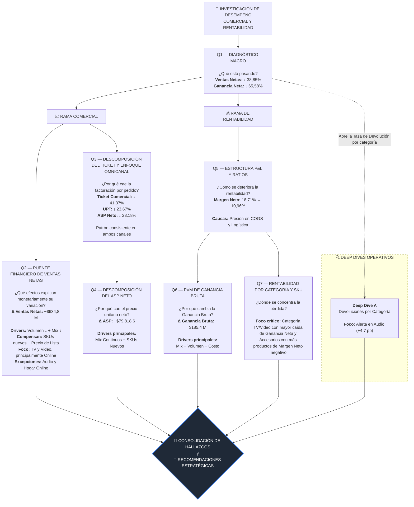

# 🔎 Investigación Analítica SQL

Esta investigación forma parte de un proyecto analítico End-to-End que se puede ver completo en: https://github.com/manticafacundoelian/dbt_elt_analytics

---

> **TL;DR:** Entre 2025 y 2026, la Ganancia Neta cayó **−65,58%**, casi el doble que las Ventas Netas (−38,85%). No es un problema de pedidos sino de Ticket Comercial —por UPT y ASP combinados— y de rentabilidad, donde la pérdida de volumen pesa más que el propio encarecimiento de costos. La investigación descarta las explicaciones más obvias —precio y descuentos, que casi se cancelan entre sí— y aísla la causa real en una sola categoría (**TV y Video**, 51,7% de toda la caída) y **3 productos puntuales**. El diagnóstico se sostiene en 3 puentes financieros con reconciliación exacta ($0,00 de residuo) y cierra con recomendaciones accionables priorizadas.

[Ver Conclusiones Generales →](#-conclusiones-generales) 

---

## 📌 Introducción

Esta investigación analiza la evolución comercial y económica de un retail de tecnología entre **2024 y 2026**, con el objetivo de identificar los principales factores asociados al deterioro observado en **ventas, comportamiento comercial y rentabilidad**.

El análisis parte de un **diagnóstico macro** y avanza progresivamente desde la variación agregada de las ventas hacia sus principales determinantes comerciales y económicos.

A partir de este diagnóstico, la investigación se estructura en dos grandes ramas:

* **Rama comercial:** analiza la evolución de las Ventas Netas desde una perspectiva financiera y comercial, descomponiendo monetariamente su variación y profundizando en el comportamiento del **Ticket Comercial, el UPT y el ASP**.

* **Rama de rentabilidad:** analiza el deterioro económico del negocio a través de la **estructura del P&L**, la evolución de los costos y la descomposición de la variación de la **Ganancia Bruta mediante un puente PVM ampliado (Price–Volume–Mix-Costo-Cambios en el Portfolio)**, complementando el análisis con la rentabilidad por categoría y SKU.

El objetivo no es únicamente cuantificar la caída observada, sino **reconstruir sus principales mecanismos**, desde la evolución de las ventas y el comportamiento de los clientes hasta su impacto final sobre la rentabilidad.

---

## 🗺️ Hoja de Ruta Ejecutiva & Resumen de Diagnóstico

```mermaid
flowchart TD

    A["🔎 INVESTIGACIÓN DE DESEMPEÑO<br/>COMERCIAL Y RENTABILIDAD"]

    A --> B["Q1 — DIAGNÓSTICO MACRO<br/><br/>¿Qué está pasando?<br/><b>Ventas Netas:</b> ↓ 38,85%<br/><b>Ganancia Neta:</b> ↓ 65,58%"]

    B --> C["📈 RAMA COMERCIAL"]
    B --> E["💰 RAMA DE RENTABILIDAD"]

    %% Rama Comercial: Q2 y Q3→Q4 son lentes paralelos, no secuenciales

    C --> C1["Q2 — PUENTE FINANCIERO DE VENTAS NETAS<br/><br/>¿Qué efectos explican monetariamente su variación?<br/><b>Δ Ventas Netas:</b> −$634,8 M<br/><br/><b>Drivers:</b> Volumen ↓ + Mix ↓<br/><b>Compensan:</b> SKUs nuevos + Precio de Lista<br/><b>Foco:</b> TV y Video, principalmente Online<br/><b>Excepciones:</b> Audio y Hogar Online"]

    C --> C2["Q3 — DESCOMPOSICIÓN DEL TICKET Y ENFOQUE OMNICANAL<br/><br/>¿Por qué cae la facturación por pedido?<br/><b>Ticket Comercial:</b> ↓ 41,37%<br/><b>UPT:</b> ↓ 23,67%<br/><b>ASP Neto:</b> ↓ 23,18%<br/><br/>Patrón consistente en ambos canales"]

    C2 --> C3["Q4 — DESCOMPOSICIÓN DEL ASP NETO<br/><br/>¿Por qué cae el precio unitario neto?<br/><b>Δ ASP:</b> −$79.818,6<br/><br/><b>Drivers principales:</b><br/>Mix Continuos + SKUs Nuevos"]

    %% Rama de Rentabilidad: Q5 es la raíz, Q6 y Q7 son ramas paralelas
    E --> E1["Q5 — ESTRUCTURA P&L Y RATIOS<br/><br/>¿Cómo se deteriora la rentabilidad?<br/><b>Margen Neto:</b> 18,71% → 10,96%<br/><br/><b>Causas:</b> Presión en COGS y Logística"]
    
    E1 --> E2["Q6 — PVM DE GANANCIA BRUTA<br/><br/>¿Por qué cambia la Ganancia Bruta?<br/><b>Δ Ganancia Bruta:</b> −$185,4 M<br/><br/><b>Drivers principales:</b><br/>Mix + Volumen + Costo"]
    
    E1 --> E3["Q7 — RENTABILIDAD POR CATEGORÍA Y SKU<br/><br/>¿Dónde se concentra la pérdida?<br/><br/><b>Foco crítico:</b> Categoría TV/Video con mayor caída de Ganancia Neta y Accesorios con más productos de Margen Neto negativo"]

    %% El Deep Dive abre un dato ya presentado en Q1 (Tasa de Devolución)
    B -.->|Abre la Tasa de Devolución por categoría| H

    subgraph DEEP_DIVES ["🔍 DEEP DIVES OPERATIVOS"]
        H["<b>Deep Dive A</b><br/>Devoluciones por Categoría<br/><br/><b>Foco:</b> Alerta en Audio (+4,7 pp)"]
    end

    %% ==========================================
    %% EFECTO LLAVE ACOSTADA UNIFICADORA
    %% ==========================================
    C1 ---> LLAVE{" 🤝 CONSOLIDACIÓN DE HALLAZGOS<br/>y<br/>🎯 RECOMENDACIONES ESTRATÉGICAS"}
    C3 ---> LLAVE
    E2 ---> LLAVE
    E3 ---> LLAVE
    H  ---> LLAVE

    style LLAVE fill:#1f2937,stroke:#3b82f6,stroke-width:2px,color:#fff
    style DEEP_DIVES stroke-dasharray: 5 5
```

---

## 🔎 Investigación y Desarrollo

La investigación busca responder **siete preguntas principales de diagnóstico**, complementadas por **un análisis operativo de profundización (*Deep Dives*)**:

### Preguntas Core del Diagnóstico

#### ┌─ 🔹 Q1 — Diagnóstico Macro: ¿Qué cambió en el desempeño general del negocio?

<strong>Ver desarrollo de Q1</strong>
  

   

#### 🔹 Síntesis

El diagnóstico muestra, por un lado, una fuerte contracción de las Ventas Netas y del Ticket Comercial y, por otro, un deterioro de la rentabilidad que ya se había manifestado durante 2025.

 

[Ver Consulta SQL →](./sql_business_analysis/q1_diagnostico_macro_yoy.sql) 
 

#### 🔹 Resultados 

| Métrica                    |       2024 |       2025 |     YoY 2025 |       2026 |     YoY 2026 |
| :------------------------- | ---------: | ---------: | -----------: | ---------: | -----------: |
| **Pedidos**                |      1.365 |      1.581 |  **+15,82%** |      1.649 |   **+4,30%** |
| **Ventas Brutas**          | $1.316,5 M | $1.684,4 M |  **+27,95%** | $1.064,0 M |  **−36,83%** |
| **Tasa de Descuento (%)**  |      1,98% |      3,00% | **+1,02 pp** |      6,10% | **+3,10 pp** | 
| **Ventas Netas**           | $1.290,5 M | $1.633,9 M |  **+26,62%** |   $999,1 M |  **−38,85%** |
| Devoluciones ($)           |    $37,2 M |    $53,7 M |  **+44,45%** |    $70,3 M |  **+30,90%** |
| **Tasa de Devolución (%)** |      2,88% |      3,28% | **+0,40 pp** |      7,03% | **+3,75 pp** |
| **Ventas Netas Finales**   | $1.253,3 M | $1.580,3 M |  **+26,09%** |   $928,9 M |  **−41,22%** |
| **Ganancia Neta**          |   $300,1 M |   $295,7 M |   **−1,47%** |   $101,8 M |  **−65,58%** |
| **Margen Neto (%)**        |     23,95% |     18,71% | **−5,24 pp** |     10,96% | **−7,75 pp** |
| **Ticket Comercial**       |   $945.397 | $1.033.477 |   **+9,32%** |   $605.891 |  **−41,37%** |

> *Nota: El Ticket Comercial se calcula sobre Ventas Netas, antes de devoluciones, para analizar el comportamiento comercial de las órdenes independientemente de las devoluciones posteriores.*

#### 🔹 Hallazgos

#### Diagnóstico Comercial

**1. Crecimiento en pedidos con caída de facturación**

En 2026 se registraron **1.649 pedidos (+4,30% YoY)**, mientras que las Ventas Netas cayeron un **−38,85%**.

**2. Contracción del Ticket Comercial**

La caída de ingresos se acompaña de una reducción significativa del ticket promedio, que disminuyó un **−41,37%**, pasando de **$1.033.477 a $605.891**.

**3. Mayor incidencia de devoluciones**

La Tasa de Devolución aumentó de **3,28% a 7,03% (+3,75 pp)**, profundizando la caída de las Ventas Netas Finales hasta un **−41,22%**.

#### Diagnóstico de Rentabilidad

**4. La ganancia cae más que las ventas**

En 2026, la Ganancia Neta cayó un **−65,58%**, frente a una caída del **−38,85%** en Ventas Netas. Como consecuencia, el Margen Neto se redujo del **18,71% al 10,96% (−7,75 pp)**.

**5. Deterioro de rentabilidad previo**

El problema de rentabilidad antecede a la caída de facturación de 2026. En 2025, a pesar de un crecimiento del **+26,62%** en Ventas Netas, la Ganancia Neta cayó un **−1,47%** y el Margen Neto perdió **−5,24 pp**.

 

#### 🔹 Puente analítico → Ramas Comercial y de Rentabilidad

El diagnóstico muestra, por un lado, una fuerte contracción de las **Ventas Netas** (−38,85%) y, por otro, una caída de la **Ganancia Neta** proporcionalmente mayor (−65,58%). Estas dos variables abren dos líneas de indagación independientes:

**La Rama Comercial (Q2–Q4)** cuantifica monetariamente esta caída y profundiza en cómo se manifestó en el comportamiento por pedido — Ticket, UPT y ASP.

**La Rama de Rentabilidad (Q5–Q7)** analiza la estructura de costos y descompone la Ganancia Bruta para explicar por qué el resultado económico se deterioró más que las ventas.

 

#### ├─ 🔹 Q2 — Puente Financiero de Ventas Netas: ¿Qué efectos explican monetariamente su variación?

<strong>Ver desarrollo de Q2</strong>
  

 

#### 🔹 Síntesis

Las **Ventas Netas disminuyeron $634,8 M entre 2025 y 2026**, explicadas principalmente por una fuerte contracción del **Volumen**, seguida por un efecto negativo de **Mix**.

Frente a estos efectos adversos, el **Precio** y, especialmente, la incorporación de **SKUs Nuevos**, actuaron como factores de compensación. Los **Descuentos** profundizaron parcialmente la caída, mientras que el efecto de los **SKUs Descontinuados fue prácticamente nulo**.

La apertura por **canal** muestra que el mayor deterioro absoluto se concentra en **Online**, aunque **Físico** presenta un impacto particularmente fuerte del Mix. Al cruzar **categoría × canal**, la contracción queda fuertemente concentrada en **TV y Video**, especialmente Online, seguida por **Telefonía y Computación**.

En contraste, **Audio Online** y **Hogar Online** presentan una evolución positiva, mostrando que el deterioro no fue homogéneo en todo el negocio.

 

#### 🔸 Q2.1 — Puente agregado total

[Ver Consulta SQL →](./sql_business_analysis/q2.1_puente_ventas_netas_total.sql)  

#### 🔹 Resultados

| Efecto                        | Impacto 2025 → 2026 |
| :---------------------------- | ------------------: |
| **Δ Ventas Netas**            |       **−$634,8 M** |
| Volumen                       |           −$614,9 M |
| Mix                           |           −$161,3 M |
| Precio                        |            +$37,8 M |
| Descuentos                    |            −$26,8 M |
| SKUs Nuevos                   |           +$130,5 M |
| SKUs Descontinuados           |             −$0,2 M |
| **Impacto total**             |       **−$634,8 M** |

> *Nota: El puente atribuye la variación de Ventas Netas entre 2025 y 2026 a efectos de **Volumen y Mix sobre SKUs continuos**, **Precio de Lista**, **Descuentos** y **cambios en el portafolio**, considerando **SKUs Nuevos y SKUs Descontinuados como efectos directos**. El impacto total coincide exactamente con la variación observada, confirmando la conciliación del puente.*

#### 🔹 Hallazgos

**1. El Volumen explica la mayor parte de la caída**

El efecto Volumen alcanzó **−$614,9 M**, siendo ampliamente el principal factor de deterioro. La contracción de las unidades comercializadas explica, por sí sola, una parte sustancial de la caída de Ventas Netas.

**2. El Mix también tuvo un impacto negativo relevante**

El Mix de los **SKUs continuos** aportó **−$161,3 M**, mostrando que el deterioro no se explica únicamente por vender menos unidades. También cambió desfavorablemente la composición de las ventas entre los productos que permanecieron activos en ambos períodos.

**3. Los nuevos SKUs compensaron parcialmente la contracción**

La incorporación de **SKUs nuevos aportó +$130,5 M**, convirtiéndose en el principal factor positivo del puente. Si bien este efecto no alcanzó para revertir la caída generada por Volumen y Mix, sí compensó una parte significativa del deterioro.

**4. El Precio de Lista aportó una compensación adicional**

El aumento del **Precio de Lista generó +$37,8 M**, contribuyendo positivamente a las Ventas Netas y amortiguando parcialmente los efectos negativos.

**5. Los Descuentos profundizaron la caída**

El efecto de los **Descuentos fue de −$26,8 M**, contrarrestando parte del beneficio obtenido por los mayores precios de lista.

**6. Los SKUs descontinuados tuvieron un impacto marginal**

El efecto asociado a los **SKUs descontinuados fue de apenas −$0,2 M**, por lo que prácticamente no tuvo incidencia sobre la variación total.

 

#### 🔸 Q2.2 — Puente por canal

[Ver Consulta SQL →](./sql_business_analysis/q2.2_puente_ventas_netas_canal.sql)  

#### 🔹 Resultados

| Canal | Ventas 2025 | Ventas 2026 | Δ Ventas | Impacto Volumen | Impacto Mix | Impacto Precio | Impacto Descuentos | SKUs Nuevos | SKUs Descontinuados | Impacto Total |
| :--- | ---: | ---: | ---: | ---: | ---: | ---: | ---: | ---: | ---: | ---: |
| **Online** | $1,178.4M | $794.0M | -$384.4M | -$443.5M | -$51.4M | +$30.2M | -$20.9M | +$101.3M | $0.00M | -$384.4M |
| **Físico** | $455.5M | $205.1M | -$250.4M | -$171.4M | -$109.8M | +$7.6M | -$5.8M | +$29.2M | -$0.2M | -$250.4M |

#### 🔹 Hallazgos

**1. Online concentra la mayor caída absoluta**

El canal Online redujo sus Ventas Netas en **$384,4 M**, frente a una caída de **$250,4 M en Físico**, por lo que concentra la mayor parte del deterioro agregado.

**2. El Volumen domina en ambos canales**

El principal efecto negativo en Online fue el **Volumen (−$443,5 M)**, mientras que en Físico alcanzó **−$171,4 M**.

Esto confirma que la contracción de unidades comercializadas constituye el principal problema comercial en ambos canales.

**3. Físico presenta un deterioro de Mix especialmente fuerte**

El Mix tuvo un impacto de **−$109,8 M en Físico**, más del doble del observado en Online (**−$51,4 M**).

Esto indica que el canal físico no solo perdió volumen, sino que también experimentó un cambio particularmente desfavorable en la composición de los productos vendidos.

**4. Los nuevos SKUs compensaron parcialmente la caída**

La incorporación de nuevos productos aportó **+$101,3 M en Online** y **+$29,2 M en Físico**, funcionando como un factor de compensación frente a la contracción del Volumen y otros efectos negativos.

El aporte fue relevante en ambos canales, aunque insuficiente para revertir la caída de Ventas Netas.

 

#### 🔹 Q2.3 — Puente por categoría × canal

[Ver Consulta SQL →](./sql_business_analysis/q2.3_puente_ventas_netas_categoria_canal.sql)  

#### 🔹 Resultados

| Categoría       | Canal    |  Δ Ventas Netas | Principal efecto negativo |
| :-------------- | :------- | ------------: | :------------------------ |
| **TV y Video**  | Online   | **−$302,3 M** | Volumen −$237,2 M         |
| **TV y Video**  | Físico   | **−$132,1 M** | Volumen −$81,7 M          |
| **Telefonía**   | Online   |  **−$73,1 M** | Volumen −$49,0 M          |
| **Computación** | Físico   |  **−$50,1 M** | Volumen −$29,8 M          |
| **Computación** | Online   |  **−$45,9 M** | Volumen −$61,7 M          |
| **Telefonía**   | Físico   |  **−$31,5 M** | Volumen −$18,6 M          |
| **Accesorios**  | Online   |  **−$19,1 M** | Volumen −$25,9 M          |
| **Accesorios**  | Físico   |  **−$12,9 M** | Volumen −$10,8 M          |
| **Hogar**       | Físico   |  **−$12,7 M** | Volumen −$12,1 M          |
| **Audio**       | Físico   |  **−$11,1 M** | Volumen −$18,4 M          |
| **Hogar**       | Online   |   **+$8,9 M** | Mix +$37,5 M              |
| **Audio**       | Online   |  **+$47,1 M** | SKUs nuevos +$64,3 M      |

#### 🔹 Hallazgos

**1. TV y Video concentra el principal deterioro**

TV y Video presenta una caída conjunta de aproximadamente **$434,4 M** entre ambos canales, explicando cerca de **68% de la contracción total de Ventas Netas**.

El mayor deterioro se encuentra en **Online**, con **−$302,3 M**, seguido por **Físico** con **−$132,1 M**.

**2. La caída de TV y Video combina Volumen y Mix**

En TV y Video Online, el Volumen aportó **−$237,2 M** y el Mix **−$68,9 M**. En Físico, ambos efectos también fueron negativos, con **−$81,7 M de Volumen** y **−$52,5 M de Mix**.

Por lo tanto, el deterioro de esta categoría no responde únicamente a una menor cantidad vendida, sino también a una composición menos favorable de las ventas.

**3. Telefonía y Computación constituyen el segundo foco de deterioro**

Telefonía cayó tanto en Online (**−$73,1 M**) como en Físico (**−$31,5 M**), mientras que Computación disminuyó **−$45,9 M en Online** y **−$50,1 M en Físico**.

En estos cruces, el Volumen representa el principal factor negativo y se combina con efectos desfavorables de Mix.

**4. Audio Online y Hogar Online funcionan como excepciones positivas**

Mientras prácticamente todos los demás cruces categoría × canal presentan caídas, **Audio Online creció $47,1 M** y **Hogar Online $8,9 M**.

En Audio Online, el crecimiento estuvo impulsado principalmente por **SKUs nuevos (+$64,3 M)** y un **Mix favorable (+$21,4 M)**, que compensaron la caída de Volumen.

En Hogar Online, el principal impulsor fue el **Mix (+$37,5 M)**, que compensó una caída de Volumen de **−$29,2 M**.

 

#### 🔹 Puente analítico → Q3

Q2 cuantifica **dónde y por qué monetariamente se movió la Venta Neta**, pasando del resultado agregado a su distribución por **canal** y finalmente a la combinación de **categoría × canal**.

El diagnóstico muestra que la contracción está dominada por una fuerte caída del **Volumen**, acompañada por un deterioro del **Mix**, mientras que la incorporación de nuevos SKUs y los mayores precios de lista compensaron parcialmente el impacto negativo.

**Q3 cambia la unidad de análisis:** pasa del valor monetario total al comportamiento por pedido, descomponiendo la evolución del **Ticket Comercial** mediante **órdenes, UPT y ASP**, y profundizando además en la evolución de cada canal.

 

#### ├─ 🔹 Q3 — Descomposición del Ticket y Comportamiento Omnicanal: ¿Por qué cae la facturación por pedido?

<strong>Ver desarrollo de Q3</strong>
  

 

#### 🔹 Síntesis

La **facturación por pedido cayó** entre 2025 y 2026 porque los clientes compraron **menos unidades por pedido** y cada unidad generó un **menor valor promedio**, dando como resultado una caída del Ticket Comercial.

Ambos fenómenos se reprodujeron transversalmente en **Online y Físico**, lo que indica que el deterioro responde principalmente a un **cambio en el comportamiento comercial**, más que a un problema asociado exclusivamente a un canal.

 

#### 🔸 Q3.1 — Descomposición del Ticket (UPT vs. ASP)

[Ver Consulta SQL →](./sql_business_analysis/q3.1_descomposicion_ticket.sql) 
 

#### 🔹 Resultados

| Métrica                       |       2024 |       2025 |    YoY 2025 |     2026 |    YoY 2026 |
| :---------------------------- | ---------: | ---------: | ----------: | -------: | ----------: |
| **Pedidos**                   |      1.365 |      1.581 | **+15,82%** |    1.649 |  **+4,30%** |
| **Unidades Totales**          |      3.946 |      4.746 | **+20,27%** |    3.778 | **−20,41%** |
| **Ventas Netas**              | $1.290,5 M | $1.633,9 M | **+26,62%** | $999,1 M | **−38,85%** |
| **Unidades por Pedido (UPT)** |       2,89 |       3,00 |  **+3,81%** |     2,29 | **−23,67%** |
| **ASP Comercial**             |   $327.032 |   $344.275 |  **+5,27%** | $264.456 | **−23,18%** |
| **Ticket Comercial**          |   $945.397 | $1.033.477 |  **+9,32%** | $605.891 | **−41,37%** |

> *Nota: **Ticket Comercial = UPT × ASP**, donde UPT representa las unidades promedio por pedido y ASP el valor promedio por unidad.*

#### 🔹 Hallazgos

**1. El ticket cae por dos vías simultáneas**

Entre 2025 y 2026, el Ticket Comercial disminuyó **41,37%**. La descomposición muestra una caída prácticamente equivalente en sus dos componentes: **UPT −23,67%** y **ASP −23,18%**.

Esto indica que en 2026 los clientes compraron **menos unidades por pedido y, además, a un menor valor promedio por unidad**.

 

#### 🔸 Q3.2 — Comportamiento Omnicanal

[Ver Consulta SQL →](./sql_business_analysis/q3.2_comportamiento_omnicanal.sql) 
 

#### 🔹 Resultados

| Canal | Pedidos 2025 | Pedidos 2026 | YoY Pedidos | Part. Pedidos 2025 | Part. Pedidos 2026 | Ticket 2025 | Ticket 2026 | YoY Ticket | ASP 2025 | ASP 2026 | YoY ASP | Tasa Descto. 2025 | Tasa Descto. 2026 | Δ Descto. (pp) |
| --- | --- | --- | --- | --- | --- | --- | --- | --- | --- | --- | --- | --- | --- | --- |
| **Online** | 1.116 | 1.318 | **+18,10%** | 70,59% | 79,93% | $1.055.898 | $602.436 | **−42,95%** | $349.876 | $263.879 | **−24,58%** | 2,98% | 6,04% | **+3,06 pp** |
| **Físico** | 465 | 331 | **−28,82%** | 29,41% | 20,07% | $979.667 | $619.651 | **−36,75%** | $330.584 | $266.716 | **−19,32%** | 3,03% | 6,31% | **+3,29 pp** |

#### 🔹 Hallazgos

**1. El deterioro del ticket se reproduce en ambos canales**

El Ticket Comercial cayó **42,95% en Online** y **36,75% en Físico**. La magnitud es diferente, pero el patrón es consistente: **ambos canales pierden valor por pedido**.

**2. UPT y ASP caen simultáneamente en ambos canales**

En Online, el UPT disminuyó **24,35%** y el ASP **24,58%**. En Físico, las caídas fueron de **21,60%** y **19,32%**, respectivamente.

Esto refuerza el hallazgo de Q3.1: la contracción del ticket no responde a un único componente ni a un único canal.

**3. El mix de canales cambia, pero no explica por sí solo el deterioro**

La participación de Online aumentó de **70,59% a 79,93%**, mientras Físico cayó de **29,41% a 20,07%**. Sin embargo, el ticket se deterioró dentro de **ambos canales**, por lo que el cambio de participación no explica por sí solo la caída del ticket total.

**4. Los descuentos aumentaron en ambos canales de manera similar**

La tasa de descuento aumentó **+3,06 pp en Online** y **+3,29 pp en Físico**.

 

#### 🔹 Puente analítico → Q4

Q3 identifica **qué está pasando con el valor por pedido**: los clientes compran menos unidades y cada unidad genera un menor valor promedio.

**Q4 profundiza el segundo componente —el ASP Neto— para determinar qué factores explican la caída del valor promedio por unidad.**

 

#### ├─ 🔹 Q4 — Descomposición del ASP Neto: ¿Por qué cae el valor promedio por unidad?

<strong>Ver desarrollo de Q4</strong>
  

 

#### 🔹 Síntesis

La caída del **ASP** responde principalmente a un cambio en la **composición de los productos vendidos** y a la incorporación de **SKUs nuevos con valores unitarios inferiores al promedio previo**.

Los efectos de **Precio de Lista y Descuentos** tuvieron un impacto secundario en términos netos, por lo que el deterioro del valor promedio por unidad se concentra principalmente en el **mix y la renovación del portafolio**.

 

#### 🔸 Q4.1 — Puente Agregado (Mix + Precio + Descuento + Nuevos + Descontinuados)

[Ver Consulta SQL →](./sql_business_analysis/q4_1_descomposicion_asp_agregada.sql) 
 

#### 🔹 Resultados

| Métrica                    |       2025 |       2026 |            Δ |
| :-------------------------- | ---------: | ---------: | -----------: |
| **ASP Comercial**           |   $344.275 |   $264.456 | **−$79.819** |
| **SKUs Continuos**          |         37 |         37 |             — |
| **SKUs Nuevos**             |          — |         11 |             — |
| **SKUs Descontinuados**     |          0 |          — |             — |

**Descomposición del Δ ASP ($79.819 de caída):**

| Efecto                          |    Impacto ($) | % del Δ Total |
| :------------------------------- | --------------: | -------------: |
| **Mix**         |     −$54.180,70 |    **67,9%** |
| **SKUs Nuevos**                  |     −$29.328,29 |    **36,7%** |
| **Precio**                       |      $12.778,52 |   **−16,0%** |
| **Descuentos**                   |      −$9.088,17 |    **11,4%** |
| **SKUs Descontinuados**          |           $0,00 |        0,0% |
| **Chequeo de Residuo y % Total**   |     **$0,00** ✅ |      100,0% |

> *Nota metodológica: el efecto Mix se valúa a precio del año base (2025) y los efectos Precio y Descuento se ponderan con el volumen del año actual (2026). Esta convención asegura que el puente cierre exacto (residuo $0), a costa de que la interacción entre cambio de mix y cambio de precio quede incluida dentro del efecto Precio.*

#### 🔹 Hallazgos

**1. La caída del ASP es principalmente un problema de mix, no de precios**

El efecto **Mix explica el 67,9%** de la caída, y los **SKUs Nuevos otro 36,7%**. Juntos superan el 100% del Δ, porque **Precio (+$12.778,52) y Descuento (−$9.088,17) casi se cancelan entre sí** (saldo neto: +$3.690,35). En otras palabras: la política de precios y descuentos, en neto, no explica la caída; el problema está en qué se vendió, no en cuánto se cobró por lo mismo.

**2. No hubo bajas de catálogo**

Los **0 SKUs descontinuados** confirman que toda la caída se explica por mix y por lanzamientos, no por pérdida de líneas existentes.

 

#### 🔸 Q4.2 — Puente por Categoría

[Ver Consulta SQL →](./sql_business_analysis/q4_2_descomposicion_asp_categoria.sql) 
 

#### 🔹 Resultados

| Categoría | Unid. 2025 | Unid. 2026 | Part. 2025 | Part. 2026 | Δ Part. (pp) | Mix | Precio | Descuento | Nuevos | Total | % contribución al Δ ASP |
| :--- | ---: | ---: | ---: | ---: | ---: | ---: | ---: | ---: | ---: | ---: | ---: |
| **TV y Video** | 791 | 402 | 16,67% | 10,64% | **−6,03** | −40.717,38 | 5.642,40 | −4.004,87 | 0,00 | **−39.079,85** | **49,0%** |
| **Computación** | 767 | 690 | 16,16% | 18,26% | +2,10 | −15.885,31 | 1.348,05 | −971,26 | −17.671,74 | **−33.180,25** | **41,6%** |
| **Telefonía** | 259 | 102 | 5,46% | 2,70% | −2,76 | −13.908,97 | 830,43 | −300,51 | 438,49 | **−12.940,57** | **16,2%** |
| **Audio** | 707 | 862 | 14,90% | 22,82% | +7,92 | 3.587,54 | 2.000,85 | −1.397,46 | −9.056,35 | **−4.865,42** | **6,1%** |
| **Accesorios** | 1.222 | 782 | 25,75% | 20,70% | −5,05 | 338,66 | 1.115,33 | −851,29 | −3.038,69 | **−2.435,99** | **3,1%** |
| **Hogar** | 1.000 | 940 | 21,07% | 24,88% | +3,81 | 12.404,76 | 1.841,45 | −1.562,78 | 0,00 | **+12.683,43** | **−15,9%** |
| **Total (chequeo)** | — | — | — | — | — | — | — | — | — | **−79.818,65** ✅ | 100,0% |

#### 🔹 Hallazgos

**1. Dos categorías explican el 90,6% de la caída, por mecanismos opuestos**

**TV y Video** (−49,0%) presenta una caída dominada por el efecto Mix: perdió 6 puntos de share, sin ningún SKU nuevo, y ni precio ni descuento lo compensan. **Computación** (−41,6%), en cambio, **ganó participación** (+2,10 pp) pero ven presionado su ASP por la incorporación de SKUs nuevos, que entraron por debajo del promedio (−$17.671,74). El mismo patrón se repite en **Audio**, que ganó +7,92 pp de share (la mayor suba de todas) y aun así cae, arrastrada por sus lanzamientos.

**2. Hogar es la única categoría que empuja el ASP hacia arriba**

Ganó share (+3,81 pp) con mix positivo (+$12.404,76) y sin lanzamientos, el espejo exacto de TV y Video.
 

#### 🔸 Q4.3 — Bridge por SKU (Detalle y Ranking de Impacto)

[Ver Consulta SQL →](./sql_business_analysis/q4_3_descomposicion_asp_sku.sql) 
 

#### 🔹 Resultados — Top 5 Mayor Impacto Negativo

| Producto | Categoría | Estado | Δ Part. (pp) | Mix | Precio | Descuento | Nuevos | Total |
| :--- | :--- | :--- | ---: | ---: | ---: | ---: | ---: | ---: |
| TCL Monitor TV 21 | TV y Video | Continuo | −2,616 | −20.173,53 | 2.265,13 | −1.530,49 | 0,00 | **−19.438,89** |
| Acer Memoria RAM 2 | Computación | Continuo | −3,132 | −11.108,52 | 197,11 | −95,52 | 0,00 | **−11.006,93** |
| Lenovo Mouse 1 | Computación | Continuo | −4,073 | −10.436,40 | 332,19 | −189,48 | 0,00 | **−10.293,69** |
| TCL Chromecast 25 | TV y Video | Continuo | −1,342 | −9.111,00 | 1.173,26 | −905,27 | 0,00 | **−8.843,01** |
| Acer Notebook 7 | Computación | Nuevo 2026 | +4,579 | 0,00 | 0,00 | 0,00 | −8.347,11 | **−8.347,11** |

#### 🔹 Resultados — Top 5 Mayor Impacto Positivo

| Producto | Categoría | Estado | Δ Part. (pp) | Mix | Precio | Descuento | Nuevos | Total |
| :--- | :--- | :--- | ---: | ---: | ---: | ---: | ---: | ---: |
| Liliana Cafetera 46 | Hogar | Continuo | +6,315 | 12.338,22 | 1.171,32 | −1.043,51 | 0,00 | **12.466,03** |
| ASUS Webcam 6 | Computación | Continuo | +1,167 | 7.423,10 | 406,13 | −391,52 | 0,00 | **7.437,70** |
| Philips Barra de Sonido 28 | Audio | Continuo | +0,013 | 3.595,60 | 793,89 | −469,45 | 0,00 | **3.920,04** |
| Samsung Monitor TV 23 | TV y Video | Continuo | +0,365 | 3.313,49 | 487,24 | −353,18 | 0,00 | **3.447,55** |
| Logitech Funda 40 | Accesorios | Continuo | +0,561 | 1.273,05 | 121,81 | −90,70 | 0,00 | **1.304,16** |

> *Detalle completo de los 48 SKUs disponible en la salida de la consulta SQL vinculada arriba.*

#### 🔹 Hallazgos

**1. El impacto está muy concentrado, y el caso extremo confirma Q3.2**

Los 5 productos de mayor impacto negativo explican el **72,6%** de la caída total. El más extremo, **TCL Monitor TV 21**, perdió más de la mitad de sus unidades (295 → 136) y explica por sí solo el **24,4%** de la caída del ASP — la manifestación a nivel producto de la pérdida de mix que ya vimos en TV y Video.  
 

#### 🔹 Puente analítico → Cierre de la Rama Comercial

Q4 completa el diagnóstico comercial: la caída del ASP se explica principalmente por **Mix** y por la incorporación de **SKUs nuevos a precios por debajo del promedio**, no por la política de precios o descuentos.

Con esto, la **Rama Comercial queda completa**. La **Rama de Rentabilidad (Q5–Q7)**, abierta en paralelo desde el diagnóstico inicial, analiza cómo estos mismos fenómenos de ventas se tradujeron en el deterioro del resultado económico.

 

#### ├─ 🔹 Q5 — Estructura de Rentabilidad y Ratios P&L: ¿Cómo se deterioró la rentabilidad?

<strong>Ver desarrollo de Q5</strong>
  

 

#### 🔹 Síntesis

La rentabilidad se deterioró por una **mayor presión del Costo de Ventas sobre el ingreso retenido**, acompañada por un incremento del peso de los **costos logísticos**.

El problema no comienza en 2026: ya durante 2025 el crecimiento de las ventas dejó de traducirse en una mejora equivalente de la **Ganancia Bruta y el Margen Neto**.

 

[Ver Consulta SQL →](./sql_business_analysis/q4_rentabilidad_ratios_pnl.sql)  

#### 🔹 Resultados

| Métrica                      |       2024 |       2025 |     YoY 2025 |     2026 |     YoY 2026 |
| :--------------------------- | ---------: | ---------: | -----------: | -------: | -----------: |
| **Ventas Netas Finales**     | $1.253,3 M | $1.580,3 M |  **+26,09%** | $928,9 M |  **−41,22%** |
| **Costo de Ventas**          |   $943,1 M | $1.270,0 M |  **+34,60%** | $804,0 M |  **−36,69%** |
| **Costo de Ventas / VNF** |     75,25% |     80,37% | **+5,12 pp** |   86,56% | **+6,19 pp** |
| **Ganancia Bruta**           |   $310,2 M |   $310,2 M |   **−0,01%** | $124,9 M |  **−59,75%** |
| **Margen Bruto**             |     24,75% |     19,63% | **−5,12 pp** |   13,44% | **−6,19 pp** |
| **Costo Logístico / VNF** |      0,81% |      0,92% | **+0,11 pp** |    2,49% | **+1,57 pp** |
| **Ganancia Neta**            |   $300,1 M |   $295,7 M |   **−1,47%** | $101,8 M |  **−65,58%** |
| **Margen Neto**              |     23,95% |     18,71% | **−5,24 pp** |   10,96% | **−7,75 pp** |

> Para el análisis de rentabilidad se toma como base la **Venta Neta Final**, es decir, la venta después de devoluciones aprobadas. Esta decisión busca medir la rentabilidad sobre el **ingreso económico efectivamente retenido por la empresa**.

#### 🔹 Hallazgos

**1. El costo de ventas absorbe una proporción cada vez mayor de las Ventas Netas Finales**

Entre 2025 y 2026, el **Costo de Ventas / Ventas** aumentó **6,19 pp**, pasando de 80,37% a 86,56%.

Como consecuencia, el **Margen Bruto** se redujo en la misma magnitud, de 19,63% a 13,44%.

El deterioro resulta especialmente relevante porque entre 2024 y 2025 las ventas habían crecido **26,09%**, pero la **Ganancia Bruta permaneció prácticamente sin cambios**, pasando de $310,2 M a $310,2 M.

**2. La presión logística se intensifica en 2026**

El **Costo Logístico / Ventas** pasó de 0,92% en 2025 a 2,49% en 2026, un aumento de **1,57 pp**.

Aunque su peso es significativamente menor que el del Costo de Ventas, la mayor carga logística reduce todavía más la rentabilidad una vez deteriorado el margen bruto.

**3. La rentabilidad cae mucho más que las ventas**

Entre 2025 y 2026, las **Ventas Netas Finales disminuyeron 41,22%**, mientras que la **Ganancia Neta cayó 65,58%**.

En consecuencia, el **Margen Neto** pasó de 18,71% a 10,96%, una reducción de **7,75 pp**.

El deterioro no responde únicamente a una menor escala de ventas: una proporción creciente de las **Ventas Netas Finales** es absorbida por el **Costo de Ventas**, mientras que el **Costo Logístico** agrega una presión adicional sobre el resultado final.

El siguiente paso es determinar cuánto del deterioro de la **Ganancia Bruta** corresponde a cada componente económico.

 

#### 🔹 Puente analítico → Q6

Q5 muestra que el deterioro de 2026 combina una fuerte contracción de las ventas, **como demostró la Rama Comercial**, con un aumento del peso del **Costo de Ventas**, que comprimió el **Margen Bruto hasta 13,44%** y redujo la **Ganancia Bruta un 59,75%**.

**Q6 descompone esta caída de la Ganancia Bruta mediante un PVM formal —Volumen → Mix → Precio → Costo → Nuevos Lanzamientos → Descontinuados**, para cuantificar qué componentes explican el deterioro entre 2025 y 2026.

 

#### ├─ 🔹 Q6 — Puente Financiero de Ganancia Bruta: ¿Qué efectos explican monetariamente la erosión del margen?

<strong>Ver desarrollo de Q6</strong>
  

 

#### 🔹 Síntesis

La **Ganancia Bruta se redujo $185,4 M entre 2025 y 2026** (−59,8%), sufriendo un deterioro significativamente más severo que el de las Ventas Netas (−39,2%). Esta contracción responde a un **"efecto pinza" generado por el colapso masivo de Volumen (−$122,5 M) y un fuerte aumento de costos directos COGS (−$64,5 M)**.

Frente a este escenario, los incrementos de **Precio de Lista (+$10,0 M)** y la incorporación de **SKUs Nuevos (+$15,5 M)** actuaron como factores de mitigación, pero resultaron insuficientes para contener la erosión del margen bruto global, el cual cayó **6,19 puntos porcentuales** (pasando del 19,63% al 13,44%).

La apertura por **canal** confirma dos mecánicas de deterioro distintas: **Online** concentra el **65,6% de la pérdida absoluta** de ganancia (−$121,6 M) empujado por la incapacidad de absorber la inflación de costos (−$51,4 M), mientras que **Físico** sufre un colapso relativo (−71,2% en ganancia) determinado por la caída de demanda y un severo deterioro del Mix (−$21,2 M).

Al analizar por **categoría**, la contracción queda masivamente concentrada en **TV y Video (−$100,9 M)**, explicando por sí sola más del **54% de la pérdida total de ganancia bruta de la compañía**.

 

#### 🔸 Q6.1 — Puente agregado total

[Ver Consulta SQL →](./sql_business_analysis/q6.1_puente_ganancia_bruta_total.sql)  

#### 🔹 Resultados

| Métrica / Efecto | Impacto 2025 → 2026 |
| :--- | ---: |
| **Ganancia Bruta 2025** | **$310,2 M** |
| **Ganancia Bruta 2026** | **$124,9 M** |
| **Δ Ganancia Bruta (Monto)** | **−$185,4 M** (−59,8%) |
| **Δ Tasa de Margen Bruto** | **−6,19 pp** (19,63% → 13,44%) |
| --- | --- |
| Impacto Volumen | −$122,5 M |
| Impacto Costo (COGS) | −$64,5 M |
| Impacto Mix | −$23,9 M |
| Impacto Precio | +$10,0 M |
| SKUs Nuevos (Lanzamientos) | +$15,5 M |
| SKUs Descontinuados | −$0,02 M |
| **Impacto total reconciliado** | **−$185,4 M** |

> *Nota: El puente PVM de Ganancia Bruta atribuye la variación monetaria entre 2025 y 2026 a efectos de **Volumen y Mix sobre SKUs continuos**, **Evolución de Precios**, **Absorción de Costos (COGS)** y **Rotación de Portafolio**. La suma aditiva de los 6 efectos concilia exactamente con la variación observada ($0,00 de residuo de auditoría).*

#### 🔹 Hallazgos

**1. Desproporcionada caída de la rentabilidad bruta**
La Ganancia Bruta cayó un **−59,8%** (de $310,2 M a $124,9 M), superando ampliamente la caída de ingresos. Esto confirma que el negocio no solo vendió un 23% menos de unidades (−1.051 u), sino que **perdió eficiencia estructural para convertir ventas en margen**.

**2. Doble motor de destrucción: Volumen y COGS**
El **Efecto Volumen (−$122,5 M)** y el **Efecto Costo (−$64,5 M)** explican conjuntamente el 101% del deterioro. Los aumentos en los costos de proveedores no pudieron trasladarse plenamente al precio final.

**3. Los aumentos de precio no alcanzaron a cubrir la inflación de costos**
El **Efecto Precio aportó +$10,0 M**, pero fue superado **6,4 veces por la subida del COGS (−$64,5 M)**, demostrando una clara pérdida de poder de fijación de precios frente al mercado.

**4. Aporte positivo de los lanzamientos**
La incorporación de **SKUs nuevos aportó +$15,5 M** en Ganancia Bruta, funcionando como la principal palanca de amortiguación del periodo.

 

#### 🔸 Q6.2 — Puente por canal

[Ver Consulta SQL →](./sql_business_analysis/q6.2_puente_ganancia_bruta_canal.sql)  

#### 🔹 Resultados

| Canal | Unid. 2025 | Unid. 2026 | Δ Unid. | GB 2025 | GB 2026 | Δ Ganancia | Var % | Margen 2025 | Margen 2026 | Δ Margen (pp) | Imp. Volumen | Imp. Mix | Imp. Precio | Imp. Costo | SKUs Nuevos | Impacto Total |
| :--- | ---: | ---: | ---: | ---: | ---: | ---: | ---: | ---: | ---: | ---: | ---: | ---: | ---: | ---: | ---: | ---: |
| **Online** | 3.255 | 2.814 | −441 | $220,6M | $99,0M | **−$121,6M** | −55,1% | 19,35% | 13,46% | −5,88 pp | −$87,1M | −$2,7M | +$8,2M | **−$51,4M** | +$11,5M | **−$121,6M** |
| **Físico** | 1.331 | 721 | −610 | $89,6M | $25,8M | **−$63,8M** | −71,2% | 20,37% | 13,36% | −7,01 pp | −$35,4M | **−$21,2M** | +$1,8M | −$13,1M | +$4,1M | **−$63,8M** |

#### 🔹 Hallazgos

**1. Online lidera la pérdida absoluta atrapado por la "pinza de costos"**
El canal Online explica el **65,6% de la pérdida total (−$121,6 M)**. Su principal motor de erosión fue el **Impacto Costo (−$51,4 M)**: por cada $1,00 trasladado a precio (+ $8,2 M), el costo del producto aumentó $6,27.

**2. Físico sufre un colapso relativo liderado por Mix y caída de clientes**
El canal Físico perdió casi la mitad de sus ventas físicas (−610 unidades, un −45,8%) y sufrió un colapso del **−71,2% en Ganancia Bruta**. A la caída de volumen (−$35,4 M) se sumó un severo deterioro de **Mix (−$21,2 M)**, reflejando que las sucursales dejaron de vender productos de alta gama.

**3. Convergencia a la baja en la tasa de margen**
Ambos canales erosionaron sensiblemente su rentabilidad sobre ventas (**−5,88 pp en Online** y **−7,01 pp en Físico**), convergiendo exactamente en el mismo piso del **~13,4%**.

 

#### 🔸 Q6.3 — Puente por categoría

[Ver Consulta SQL →](./sql_business_analysis/q6.3_puente_ganancia_bruta_categoria.sql)  

#### 🔹 Resultados

| Categoría | Unid. 2025 | Unid. 2026 | Δ Unid. | GB 2025 | GB 2026 | Δ Ganancia | Var % | Margen 2025 | Margen 2026 | Δ Margen (pp) | Imp. Volumen | Imp. Mix | Imp. Precio | Imp. Costo | SKUs Nuevos | Impacto Total |
| :--- | ---: | ---: | ---: | ---: | ---: | ---: | ---: | ---: | ---: | ---: | ---: | ---: | ---: | ---: | ---: | ---: |
| **TV y Video** | 764 | 375 | −389 | $142,3M | $41,4M | **−$100,9M** | −70,9% | 17,31% | 10,84% | −6,47 pp | −$56,2M | −$19,8M | +$4,5M | −$29,7M | +$0,3M | **−$100,9M** |
| **Computación** | 741 | 647 | −94 | $61,5M | $29,2M | **−$32,3M** | −52,6% | 26,18% | 21,19% | −4,98 pp | −$24,3M | −$8,5M | +$1,1M | −$6,0M | +$5,3M | **−$32,3M** |
| **Telefonía** | 248 | 94 | −154 | $31,8M | $9,7M | **−$22,1M** | −69,5% | 18,41% | 13,85% | −4,57 pp | −$12,5M | −$7,1M | +$1,4M | −$4,0M | +$0,2M | **−$22,1M** |
| **Accesorios** | 1.183 | 734 | −449 | $18,0M | $6,7M | **−$11,3M** | −63,0% | 19,08% | 10,82% | −8,27 pp | −$7,1M | +$0,2M | +$0,7M | −$5,8M | +$0,7M | **−$11,3M** |
| **Audio** | 682 | 791 | +109 | $32,3M | $22,5M | **−$9,8M** | −30,4% | 21,50% | 12,69% | −8,80 pp | −$12,8M | +$2,6M | +$1,6M | −$10,4M | +$9,1M | **−$9,8M** |
| **Hogar** | 968 | 894 | −74 | $24,4M | $15,5M | **−$8,9M** | −36,6% | 22,93% | 15,34% | −7,59 pp | −$9,6M | +$8,6M | +$0,8M | −$8,6M | $0,0M | **−$8,9M** |

#### 🔹 Hallazgos

**1. TV y Video es el epicentro absoluto de la crisis**
TV y Video perdió **−$100,9 M de Ganancia Bruta** (−70,9%), explicando por sí sola el **54,4% del deterioro de toda la empresa**. Esta contracción combina una fuerte caída de volumen (−$56,2 M), una degradación del Mix hacia modelos más económicos (−$19,8 M) y una gran absorción de costos (−$29,7 M).

**2. Audio crece en unidades pero pierde rentabilidad por sustitución**
Audio fue la única categoría con crecimiento físico (+109 unidades, un +16,0%), impulsada por sus **lanzamientos 2026 (+$9,1 M)**. Sin embargo, su ganancia cayó −$9,8 M debido al impacto negativo de **Costo (−$10,4 M)** y **Volumen sobre SKUs continuos (−$12,8 M)**.

 

#### 🔸 Q6.4 — Top / Bottom SKUs por variación de Ganancia Bruta

[Ver Consulta SQL →](./sql_business_analysis/q6.4_puente_ganancia_bruta_top_skus.sql)  

#### 🔹 Resultados

| Tipo Ranking | ID | Producto | Categoría | Canal | Estado | Δ Unid. | GB 2025 | GB 2026 | Imp. Volumen | Imp. Mix | Imp. Costo | Imp. Precio | Impacto Total GB |
| :--- | ---: | :--- | :--- | :--- | :--- | ---: | ---: | ---: | ---: | ---: | ---: | ---: | ---: |
| 🔻 **Top Destructor** | 21 | TCL Monitor TV 21 | TV y Video | Online | Continuo | −105 | $46,6M | $15,7M | −$18,4M | −$5,5M | −$8,4M | +$1,3M | **−$30,9M** |
| 🔻 **Top Destructor** | 25 | TCL Chromecast 25 | TV y Video | Online | Continuo | −60 | $31,6M | $12,7M | −$12,5M | −$2,1M | −$4,7M | +$0,4M | **−$18,9M** |
| 🔻 **Top Destructor** | 21 | TCL Monitor TV 21 | TV y Video | Físico | Continuo | −52 | $18,3M | $4,4M | −$7,2M | −$5,0M | −$2,3M | +$0,6M | **−$13,9M** |
| 🔻 **Top Destructor** | 19 | TCL Monitor TV 19 | TV y Video | Online | Continuo | −47 | $10,7M | **−$1,5M** | −$4,2M | −$3,1M | −$5,8M | +$0,9M | **−$12,2M** |
| 🔻 **Top Destructor** | 2 | Acer Memoria RAM 2 | Computación | Online | Continuo | −85 | $16,8M | $5,2M | −$6,6M | −$4,5M | −$0,6M | +$0,2M | **−$11,6M** |
| --- | --- | :--- | :--- | :--- | :--- | ---: | ---: | ---: | ---: | ---: | ---: | ---: | ---: |
| 🟢 **Top Promotor** | 6 | ASUS Webcam 6 | Computación | Online | Continuo | +40 | $1,8M | $7,7M | −$0,7M | +$7,9M | −$1,5M | +$0,1M | **+$5,9M** |
| 🟢 **Top Promotor** | 30 | Philips Eq. Audio 30 | Audio | Online | Nuevo | +80 | $0,0M | $5,3M | $0,0M | $0,0M | $0,0M | $0,0M | **+$5,3M** |
| 🟢 **Top Promotor** | 33 | Sony Eq. Audio 33 | Audio | Online | Nuevo | +123 | $0,0M | $3,0M | $0,0M | $0,0M | $0,0M | $0,0M | **+$3,0M** |
| 🟢 **Top Promotor** | 30 | Philips Eq. Audio 30 | Audio | Físico | Nuevo | +32 | $0,0M | $2,3M | $0,0M | $0,0M | $0,0M | $0,0M | **+$2,3M** |
| 🟢 **Top Promotor** | 7 | Acer Notebook 7 | Computación | Online | Nuevo | +132 | $0,0M | $2,2M | $0,0M | $0,0M | $0,0M | $0,0M | **+$2,2M** |

#### 🔹 Hallazgos

**1. Alta concentración de la pérdida en la línea TCL (TV y Video)**
Solo cuatro productos de la línea TCL en TV y Video explican **−$75,9 M de caída en Ganancia Bruta** (el 41% del deterioro total de la empresa).

**2. Aparición de Margen Bruto Negativo en SKU continuo**
El producto **TCL Monitor TV 19 (Online)** pasó de generar $10,7 M en 2025 a dar un **resultado bruto negativo de −$1,5 M en 2026**, destruyendo efectivo en cada unidad vendida debido al impacto directo de costos (−$5,8 M).

**3. Dominio absoluto de los SKUs Nuevos en la aportación de margen**
Cuatro de los cinco principales promotores de margen del período corresponden a **lanzamientos 2026** de Audio y Computación, demostrando que la rotación de catálogo fue la única estrategia comercial exitosa del año.

 

#### 🔹 Puente analítico → Q7

Q6 cuantifica la descomposición dinámica de la pérdida de Ganancia Bruta entre 2025 y 2026, identificando la **combinación de subida de COGS, colapso de volumen en TV y Video y degradación de Mix** como las causas fundamentales de la erosión monetaria.

**Q7 cambia la lente hacia la foto estática de salud del portafolio (2026):** evaluará la calidad actual del margen por SKU e incorporará los costos logísticos y de envío para medir el **Margen de Contribución Post-Logística**, identificando zonas de "fuga silenciosa" y productos que operan a margen negativo.

 

#### └─ 🔹 Q7 — Salud de Cartera y Atribución de Margen: P&L Estático 2026 y Fuga Logística

<strong>Ver desarrollo de Q7</strong>
  

 

#### 🔹 Síntesis

El análisis de salud de cartera sobre el P&L 2026 revela que la empresa operó con un **Margen Neto Global del 10,96%** ($101,8 M de Ganancia Neta sobre $928,9 M de Ventas Netas), tras deducir **$23,1 M en Costos Logísticos**. 

Sin embargo, el resultado consolidado oculta una severa distorsión estructural: **14 SKUs (el 22,9% del portafolio comercializado, desplegados en 19 combinaciones SKU × Canal) operan en terreno de pérdida neta**, destruyendo **−$9,5 M en efectivo** a pesar de generar $140,4 M en ventas (el 15,1% de la facturación total).

El diagnóstico integral demuestra tres patrones críticos de fuga de rentabilidad:
1. **Destrucción Directa en Precio/COGS (Cuadrante C1):** $107,3 M en ventas pierden dinero desde la góndola (Margen Bruto de −4,60%).
2. **Fuga Logística Silenciosa (Cuadrante C2):** $33,1 M en ventas generan margen bruto positivo (4,91%), pero el flete fijo en el canal Online devora totalmente la ganancia en productos de bajo ticket (especialmente en Accesorios y Hogar), convirtiéndolas en pérdidas netas (−4,50%).
3. **Aceleración por Price Lag en el 2º Semestre:** La destrucción de valor se concentró críticamente en la segunda mitad del año por la falta de actualización oportuna de precios comerciales ante el aumento de costos de reposición y fletes.

El **Cuadrante Sostenible (C4)** sostiene la operación generando $104,1 M de ganancia neta (102,3% del resultado total), subsidiando involuntariamente los $9,5 M destruidos por los cuadrantes deficitarios.

 

#### 🔸 Q7.1 — Diagnóstico Global de Cartera 2026 (Cuadrantes de Salud)

[Ver Consulta SQL →](./sql_business_analysis/q7.1_diagnostico_cartera_2026.sql)  

#### 🔹 Resultados

| Cuadrante de Salud | Cant. SKUs | Unidades | Ventas Netas | Ganancia Bruta | Costo Logístico | Ganancia Neta | Margen Bruto % | Margen Neto % | % Facturación |
| :--- | ---: | ---: | ---: | ---: | ---: | ---: | ---: | ---: | ---: |
| 🔴 **C1: Destructor Bruto** *(MB < 0%)* | 8 | 460 | $107,3M | −$4,93M | $3,05M | **−$7,99M** | −4,60% | −7,44% | 11,55% |
| 🟠 **C2: Fuga Logística** *(MB > 0% \| MN < 0%)* | 6 | 417 | $33,1M | +$1,63M | $3,11M | **−$1,49M** | +4,91% | −4,50% | 3,56% |
| 🟡 **C3: Margen Neto Bajo** *(MN 0% a 10%)* | 14 | 614 | $126,9M | +$11,60M | $4,46M | **+$7,14M** | +9,14% | +5,63% | 13,66% |
| 🟢 **C4: Cartera Sostenible** *(MN > 10%)* | 33 | 2.044 | $661,6M | +$116,57M | $12,47M | **+$104,10M** | +17,62% | +15,73% | 71,23% |
| **Total Empresa** | **61** | **3.535** | **$928,9M** | **+$124,86M** | **$23,09M** | **+$101,77M** | **+13,44%** | **+10,96%** | **100,00%** |

#### 🔹 Hallazgos

**1. $140,4 M de facturación están atrapados en operaciones deficitarias**
Los cuadrantes **C1 y C2 suman $140,4 M en Ventas Netas** (15,1% del revenue total) que no generan retorno positivo. La empresa está financiando volumen de ventas que destruye **−$9,48 M de Ganancia Neta**.

**2. C1: Vender con margen bruto negativo**
8 SKUs registran pérdidas antes de cualquier costo operativo. Generaron **−$4,93 M de pérdida bruta** y requirieron **$3,05 M adicionales en fletes**, acumulando un impacto negativo final de **−$7,99 M**. Esto evidencia fallas graves de comercialización y descalce frente a la subida de costos de proveedores.

**3. C2: La "Fuga Logística" captura el 9,3% del costo de envío total**
6 SKUs muestran una rentabilidad en góndola débil (+4,91% de Margen Bruto), pero el gasto de envío ($3,11 M) representa un **9,41% sobre la venta neta de este cuadrante**, sobrepasando el margen comercial e invirtiendo el resultado a **−$1,49 M netos**.

**4. Concentración de la Ganancia en el Cuadrante Sostenible (C4)**
El **71,2% de los ingresos ($661,6 M)** y el **102,3% de la Ganancia Neta de la empresa ($104,1 M)** proviene de 33 SKUs saludables con un Margen Neto promedio del **15,73%**.

 

#### 🔸 Q7.2 — Atribución Logística por Canal y Categoría

[Ver Consulta SQL →](./sql_business_analysis/q7.2_atribucion_logistica_categoria_canal.sql)  

#### 🔹 Resultados

| Categoría | Canal | Unid. | Ventas Netas | Ganancia Bruta | Costo Logístico | Ganancia Neta | Peso Log. % | Margen Bruto % | Margen Neto % | Δ Margen (pp) |
| :--- | :--- | ---: | ---: | ---: | ---: | ---: | ---: | ---: | ---: | ---: |
| **Accesorios** | Físico | 168 | $15,35M | $1,94M | $0,00M | **$1,94M** | 0,00% | 12,61% | **12,61%** | 0,00 pp |
| **Accesorios** | Online | 566 | $46,24M | $4,73M | **$3,94M** | **$0,78M** | **8,53%** | 10,22% | **1,69%** | **−8,53 pp** |
| **Audio** | Físico | 156 | $35,08M | $5,02M | $0,00M | **$5,02M** | 0,00% | 14,32% | **14,32%** | 0,00 pp |
| **Audio** | Online | 635 | $142,11M | $17,47M | **$5,85M** | **$11,62M** | **4,11%** | 12,29% | **8,18%** | **−4,11 pp** |
| **Computación** | Físico | 133 | $26,37M | $5,13M | $0,00M | **$5,13M** | 0,00% | 19,47% | **19,47%** | 0,00 pp |
| **Computación** | Online | 514 | $111,19M | $24,02M | **$3,78M** | **$20,24M** | **3,40%** | 21,60% | **18,21%** | **−3,39 pp** |
| **Hogar** | Físico | 165 | $18,42M | $2,82M | $0,00M | **$2,82M** | 0,00% | 15,30% | **15,30%** | 0,00 pp |
| **Hogar** | Online | 729 | $82,39M | $12,64M | **$5,86M** | **$6,78M** | **7,11%** | 15,35% | **8,23%** | **−7,12 pp** |
| **TV y Video** | Físico | 77 | $81,31M | $8,31M | $0,00M | **$8,31M** | 0,00% | 10,22% | **10,22%** | 0,00 pp |
| **TV y Video** | Online | 298 | $300,33M | $33,08M | **$3,02M** | **$30,06M** | **1,01%** | 11,02% | **10,01%** | **−1,01 pp** |
| **Telefonía** | Físico | 22 | $16,88M | $2,62M | $0,00M | **$2,62M** | 0,00% | 15,51% | **15,51%** | 0,00 pp |
| **Telefonía** | Online | 72 | $53,19M | $7,09M | **$0,64M** | **$6,44M** | **1,21%** | 13,32% | **12,11%** | **−1,21 pp** |

#### 🔹 Hallazgos

**1. Accesorios Online: Fuga logística crítica (Margen Neto al borde del colapso)**
Accesorios es la categoría más castigada por la logística e-commerce. El gasto de envío ($3,94 M) representa un **8,53% sobre la venta neta**, devorando más del 83% de su ganancia bruta y colapsando su rentabilidad final del **10,22% bruto a apenas un 1,69% neto**. Se despachan volúmenes de bajo ticket promedio donde el flete fijo destruye la ecuación comercial.

**2. Hogar Online: El flete erosiona casi la mitad del margen**
El canal digital de Hogar absorbe **$5,86 M en envíos** (7,11% de la facturación del canal). Esto reduce la rentabilidad neta a la mitad (**de 15,35% a 8,23%**), indicando la necesidad de establecer montos mínimos de compra o esquemas de envío compartido para productos voluminosos o de bajo ticket.

**3. Computación Online: El canal digital más saludable del negocio**
Computación logra combinar un excelente margen bruto (21,60%) con una baja dilución logística (3,40%), entregando un **Margen Neto del 18,21%** ($20,24 M de ganancia neta en Online).

**4. Dilución eficiente en productos de alto ticket (TV y Video y Telefonía)**
Dado su elevado precio promedio por unidad, en **TV y Video** y **Telefonía** el costo logístico representa tan solo el **1,01%** y **1,21%** de los ingresos en Online respectivamente, manteniendo márgenes netos saludables superiores al 10%.

 

#### 🔸 Q7.3 — Matriz de SKUs Críticos y Alerta de Aceleración 2S 2026

[Ver Consulta SQL →](./sql_business_analysis/q7.3_skus_criticos_c1_c2.sql)  

#### 🔹 Resultados (Combinaciones SKU × Canal en Terreno Deficitario)

| Cuadrante | ID | Producto | Categoría | Canal | Unid. | Ventas Netas | Ganancia Bruta | Costo Logístico | Ganancia Neta 2026 | Margen Bruto % | Margen Neto % | Ganancia Neta 2S 2026 |
| :--- | ---: | :--- | :--- | :--- | ---: | ---: | ---: | ---: | ---: | ---: | ---: | ---: |
| 🔴 **C1** | 32 | Edifier Auriculares 32 | Audio | Online | 90 | $18,34M | −$1,64M | $1,00M | **−$2,65M** | −8,97% | −14,44% | **−$2,65M** |
| 🔴 **C1** | 19 | TCL Monitor TV 19 | TV y Video | Online | 22 | $32,36M | −$1,52M | $0,32M | **−$1,83M** | −4,68% | −5,66% | **−$2,70M** |
| 🔴 **C1** | 36 | Anker Hub USB 36 | Accesorios | Online | 100 | $9,95M | −$0,54M | $0,65M | **−$1,19M** | −5,44% | −11,99% | **−$1,15M** |
| 🔴 **C1** | 47 | Liliana Ventilador 47 | Hogar | Online | 126 | $11,18M | −$0,16M | $0,94M | **−$1,10M** | −1,43% | −9,86% | **−$1,15M** |
| 🟠 **C2** | 34 | Anker Mousepad 34 | Accesorios | Online | 226 | $7,08M | +$0,91M | $1,41M | **−$0,50M** | +12,86% | −7,05% | **−$0,67M** |
| 🟠 **C2** | 29 | Edifier Auriculares 29 | Audio | Online | 128 | $13,93M | +$0,63M | $1,11M | **−$0,48M** | +4,49% | −3,44% | **−$0,87M** |
| 🔴 **C1** | 3 | Dell Teclado 3 | Computación | Online | 13 | $1,75M | −$0,30M | $0,14M | **−$0,44M** | −17,00% | −25,09% | **−$0,44M** |
| 🔴 **C1** | 32 | Edifier Auriculares 32 | Audio | Físico | 21 | $4,24M | −$0,39M | $0,00M | **−$0,39M** | −9,31% | −9,31% | **−$0,39M** |
| 🟠 **C2** | 27 | JBL Parlante Bluetooth 27 | Audio | Online | 38 | $7,19M | +$0,04M | $0,36M | **−$0,33M** | +0,51% | −4,55% | **−$0,50M** |
| 🟠 **C2** | 8 | Lenovo Mouse 8 | Computación | Online | 19 | $4,31M | +$0,03M | $0,18M | **−$0,15M** | +0,60% | −3,59% | **−$0,09M** |
| 🔴 **C1** | 3 | Dell Teclado 3 | Computación | Físico | 4 | $0,53M | −$0,12M | $0,00M | **−$0,12M** | −23,01% | −23,01% | **−$0,12M** |
| 🔴 **C1** | 36 | Anker Hub USB 36 | Accesorios | Físico | 31 | $3,08M | −$0,12M | $0,00M | **−$0,12M** | −3,85% | −3,85% | **−$0,17M** |
| 🔴 **C1** | 47 | Liliana Ventilador 47 | Hogar | Físico | 25 | $2,19M | −$0,06M | $0,00M | **−$0,06M** | −2,69% | −2,69% | **−$0,10M** |
| 🔴 **C1** | 19 | TCL Monitor TV 19 | TV y Video | Físico | 13 | $18,56M | −$0,03M | $0,00M | **−$0,03M** | −0,17% | −0,17% | **−$0,93M** |
| 🔴 **C1** | 27 | JBL Parlante Bluetooth 27 | Audio | Físico | 7 | $1,30M | −$0,02M | $0,00M | **−$0,02M** | −1,76% | −1,76% | **−$0,04M** |
| 🟠 **C2** | 50 | Liliana Cafetera 50 | Hogar | Online | 3 | $0,16M | +$0,01M | $0,03M | **−$0,02M** | +6,07% | −13,62% | **−$0,02M** |
| 🔴 **C1** | 8 | Lenovo Mouse 8 | Computación | Físico | 3 | $0,66M | −$0,02M | $0,00M | **−$0,02M** | −3,03% | −3,03% | **−$0,01M** |
| 🟠 **C2** | 39 | TP-Link Hub USB 39 | Accesorios | Online | 3 | $0,42M | +$0,02M | $0,02M | **−$0,01M** | +3,98% | −1,77% | **−$0,01M** |
| 🔴 **C1** | 11 | Motorola Smartphone 11 | Telefonía | Físico | 5 | $3,15M | −$0,01M | $0,00M | **−$0,01M** | −0,16% | −0,16% | **−$0,08M** |

#### 🔹 Hallazgos

**1. Alta concentración del daño en los Top 4 Destructores Brutos (C1)**
Solo cuatro productos comercializados en Online explican **−$6,77 M en pérdidas netas directas** (el 71,4% de toda la destrucción de caja de los cuadrantes C1 y C2):
- **Edifier Auriculares 32 (Online):** Pierde −$2,65 M (Margen Neto −14,44%).
- **TCL Monitor TV 19 (Online):** Pierde −$1,83 M (Margen Neto −5,66%).
- **Anker Hub USB 36 (Online):** Pierde −$1,19 M (Margen Neto −11,99%).
- **Liliana Ventilador 47 (Online):** Pierde −$1,10 M (Margen Neto −9,86%).

**2. Caso emblemático de Fuga Logística (C2): Anker Mousepad 34**
Este producto generó un volumen saludable de 226 unidades y una **Ganancia Bruta positiva de +$0,91 M (12,86% de margen bruto)**. Sin embargo, la empresa absorbió **$1,41 M en costos de envío** (un 19,9% sobre la venta neta), convirtiendo la operación en una pérdida neta final de **−$0,50 M**.

**3. Evidencia de Aceleración y "Price Lag" en el 2º Semestre (2S 2026)**
La comparación con la ganancia neta del segundo semestre demuestra que **el deterioro financiero fue un incendio que se aceleró bruscamente a fines de 2026**:
- **TCL Monitor TV 19 (Online):** Mientras el acumulado anual marca −$1,83 M, la pérdida en el 2S fue de **−$2,70 M** (lo que significa que en el 1S había sido rentable).
- **TCL Monitor TV 19 (Físico):** Cierra el año en −$0,03 M, pero en el 2S perdió **−$0,93 M**.
- **Edifier Auriculares 32 (Online):** La totalidad de la pérdida del año (−$2,65 M) se concentró en el segundo semestre.

 Esto confirma que la empresa sufrió un severo retraso en el ajuste de precios comerciales frente a la subida de costos de reposición (COGS) e incrementos de tarifas logísticas durante la segunda parte del año.

 

#### 🔹 Conclusión de Salud de Cartera (Q7)

El P&L de 2026 expone que **el 15,1% de la facturación comercializada es deficitaria**. La empresa no enfrenta simplemente un problema de volumen generalizado, sino una **fuga activa de liquidez** concentrada en **fijeza de precios por debajo de costos (C1)** e **incapacidad para cobrar envíos en productos de bajo ticket (C2)**, fenómenos que se profundizaron críticamente en el segundo semestre de 2026.

 

### Profundización Operativa (Deep Dives)

#### ├─ 🔹 Deep Dive A — Devoluciones por Categoría: ¿Dónde se concentra el deterioro?

<strong>Ver desarrollo del Deep Dive B</strong>
  
 

[Ver Consulta SQL →](./sql_business_analysis/deep_dive_b_devoluciones_categoria.sql)  

Q1 mostró que la Tasa de Devolución consolidada casi se duplicó (3,28% → 7,03%). Este Deep Dive abre esa tasa por categoría para determinar si el deterioro es generalizado o está concentrado en categorías específicas.

#### 🔹 Resultados

| Categoría       | Devoluciones 2025 | Devoluciones 2026 | Tasa Dev. 2025 | Tasa Dev. 2026 | Δ Tasa (pp) | Tasa Dev. Unidades 2026 |
| :-------------- | -----------------: | -----------------: | --------------: | --------------: | -----------: | ------------------------: |
| **TV y Video**  |        $25,35 M |        $31,24 M |          2,99% |          7,57% |   **+4,57** |                     6,72% |
| **Audio**       |         $6,13 M |        $15,28 M |          3,91% |      **7,94%** |   **+4,02** |                 **8,24%** |
| **Computación** |         $8,22 M |         $9,55 M |          3,38% |          6,49% |   **+3,11** |                     6,23% |
| **Accesorios**  |         $3,36 M |         $3,99 M |          3,44% |          6,08% |   **+2,64** |                     6,14% |
| **Telefonía**   |         $7,07 M |         $4,90 M |          3,94% |          6,54% |   **+2,60** |                     7,84% |
| **Hogar**       |         $3,55 M |         $5,30 M |          3,23% |          5,00% |   **+1,77** |                     4,89% |
| **Total (chequeo)** | **$53,67 M** | **$70,26 M** | — | — | — | — |

> *Nota: "Tasa Dev." se mide como Devoluciones $ / Ventas Netas Comerciales de la categoría; "Tasa Dev. Unidades" mide unidades devueltas / unidades vendidas, para distinguir si el problema es de valor o de volumen devuelto.*

#### 🔹 Hallazgos

**1. TV y Video, ya la categoría más golpeada en ventas y ganancia, es también la que más empeoró en devoluciones**

Con **+4,57 pp**, TV y Video tiene el mayor deterioro de tasa de devolución de toda la empresa — un factor adicional, no cuantificado en Q3/Q5, que agrava su deterioro: no solo se vendió menos, sino que una porción creciente de lo vendido terminó devuelto.

**2. Audio tiene la tasa de devolución más alta en términos absolutos**

Con **7,94%** en 2026 (la más alta de todas las categorías) y **8,24% en unidades**, Audio confirma un problema de calidad o ajuste de expectativas que se suma a lo ya visto en Q3/Q5: es la categoría cuyo crecimiento de unidades resultó, en parte, engañoso — ahora se ve que también es la que más se devuelve.

**3. El deterioro de devoluciones es generalizado, pero de intensidad muy dispar**

Las 6 categorías empeoraron su tasa de devolución (entre +1,77 pp y +4,57 pp), sin excepciones — mismo patrón de deterioro transversal que ya se vio en Q6.1 con el margen neto.

---

## Conclusiones Generales

## 🤝 Consolidación de Hallazgos

Las siete preguntas centrales y el Deep Dive, leídas en conjunto, arman una sola historia contada desde tres ángulos distintos —el monto total ($), el valor por unidad (ASP) y la salud actual de cada categoría—, que convergen todas en el mismo origen: **TV y Video**, con dos complicaciones adicionales que operan en paralelo en **Audio/Computación** y en **Accesorios**.

#### La Cascada P&L completa

Q1 planteó la pregunta, Q5 mostró los ratios, Q6 descompuso la Ganancia Bruta. Uniendo los tres, la cascada completa —de Ventas Brutas a Ganancia Neta— cierra así:

| Concepto | 2025 | 2026 | Var. YoY |
| :--- | ---: | ---: | ---: |
| Ventas Brutas | $1.684,4 M | $1.064,0 M | **−36,83%** |
| (−) Descuentos comerciales | $50,5 M | $64,9 M | +28,50% |
| **Ventas Netas Comerciales** | **$1.633,9 M** | **$999,1 M** | **−38,85%** |
| (−) Devoluciones | $53,7 M | $70,3 M | +30,90% |
| **Ventas Netas Finales** | **$1.580,3 M** | **$928,9 M** | **−41,22%** |
| (−) Costo de Ventas (COGS) | $1.270,0 M | $804,0 M | −36,69% |
| **Ganancia Bruta** | **$310,22 M** | **$124,86 M** | **−59,75%** |
| (−) Costo Logístico | $14,52 M | $23,09 M | +59,05% |
| **Ganancia Neta** | **$295,70 M** | **$101,77 M** | **−65,58%** |
| **Margen Neto** | **18,71%** | **10,96%** | **−7,75 pp** |

> *La línea de Costo Logístico es una resta aritmética directa, no una descomposición PVM: Q6 explica exclusivamente la variación de la Ganancia Bruta, y el rol de la logística en el paso a Ganancia Neta está cubierto por Q5 (consolidado) y Q7.1 (por categoría).*

#### Tres puentes, tres lentes sobre la misma caída

La investigación construyó tres descomposiciones monetarias distintas, y cada una responde una pregunta diferente:

| Puente | Mide | Mix | Precio/Descuento | Volumen/Nuevos |
| :--- | :--- | ---: | ---: | ---: |
| **Q2 — Ventas Netas** ($ totales) | −$634,8 M | −$204,7 M | +$48,3 M / −$34,3 M | −$333,3 M / −$110,8 M |
| **Q4 — ASP** ($ por unidad) | −$79.819 | −$54.180,70 | +$12.778,52 / −$9.088,17 | — / −$29.328,29 |
| **Q6 — Ganancia Bruta** ($ de rentabilidad) | −$185,36 M | −$23,41 M (Mix) | +$9,88 M (Precio) | −$122,44 M (Volumen) / +$15,17 M (Nuevos) |

Las tres cuentan la misma historia con unidades distintas: el **Mix** y el **Volumen** del negocio ya existente son los responsables centrales en las tres lecturas, mientras que **Precio y Descuentos** casi se cancelan entre sí en todos los casos, y los **lanzamientos 2026** ayudan a sostener el monto total y la Ganancia Bruta, pero no evitan que el ASP caiga.

#### Radiografía por categoría: cuatro problemas distintos, no uno solo

**TV y Video — el epicentro, en franco deterioro.** Lidera cada bridge de la investigación: la caída del ASP (Q4, −49,0%), la caída de Ganancia Bruta (Q6, −$100,88 M, 54,4% del total), el peor deterioro de tasa de devolución (Deep Dive A, +4,57 pp) y, por sobre todo, **más de la mitad de toda la caída de Ganancia Neta de la empresa** (Q7.1, −$100,22 M, 51,68%). Conserva el 37,70% de la ganancia neta del año, pero ya opera en pérdida en el segundo semestre (−1,04%). Toda la investigación converge en los mismos 2-3 productos: **TCL Monitor TV 21, TCL Chromecast 25 y TCL Monitor TV 19**.

**Audio y Computación — crecimiento que esconde tres problemas, no uno.** Ganan participación de mercado (Q4) gracias a sus lanzamientos 2026, que sostienen su Ganancia Bruta (Q6). Pero Audio tiene la **tasa de devolución más alta de la empresa** (Deep Dive A, 7,94%/8,24% en unidades), y **3 de sus 11 lanzamientos conjuntos dan margen neto negativo** (Q7.2: Dell Teclado 3 −24,61%, Edifier Auriculares 32 −13,48%, Lenovo Mouse 8 −3,52%). El crecimiento es real, pero no homogéneo ni sin costo.

**Accesorios — el problema estructural, no coyuntural.** Es la única categoría, junto a TV y Video, con margen negativo en el 2° semestre (Q7.1, −3,72%), pero su deterioro combina el **segundo peor aumento de COGS (+8,27 pp)** y el **peor aumento de costo logístico (+3,55 pp, 6,40% sobre ventas)** de toda la empresa — consecuencia directa de operar con el menor ticket promedio del catálogo. Dos de sus propios productos ya dan pérdida (Anker Hub USB 36, Anker Mousepad 34), y el resto opera con márgenes estructuralmente ajustados.

**Hogar — la única excepción positiva.** Es la única categoría con efecto Mix favorable tanto en Ventas Netas (implícito en Q2) como en Ganancia Bruta (Q6, +$8,55 M), sin lanzamientos de por medio — el espejo exacto de TV y Video. También empeoró en devolución y costo, como el resto, pero partiendo de una base sana.

**Un patrón transversal, fuera de las categorías.** El deterioro comercial no es un problema de canal: Online y Físico caen de forma casi idéntica en Ticket, UPT y ASP (Q3.2), y la suba de la tasa de descuento es prácticamente igual en ambos (+3,06 pp y +3,29 pp). El corrimiento de pedidos hacia Online (de 70,59% a 79,93% de participación) no compensa la pérdida de valor por operación en ningún canal.

**Una señal de alerta adicional: el deterioro se acelera dentro del año.** Más allá de TV y Video y Accesorios a nivel categoría, varios productos puntuales muestran una caída de margen mucho más severa en el 2° semestre que en el promedio anual — el caso más marcado es **Liliana Cafetera 50** (−33,11% en el 2S vs. −13,62% en el año completo), lo que sugiere que el deterioro de 2026 todavía no tocó piso.

## 🎯 Recomendaciones Estratégicas

1. **Investigar de inmediato los 3 SKUs de TV y Video** (TCL Monitor TV 21, TV 19 y Chromecast 25): son, a la vez, el problema de precio (Q4), de ganancia (Q6), de devoluciones (Deep Dive A) y de margen neto (Q7) más grande de la empresa. Son responsables, ellos solos, de más de la mitad de toda la caída de Ganancia Neta (Q7.1). Cualquier causa raíz identificada ahí (calidad, competencia, pricing) tiene el mayor apalancamiento posible sobre el resultado total.

2. **Auditar los 3 lanzamientos 2026 con margen negativo** (Dell Teclado 3, Edifier Auriculares 32, Lenovo Mouse 8): decidir si se ajusta precio, se renegocia costo de abastecimiento o se discontinúan, antes de escalar más lanzamientos con el mismo criterio comercial que hoy sostiene el volumen total pero no siempre la rentabilidad.

3. **Rediseñar estructuralmente Accesorios**, no producto por producto: con el mayor costo logístico relativo de la empresa (6,40% sobre ventas) y el segundo peor deterioro de COGS, la solución pasa por renegociar condiciones de envío para productos de bajo ticket o reconsiderar el mix de la categoría en su conjunto.

4. **Resolver la causa de devoluciones en Audio** antes de seguir escalando la categoría: con la tasa más alta de la empresa (7,94%/8,24% en unidades), sostener su crecimiento sin atacar esto es agrandar un problema, no una oportunidad.

5. **Monitorear de cerca la tendencia del 2° semestre**, no solo el cierre anual: casos como TV y Video y Liliana Cafetera 50 muestran que el promedio del año puede esconder un deterioro que ya es mucho peor en los meses recientes. Un tablero con corte semestral o trimestral evitaría que la próxima corrección llegue tarde.

6. **Documentar y replicar lo que hizo bien Hogar**: es el único caso de mix favorable sin lanzamientos de por medio, tanto en ventas como en ganancia — entender esa dinámica puede aportar una palanca de recuperación de bajo riesgo para otras categorías.

### Alcance y limitaciones

Esta investigación reconstruye el **qué** y el **por dónde** del deterioro con reconciliación matemática exacta en sus tres bridges (Q2, Q4 y Q6, todos con residuo $0,00). No cubre, y queda como trabajo futuro: **causas de raíz cualitativas** (por qué cayó la demanda de TV y Video, por qué suben las devoluciones de Audio — esta investigación cuantifica el efecto, no la causa comercial u operativa de fondo); **elasticidad precio-volumen** (no se estima si una suba de precio en Hogar sostendría su volumen); y **granularidad estacional completa** (el corte de 2° semestre en Q7 es un indicio de tendencia, no un análisis mensual). Estas limitaciones no invalidan las conclusiones: acotan dónde termina el diagnóstico y empieza la decisión de negocio.

---

## 🧭 Metodología y criterios de análisis

Para mantener consistencia entre las distintas etapas se establecen los siguientes criterios:

### Universo de análisis

* Toda la investigación utiliza `order_status = 'delivered'` como filtro único y consistente en todas las consultas.
* Se eligió este criterio para garantizar comparabilidad entre etapas: todos los indicadores se calculan sobre el mismo universo de pedidos efectivamente entregados.
* ⚠️ **Nota sobre 2026:** a diferencia de 2024 y 2025 (años cerrados), 2026 es un año en curso y aún tiene pedidos en estados `processing` y `shipped` al momento del corte de datos. Estos pedidos no están incluidos en ninguna métrica. Por lo tanto, las variaciones interanuales reportadas para 2026 reflejan únicamente la porción de la actividad completada.

### Ventas y devoluciones

* **Ventas Brutas:** valor de los productos antes de descuentos.
* **Ventas Netas:** ventas después de descuentos y antes de devoluciones.
* **Ventas Netas Finales:** ventas netas después de devoluciones aprobadas.
* En los análisis de rentabilidad, las unidades, ingresos y costos asociados a devoluciones se ajustan para reflejar el resultado final de la operación.

### Rentabilidad

* **Ganancia Bruta** = Ventas netas finales − Costo de mercadería vendida (COGS).
* **Ganancia Neta** = Ganancia bruta − Costo logístico asignado.
* Los márgenes se calculan sobre las ventas netas finales.

### Métricas comerciales (Q2 y Q3)

Para analizar el comportamiento del ticket se utilizan:

* **Ticket Comercial** = Ventas Netas / Pedidos.
* **UPT (Units Per Transaction)** = Unidades / Pedidos.
* **ASP Comercial** = Ventas Netas / Unidades.

Estas métricas se calculan antes de devoluciones para aislar el comportamiento puramente comercial de la intención de compra.

