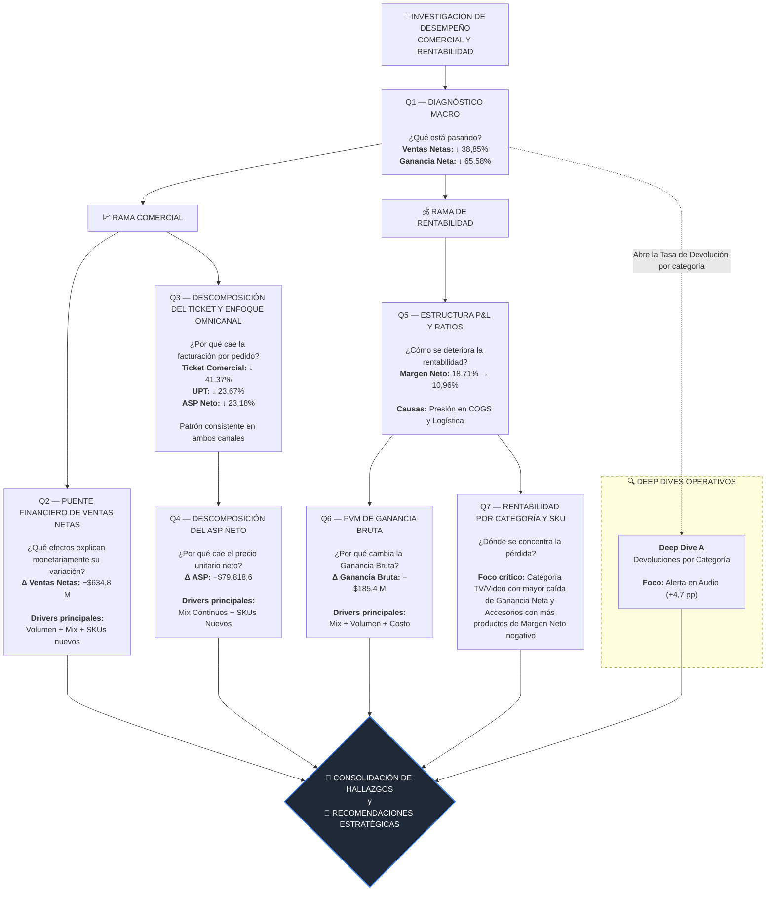

# 🔎 Investigación Analítica SQL

Esta investigación forma parte de un proyecto analítico End-to-End que se puede ver completo en: https://github.com/manticafacundoelian/dbt_elt_analytics

---

> **TL;DR:** Entre 2025 y 2026, la Ganancia Neta cayó **−65,58%**, casi el doble que las Ventas Netas (−38,85%). No es un problema de pedidos sino de Ticket Comercial —por UPT y ASP combinados— y de rentabilidad, donde la pérdida de volumen pesa más que el propio encarecimiento de costos. La investigación descarta las explicaciones más obvias —precio y descuentos, que casi se cancelan entre sí— y aísla la causa real en una sola categoría (**TV y Video**, 51,7% de toda la caída) y **3 productos puntuales**. El diagnóstico se sostiene en 3 puentes financieros con reconciliación exacta ($0,00 de residuo) y cierra con recomendaciones accionables priorizadas. [Ver Conclusiones Generales →](#-conclusiones-generales)

---

## 📌 Introducción

Esta investigación analiza la evolución comercial y económica de un retail de tecnología entre **2024 y 2026**, con el objetivo de identificar los principales factores asociados al deterioro observado en **ventas, comportamiento comercial y rentabilidad**.

El análisis parte de un **diagnóstico macro** y avanza progresivamente desde la variación agregada de las ventas hacia sus principales determinantes comerciales y económicos.

A partir de este diagnóstico, la investigación se estructura en dos grandes ramas:

* **Rama comercial:** analiza la evolución de las Ventas Netas desde una perspectiva financiera y comercial, descomponiendo monetariamente su variación y profundizando en el comportamiento del **Ticket Comercial, el UPT y el ASP**.

* **Rama de rentabilidad:** analiza el deterioro económico del negocio a través de la **estructura del P&L**, la evolución de los costos y la descomposición de la variación de la **Ganancia Bruta mediante un puente PVM ampliado (Price–Volume–Mix-Costo-Cambios en el Portfolio)**, complementando el análisis con la rentabilidad por categoría y SKU.

El objetivo no es únicamente cuantificar la caída observada, sino **reconstruir sus principales mecanismos**, desde la evolución de las ventas y el comportamiento de los clientes hasta su impacto final sobre la rentabilidad.

---

## 🗺️ Hoja de Ruta Ejecutiva & Resumen de Diagnóstico

```mermaid
flowchart TD

    A["🔎 INVESTIGACIÓN DE DESEMPEÑO<br/>COMERCIAL Y RENTABILIDAD"]

    A --> B["Q1 — DIAGNÓSTICO MACRO<br/><br/>¿Qué está pasando?<br/><b>Ventas Netas:</b> ↓ 38,85%<br/><b>Ganancia Neta:</b> ↓ 65,58%"]

    B --> C["📈 RAMA COMERCIAL"]
    B --> E["💰 RAMA DE RENTABILIDAD"]

    %% Rama Comercial: Q2 y Q3→Q4 son lentes paralelos, no secuenciales
    C --> C1["Q2 — PUENTE FINANCIERO DE VENTAS NETAS<br/><br/>¿Qué efectos explican monetariamente su variación?<br/><b>Δ Ventas Netas:</b> −$634,8 M<br/><br/><b>Drivers principales:</b><br/>Volumen + Mix + SKUs nuevos"]

    C --> C2["Q3 — DESCOMPOSICIÓN DEL TICKET Y ENFOQUE OMNICANAL<br/><br/>¿Por qué cae la facturación por pedido?<br/><b>Ticket Comercial:</b> ↓ 41,37%<br/><b>UPT:</b> ↓ 23,67%<br/><b>ASP Neto:</b> ↓ 23,18%<br/><br/>Patrón consistente en ambos canales"]

    C2 --> C3["Q4 — DESCOMPOSICIÓN DEL ASP NETO<br/><br/>¿Por qué cae el precio unitario neto?<br/><b>Δ ASP:</b> −$79.818,6<br/><br/><b>Drivers principales:</b><br/>Mix Continuos + SKUs Nuevos"]

    %% Rama de Rentabilidad: Q5 es la raíz, Q6 y Q7 son ramas paralelas
    E --> E1["Q5 — ESTRUCTURA P&L Y RATIOS<br/><br/>¿Cómo se deteriora la rentabilidad?<br/><b>Margen Neto:</b> 18,71% → 10,96%<br/><br/><b>Causas:</b> Presión en COGS y Logística"]
    
    E1 --> E2["Q6 — PVM DE GANANCIA BRUTA<br/><br/>¿Por qué cambia la Ganancia Bruta?<br/><b>Δ Ganancia Bruta:</b> −$185,4 M<br/><br/><b>Drivers principales:</b><br/>Mix + Volumen + Costo"]
    
    E1 --> E3["Q7 — RENTABILIDAD POR CATEGORÍA Y SKU<br/><br/>¿Dónde se concentra la pérdida?<br/><br/><b>Foco crítico:</b> Categoría TV/Video con mayor caída de Ganancia Neta y Accesorios con más productos de Margen Neto negativo"]

    %% El Deep Dive abre un dato ya presentado en Q1 (Tasa de Devolución)
    B -.->|Abre la Tasa de Devolución por categoría| H

    subgraph DEEP_DIVES ["🔍 DEEP DIVES OPERATIVOS"]
        H["<b>Deep Dive A</b><br/>Devoluciones por Categoría<br/><br/><b>Foco:</b> Alerta en Audio (+4,7 pp)"]
    end

    %% ==========================================
    %% EFECTO LLAVE ACOSTADA UNIFICADORA
    %% ==========================================
    C1 ---> LLAVE{" 🤝 CONSOLIDACIÓN DE HALLAZGOS<br/>y<br/>🎯 RECOMENDACIONES ESTRATÉGICAS"}
    C3 ---> LLAVE
    E2 ---> LLAVE
    E3 ---> LLAVE
    H  ---> LLAVE

    style LLAVE fill:#1f2937,stroke:#3b82f6,stroke-width:2px,color:#fff
    style DEEP_DIVES stroke-dasharray: 5 5
```

---

## 🔎 Investigación y Desarrollo

La investigación busca responder **siete preguntas principales de diagnóstico**, complementadas por **un análisis operativo de profundización (*Deep Dives*)**:

### Preguntas Core del Diagnóstico

#### ┌─ 🔹 Q1 — Diagnóstico Macro: ¿Qué cambió en el desempeño general del negocio?

<strong>Ver desarrollo de Q1</strong>
  

   

#### 🔹 Síntesis

El diagnóstico muestra, por un lado, una fuerte contracción de las Ventas Netas y del Ticket Comercial y, por otro, un deterioro de la rentabilidad que ya se había manifestado durante 2025.

 

[Ver Consulta SQL →](./sql_business_analysis/q1_diagnostico_macro_yoy.sql) 
 

#### 🔹 Resultados 

| Métrica                    |       2024 |       2025 |     YoY 2025 |       2026 |     YoY 2026 |
| :------------------------- | ---------: | ---------: | -----------: | ---------: | -----------: |
| **Pedidos**                |      1.365 |      1.581 |  **+15,82%** |      1.649 |   **+4,30%** |
| **Ventas Brutas**          | $1.316,5 M | $1.684,4 M |  **+27,95%** | $1.064,0 M |  **−36,83%** |
| **Tasa de Descuento (%)**  |      1,98% |      3,00% | **+1,02 pp** |      6,10% | **+3,10 pp** | 
| **Ventas Netas**           | $1.290,5 M | $1.633,9 M |  **+26,62%** |   $999,1 M |  **−38,85%** |
| Devoluciones ($)           |    $37,2 M |    $53,7 M |  **+44,45%** |    $70,3 M |  **+30,90%** |
| **Tasa de Devolución (%)** |      2,88% |      3,28% | **+0,40 pp** |      7,03% | **+3,75 pp** |
| **Ventas Netas Finales**   | $1.253,3 M | $1.580,3 M |  **+26,09%** |   $928,9 M |  **−41,22%** |
| **Ganancia Neta**          |   $300,1 M |   $295,7 M |   **−1,47%** |   $101,8 M |  **−65,58%** |
| **Margen Neto (%)**        |     23,95% |     18,71% | **−5,24 pp** |     10,96% | **−7,75 pp** |
| **Ticket Comercial**       |   $945.397 | $1.033.477 |   **+9,32%** |   $605.891 |  **−41,37%** |

> *Nota: El Ticket Comercial se calcula sobre Ventas Netas, antes de devoluciones, para analizar el comportamiento comercial de las órdenes independientemente de las devoluciones posteriores.*

#### 🔹 Hallazgos

#### Diagnóstico Comercial

**1. Crecimiento en pedidos con caída de facturación**

En 2026 se registraron **1.649 pedidos (+4,30% YoY)**, mientras que las Ventas Netas cayeron un **−38,85%**.

**2. Contracción del Ticket Comercial**

La caída de ingresos se acompaña de una reducción significativa del ticket promedio, que disminuyó un **−41,37%**, pasando de **$1.033.477 a $605.891**.

**3. Mayor incidencia de devoluciones**

La Tasa de Devolución aumentó de **3,28% a 7,03% (+3,75 pp)**, profundizando la caída de las Ventas Netas Finales hasta un **−41,22%**.

#### Diagnóstico de Rentabilidad

**4. La ganancia cae más que las ventas**

En 2026, la Ganancia Neta cayó un **−65,58%**, frente a una caída del **−38,85%** en Ventas Netas. Como consecuencia, el Margen Neto se redujo del **18,71% al 10,96% (−7,75 pp)**.

**5. Deterioro de rentabilidad previo**

El problema de rentabilidad antecede a la caída de facturación de 2026. En 2025, a pesar de un crecimiento del **+26,62%** en Ventas Netas, la Ganancia Neta cayó un **−1,47%** y el Margen Neto perdió **−5,24 pp**.

 

#### 🔹 Puente analítico → Ramas Comercial y de Rentabilidad

El diagnóstico muestra, por un lado, una fuerte contracción de las **Ventas Netas** (−38,85%) y, por otro, una caída de la **Ganancia Neta** proporcionalmente mayor (−65,58%). Estas dos variables abren dos líneas de indagación independientes:

**La Rama Comercial (Q2–Q4)** cuantifica monetariamente esta caída y profundiza en cómo se manifestó en el comportamiento por pedido — Ticket, UPT y ASP.

**La Rama de Rentabilidad (Q5–Q7)** analiza la estructura de costos y descompone la Ganancia Bruta para explicar por qué el resultado económico se deterioró más que las ventas.

 

#### ├─ 🔹 Q2 — Puente Financiero de Ventas Netas: ¿Qué efectos explican monetariamente su variación?

<strong>Ver desarrollo de Q2</strong>
  

 

#### 🔹 Síntesis

La variación de las **Ventas Netas** se atribuye principalmente a los efectos de **Volumen, Mix de SKUs continuos y cambios en el portafolio**, que concentraron los principales impactos negativos del período.

El **Precio de Lista** actuó como factor de compensación parcial, mientras que los **Descuentos** profundizaron la variación negativa.

 

[Ver Consulta SQL →](./sql_business_analysis/q2_puente_ventas_netas.sql) 
 

#### 🔹 Resultados

El puente descompone la variación de las **Ventas Netas entre 2025 y 2026** mediante efectos de **Volumen, Mix de SKUs continuos, Precio de Lista, Descuentos y cambios en el portafolio**.

| Efecto                        | Impacto 2025 → 2026 |
| :---------------------------- | ------------------: |
| **Variación de Ventas Netas** |       **−$634,8 M** |
| Volumen                       |           −$333,3 M |
| Mix — SKUs continuos          |           −$204,7 M |
| Precio de Lista               |            +$48,3 M |
| Descuentos                    |            −$34,3 M |
| SKUs nuevos                   |           −$110,8 M |
| SKUs descontinuados           |              $0,0 M |
| **Residuo**                   |          **$0,0 M** |

> *Nota: El puente descompone la variación de Ventas Netas entre 2025 y 2026 en efectos de **Volumen, Mix de SKUs continuos, Precio, Descuentos y altas/bajas de productos**. El residuo de $0 confirma la conciliación exacta del puente.*

#### 🔹 Hallazgos

#### Principales impulsores de la caída

**1. El Volumen concentra el mayor impacto negativo**

El efecto Volumen explica una reducción de **$333,3 M** en las Ventas Netas, siendo el principal componente negativo del puente.

**2. El Mix de productos profundiza la contracción**

El Mix de los **SKUs continuos** aportó un impacto negativo de **$204,7 M**, indicando un cambio desfavorable en la composición de las ventas entre los productos que permanecieron activos en ambos períodos.

**3. Los SKUs nuevos no compensaron la pérdida del negocio existente**

Los productos incorporados en 2026 generaron un impacto de **−$110,8 M** bajo la metodología del puente, por lo que su incorporación no compensó los efectos negativos provenientes del volumen y del mix.

#### Factores de compensación

**4. El aumento del Precio de Lista compensó parcialmente la caída**

El efecto Precio de Lista aportó **+$48,3 M**, funcionando como un factor de compensación frente a los principales impactos negativos.

**5. Los Descuentos profundizaron la contracción**

El efecto Descuentos tuvo un impacto de **−$34,3 M**, reduciendo parcialmente el beneficio generado por el aumento de los precios de lista.

 

#### 🔹 Puente analítico → Q3

Este puente cuantifica en pesos la variación total de las Ventas Netas: cuánto explica el volumen, el mix y la renovación del portafolio.

**Q3 ofrece una lectura complementaria del mismo fenómeno**, esta vez en términos de comportamiento por pedido — Ticket Comercial, UPT y ASP —, para observar la caída desde la unidad económica con la que opera el negocio día a día, no solo desde el monto agregado.

 

#### ├─ 🔹 Q3 — Descomposición del Ticket y Comportamiento Omnicanal: ¿Por qué cae la facturación por pedido?

<strong>Ver desarrollo de Q3</strong>
  

 

#### 🔹 Síntesis

La **facturación por pedido cayó** entre 2025 y 2026 porque los clientes compraron **menos unidades por pedido** y cada unidad generó un **menor valor promedio**, dando como resultado una caída del Ticket Comercial.

Ambos fenómenos se reprodujeron transversalmente en **Online y Físico**, lo que indica que el deterioro responde principalmente a un **cambio en el comportamiento comercial**, más que a un problema asociado exclusivamente a un canal.

 

#### 🔸 Q3.1 — Descomposición del Ticket (UPT vs. ASP)

[Ver Consulta SQL →](./sql_business_analysis/q3.1_descomposicion_ticket.sql) 
 

#### 🔹 Resultados

| Métrica                       |       2024 |       2025 |    YoY 2025 |     2026 |    YoY 2026 |
| :---------------------------- | ---------: | ---------: | ----------: | -------: | ----------: |
| **Pedidos**                   |      1.365 |      1.581 | **+15,82%** |    1.649 |  **+4,30%** |
| **Unidades Totales**          |      3.946 |      4.746 | **+20,27%** |    3.778 | **−20,41%** |
| **Ventas Netas**              | $1.290,5 M | $1.633,9 M | **+26,62%** | $999,1 M | **−38,85%** |
| **Unidades por Pedido (UPT)** |       2,89 |       3,00 |  **+3,81%** |     2,29 | **−23,67%** |
| **ASP Comercial**             |   $327.032 |   $344.275 |  **+5,27%** | $264.456 | **−23,18%** |
| **Ticket Comercial**          |   $945.397 | $1.033.477 |  **+9,32%** | $605.891 | **−41,37%** |

> *Nota: **Ticket Comercial = UPT × ASP**, donde UPT representa las unidades promedio por pedido y ASP el valor promedio por unidad.*

#### 🔹 Hallazgos

**1. El ticket cae por dos vías simultáneas**

Entre 2025 y 2026, el Ticket Comercial disminuyó **41,37%**. La descomposición muestra una caída prácticamente equivalente en sus dos componentes: **UPT −23,67%** y **ASP −23,18%**.

Esto indica que en 2026 los clientes compraron **menos unidades por pedido y, además, a un menor valor promedio por unidad**.

 

#### 🔸 Q3.2 — Comportamiento Omnicanal

[Ver Consulta SQL →](./sql_business_analysis/q3.2_comportamiento_omnicanal.sql) 
 

#### 🔹 Resultados

| Canal | Pedidos 2025 | Pedidos 2026 | YoY Pedidos | Part. Pedidos 2025 | Part. Pedidos 2026 | Ticket 2025 | Ticket 2026 | YoY Ticket | ASP 2025 | ASP 2026 | YoY ASP | Tasa Descto. 2025 | Tasa Descto. 2026 | Δ Descto. (pp) |
| --- | --- | --- | --- | --- | --- | --- | --- | --- | --- | --- | --- | --- | --- | --- |
| **Online** | 1.116 | 1.318 | **+18,10%** | 70,59% | 79,93% | $1.055.898 | $602.436 | **−42,95%** | $349.876 | $263.879 | **−24,58%** | 2,98% | 6,04% | **+3,06 pp** |
| **Físico** | 465 | 331 | **−28,82%** | 29,41% | 20,07% | $979.667 | $619.651 | **−36,75%** | $330.584 | $266.716 | **−19,32%** | 3,03% | 6,31% | **+3,29 pp** |

#### 🔹 Hallazgos

**1. El deterioro del ticket se reproduce en ambos canales**

El Ticket Comercial cayó **42,95% en Online** y **36,75% en Físico**. La magnitud es diferente, pero el patrón es consistente: **ambos canales pierden valor por pedido**.

**2. UPT y ASP caen simultáneamente en ambos canales**

En Online, el UPT disminuyó **24,35%** y el ASP **24,58%**. En Físico, las caídas fueron de **21,60%** y **19,32%**, respectivamente.

Esto refuerza el hallazgo de Q3.1: la contracción del ticket no responde a un único componente ni a un único canal.

**3. El mix de canales cambia, pero no explica por sí solo el deterioro**

La participación de Online aumentó de **70,59% a 79,93%**, mientras Físico cayó de **29,41% a 20,07%**. Sin embargo, el ticket se deterioró dentro de **ambos canales**, por lo que el cambio de participación no explica por sí solo la caída del ticket total.

**4. Los descuentos aumentaron en ambos canales de manera similar**

La tasa de descuento aumentó **+3,06 pp en Online** y **+3,29 pp en Físico**.

 

#### 🔹 Puente analítico → Q4

Q3 identifica **qué está pasando con el valor por pedido**: los clientes compran menos unidades y cada unidad genera un menor valor promedio.

**Q4 profundiza el segundo componente —el ASP Neto— para determinar qué factores explican la caída del valor promedio por unidad.**

 

#### ├─ 🔹 Q4 — Descomposición del ASP Neto: ¿Por qué cae el valor promedio por unidad?

<strong>Ver desarrollo de Q4</strong>
  

 

#### 🔹 Síntesis

La caída del **ASP** responde principalmente a un cambio en la **composición de los productos vendidos** y a la incorporación de **SKUs nuevos con valores unitarios inferiores al promedio previo**.

Los efectos de **Precio de Lista y Descuentos** tuvieron un impacto secundario en términos netos, por lo que el deterioro del valor promedio por unidad se concentra principalmente en el **mix y la renovación del portafolio**.

 

#### 🔸 Q4.1 — Puente Agregado (Mix + Precio + Descuento + Nuevos + Descontinuados)

[Ver Consulta SQL →](./sql_business_analysis/q4_1_descomposicion_asp_agregada.sql) 
 

#### 🔹 Resultados

| Métrica                    |       2025 |       2026 |            Δ |
| :-------------------------- | ---------: | ---------: | -----------: |
| **ASP Comercial**           |   $344.275 |   $264.456 | **−$79.819** |
| **SKUs Continuos**          |         37 |         37 |             — |
| **SKUs Nuevos**             |          — |         11 |             — |
| **SKUs Descontinuados**     |          0 |          — |             — |

**Descomposición del Δ ASP ($79.819 de caída):**

| Efecto                          |    Impacto ($) | % del Δ Total |
| :------------------------------- | --------------: | -------------: |
| **Mix (SKUs continuos)**         |     −$54.180,70 |    **67,9%** |
| **SKUs Nuevos**                  |     −$29.328,29 |    **36,7%** |
| **Precio**                       |      $12.778,52 |   **−16,0%** |
| **Descuentos**                   |      −$9.088,17 |    **11,4%** |
| **SKUs Descontinuados**          |           $0,00 |        0,0% |
| **Chequeo de Residuo y % Total**   |     **$0,00** ✅ |      100,0% |

> *Nota metodológica: el efecto Mix se valúa a precio del año base (2025) y los efectos Precio y Descuento se ponderan con el volumen del año actual (2026). Esta convención asegura que el puente cierre exacto (residuo $0), a costa de que la interacción entre cambio de mix y cambio de precio quede incluida dentro del efecto Precio.*

#### 🔹 Hallazgos

**1. La caída del ASP es principalmente un problema de mix, no de precios**

El efecto **Mix explica el 67,9%** de la caída, y los **SKUs Nuevos otro 36,7%**. Juntos superan el 100% del Δ, porque **Precio (+$12.778,52) y Descuento (−$9.088,17) casi se cancelan entre sí** (saldo neto: +$3.690,35). En otras palabras: la política de precios y descuentos, en neto, no explica la caída; el problema está en qué se vendió, no en cuánto se cobró por lo mismo.

**2. No hubo bajas de catálogo**

Los **0 SKUs descontinuados** confirman que toda la caída se explica por mix y por lanzamientos, no por pérdida de líneas existentes.

 

#### 🔸 Q4.2 — Puente por Categoría

[Ver Consulta SQL →](./sql_business_analysis/q4_2_descomposicion_asp_categoria.sql) 
 

#### 🔹 Resultados

| Categoría | Unid. 2025 | Unid. 2026 | Part. 2025 | Part. 2026 | Δ Part. (pp) | Mix | Precio | Descuento | Nuevos | Total | % contribución al Δ ASP |
| :--- | ---: | ---: | ---: | ---: | ---: | ---: | ---: | ---: | ---: | ---: | ---: |
| **TV y Video** | 791 | 402 | 16,67% | 10,64% | **−6,03** | −40.717,38 | 5.642,40 | −4.004,87 | 0,00 | **−39.079,85** | **49,0%** |
| **Computación** | 767 | 690 | 16,16% | 18,26% | +2,10 | −15.885,31 | 1.348,05 | −971,26 | −17.671,74 | **−33.180,25** | **41,6%** |
| **Telefonía** | 259 | 102 | 5,46% | 2,70% | −2,76 | −13.908,97 | 830,43 | −300,51 | 438,49 | **−12.940,57** | **16,2%** |
| **Audio** | 707 | 862 | 14,90% | 22,82% | +7,92 | 3.587,54 | 2.000,85 | −1.397,46 | −9.056,35 | **−4.865,42** | **6,1%** |
| **Accesorios** | 1.222 | 782 | 25,75% | 20,70% | −5,05 | 338,66 | 1.115,33 | −851,29 | −3.038,69 | **−2.435,99** | **3,1%** |
| **Hogar** | 1.000 | 940 | 21,07% | 24,88% | +3,81 | 12.404,76 | 1.841,45 | −1.562,78 | 0,00 | **+12.683,43** | **−15,9%** |
| **Total (chequeo)** | — | — | — | — | — | — | — | — | — | **−79.818,65** ✅ | 100,0% |

#### 🔹 Hallazgos

**1. Dos categorías explican el 90,6% de la caída, por mecanismos opuestos**

**TV y Video** (−49,0%) presenta una caída dominada por el efecto Mix: perdió 6 puntos de share, sin ningún SKU nuevo, y ni precio ni descuento lo compensan. **Computación** (−41,6%), en cambio, **ganó participación** (+2,10 pp) pero ven presionado su ASP por la incorporación de SKUs nuevos, que entraron por debajo del promedio (−$17.671,74). El mismo patrón se repite en **Audio**, que ganó +7,92 pp de share (la mayor suba de todas) y aun así cae, arrastrada por sus lanzamientos.

**2. Hogar es la única categoría que empuja el ASP hacia arriba**

Ganó share (+3,81 pp) con mix positivo (+$12.404,76) y sin lanzamientos, el espejo exacto de TV y Video.
 

#### 🔸 Q4.3 — Bridge por SKU (Detalle y Ranking de Impacto)

[Ver Consulta SQL →](./sql_business_analysis/q4_3_descomposicion_asp_sku.sql) 
 

#### 🔹 Resultados — Top 5 Mayor Impacto Negativo

| Producto | Categoría | Estado | Δ Part. (pp) | Mix | Precio | Descuento | Nuevos | Total |
| :--- | :--- | :--- | ---: | ---: | ---: | ---: | ---: | ---: |
| TCL Monitor TV 21 | TV y Video | Continuo | −2,616 | −20.173,53 | 2.265,13 | −1.530,49 | 0,00 | **−19.438,89** |
| Acer Memoria RAM 2 | Computación | Continuo | −3,132 | −11.108,52 | 197,11 | −95,52 | 0,00 | **−11.006,93** |
| Lenovo Mouse 1 | Computación | Continuo | −4,073 | −10.436,40 | 332,19 | −189,48 | 0,00 | **−10.293,69** |
| TCL Chromecast 25 | TV y Video | Continuo | −1,342 | −9.111,00 | 1.173,26 | −905,27 | 0,00 | **−8.843,01** |
| Acer Notebook 7 | Computación | Nuevo 2026 | +4,579 | 0,00 | 0,00 | 0,00 | −8.347,11 | **−8.347,11** |

#### 🔹 Resultados — Top 5 Mayor Impacto Positivo

| Producto | Categoría | Estado | Δ Part. (pp) | Mix | Precio | Descuento | Nuevos | Total |
| :--- | :--- | :--- | ---: | ---: | ---: | ---: | ---: | ---: |
| Liliana Cafetera 46 | Hogar | Continuo | +6,315 | 12.338,22 | 1.171,32 | −1.043,51 | 0,00 | **12.466,03** |
| ASUS Webcam 6 | Computación | Continuo | +1,167 | 7.423,10 | 406,13 | −391,52 | 0,00 | **7.437,70** |
| Philips Barra de Sonido 28 | Audio | Continuo | +0,013 | 3.595,60 | 793,89 | −469,45 | 0,00 | **3.920,04** |
| Samsung Monitor TV 23 | TV y Video | Continuo | +0,365 | 3.313,49 | 487,24 | −353,18 | 0,00 | **3.447,55** |
| Logitech Funda 40 | Accesorios | Continuo | +0,561 | 1.273,05 | 121,81 | −90,70 | 0,00 | **1.304,16** |

> *Detalle completo de los 48 SKUs disponible en la salida de la consulta SQL vinculada arriba.*

#### 🔹 Hallazgos

**1. El impacto está muy concentrado, y el caso extremo confirma Q3.2**

Los 5 productos de mayor impacto negativo explican el **72,6%** de la caída total. El más extremo, **TCL Monitor TV 21**, perdió más de la mitad de sus unidades (295 → 136) y explica por sí solo el **24,4%** de la caída del ASP — la manifestación a nivel producto de la pérdida de mix que ya vimos en TV y Video.  
 

#### 🔹 Puente analítico → Cierre de la Rama Comercial

Q4 completa el diagnóstico comercial: la caída del ASP se explica principalmente por **Mix** y por la incorporación de **SKUs nuevos a precios por debajo del promedio**, no por la política de precios o descuentos.

Con esto, la **Rama Comercial queda completa**. La **Rama de Rentabilidad (Q5–Q7)**, abierta en paralelo desde el diagnóstico inicial, analiza cómo estos mismos fenómenos de ventas se tradujeron en el deterioro del resultado económico.

 

#### ├─ 🔹 Q5 — Estructura de Rentabilidad y Ratios P&L: ¿Cómo se deterioró la rentabilidad?

<strong>Ver desarrollo de Q5</strong>
  

 

#### 🔹 Síntesis

La rentabilidad se deterioró por una **mayor presión del Costo de Ventas sobre el ingreso retenido**, acompañada por un incremento del peso de los **costos logísticos**.

El problema no comienza en 2026: ya durante 2025 el crecimiento de las ventas dejó de traducirse en una mejora equivalente de la **Ganancia Bruta y el Margen Neto**.

 

[Ver Consulta SQL →](./sql_business_analysis/q4_rentabilidad_ratios_pnl.sql)  

#### 🔹 Resultados

| Métrica                      |       2024 |       2025 |     YoY 2025 |     2026 |     YoY 2026 |
| :--------------------------- | ---------: | ---------: | -----------: | -------: | -----------: |
| **Ventas Netas Finales**     | $1.253,3 M | $1.580,3 M |  **+26,09%** | $928,9 M |  **−41,22%** |
| **Costo de Ventas**          |   $943,1 M | $1.270,0 M |  **+34,60%** | $804,0 M |  **−36,69%** |
| **Costo de Ventas / VNF** |     75,25% |     80,37% | **+5,12 pp** |   86,56% | **+6,19 pp** |
| **Ganancia Bruta**           |   $310,2 M |   $310,2 M |   **−0,01%** | $124,9 M |  **−59,75%** |
| **Margen Bruto**             |     24,75% |     19,63% | **−5,12 pp** |   13,44% | **−6,19 pp** |
| **Costo Logístico / VNF** |      0,81% |      0,92% | **+0,11 pp** |    2,49% | **+1,57 pp** |
| **Ganancia Neta**            |   $300,1 M |   $295,7 M |   **−1,47%** | $101,8 M |  **−65,58%** |
| **Margen Neto**              |     23,95% |     18,71% | **−5,24 pp** |   10,96% | **−7,75 pp** |

> Para el análisis de rentabilidad se toma como base la **Venta Neta Final**, es decir, la venta después de devoluciones aprobadas. Esta decisión busca medir la rentabilidad sobre el **ingreso económico efectivamente retenido por la empresa**.

#### 🔹 Hallazgos

**1. El costo de ventas absorbe una proporción cada vez mayor de las Ventas Netas Finales**

Entre 2025 y 2026, el **Costo de Ventas / Ventas** aumentó **6,19 pp**, pasando de 80,37% a 86,56%.

Como consecuencia, el **Margen Bruto** se redujo en la misma magnitud, de 19,63% a 13,44%.

El deterioro resulta especialmente relevante porque entre 2024 y 2025 las ventas habían crecido **26,09%**, pero la **Ganancia Bruta permaneció prácticamente sin cambios**, pasando de $310,2 M a $310,2 M.

**2. La presión logística se intensifica en 2026**

El **Costo Logístico / Ventas** pasó de 0,92% en 2025 a 2,49% en 2026, un aumento de **1,57 pp**.

Aunque su peso es significativamente menor que el del Costo de Ventas, la mayor carga logística reduce todavía más la rentabilidad una vez deteriorado el margen bruto.

**3. La rentabilidad cae mucho más que las ventas**

Entre 2025 y 2026, las **Ventas Netas Finales disminuyeron 41,22%**, mientras que la **Ganancia Neta cayó 65,58%**.

En consecuencia, el **Margen Neto** pasó de 18,71% a 10,96%, una reducción de **7,75 pp**.

El deterioro no responde únicamente a una menor escala de ventas: una proporción creciente de las **Ventas Netas Finales** es absorbida por el **Costo de Ventas**, mientras que el **Costo Logístico** agrega una presión adicional sobre el resultado final.

El siguiente paso es determinar cuánto del deterioro de la **Ganancia Bruta** corresponde a cada componente económico.

 

#### 🔹 Puente analítico → Q6

Q5 muestra que el deterioro de 2026 combina una fuerte contracción de las ventas, **como demostró la Rama Comercial**, con un aumento del peso del **Costo de Ventas**, que comprimió el **Margen Bruto hasta 13,44%** y redujo la **Ganancia Bruta un 59,75%**.

**Q6 descompone esta caída de la Ganancia Bruta mediante un PVM formal —Volumen → Mix → Precio → Costo → Nuevos Lanzamientos → Descontinuados**, para cuantificar qué componentes explican el deterioro entre 2025 y 2026.

 

#### ├─ 🔹 Q6 — PVM: ¿Qué componentes explican la caída de la Ganancia Bruta?

<strong>Ver desarrollo de Q6</strong>
  

 

#### 🔹 Síntesis

La **Ganancia Bruta se deterioró principalmente por una menor contribución del negocio existente**, combinando una fuerte caída del **Volumen** con un deterioro del **Costo**, mientras que el Mix también aportó negativamente. Los efectos de **Precio y Lanzamientos** compensaron solo parcialmente esta pérdida.

El análisis por categoría muestra que **TV y Video concentra la mayor parte del deterioro**, mientras que Audio presenta un comportamiento particular: el crecimiento de sus lanzamientos oculta una caída importante en el negocio continuo.

A nivel SKU, la pérdida se encuentra **fuertemente concentrada en un grupo reducido de productos continuos**, liderados por TCL Monitor TV 21 y TCL Chromecast 25. En contraste, los lanzamientos de 2026 actuaron en conjunto como un **contrapeso positivo**.

En conjunto, Q6 muestra que el deterioro de la Ganancia Bruta no proviene principalmente de los nuevos productos, sino de la **pérdida de volumen y rentabilidad del portafolio existente**, especialmente en determinados productos y categorías.

 

#### 🔸 Q6.1 — PVM Consolidado: ¿Qué explica la variación total?

[Ver Consulta SQL →](./sql_business_analysis/q6_1_pvm_consolidado.sql)  

#### 🔹 Resultados

| Factor              | Efecto sobre la Ganancia Bruta | Participación |
| :------------------ | ------------------------------: | -------------: |
| **Volumen**         |                       −$122,44 M |     **66,05%** |
| **Mix**             |                        −$23,41 M |     **12,63%** |
| **Precio**          |                         +$9,88 M |     **−5,33%** |
| **Costo**           |                        −$64,56 M |     **34,83%** |
| **Lanzamientos**    |                        +$15,17 M |     **−8,19%** |
| **Discontinuados**  |                           $0,0 M |         0,00% |
| **Variación total** |                     **−$185,36 M** |   **100,00%** |

**Ganancia Bruta 2025:** $310,22 M
**Ganancia Bruta 2026:** $124,86 M
**Variación:** **−$185,36 M**

> Este PVM explica la variación de la Ganancia Bruta, no de la Ganancia Neta. El rol del costo logístico en el deterioro de la Ganancia Neta se analiza a nivel consolidado en Q4 y a nivel categoría en Q6.2.*
> *Nota metodológica: el efecto "Precio" es Precio Realizado (ventas netas de descuento y de devoluciones, dividido por unidades efectivas), por lo que incorpora tanto la política de descuentos como el impacto de reembolsos. La apertura granular entre Precio de Lista y Descuento se realiza en Q3, sobre ventas comerciales antes de devolución. Los efectos Volumen y Mix se calculan sobre el universo de SKUs continuos exclusivamente, para aislar el comportamiento del negocio existente de la entrada de nuevos lanzamientos.*

#### 🔹 Hallazgos

**1. La caída es, ante todo, un problema de volumen del negocio existente**

El efecto **Volumen explica el 66,05%** de la caída — más del doble que Mix (12,63%). La reducción de Ganancia Bruta no es principalmente un cambio en qué se vende, sino una **caída real en la cantidad vendida** de los productos que la empresa ya tenía en catálogo.

**2. El Costo es el segundo factor más relevante; Precio y Lanzamientos compensan solo parcialmente**

El efecto **Costo (−$64,56 M, 34,83%)** confirma que, además de vender menos, el margen unitario de los productos continuos se deterioró por el lado del costo de reposición. Precio (+$9,88 M) y Lanzamientos (+$15,17 M) compensan en conjunto apenas el 13,5% de la caída.

#### 🔹 Reconciliación

**−$122,44 M − $23,41 M + $9,88 M − $64,56 M + $15,17 M = −$185,36 M**

Diferencia de reconciliación: **$0,00** ✅

 

#### 🔸 Q6.2 — PVM por Categoría: ¿Dónde se concentra el deterioro?

[Ver Consulta SQL →](./sql_business_analysis/q6_2_pvm_por_categoria.sql)  

#### 🔹 Resultados

| Categoría       | SKUs | Unid. 2025 | Unid. 2026 |      Volumen |          Mix |     Precio |        Costo | Lanzamientos | Discontinuados |     Efecto PVM | % del Δ Total |
| :-------------- | ---: | ---------: | ---------: | -----------: | -----------: | ---------: | -----------: | -----------: | -------------: | -------------: | ------------: |
| **TV y Video**  |    7 |        764 |        375 |    −$56,15 M |    −$19,37 M |   +$4,38 M |    −$29,74 M |       $0,0 M |         $0,0 M | **−$100,88 M** |    **54,42%** |
| **Computación** |   10 |        741 |        647 |    −$24,27 M |     −$8,28 M |   +$0,90 M |     −$5,96 M |     +$5,26 M |         $0,0 M |  **−$32,34 M** |    **17,44%** |
| **Telefonía**   |    6 |        248 |         94 |    −$12,54 M |     −$7,15 M |   +$1,50 M |     −$4,03 M |     +$0,15 M |         $0,0 M |  **−$22,07 M** |    **11,90%** |
| **Accesorios**  |   10 |      1.183 |        734 |     −$7,10 M |     +$0,22 M |   +$0,72 M |     −$5,82 M |     +$0,66 M |         $0,0 M |  **−$11,32 M** |     **6,10%** |
| **Audio**       |    8 |        682 |        791 |    −$12,76 M |     +$2,61 M |   +$1,58 M |    −$10,37 M |     +$9,10 M |         $0,0 M |   **−$9,84 M** |     **5,31%** |
| **Hogar**       |    7 |        968 |        894 |     −$9,62 M |     +$8,55 M |   +$0,81 M |     −$8,65 M |       $0,0 M |         $0,0 M |   **−$8,92 M** |     **4,81%** |
| **Total**       |   48 |      4.586 |      3.535 |   −$122,44 M |    −$23,41 M |   +$9,88 M |    −$64,56 M |    +$15,17 M |         $0,0 M | **−$185,36 M** |     **100%** |

#### 🔹 Hallazgos

**1. TV y Video concentra más de la mitad de la caída, y es puramente un problema de volumen**

Con **−$100,88 M (54,4%)**, TV y Video es la categoría más golpeada por lejos. Su efecto Volumen (**−$56,15 M**) representa el **45,9% de todo el efecto Volumen de la empresa**, sin ningún lanzamiento que lo compense.

**2. Audio crece en unidades totales, pero su negocio base se derrumba**

Audio pasa de 682 a 791 unidades (+16%), pero registra un efecto Volumen de **−$12,76 M**, el segundo más negativo. Esto solo se explica porque sus **Lanzamientos (+$9,10 M, el mayor de todas las categorías)** ocultan una caída fuerte en sus productos continuos — el mismo patrón identificado en Q3.

**3. Hogar es la única categoría con Mix positivo**

Con **+$8,55 M**, sin lanzamientos que lo expliquen — es enteramente producto de una mejor composición entre sus SKUs continuos, el espejo de TV y Video.

#### 🔹 Reconciliación por categoría

La suma de los efectos PVM de todas las categorías reproduce, al centavo, la variación consolidada: **−$185,36 M** ✅

 

#### 🔸 Q6.3 — PVM por SKU: ¿Qué productos explican el deterioro?

[Ver Consulta SQL →](./sql_business_analysis/q6_3_pvm_por_sku.sql)  

#### 🔹 Resultados — Top 8 Mayor Impacto Negativo

| Producto              | Categoría   | Estado   | Unid. 2025→2026 |   Efecto PVM |
| :--------------------- | :---------- | :------- | :--------------- | -----------: |
| TCL Monitor TV 21      | TV y Video  | Continuo | 283 → 126        | **−$44,79 M** |
| TCL Chromecast 25      | TV y Video  | Continuo | 176 → 83         | **−$26,87 M** |
| Acer Memoria RAM 2     | Computación | Continuo | 212 → 53         | **−$21,19 M** |
| TCL Monitor TV 19      | TV y Video  | Continuo | 83 → 35          | **−$14,23 M** |
| Lenovo Mouse 1         | Computación | Continuo | 318 → 102        | **−$12,70 M** |
| Samsung Smart TV 20    | TV y Video  | Continuo | 114 → 35         |  **−$9,93 M** |
| ASUS Notebook 5        | Computación | Continuo | 150 → 73         |  **−$7,16 M** |
| Samsung Smartphone 14  | Telefonía   | Continuo | 56 → 13          |  **−$6,71 M** |

#### 🔹 Resultados — Top 5 Mayor Impacto Positivo

| Producto                    | Categoría   | Estado   | Unidades 2026 |  Efecto PVM |
| :--------------------------- | :---------- | :------- | -------------: | ----------: |
| Philips Equipo de Audio 30   | Audio       | Nuevo    |            112 | **+$7,63 M** |
| ASUS Webcam 6                | Computación | Continuo |             56 | **+$5,22 M** |
| Sony Equipo de Audio 33      | Audio       | Nuevo    |            142 | **+$3,51 M** |
| Acer Notebook 7              | Computación | Nuevo    |            166 | **+$2,83 M** |
| HP Mouse 10                  | Computación | Nuevo    |            118 | **+$2,37 M** |

> *Detalle completo de los 48 SKUs disponible en la salida de la consulta SQL vinculada arriba. Las unidades en Q5 son efectivas, después de devoluciones, por lo que pueden diferir de Q3.*

#### 🔹 Hallazgos

**1. Los principales impactos negativos están concentrados en productos ya existentes**

Los 8 SKUs con mayor impacto negativo son **todos "Continuo"** — ningún lanzamiento aparece entre ellos. Los dos principales, **TCL Monitor TV 21** y **TCL Chromecast 25**, generan conjuntamente **−$71,66 M (38,7% de toda la caída)**, y son los mismos dos productos identificados como el mayor problema del ASP en Q3 — la pérdida de volumen no solo bajó el precio promedio, fue también el principal destructor de Ganancia Bruta.

**2. Los lanzamientos son el principal contrapeso, no el problema**

Los 5 mayores efectos positivos incluyen **3 lanzamientos de 2026** (Philips Equipo de Audio 30, Sony Equipo de Audio 33, Acer Notebook 7), que en conjunto aportan +$13,97 M. Ningún lanzamiento aparece entre los peores SKUs.

**3. El PVM separa volumen de otros efectos: el caso de ASUS Webcam 6**

**ASUS Webcam 6**, un producto continuo, triplicó sus unidades (19→56) y eso le permitió compensar sus propios efectos negativos de Mix, Precio y Costo, cerrando con un PVM total de **+$5,22 M** — el único SKU continuo entre los 5 mejores.  

 

#### 🔹 Puente analítico → Q7

El PVM identifica los mecanismos detrás de la caída de la Ganancia Bruta (Volumen y Costo como principales drivers negativos, agravados por Mix, y parcialmente compensados por Precio y Lanzamientos), completando el diagnóstico de las dos ramas de la investigación: Comercial (Q1-Q3) y Rentabilidad (Q4-Q5).

**Q7 evalúa cómo se traduce este deterioro en la salud actual de cada categoría y producto**, midiendo su margen presente, el escalón de costo donde se pierde rentabilidad, y qué SKUs son responsables — antes de cerrar la investigación con las Conclusiones Generales.

 

#### └─ 🔹 Q7 — Rentabilidad por Categoría y Producto: ¿Dónde se genera (o se pierde) la Ganancia Neta hoy?

<strong>Ver desarrollo de Q7</strong>
  

 

#### 🔹 Síntesis

Q7 muestra **dónde se materializa actualmente el deterioro de la rentabilidad**, tanto a nivel de categoría como de producto.

A nivel categoría, **TV y Video concentra la mayor pérdida de Ganancia Neta**, mientras que **Accesorios presenta el deterioro relativo más severo**, asociado a una fuerte presión simultánea del COGS y del costo logístico.

A nivel SKU, la pérdida se concentra en un **grupo reducido de productos con Margen Neto negativo**, incluyendo tanto productos continuos como algunos lanzamientos de 2026. Esto permite identificar los puntos concretos donde el deterioro de rentabilidad requiere mayor atención.

 

#### 🔸 Q7.1 — Rentabilidad por Categoría: Margen, Resultado y Tendencia

[Ver Consulta SQL →](./sql_business_analysis/q7_1_rentabilidad_categoria.sql)  

#### 🔹 Resultados

| Categoría        | Ganancia Neta 2026 | Var. Ganancia Neta | % de la Caída Total | COGS/VNF 2026 | Δ COGS (pp) | Logística/VNF 2026 | Δ Logística (pp) | Margen Neto 2026 | Δ Margen (pp) | Margen 2° Sem. 2026 | Participación Gan. Neta 2026 |
| :--------------- | -----------------: | -----------------: | ------------------: | ------------: | ----------: | -----------------: | ---------------: | ------------: | ------------: | ------------------: | ---------------------------: |
| **TV y Video**   |           $38,36 M |           −72,32% |           **51,68%**|        89,16% |       +6,47 |              0,79% |            +0,34 |           10,05% |         −6,81 |          **−1,04%** |                   **37,70%** |
| **Computación**  |           $25,38 M |           −57,08% |           **17,40%**|        78,81% |       +4,98 |              2,75% |            +1,74 |           18,45% |         −6,72 |               8,99% |                       24,94% |
| **Telefonía**    |            $9,06 M |           −70,51% |           **11,17%**|        86,15% |       +4,57 |              0,92% |            +0,31 |           12,93% |         −4,88 |               8,71% |                        8,90% |
| **Audio**        |           $16,64 M |           −44,95% |            **7,01%**|        87,31% |       +8,80 |              3,30% |            +1,91 |            9,39% |        −10,71 |               2,79% |                       16,35% |
| **Accesorios**   |            $2,72 M |           −82,21% |            **6,48%**|        89,18% |       +8,27 |              6,40% |            +3,55 |            4,42% |        −11,81 |          **−3,72%** |                        2,67% |
| **Hogar**        |            $9,60 M |           −55,84% |            **6,26%**|        84,66% |       +7,59 |              5,81% |            +3,33 |            9,52% |        −10,92 |               4,12% |                        9,44% |

> *Nota: COGS/VNF + Logística/VNF + Margen Neto = 100% en cada categoría (verificado al redondeo), confirmando la conciliación de la cascada P&L. El Margen Neto se mide sobre la facturación propia de cada categoría. % de la Caída Total indica la atribución de cada categoría sobre la pérdida total de Ganancia Neta de la empresa (−$193,93 M).*

#### 🔹 Hallazgos

**1. TV y Video explica más de la mitad de la caída total de Ganancia Neta**

**TV y Video** es responsable del **51,68% de toda la caída de Ganancia Neta de la empresa** (−$100,22 M). Aunque conserva el 37,70% de la ganancia neta total en el año ($38,36 M), su Margen Neto anual se redujo en **6,81 pp** hasta 10,05%, y en el segundo semestre de 2026 ingresó en terreno negativo con **−1,04%**.

Su incremento del peso logístico fue bajo (+0,34 pp), confirmando que su deterioro proviene principalmente del incremento en la tasa de COGS (+6,47 pp) y la pérdida masiva de volumen analizada en Q6.

**2. Accesorios sufre el mayor deterioro relativo de margen**

**Accesorios** genera apenas $2,72 M en 2026 (−82,21% vs 2025) y registra el menor Margen Neto anual (**4,42%**), profundizándose en el segundo semestre hasta **−3,72%**.

La categoría sufre una fuerte presión simultánea: combina el segundo mayor aumento de COGS (+8,27 pp) con el mayor costo logístico sobre ventas de la empresa (**6,40%**, +3,55 pp), resultando en la mayor contracción de margen neto entre las categorías (**−11,81 pp**).

**3. La ineficiencia logística castiga especialmente a las categorías de bajo ticket**

El peso logístico sobre ventas se mantiene controlado en **TV y Video (0,79%)** y **Telefonía (0,92%)**, pero escala a niveles críticos en **Accesorios (6,40%)**, **Hogar (5,81%)** y **Audio (3,30%)**. Esto evidencia que los costos fijos de envío absorben una porción desproporcionada del margen cuando el ticket promedio es menor.

**4. Todas las categorías redujeron su Margen Neto interanual**

El deterioro de la rentabilidad es generalizado: abarca desde **−4,88 pp en Telefonía** hasta **−11,81 pp en Accesorios**, demostrando que la pérdida de eficiencia afectó a toda la estructura comercial.

 

#### 🔸 Q7.2 — Rentabilidad por Producto: ¿Quién concentra la pérdida dentro de cada categoría?

[Ver Consulta SQL →](./sql_business_analysis/q7_2_rentabilidad_producto.sql)  

#### 🔹 Resultados — Productos con Margen Neto 2026 Negativo

| Producto                  | Categoría   | Tipo     | Margen 2025 | Margen 2026 | Δ Margen (pp) | Margen 2° Sem. 2026 |
| :------------------------ | :---------- | :------- | ----------: | ----------: | ------------: | ------------------: |
| **Dell Teclado 3**        | Computación | Nuevo    |   — (Nuevo) | **−24,61%** |             — |         **−24,61%** |
| **Liliana Cafetera 50**   | Hogar       | Continuo |       5,78% | **−13,62%** |        −19,40 |         **−33,11%** |
| **Edifier Auriculares 32**| Audio       | Nuevo    |   — (Nuevo) | **−13,48%** |             — |         **−13,48%** |
| **Anker Hub USB 36**      | Accesorios  | Continuo |       4,57% | **−10,06%** |        −14,63 |         **−15,76%** |
| **Liliana Ventilador 47** | Hogar       | Continuo |       4,94% |  **−8,69%** |        −13,63 |         **−16,11%** |
| **JBL Parlante Bluetooth 27**| Audio    | Continuo |       8,17% |  **−4,12%** |        −12,29 |         **−12,22%** |
| **Anker Mousepad 34**     | Accesorios  | Continuo |      15,32% |  **−3,80%** |        −19,12 |         **−14,09%** |
| **TCL Monitor TV 19**     | TV y Video  | Continuo |      10,32% |  **−3,66%** |        −13,98 |         **−13,69%** |
| **Lenovo Mouse 8**        | Computación | Nuevo    |   — (Nuevo) |  **−3,52%** |             — |         **−11,38%** |
| **Edifier Auriculares 29**| Audio       | Continuo |      13,49% |  **−1,72%** |        −15,21 |          **−8,31%** |

> *Detalle completo de los 48 SKUs disponible en la salida de la consulta SQL vinculada arriba.*

#### 🔹 Hallazgos

**1. Exactamente 10 productos operaron con Margen Neto negativo en 2026**

El análisis granular revela que **10 de los 48 SKUs del catálogo destruyeron valor en el acumulado de 2026**, combinando altos costos de mercadería y fletes de envío.

**2. En TV y Video, el margen negativo en el año se concentra en un solo producto**

De los 7 SKUs de TV y Video, **6 mantuvieron margen anual positivo**, mientras que **TCL Monitor TV 19** acumuló un Margen Neto de **−3,66%** (cayendo a **−13,69%** en el 2S 2026). Este producto conecta directamente el deterioro del ASP y PVM visto en Q3 y Q6 con la pérdida final de Ganancia Neta.

**3. Los lanzamientos no son inmunes a la pérdida de rentabilidad**

**3 de los 10 productos en rojo son lanzamientos de 2026** (**Dell Teclado 3** con −24,61%, **Edifier Auriculares 32** con −13,48% y **Lenovo Mouse 8** con −3,52%). Esto demuestra que aunque los lanzamientos tuvieron un efecto PVM bruto positivo en Q6, varios SKUs nuevos ingresaron al mercado con precios de venta incapaces de cubrir su COGS y costo logístico.

**4. Aceleración del deterioro en el segundo semestre**

Productos como **Liliana Cafetera 50** profundizan severamente su pérdida en el segundo semestre (**−33,11%** vs −13,62% anual), señalando que la erosión de márgenes se aceleró hacia la última parte del año.

#### 🔹 Puente analítico → Conclusiones Generales

Q7 completa la investigación llevando la rentabilidad desde el nivel consolidado hasta el nivel de categorías y productos. Mientras Q1 a Q3 explicaron la caída comercial y Q4 a Q6 identificaron los motores PVM y la cascada de costos, Q7 precisa **dónde se materializa actualmente la pérdida de rentabilidad y con qué intensidad**.

El diagnóstico confirma dos patrones claros: una **pérdida concentrada por escala en TV y Video** (liderada por caída de volumen y el deterioro de *TCL Monitor TV 19*) y una **pérdida distribuida por ineficiencia en Accesorios** (donde el bajo ticket amplifica el impacto logístico).

**Con este análisis, la investigación cuenta con las piezas necesarias para integrar la lectura comercial y financiera en las Conclusiones Generales.**

### Profundización Operativa (Deep Dives)

#### ├─ 🔹 Deep Dive A — Devoluciones por Categoría: ¿Dónde se concentra el deterioro?

<strong>Ver desarrollo del Deep Dive B</strong>
  
 

[Ver Consulta SQL →](./sql_business_analysis/deep_dive_b_devoluciones_categoria.sql)  

Q1 mostró que la Tasa de Devolución consolidada casi se duplicó (3,28% → 7,03%). Este Deep Dive abre esa tasa por categoría para determinar si el deterioro es generalizado o está concentrado en categorías específicas.

#### 🔹 Resultados

| Categoría       | Devoluciones 2025 | Devoluciones 2026 | Tasa Dev. 2025 | Tasa Dev. 2026 | Δ Tasa (pp) | Tasa Dev. Unidades 2026 |
| :-------------- | -----------------: | -----------------: | --------------: | --------------: | -----------: | ------------------------: |
| **TV y Video**  |        $25,35 M |        $31,24 M |          2,99% |          7,57% |   **+4,57** |                     6,72% |
| **Audio**       |         $6,13 M |        $15,28 M |          3,91% |      **7,94%** |   **+4,02** |                 **8,24%** |
| **Computación** |         $8,22 M |         $9,55 M |          3,38% |          6,49% |   **+3,11** |                     6,23% |
| **Accesorios**  |         $3,36 M |         $3,99 M |          3,44% |          6,08% |   **+2,64** |                     6,14% |
| **Telefonía**   |         $7,07 M |         $4,90 M |          3,94% |          6,54% |   **+2,60** |                     7,84% |
| **Hogar**       |         $3,55 M |         $5,30 M |          3,23% |          5,00% |   **+1,77** |                     4,89% |
| **Total (chequeo)** | **$53,67 M** | **$70,26 M** | — | — | — | — |

> *Nota: "Tasa Dev." se mide como Devoluciones $ / Ventas Netas Comerciales de la categoría; "Tasa Dev. Unidades" mide unidades devueltas / unidades vendidas, para distinguir si el problema es de valor o de volumen devuelto.*

#### 🔹 Hallazgos

**1. TV y Video, ya la categoría más golpeada en ventas y ganancia, es también la que más empeoró en devoluciones**

Con **+4,57 pp**, TV y Video tiene el mayor deterioro de tasa de devolución de toda la empresa — un factor adicional, no cuantificado en Q3/Q5, que agrava su deterioro: no solo se vendió menos, sino que una porción creciente de lo vendido terminó devuelto.

**2. Audio tiene la tasa de devolución más alta en términos absolutos**

Con **7,94%** en 2026 (la más alta de todas las categorías) y **8,24% en unidades**, Audio confirma un problema de calidad o ajuste de expectativas que se suma a lo ya visto en Q3/Q5: es la categoría cuyo crecimiento de unidades resultó, en parte, engañoso — ahora se ve que también es la que más se devuelve.

**3. El deterioro de devoluciones es generalizado, pero de intensidad muy dispar**

Las 6 categorías empeoraron su tasa de devolución (entre +1,77 pp y +4,57 pp), sin excepciones — mismo patrón de deterioro transversal que ya se vio en Q6.1 con el margen neto.

---

## 🤝 Consolidación de Hallazgos

Las siete preguntas centrales y el Deep Dive, leídas en conjunto, arman una sola historia contada desde tres ángulos distintos —el monto total ($), el valor por unidad (ASP) y la salud actual de cada categoría—, que convergen todas en el mismo origen: **TV y Video**, con dos complicaciones adicionales que operan en paralelo en **Audio/Computación** y en **Accesorios**.

#### La Cascada P&L completa

Q1 planteó la pregunta, Q5 mostró los ratios, Q6 descompuso la Ganancia Bruta. Uniendo los tres, la cascada completa —de Ventas Brutas a Ganancia Neta— cierra así:

| Concepto | 2025 | 2026 | Var. YoY |
| :--- | ---: | ---: | ---: |
| Ventas Brutas | $1.684,4 M | $1.064,0 M | **−36,83%** |
| (−) Descuentos comerciales | $50,5 M | $64,9 M | +28,50% |
| **Ventas Netas Comerciales** | **$1.633,9 M** | **$999,1 M** | **−38,85%** |
| (−) Devoluciones | $53,7 M | $70,3 M | +30,90% |
| **Ventas Netas Finales** | **$1.580,3 M** | **$928,9 M** | **−41,22%** |
| (−) Costo de Ventas (COGS) | $1.270,0 M | $804,0 M | −36,69% |
| **Ganancia Bruta** | **$310,22 M** | **$124,86 M** | **−59,75%** |
| (−) Costo Logístico | $14,52 M | $23,09 M | +59,05% |
| **Ganancia Neta** | **$295,70 M** | **$101,77 M** | **−65,58%** |
| **Margen Neto** | **18,71%** | **10,96%** | **−7,75 pp** |

> *La línea de Costo Logístico es una resta aritmética directa, no una descomposición PVM: Q6 explica exclusivamente la variación de la Ganancia Bruta, y el rol de la logística en el paso a Ganancia Neta está cubierto por Q5 (consolidado) y Q7.1 (por categoría).*

#### Tres puentes, tres lentes sobre la misma caída

La investigación construyó tres descomposiciones monetarias distintas, y cada una responde una pregunta diferente:

| Puente | Mide | Mix | Precio/Descuento | Volumen/Nuevos |
| :--- | :--- | ---: | ---: | ---: |
| **Q2 — Ventas Netas** ($ totales) | −$634,8 M | −$204,7 M | +$48,3 M / −$34,3 M | −$333,3 M / −$110,8 M |
| **Q4 — ASP** ($ por unidad) | −$79.819 | −$54.180,70 | +$12.778,52 / −$9.088,17 | — / −$29.328,29 |
| **Q6 — Ganancia Bruta** ($ de rentabilidad) | −$185,36 M | −$23,41 M (Mix) | +$9,88 M (Precio) | −$122,44 M (Volumen) / +$15,17 M (Nuevos) |

Las tres cuentan la misma historia con unidades distintas: el **Mix** y el **Volumen** del negocio ya existente son los responsables centrales en las tres lecturas, mientras que **Precio y Descuentos** casi se cancelan entre sí en todos los casos, y los **lanzamientos 2026** ayudan a sostener el monto total y la Ganancia Bruta, pero no evitan que el ASP caiga.

#### Radiografía por categoría: cuatro problemas distintos, no uno solo

**TV y Video — el epicentro, en franco deterioro.** Lidera cada bridge de la investigación: la caída del ASP (Q4, −49,0%), la caída de Ganancia Bruta (Q6, −$100,88 M, 54,4% del total), el peor deterioro de tasa de devolución (Deep Dive A, +4,57 pp) y, por sobre todo, **más de la mitad de toda la caída de Ganancia Neta de la empresa** (Q7.1, −$100,22 M, 51,68%). Conserva el 37,70% de la ganancia neta del año, pero ya opera en pérdida en el segundo semestre (−1,04%). Toda la investigación converge en los mismos 2-3 productos: **TCL Monitor TV 21, TCL Chromecast 25 y TCL Monitor TV 19**.

**Audio y Computación — crecimiento que esconde tres problemas, no uno.** Ganan participación de mercado (Q4) gracias a sus lanzamientos 2026, que sostienen su Ganancia Bruta (Q6). Pero Audio tiene la **tasa de devolución más alta de la empresa** (Deep Dive A, 7,94%/8,24% en unidades), y **3 de sus 11 lanzamientos conjuntos dan margen neto negativo** (Q7.2: Dell Teclado 3 −24,61%, Edifier Auriculares 32 −13,48%, Lenovo Mouse 8 −3,52%). El crecimiento es real, pero no homogéneo ni sin costo.

**Accesorios — el problema estructural, no coyuntural.** Es la única categoría, junto a TV y Video, con margen negativo en el 2° semestre (Q7.1, −3,72%), pero su deterioro combina el **segundo peor aumento de COGS (+8,27 pp)** y el **peor aumento de costo logístico (+3,55 pp, 6,40% sobre ventas)** de toda la empresa — consecuencia directa de operar con el menor ticket promedio del catálogo. Dos de sus propios productos ya dan pérdida (Anker Hub USB 36, Anker Mousepad 34), y el resto opera con márgenes estructuralmente ajustados.

**Hogar — la única excepción positiva.** Es la única categoría con efecto Mix favorable tanto en Ventas Netas (implícito en Q2) como en Ganancia Bruta (Q6, +$8,55 M), sin lanzamientos de por medio — el espejo exacto de TV y Video. También empeoró en devolución y costo, como el resto, pero partiendo de una base sana.

**Un patrón transversal, fuera de las categorías.** El deterioro comercial no es un problema de canal: Online y Físico caen de forma casi idéntica en Ticket, UPT y ASP (Q3.2), y la suba de la tasa de descuento es prácticamente igual en ambos (+3,06 pp y +3,29 pp). El corrimiento de pedidos hacia Online (de 70,59% a 79,93% de participación) no compensa la pérdida de valor por operación en ningún canal.

**Una señal de alerta adicional: el deterioro se acelera dentro del año.** Más allá de TV y Video y Accesorios a nivel categoría, varios productos puntuales muestran una caída de margen mucho más severa en el 2° semestre que en el promedio anual — el caso más marcado es **Liliana Cafetera 50** (−33,11% en el 2S vs. −13,62% en el año completo), lo que sugiere que el deterioro de 2026 todavía no tocó piso.

---

## 🎯 Recomendaciones Estratégicas

1. **Investigar de inmediato los 3 SKUs de TV y Video** (TCL Monitor TV 21, TV 19 y Chromecast 25): son, a la vez, el problema de precio (Q4), de ganancia (Q6), de devoluciones (Deep Dive A) y de margen neto (Q7) más grande de la empresa. Son responsables, ellos solos, de más de la mitad de toda la caída de Ganancia Neta (Q7.1). Cualquier causa raíz identificada ahí (calidad, competencia, pricing) tiene el mayor apalancamiento posible sobre el resultado total.

2. **Auditar los 3 lanzamientos 2026 con margen negativo** (Dell Teclado 3, Edifier Auriculares 32, Lenovo Mouse 8): decidir si se ajusta precio, se renegocia costo de abastecimiento o se discontinúan, antes de escalar más lanzamientos con el mismo criterio comercial que hoy sostiene el volumen total pero no siempre la rentabilidad.

3. **Rediseñar estructuralmente Accesorios**, no producto por producto: con el mayor costo logístico relativo de la empresa (6,40% sobre ventas) y el segundo peor deterioro de COGS, la solución pasa por renegociar condiciones de envío para productos de bajo ticket o reconsiderar el mix de la categoría en su conjunto.

4. **Resolver la causa de devoluciones en Audio** antes de seguir escalando la categoría: con la tasa más alta de la empresa (7,94%/8,24% en unidades), sostener su crecimiento sin atacar esto es agrandar un problema, no una oportunidad.

5. **Monitorear de cerca la tendencia del 2° semestre**, no solo el cierre anual: casos como TV y Video y Liliana Cafetera 50 muestran que el promedio del año puede esconder un deterioro que ya es mucho peor en los meses recientes. Un tablero con corte semestral o trimestral evitaría que la próxima corrección llegue tarde.

6. **Documentar y replicar lo que hizo bien Hogar**: es el único caso de mix favorable sin lanzamientos de por medio, tanto en ventas como en ganancia — entender esa dinámica puede aportar una palanca de recuperación de bajo riesgo para otras categorías.

### Alcance y limitaciones

Esta investigación reconstruye el **qué** y el **por dónde** del deterioro con reconciliación matemática exacta en sus tres bridges (Q2, Q4 y Q6, todos con residuo $0,00). No cubre, y queda como trabajo futuro: **causas de raíz cualitativas** (por qué cayó la demanda de TV y Video, por qué suben las devoluciones de Audio — esta investigación cuantifica el efecto, no la causa comercial u operativa de fondo); **elasticidad precio-volumen** (no se estima si una suba de precio en Hogar sostendría su volumen); y **granularidad estacional completa** (el corte de 2° semestre en Q7 es un indicio de tendencia, no un análisis mensual). Estas limitaciones no invalidan las conclusiones: acotan dónde termina el diagnóstico y empieza la decisión de negocio.

---

## 🧭 Metodología y criterios de análisis

Para mantener consistencia entre las distintas etapas se establecen los siguientes criterios:

### Universo de análisis

* Toda la investigación utiliza `order_status = 'delivered'` como filtro único y consistente en todas las consultas.
* Se eligió este criterio para garantizar comparabilidad entre etapas: todos los indicadores se calculan sobre el mismo universo de pedidos efectivamente entregados.
* ⚠️ **Nota sobre 2026:** a diferencia de 2024 y 2025 (años cerrados), 2026 es un año en curso y aún tiene pedidos en estados `processing` y `shipped` al momento del corte de datos. Estos pedidos no están incluidos en ninguna métrica. Por lo tanto, las variaciones interanuales reportadas para 2026 reflejan únicamente la porción de la actividad completada.

### Ventas y devoluciones

* **Ventas Brutas:** valor de los productos antes de descuentos.
* **Ventas Netas:** ventas después de descuentos y antes de devoluciones.
* **Ventas Netas Finales:** ventas netas después de devoluciones aprobadas.
* En los análisis de rentabilidad, las unidades, ingresos y costos asociados a devoluciones se ajustan para reflejar el resultado final de la operación.

### Rentabilidad

* **Ganancia Bruta** = Ventas netas finales − Costo de mercadería vendida (COGS).
* **Ganancia Neta** = Ganancia bruta − Costo logístico asignado.
* Los márgenes se calculan sobre las ventas netas finales.

### Métricas comerciales (Q2 y Q3)

Para analizar el comportamiento del ticket se utilizan:

* **Ticket Comercial** = Ventas Netas / Pedidos.
* **UPT (Units Per Transaction)** = Unidades / Pedidos.
* **ASP Comercial** = Ventas Netas / Unidades.

Estas métricas se calculan antes de devoluciones para aislar el comportamiento puramente comercial de la intención de compra.

