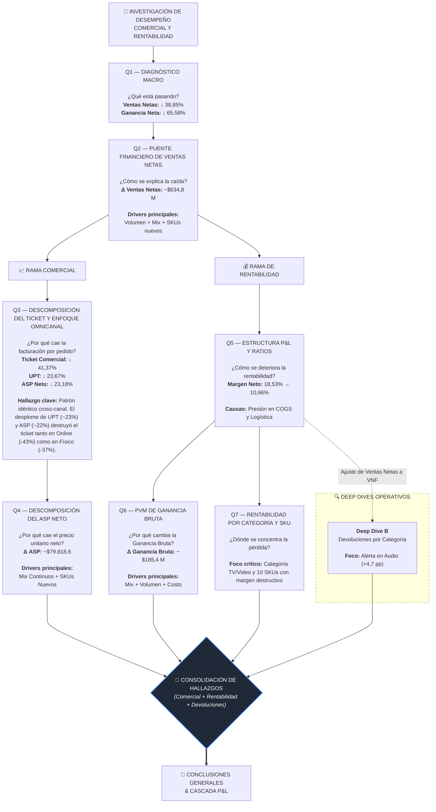

# 🔎 Investigación Analítica SQL

Esta investigación forma parte de un proyecto analítico End-to-End que se puede ver completo en: https://github.com/manticafacundoelian/dbt_elt_analytics

---

## 📌 Introducción

Esta investigación analiza la evolución comercial y económica de un retail de tecnología entre **2024 y 2026**, con el objetivo de identificar los principales factores asociados al deterioro observado en **ventas, comportamiento comercial y rentabilidad**.

El análisis parte de un **diagnóstico macro** y avanza progresivamente desde la variación agregada de las ventas hacia sus principales determinantes comerciales y económicos.

A partir de este diagnóstico, la investigación se estructura en dos grandes ramas:

* **Rama comercial:** analiza la evolución de las Ventas Netas desde una perspectiva financiera y comercial, identificando los principales efectos que explican su variación y profundizando posteriormente en el comportamiento del **Ticket Comercial, el UPT y el ASP**.

* **Rama de rentabilidad:** analiza el deterioro económico del negocio a través de la **estructura del P&L**, la evolución de los costos y la descomposición de la variación de la **Ganancia Bruta mediante un modelo PVM (Price–Volume–Mix)**, complementando el análisis con la rentabilidad por categoría y SKU.

El objetivo no es únicamente cuantificar la caída observada, sino **reconstruir sus principales mecanismos**, desde la evolución de las ventas y el comportamiento de los clientes hasta su impacto final sobre la rentabilidad.

---

## 🗺️ Hoja de Ruta Ejecutiva & Resumen de Diagnóstico

```mermaid
flowchart TD

    A["🔎 INVESTIGACIÓN DE DESEMPEÑO<br/>COMERCIAL Y RENTABILIDAD"]

    A --> B["Q1 — DIAGNÓSTICO MACRO<br/><br/>¿Qué está pasando?<br/><b>Ventas Netas:</b> ↓ 38,85%<br/><b>Ganancia Neta:</b> ↓ 65,58%"]

    B --> C["Q2 — PUENTE FINANCIERO DE VENTAS NETAS<br/><br/>¿Cómo se explica la caída?<br/><b>Δ Ventas Netas:</b> −$634,8 M<br/><br/><b>Drivers principales:</b><br/>Volumen + Mix + SKUs nuevos"]

    %% Apertura con cuadritos conectores
    C --> D["📈 RAMA COMERCIAL"]
    C --> E["💰 RAMA DE RENTABILIDAD"]

    %% Desarrollo de la Rama Comercial Unificada
    D --> D1["Q3 — DESCOMPOSICIÓN DEL TICKET Y ENFOQUE OMNICANAL<br/><br/>¿Por qué cae la facturación por pedido?<br/><b>Ticket Comercial:</b> ↓ 41,37%<br/><b>UPT:</b> ↓ 23,67%<br/><b>ASP Neto:</b> ↓ 23,18%<br/><br/><b>Hallazgo clave:</b> Patrón idéntico cross-canal. El desplome de UPT (~23%) y ASP (~22%) destruyó el ticket tanto en Online (-43%) como en Físico (-37%)."]

    D1 --> D2["Q4 — DESCOMPOSICIÓN DEL ASP NETO<br/><br/>¿Por qué cae el precio unitario neto?<br/><b>Δ ASP:</b> −$79.818,6<br/><br/><b>Drivers principales:</b><br/>Mix Continuos + SKUs Nuevos"]

    %% Desarrollo de la Rama de Rentabilidad
    E --> E1["Q5 — ESTRUCTURA P&L Y RATIOS<br/><br/>¿Cómo se deteriora la rentabilidad?<br/><b>Margen Neto:</b> 18,53% → 10,66%<br/><br/><b>Causas:</b> Presión en COGS y Logística"]
    
    E1 --> E2["Q6 — PVM DE GANANCIA BRUTA<br/><br/>¿Por qué cambia la Ganancia Bruta?<br/><b>Δ Ganancia Bruta:</b> −$185,4 M<br/><br/><b>Drivers principales:</b><br/>Mix + Volumen + Costo"]
    
    E1 --> E3["Q7 — RENTABILIDAD POR CATEGORÍA Y SKU<br/><br/>¿Dónde se concentra la pérdida?<br/><br/><b>Foco crítico:</b> Categoría TV/Video y 10 SKUs con margen destructivo"]

    %% El puente analítico de Devoluciones hacia Q5 (Único Deep Dive flotante)
    E1 -.->|Ajuste de Ventas Netas a VNF| H

    subgraph DEEP_DIVES ["🔍 DEEP DIVES OPERATIVOS"]
        H["<b>Deep Dive B</b><br/>Devoluciones por Categoría<br/><br/><b>Foco:</b> Alerta en Audio (+4,7 pp)"]
    end

    %% ==========================================
    %% EFECTO LLAVE ACOSTADA UNIFICADORA
    %% ==========================================
    D2 ---> LLAVE{" 🤝 CONSOLIDACIÓN DE HALLAZGOS<br/><i>(Comercial + Rentabilidad + Devoluciones)</i> "}
    E2 ---> LLAVE
    E3 ---> LLAVE
    H  ---> LLAVE

    %% Destino final
    LLAVE ==> F["🎯 CONCLUSIONES GENERALES<br/>& CASCADA P&L"]

    style LLAVE fill:#1f2937,stroke:#3b82f6,stroke-width:2px,color:#fff
    style DEEP_DIVES stroke-dasharray: 5 5
```

## 🔎 Investigación y Desarrollo

La investigación busca responder **siete preguntas principales de diagnóstico**, complementadas por **un análisis operativo de profundización (*Deep Dives*)**:

### Preguntas Core del Diagnóstico

#### ┌─ 🔹 Q1 — Diagnóstico Macro: ¿Qué cambió en el desempeño general del negocio?

<strong>Ver desarrollo de Q1</strong>
  

   

#### 🔹 Síntesis

El diagnóstico muestra, por un lado, una fuerte contracción de las Ventas Netas y del Ticket Comercial y, por otro, un deterioro de la rentabilidad que ya se había manifestado durante 2025.*

 

[Ver Consulta SQL →](./sql_business_analysis/q1_diagnostico_macro_yoy.sql) 
 

#### 🔹 Resultados 

| Métrica                    |       2024 |       2025 |     YoY 2025 |       2026 |     YoY 2026 |
| :------------------------- | ---------: | ---------: | -----------: | ---------: | -----------: |
| **Pedidos**                |      1.365 |      1.581 |  **+15,82%** |      1.649 |   **+4,30%** |
| **Ventas Brutas**          | $1.316,5 M | $1.684,4 M |  **+27,95%** | $1.064,0 M |  **−36,83%** |
| **Ventas Netas**           | $1.290,5 M | $1.633,9 M |  **+26,62%** |   $999,1 M |  **−38,85%** |
| Devoluciones ($)           |    $37,2 M |    $53,7 M |  **+44,45%** |    $70,3 M |  **+30,90%** |
| **Tasa de Devolución (%)** |      2,88% |      3,28% | **+0,40 pp** |      7,03% | **+3,75 pp** |
| **Ventas Netas Finales**   | $1.253,3 M | $1.580,3 M |  **+26,09%** |   $928,9 M |  **−41,22%** |
| **Ganancia Neta**          |   $300,1 M |   $295,7 M |   **−1,47%** |   $101,8 M |  **−65,58%** |
| **Margen Neto (%)**        |     23,95% |     18,71% | **−5,24 pp** |     10,96% | **−7,75 pp** |
| **Ticket Comercial**       |   $945.397 | $1.033.477 |   **+9,32%** |   $605.891 |  **−41,37%** |

> *Nota: El Ticket Comercial se calcula sobre Ventas Netas, antes de devoluciones, para analizar el comportamiento comercial de las órdenes independientemente de las devoluciones posteriores.*

#### 🔹 Hallazgos

#### Diagnóstico Comercial

**1. Crecimiento en pedidos con caída de facturación**

En 2026 se registraron **1.649 pedidos (+4,30% YoY)**, mientras que las Ventas Netas cayeron un **−38,85%**.

**2. Contracción del Ticket Comercial**

La caída de ingresos se acompaña de una reducción significativa del ticket promedio, que disminuyó un **−41,37%**, pasando de **$1.033.477 a $605.891**.

**3. Mayor incidencia de devoluciones**

La Tasa de Devolución aumentó de **3,28% a 7,03% (+3,75 pp)**, profundizando la caída de las Ventas Netas Finales hasta un **−41,22%**.

#### Diagnóstico de Rentabilidad

**4. La ganancia cae más que las ventas**

En 2026, la Ganancia Neta cayó un **−65,58%**, frente a una caída del **−38,85%** en Ventas Netas. Como consecuencia, el Margen Neto se redujo del **18,71% al 10,96% (−7,75 pp)**.

**5. Deterioro de rentabilidad previo**

El problema de rentabilidad antecede a la caída de facturación de 2026. En 2025, a pesar de un crecimiento del **+26,62%** en Ventas Netas, la Ganancia Neta cayó un **−1,47%** y el Margen Neto perdió **−5,24 pp**.

 

#### 🔹 Puente analítico → Q2

En 2026, los pedidos crecieron apenas **4,30%**, mientras las **Ventas Netas cayeron $634,8 M (−38,85%)**.

**Q2 descompone esta caída en efectos de Volumen, Mix, Precio de Lista, Descuentos y cambios en los SKUs comercializados.**

 

#### ├─ 🔹 Q2 — Puente Financiero de Ventas Netas: ¿Qué efectos explican monetariamente su variación?

<strong>Ver desarrollo de Q2</strong>
  

 

#### 🔹 Síntesis

La variación de las **Ventas Netas** se atribuye principalmente a los efectos de **Volumen, Mix de SKUs continuos y cambios en el portafolio**, que concentraron los principales impactos negativos del período.

El **Precio de Lista** actuó como factor de compensación parcial, mientras que los **Descuentos** profundizaron la variación negativa.

 

[Ver Consulta SQL →](./sql_business_analysis/q2_puente_ventas_netas.sql) 
 

#### 🔹 Resultados

El puente descompone la variación de las **Ventas Netas entre 2025 y 2026** mediante efectos de **Volumen, Mix de SKUs continuos, Precio de Lista, Descuentos y cambios en el portafolio**.

| Efecto                        | Impacto 2025 → 2026 |
| :---------------------------- | ------------------: |
| **Variación de Ventas Netas** |       **−$634,8 M** |
| Volumen                       |           −$333,3 M |
| Mix — SKUs continuos          |           −$204,7 M |
| Precio de Lista               |            +$48,3 M |
| Descuentos                    |            −$34,3 M |
| SKUs nuevos                   |           −$110,8 M |
| SKUs descontinuados           |              $0,0 M |
| **Residuo**                   |          **$0,0 M** |

> *Nota: El puente descompone la variación de Ventas Netas entre 2025 y 2026 en efectos de **Volumen, Mix de SKUs continuos, Precio, Descuentos y altas/bajas de productos**. El residuo de $0 confirma la conciliación exacta del puente.*

#### 🔹 Hallazgos

#### Principales impulsores de la caída

**1. El Volumen concentra el mayor impacto negativo**

El efecto Volumen explica una reducción de **$333,3 M** en las Ventas Netas, siendo el principal componente negativo del puente.

**2. El Mix de productos profundiza la contracción**

El Mix de los **SKUs continuos** aportó un impacto negativo de **$204,7 M**, indicando un cambio desfavorable en la composición de las ventas entre los productos que permanecieron activos en ambos períodos.

**3. Los SKUs nuevos no compensaron la pérdida del negocio existente**

Los productos incorporados en 2026 generaron un impacto de **−$110,8 M** bajo la metodología del puente, por lo que su incorporación no compensó los efectos negativos provenientes del volumen y del mix.

#### Factores de compensación

**4. El aumento del Precio de Lista compensó parcialmente la caída**

El efecto Precio de Lista aportó **+$48,3 M**, funcionando como un factor de compensación frente a los principales impactos negativos.

**5. Los Descuentos profundizaron la contracción**

El efecto Descuentos tuvo un impacto de **−$34,3 M**, reduciendo parcialmente el beneficio generado por el aumento de los precios de lista.

 

#### 🔹 Puente analítico → Ramas Comercial y de Rentabilidad

Q2 cuantifica **cómo se descompone la caída de las Ventas Netas**, identificando los principales efectos que explican la variación monetaria.

La **Rama Comercial** profundiza en cómo esta contracción se manifestó en el comportamiento por pedido, mediante **Ticket, UPT y ASP Neto (Q3–Q4)**.

La **Rama de Rentabilidad** analiza cómo la evolución de las ventas y los costos se tradujo en el deterioro del resultado económico, mediante el **P&L, el PVM de Ganancia Bruta y la rentabilidad por producto (Q5–Q7)**.

 

#### ├─ 🔹 Q3 — Descomposición del Ticket y Comportamiento Omnicanal: ¿Por qué cae la facturación por pedido?

<strong>Ver desarrollo de Q3</strong>
  

 

#### 🔹 Síntesis

La **facturación por pedido cayó** entre 2025 y 2026 porque los clientes compraron **menos unidades por pedido** y cada unidad generó un **menor valor promedio**, dando como resultado una caída del Ticket Comercial.

Ambos fenómenos se reprodujeron transversalmente en **Online y Físico**, lo que indica que el deterioro responde principalmente a un **cambio en el comportamiento comercial**, más que a un problema asociado exclusivamente a un canal.

 

#### 🔸 Q3.1 — Descomposición del Ticket (UPT vs. ASP)

[Ver Consulta SQL →](./sql_business_analysis/q3.1_descomposicion_ticket.sql) 
 

#### 🔹 Resultados

| Métrica                       |       2024 |       2025 |    YoY 2025 |     2026 |    YoY 2026 |
| :---------------------------- | ---------: | ---------: | ----------: | -------: | ----------: |
| **Pedidos**                   |      1.365 |      1.581 | **+15,82%** |    1.649 |  **+4,30%** |
| **Unidades Totales**          |      3.946 |      4.746 | **+20,27%** |    3.778 | **−20,41%** |
| **Ventas Netas**              | $1.290,5 M | $1.633,9 M | **+26,62%** | $999,1 M | **−38,85%** |
| **Unidades por Pedido (UPT)** |       2,89 |       3,00 |  **+3,81%** |     2,29 | **−23,67%** |
| **ASP Comercial**             |   $327.032 |   $344.275 |  **+5,27%** | $264.456 | **−23,18%** |
| **Ticket Comercial**          |   $945.397 | $1.033.477 |  **+9,32%** | $605.891 | **−41,37%** |

> *Nota: **Ticket Comercial = UPT × ASP**, donde UPT representa las unidades promedio por pedido y ASP el valor promedio por unidad.*

#### 🔹 Hallazgos

**1. El ticket cae por dos vías simultáneas**

Entre 2025 y 2026, el Ticket Comercial disminuyó **41,37%**. La descomposición muestra una caída prácticamente equivalente en sus dos componentes: **UPT −23,67%** y **ASP −23,18%**.

Esto indica que en 2026 los clientes compraron **menos unidades por pedido y, además, a un menor valor promedio por unidad**.

 

#### 🔸 Q3.2 — Comportamiento Omnicanal

[Ver Consulta SQL →](./sql_business_analysis/q3.2_comportamiento_omnicanal.sql) 
 

#### 🔹 Resultados

| Canal      | Pedidos 2025 | Pedidos 2026 | YoY Pedidos | Participación 2025 | Participación 2026 | Ticket 2025 | Ticket 2026 |  YoY Ticket | UPT 2025 | UPT 2026 |     YoY UPT | ASP 2025 | ASP 2026 |     YoY ASP | Δ Tasa Descuento |
| :--------- | -----------: | -----------: | ----------: | -----------------: | -----------------: | ----------: | ----------: | ----------: | -------: | -------: | ----------: | -------: | -------: | ----------: | ---------------: |
| **Online** |        1.116 |        1.318 | **+18,10%** |             70,59% |             79,93% |  $1.055.898 |    $602.436 | **−42,95%** |     3,02 |     2,28 | **−24,35%** | $349.876 | $263.879 | **−24,58%** |     **+3,06 pp** |
| **Físico** |          465 |          331 | **−28,82%** |             29,41% |             20,07% |    $979.667 |    $619.651 | **−36,75%** |     2,96 |     2,32 | **−21,60%** | $330.584 | $266.716 | **−19,32%** |     **+3,29 pp** |

#### 🔹 Hallazgos

**1. El deterioro del ticket se reproduce en ambos canales**

El Ticket Comercial cayó **42,95% en Online** y **36,75% en Físico**. La magnitud es diferente, pero el patrón es consistente: **ambos canales pierden valor por pedido**.

**2. UPT y ASP caen simultáneamente en ambos canales**

En Online, el UPT disminuyó **24,35%** y el ASP **24,58%**. En Físico, las caídas fueron de **21,60%** y **19,32%**, respectivamente.

Esto refuerza el hallazgo de Q3.1: la contracción del ticket no responde a un único componente ni a un único canal.

**3. El mix de canales cambia, pero no explica por sí solo el deterioro**

La participación de Online aumentó de **70,59% a 79,93%**, mientras Físico cayó de **29,41% a 20,07%**. Sin embargo, el ticket se deterioró dentro de **ambos canales**, por lo que el cambio de participación no explica por sí solo la caída del ticket total.

**4. Los descuentos aumentaron en ambos canales**

La tasa de descuento aumentó **+3,06 pp en Online** y **+3,29 pp en Físico**, acompañando la caída del ASP en ambos canales.

 

#### 🔹 Puente analítico → Q4

Q3 identifica **qué está pasando con el valor por pedido**: los clientes compran menos unidades y cada unidad genera un menor valor promedio.

**Q4 profundiza el segundo componente —el ASP Neto— para determinar qué factores explican la caída del valor promedio por unidad.**

 

#### ├─ 🔹 Q4 — Descomposición del ASP Neto: ¿Por qué cae el valor promedio por unidad?

<strong>Ver desarrollo de Q3</strong>
  
 

#### 🔹 Síntesis

El ASP cayó **−$79.819 (−23,2%)** entre 2025 y 2026, explicado principalmente por dos efectos: el **Mix de productos continuos (−67,9%)** y la **entrada de SKUs nuevos a precios bajos (−36,7%)**. Los efectos de **Precio de Lista y Descuento casi se cancelan entre sí** (+$3.690 neto), por lo que no explican en términos netos la caída del ASP.

Al bajar a categoría, aparecen **dos historias distintas detrás del mismo número**:

- **TV y Video** (−49,0% del Δ ASP) cae por **pérdida pura de mix**: perdió 6 puntos de share sin ningún lanzamiento nuevo. Los clientes simplemente compraron menos de esta categoría.
- **Computación y Audio**, en cambio, **ganaron participación** pero fueron hundidas por sus propios **lanzamientos 2026**, que entraron a precios por debajo del promedio. El mix, en estas categorías, no es el problema — incluso ayuda en Audio.
- **Hogar** es la única categoría que empuja el ASP hacia arriba, con el mecanismo inverso al de TV y Video: ganó mix sin lanzar productos nuevos.

A nivel SKU, la caída está **muy concentrada**: 5 productos explican el 72,6% del total, con **TCL Monitor TV 21** como el caso más extremo (−$19.439, el 24,4% de toda la caída), producto de una pérdida de más de la mitad de sus unidades vendidas.

**Conclusión:** el ASP no bajó por una causa única. Es la superposición de un problema de demanda en categorías tradicionales (TV y Video) y precios de entrada bajos en las categorías con lanzamientos nuevos (Computación, Audio). Cualquier acción correctiva debería tratarlas por separado, porque responden a problemas de negocio distintos.
 

#### 🔸 Q4.1 — Puente Agregado (Mix + Precio + Descuento + Nuevos + Descontinuados)

[Ver Consulta SQL →](./sql_business_analysis/q4_1_descomposicion_asp_agregada.sql) 
 

#### 🔹 Resultados

| Métrica                    |       2025 |       2026 |            Δ |
| :-------------------------- | ---------: | ---------: | -----------: |
| **ASP Comercial**           |   $344.275 |   $264.456 | **−$79.819** |
| **SKUs Continuos**          |         37 |         37 |             — |
| **SKUs Nuevos**             |          — |         11 |             — |
| **SKUs Descontinuados**     |          0 |          — |             — |

**Descomposición del Δ ASP ($79.819 de caída):**

| Efecto                          |    Impacto ($) | % del Δ Total |
| :------------------------------- | --------------: | -------------: |
| **Mix (SKUs continuos)**         |     −$54.180,70 |    **67,9%** |
| **SKUs Nuevos**                  |     −$29.328,29 |    **36,7%** |
| **Precio**                       |      $12.778,52 |   **−16,0%** |
| **Descuentos**                   |      −$9.088,17 |    **11,4%** |
| **SKUs Descontinuados**          |           $0,00 |        0,0% |
| **Total (chequeo de residuo)**   |     **$0,00** ✅ |      100,0% |

> *Nota metodológica: el efecto Mix se valúa a precio del año base (2025) y los efectos Precio y Descuento se ponderan con el volumen del año actual (2026). Esta convención asegura que el puente cierre exacto (residuo $0), a costa de que la interacción entre cambio de mix y cambio de precio quede incluida dentro del efecto Precio.*

#### 🔹 Hallazgos

**1. La caída del ASP es principalmente un problema de mix, no de precios**

El efecto **Mix explica el 67,9%** de la caída, y los **SKUs Nuevos otro 36,7%**. Juntos superan el 100% del Δ, porque **Precio (+$12.778,52) y Descuento (−$9.088,17) casi se cancelan entre sí** (saldo neto: +$3.690,35). En otras palabras: la política de precios y descuentos, en neto, no explica la caída; el problema está en qué se vendió, no en cuánto se cobró por lo mismo.

**2. No hubo bajas de catálogo**

Los **0 SKUs descontinuados** confirman que toda la caída se explica por mix y por lanzamientos, no por pérdida de líneas existentes.

 

#### 🔸 Q4.2 — Puente por Categoría

[Ver Consulta SQL →](./sql_business_analysis/q4_2_descomposicion_asp_categoria.sql) 
 

#### 🔹 Resultados

| Categoría | Unid. 2025 | Unid. 2026 | Part. 2025 | Part. 2026 | Δ Part. (pp) | Mix | Precio | Descuento | Nuevos | Total | % del Δ ASP |
| :--- | ---: | ---: | ---: | ---: | ---: | ---: | ---: | ---: | ---: | ---: | ---: |
| **TV y Video** | 791 | 402 | 16,67% | 10,64% | **−6,03** | −40.717,38 | 5.642,40 | −4.004,87 | 0,00 | **−39.079,85** | **49,0%** |
| **Computación** | 767 | 690 | 16,16% | 18,26% | +2,10 | −15.885,31 | 1.348,05 | −971,26 | −17.671,74 | **−33.180,25** | **41,6%** |
| **Telefonía** | 259 | 102 | 5,46% | 2,70% | −2,76 | −13.908,97 | 830,43 | −300,51 | 438,49 | **−12.940,57** | **16,2%** |
| **Audio** | 707 | 862 | 14,90% | 22,82% | +7,92 | 3.587,54 | 2.000,85 | −1.397,46 | −9.056,35 | **−4.865,42** | **6,1%** |
| **Accesorios** | 1.222 | 782 | 25,75% | 20,70% | −5,05 | 338,66 | 1.115,33 | −851,29 | −3.038,69 | **−2.435,99** | **3,1%** |
| **Hogar** | 1.000 | 940 | 21,07% | 24,88% | +3,81 | 12.404,76 | 1.841,45 | −1.562,78 | 0,00 | **+12.683,43** | **−15,9%** |
| **Total (chequeo)** | — | — | — | — | — | — | — | — | — | **−79.818,65** ✅ | 100,0% |

#### 🔹 Hallazgos

**1. Dos categorías explican el 90,6% de la caída, por mecanismos opuestos**

**TV y Video** (−49,0%) cae por **pérdida pura de mix**: perdió 6 puntos de share, sin ningún SKU nuevo, y ni precio ni descuento lo compensan. **Computación** (−41,6%), en cambio, **ganó participación** (+2,10 pp) pero fue hundida por sus propios **lanzamientos 2026**, que entraron por debajo del promedio (−$17.671,74). El mismo patrón se repite en **Audio**, que ganó +7,92 pp de share (la mayor suba de todas) y aun así cae, arrastrada por sus lanzamientos.

**2. Hogar es la única categoría que empuja el ASP hacia arriba**

Ganó share (+3,81 pp) con mix positivo (+$12.404,76) y sin lanzamientos, el espejo exacto de TV y Video.
 

#### 🔸 Q4.3 — Bridge por SKU (Detalle y Ranking de Impacto)

[Ver Consulta SQL →](./sql_business_analysis/q3_3_descomposicion_asp_sku.sql) 
 

#### 🔹 Resultados — Top 5 Mayor Impacto Negativo

| Producto | Categoría | Estado | Δ Part. (pp) | Mix | Precio | Descuento | Nuevos | Total |
| :--- | :--- | :--- | ---: | ---: | ---: | ---: | ---: | ---: |
| TCL Monitor TV 21 | TV y Video | Continuo | −2,616 | −20.173,53 | 2.265,13 | −1.530,49 | 0,00 | **−19.438,89** |
| Acer Memoria RAM 2 | Computación | Continuo | −3,132 | −11.108,52 | 197,11 | −95,52 | 0,00 | **−11.006,93** |
| Lenovo Mouse 1 | Computación | Continuo | −4,073 | −10.436,40 | 332,19 | −189,48 | 0,00 | **−10.293,69** |
| TCL Chromecast 25 | TV y Video | Continuo | −1,342 | −9.111,00 | 1.173,26 | −905,27 | 0,00 | **−8.843,01** |
| Acer Notebook 7 | Computación | Nuevo 2026 | +4,579 | 0,00 | 0,00 | 0,00 | −8.347,11 | **−8.347,11** |

#### 🔹 Resultados — Top 5 Mayor Impacto Positivo

| Producto | Categoría | Estado | Δ Part. (pp) | Mix | Precio | Descuento | Nuevos | Total |
| :--- | :--- | :--- | ---: | ---: | ---: | ---: | ---: | ---: |
| Liliana Cafetera 46 | Hogar | Continuo | +6,315 | 12.338,22 | 1.171,32 | −1.043,51 | 0,00 | **12.466,03** |
| ASUS Webcam 6 | Computación | Continuo | +1,167 | 7.423,10 | 406,13 | −391,52 | 0,00 | **7.437,70** |
| Philips Barra de Sonido 28 | Audio | Continuo | +0,013 | 3.595,60 | 793,89 | −469,45 | 0,00 | **3.920,04** |
| Samsung Monitor TV 23 | TV y Video | Continuo | +0,365 | 3.313,49 | 487,24 | −353,18 | 0,00 | **3.447,55** |
| Logitech Funda 40 | Accesorios | Continuo | +0,561 | 1.273,05 | 121,81 | −90,70 | 0,00 | **1.304,16** |

> *Detalle completo de los 48 SKUs disponible en la salida de la consulta SQL vinculada arriba.*

#### 🔹 Hallazgos

**1. El impacto está muy concentrado, y el caso extremo confirma Q3.2**

Los 5 productos de mayor impacto negativo explican el **72,6%** de la caída total. El más extremo, **TCL Monitor TV 21**, perdió más de la mitad de sus unidades (295 → 136) y explica por sí solo el **24,4%** de la caída del ASP — la manifestación a nivel producto de la pérdida de mix que ya vimos en TV y Video.  
 

#### 🔹 Puente analítico → Rama de Rentabilidad

El diagnóstico comercial explica la caída de las Ventas Netas, pero no todavía por qué la Ganancia Neta cayó más proporcionalmente (−65,58% vs. −38,85%).

**Q5, Q6 y Q7 abordan la Rama de Rentabilidad**, analizando la estructura de costos y márgenes para entender esa brecha.  
 

#### ├─ 🔹 Q5 — Estructura de Rentabilidad y Ratios P&L: ¿Cómo se deterioró la rentabilidad?

<strong>Ver desarrollo de Q4</strong>
  
 

[Ver Consulta SQL →](./sql_business_analysis/q4_rentabilidad_ratios_pnl.sql)  

#### 🔹 Criterio metodológico

Para el análisis de rentabilidad se toma como base la **Venta Neta Final**, es decir, la venta después de devoluciones aprobadas.

Esta decisión busca medir la rentabilidad sobre el **ingreso económico efectivamente retenido por la empresa**. En consecuencia, los ratios de costos y márgenes de Q4 se calculan sobre esta base.

#### 🔹 Resultados

| Métrica                      |       2024 |       2025 |     YoY 2025 |     2026 |     YoY 2026 |
| :--------------------------- | ---------: | ---------: | -----------: | -------: | -----------: |
| **Ventas Netas Finales**     | $1.253,3 M | $1.580,3 M |  **+26,09%** | $928,9 M |  **−41,22%** |
| **Costo de Ventas**          |   $943,1 M | $1.270,0 M |  **+34,60%** | $804,0 M |  **−36,69%** |
| **Costo de Ventas / Ventas** |     75,25% |     80,37% | **+5,12 pp** |   86,56% | **+6,19 pp** |
| **Ganancia Bruta**           |   $310,2 M |   $310,2 M |   **−0,01%** | $124,9 M |  **−59,75%** |
| **Margen Bruto**             |     24,75% |     19,63% | **−5,12 pp** |   13,44% | **−6,19 pp** |
| **Costo Logístico / Ventas** |      0,81% |      0,92% | **+0,11 pp** |    2,49% | **+1,57 pp** |
| **Ganancia Neta**            |   $300,1 M |   $295,7 M |   **−1,47%** | $101,8 M |  **−65,58%** |
| **Margen Neto**              |     23,95% |     18,71% | **−5,24 pp** |   10,96% | **−7,75 pp** |

#### 🔹 Hallazgos

**1. El costo de ventas absorbe una proporción cada vez mayor de las Ventas Netas Finales**

Entre 2025 y 2026, el **Costo de Ventas / Ventas** aumentó **6,19 pp**, pasando de 80,37% a 86,56%.

Como consecuencia, el **Margen Bruto** se redujo en la misma magnitud, de 19,63% a 13,44%.

El deterioro resulta especialmente relevante porque entre 2024 y 2025 las ventas habían crecido **26,09%**, pero la **Ganancia Bruta permaneció prácticamente sin cambios**, pasando de $310,2 M a $310,2 M.

**2. La presión logística se intensifica en 2026**

El **Costo Logístico / Ventas** pasó de 0,92% en 2025 a 2,49% en 2026, un aumento de **1,57 pp**.

Aunque su peso es significativamente menor que el del Costo de Ventas, la mayor carga logística reduce todavía más la rentabilidad una vez deteriorado el margen bruto.

**3. La rentabilidad cae mucho más que las ventas**

Entre 2025 y 2026, las **Ventas Netas Finales disminuyeron 41,22%**, mientras que la **Ganancia Neta cayó 65,58%**.

En consecuencia, el **Margen Neto** pasó de 18,71% a 10,96%, una reducción de **7,75 pp**.

El deterioro no responde únicamente a una menor escala de ventas: una proporción creciente de las **Ventas Netas Finales** es absorbida por el **Costo de Ventas**, mientras que el **Costo Logístico** agrega una presión adicional sobre el resultado final.

El siguiente paso es determinar cuánto del deterioro de la **Ganancia Bruta** corresponde a cada componente económico.

 

#### 🔹 Puente analítico → Q5

Q4 muestra que el deterioro de 2026 combina una fuerte contracción de las ventas, **como demostró la Rama Comercial**, con un aumento del peso del **Costo de Ventas**, que comprimió el **Margen Bruto hasta 13,44%** y redujo la **Ganancia Bruta un 59,75%**.

**Q5 descompone esta caída de la Ganancia Bruta mediante un PVM formal —Volumen → Mix → Precio → Costo → Nuevos Lanzamientos → Descontinuados**, para cuantificar qué componentes explican el deterioro entre 2025 y 2026.

 

#### ├─ 🔹 Q5 — PVM: ¿Qué componentes explican la caída de la Ganancia Bruta?

<strong>Ver desarrollo de Q5</strong>
  
 

#### 🔹 Síntesis

La Ganancia Bruta cayó **−$185,36 M (−59,7%)** entre 2025 y 2026, de $310,22 M a $124,86 M. El PVM muestra que el deterioro es, ante todo, un problema de **volumen del negocio existente**: el efecto Volumen (**−$122,44 M, 66,1%**) más que duplica al efecto Mix (**−$23,41 M, 12,6%**), y el Costo suma otro **−$64,56 M (34,8%)**. Precio (+$9,88 M) y Lanzamientos (+$15,17 M) compensan apenas el 13,5% de la caída.

Al bajar a categoría, **TV y Video concentra más de la mitad del deterioro** (−$100,88 M, 54,4%), principalmente por Volumen y Costo, sin ningún lanzamiento que lo amortigüe. **Audio** repite el patrón ya visto en Q3: crece en unidades totales (+16%) pero su negocio continuo se derrumba (−$12,76 M de Volumen), oculto detrás del mayor efecto de Lanzamientos de todas las categorías (+$9,10 M).

A nivel SKU, el deterioro está **muy concentrado**: los mismos dos productos que lideraban la caída del ASP en Q3 —**TCL Monitor TV 21** y **TCL Chromecast 25**— son también los dos mayores destructores de Ganancia Bruta, con **−$71,66 M combinados (38,7% del total)**. Ningún lanzamiento aparece entre los 8 peores SKUs; todos son productos continuos.

**Conclusión:** la caída de rentabilidad se debe, centralmente, a la pérdida de volumen de un grupo reducido de productos ya establecidos (liderados por TV y Video), agravada por un deterioro simultáneo del costo unitario. Los lanzamientos no fueron un driver negativo de la Ganancia Bruta: por el contrario, aportaron un efecto positivo que compensó parcialmente la caída.
 

#### 🔸 Q5.1 — PVM Consolidado: ¿Qué explica la variación total?

[Ver Consulta SQL →](./sql_business_analysis/q5_pvm_consolidado.sql)  

#### 🔹 Resultados

| Factor              | Efecto sobre la Ganancia Bruta | Participación |
| :------------------ | ------------------------------: | -------------: |
| **Volumen**         |                       −$122,44 M |     **66,05%** |
| **Mix**             |                        −$23,41 M |     **12,63%** |
| **Precio**          |                         +$9,88 M |     **−5,33%** |
| **Costo**           |                        −$64,56 M |     **34,83%** |
| **Lanzamientos**    |                        +$15,17 M |     **−8,19%** |
| **Discontinuados**  |                           $0,0 M |         0,00% |
| **Variación total** |                     **−$185,36 M** |   **100,00%** |

**Ganancia Bruta 2025:** $310,22 M
**Ganancia Bruta 2026:** $124,86 M
**Variación:** **−$185,36 M**

> Este PVM explica la variación de la Ganancia Bruta, no de la Ganancia Neta. El rol del costo logístico en el deterioro de la Ganancia Neta se analiza a nivel consolidado en Q4 y a nivel categoría en Q6.2.*
> *Nota metodológica: el efecto "Precio" es Precio Realizado (ventas netas de descuento y de devoluciones, dividido por unidades efectivas), por lo que incorpora tanto la política de descuentos como el impacto de reembolsos. La apertura granular entre Precio de Lista y Descuento se realiza en Q3, sobre ventas comerciales antes de devolución. Los efectos Volumen y Mix se calculan sobre el universo de SKUs continuos exclusivamente, para aislar el comportamiento del negocio existente de la entrada de nuevos lanzamientos.*

#### 🔹 Hallazgos

**1. La caída es, ante todo, un problema de volumen del negocio existente**

El efecto **Volumen explica el 66,05%** de la caída — más del doble que Mix (12,63%). La reducción de Ganancia Bruta no es principalmente un cambio en qué se vende, sino una **caída real en la cantidad vendida** de los productos que la empresa ya tenía en catálogo.

**2. El Costo es el segundo factor más relevante; Precio y Lanzamientos compensan solo parcialmente**

El efecto **Costo (−$64,56 M, 34,83%)** confirma que, además de vender menos, el margen unitario de los productos continuos se deterioró por el lado del costo de reposición. Precio (+$9,88 M) y Lanzamientos (+$15,17 M) compensan en conjunto apenas el 13,5% de la caída.

#### 🔹 Reconciliación

**−$122,44 M − $23,41 M + $9,88 M − $64,56 M + $15,17 M = −$185,36 M**

Diferencia de reconciliación: **$0,00** ✅

 

#### 🔸 Q5.2 — PVM por Categoría: ¿Dónde se concentra el deterioro?

[Ver Consulta SQL →](./sql_business_analysis/q5_pvm_por_categoria.sql)  

#### 🔹 Resultados

| Categoría       | SKUs | Unid. 2025 | Unid. 2026 |      Volumen |          Mix |     Precio |        Costo | Lanzamientos | Discontinuados |     Efecto PVM | % del Δ Total |
| :-------------- | ---: | ---------: | ---------: | -----------: | -----------: | ---------: | -----------: | -----------: | -------------: | -------------: | ------------: |
| **TV y Video**  |    7 |        764 |        375 |    −$56,15 M |    −$19,37 M |   +$4,38 M |    −$29,74 M |       $0,0 M |         $0,0 M | **−$100,88 M** |    **54,42%** |
| **Computación** |   10 |        741 |        647 |    −$24,27 M |     −$8,28 M |   +$0,90 M |     −$5,96 M |     +$5,26 M |         $0,0 M |  **−$32,34 M** |    **17,44%** |
| **Telefonía**   |    6 |        248 |         94 |    −$12,54 M |     −$7,15 M |   +$1,50 M |     −$4,03 M |     +$0,15 M |         $0,0 M |  **−$22,07 M** |    **11,90%** |
| **Accesorios**  |   10 |      1.183 |        734 |     −$7,10 M |     +$0,22 M |   +$0,72 M |     −$5,82 M |     +$0,66 M |         $0,0 M |  **−$11,32 M** |     **6,10%** |
| **Audio**       |    8 |        682 |        791 |    −$12,76 M |     +$2,61 M |   +$1,58 M |    −$10,37 M |     +$9,10 M |         $0,0 M |   **−$9,84 M** |     **5,31%** |
| **Hogar**       |    7 |        968 |        894 |     −$9,62 M |     +$8,55 M |   +$0,81 M |     −$8,65 M |       $0,0 M |         $0,0 M |   **−$8,92 M** |     **4,81%** |
| **Total**       |   48 |      4.586 |      3.535 |   −$122,44 M |    −$23,41 M |   +$9,88 M |    −$64,56 M |    +$15,17 M |         $0,0 M | **−$185,36 M** |     **100%** |

#### 🔹 Hallazgos

**1. TV y Video concentra más de la mitad de la caída, y es puramente un problema de volumen**

Con **−$100,88 M (54,4%)**, TV y Video es la categoría más golpeada por lejos. Su efecto Volumen (**−$56,15 M**) representa el **45,9% de todo el efecto Volumen de la empresa**, sin ningún lanzamiento que lo compense.

**2. Audio crece en unidades totales, pero su negocio base se derrumba**

Audio pasa de 682 a 791 unidades (+16%), pero registra un efecto Volumen de **−$12,76 M**, el segundo más negativo. Esto solo se explica porque sus **Lanzamientos (+$9,10 M, el mayor de todas las categorías)** ocultan una caída fuerte en sus productos continuos — el mismo patrón identificado en Q3.

**3. Hogar es la única categoría con Mix positivo**

Con **+$8,55 M**, sin lanzamientos que lo expliquen — es enteramente producto de una mejor composición entre sus SKUs continuos, el espejo de TV y Video.

#### 🔹 Reconciliación por categoría

La suma de los efectos PVM de todas las categorías reproduce, al centavo, la variación consolidada: **−$185,36 M** ✅

 

#### 🔸 Q5.3 — PVM por SKU: ¿Qué productos explican el deterioro?

[Ver Consulta SQL →](./sql_business_analysis/q5_pvm_por_sku.sql)  

#### 🔹 Resultados — Top 8 Mayor Impacto Negativo

| Producto              | Categoría   | Estado   | Unid. 2025→2026 |   Efecto PVM |
| :--------------------- | :---------- | :------- | :--------------- | -----------: |
| TCL Monitor TV 21      | TV y Video  | Continuo | 283 → 126        | **−$44,79 M** |
| TCL Chromecast 25      | TV y Video  | Continuo | 176 → 83         | **−$26,87 M** |
| Acer Memoria RAM 2     | Computación | Continuo | 212 → 53         | **−$21,19 M** |
| TCL Monitor TV 19      | TV y Video  | Continuo | 83 → 35          | **−$14,23 M** |
| Lenovo Mouse 1         | Computación | Continuo | 318 → 102        | **−$12,70 M** |
| Samsung Smart TV 20    | TV y Video  | Continuo | 114 → 35         |  **−$9,93 M** |
| ASUS Notebook 5        | Computación | Continuo | 150 → 73         |  **−$7,16 M** |
| Samsung Smartphone 14  | Telefonía   | Continuo | 56 → 13          |  **−$6,71 M** |

#### 🔹 Resultados — Top 5 Mayor Impacto Positivo

| Producto                    | Categoría   | Estado   | Unidades 2026 |  Efecto PVM |
| :--------------------------- | :---------- | :------- | -------------: | ----------: |
| Philips Equipo de Audio 30   | Audio       | Nuevo    |            112 | **+$7,63 M** |
| ASUS Webcam 6                | Computación | Continuo |             56 | **+$5,22 M** |
| Sony Equipo de Audio 33      | Audio       | Nuevo    |            142 | **+$3,51 M** |
| Acer Notebook 7              | Computación | Nuevo    |            166 | **+$2,83 M** |
| HP Mouse 10                  | Computación | Nuevo    |            118 | **+$2,37 M** |

> *Detalle completo de los 48 SKUs disponible en la salida de la consulta SQL vinculada arriba. Las unidades en Q5 son efectivas, después de devoluciones, por lo que pueden diferir de Q3.*

#### 🔹 Hallazgos

**1. Los principales impactos negativos están concentrados en productos ya existentes**

Los 8 SKUs con mayor impacto negativo son **todos "Continuo"** — ningún lanzamiento aparece entre ellos. Los dos principales, **TCL Monitor TV 21** y **TCL Chromecast 25**, generan conjuntamente **−$71,66 M (38,7% de toda la caída)**, y son los mismos dos productos identificados como el mayor problema del ASP en Q3 — la pérdida de volumen no solo bajó el precio promedio, fue también el principal destructor de Ganancia Bruta.

**2. Los lanzamientos son el principal contrapeso, no el problema**

Los 5 mayores efectos positivos incluyen **3 lanzamientos de 2026** (Philips Equipo de Audio 30, Sony Equipo de Audio 33, Acer Notebook 7), que en conjunto aportan +$13,97 M. Ningún lanzamiento aparece entre los peores SKUs.

**3. El PVM separa volumen de otros efectos: el caso de ASUS Webcam 6**

**ASUS Webcam 6**, un producto continuo, triplicó sus unidades (19→56) y eso le permitió compensar sus propios efectos negativos de Mix, Precio y Costo, cerrando con un PVM total de **+$5,22 M** — el único SKU continuo entre los 5 mejores.  

 

#### 🔹 Puente analítico → Q6

El PVM identifica los mecanismos detrás de la caída de la Ganancia Bruta (Volumen y Costo como principales drivers negativos, agravados por Mix, y parcialmente compensados por Precio y Lanzamientos), completando el diagnóstico de las dos ramas de la investigación: Comercial (Q1-Q3) y Rentabilidad (Q4-Q5).

**Q6 evalúa cómo se traduce este deterioro en la salud actual de cada categoría y producto**, midiendo su margen presente, el escalón de costo donde se pierde rentabilidad, y qué SKUs son responsables — antes de cerrar la investigación con las Conclusiones Generales.

 

#### └─ 🔹 Q6 — Rentabilidad por Categoría y Producto: ¿Dónde se genera (o se pierde) la Ganancia Neta hoy?

<strong>Ver desarrollo de Q6</strong>
  
 

#### 🔹 Síntesis

Mientras Q3 y Q5 explican **por qué cambió** el resultado de la empresa, Q6 responde una pregunta complementaria: **¿cómo quedó distribuida la rentabilidad de la empresa entre sus categorías y productos?**

El análisis incorpora el **Costo Logístico asignado a nivel de línea** para pasar de Ganancia Bruta a Ganancia Neta:

> **Ganancia Neta = Ventas Netas Finales − Costo de Ventas − Costo Logístico**

La asignación logística permite analizar la rentabilidad a nivel de categoría y SKU, manteniendo la correspondencia con el costo logístico total del pedido.

**TV y Video** es el caso más relevante por escala: concentra el **37,70% de la Ganancia Neta 2026**, pero su margen anual de **10,05%** oculta un deterioro reciente más severo: durante el segundo semestre de 2026 el margen pasa a **−1,04%**. A nivel de producto, esta pérdida se encuentra concentrada en un único SKU: **TCL Monitor TV 19**, mientras que los restantes productos de la categoría mantienen margen positivo.

**Accesorios**, en cambio, presenta un deterioro más extendido: registra el menor Margen Neto anual de las seis categorías (**4,42%**), el margen más negativo durante el segundo semestre (**−3,72%**) y los mayores incrementos tanto de COGS como de costo logístico en puntos porcentuales. El comportamiento sugiere una presión simultánea de ambos componentes de costo, aunque la relación entre ticket y costo logístico no se contrasta directamente en este análisis.

**Conclusión:** el deterioro de rentabilidad diagnosticado en Q4/Q5 no afecta de la misma manera a todas las categorías. En **TV y Video**, el problema reciente se concentra especialmente en un producto; en **Accesorios**, la presión aparece más distribuida y combina deterioro de COGS y logística. Q6 permite así pasar del diagnóstico consolidado a identificar **dónde se materializa actualmente la pérdida de rentabilidad**.

 

#### 🔸 Q6.1 — Rentabilidad por Categoría: Margen, Resultado y Tendencia

[Ver Consulta SQL →](./sql_business_analysis/q6_1_rentabilidad_categoria.sql)  

#### 🔹 Resultados

| Categoría       | Ganancia Neta 2026 | Var. Ganancia Neta | COGS/VNF 2026 | Δ COGS (pp) | Logística/VNF 2026 | Δ Logística (pp) | Margen Neto 2026 | Δ Margen (pp) | Margen 2° Sem. 2026 | Participación Gan. Neta 2026 |
| :-------------- | -----------------: | -----------------: | ------------: | ----------: | -----------------: | ---------------: | ---------------: | ------------: | ------------------: | ---------------------------: |
| **TV y Video**  |           $38,36 M |            −72,32% |        89,16% |       +6,47 |              0,79% |            +0,34 |           10,05% |         −6,81 |          **−1,04%** |                   **37,70%** |
| **Computación** |           $25,38 M |            −57,08% |        78,81% |       +4,99 |              2,75% |            +1,74 |           18,45% |         −6,72 |               8,99% |                       24,94% |
| **Audio**       |           $16,64 M |            −44,95% |        87,31% |       +8,81 |              3,30% |            +1,91 |            9,39% |        −10,71 |               2,79% |                       16,35% |
| **Hogar**       |            $9,60 M |            −55,83% |        84,66% |       +7,59 |              5,81% |            +3,33 |            9,52% |        −10,92 |               4,12% |                        9,44% |
| **Telefonía**   |            $9,06 M |            −70,51% |        86,15% |       +4,56 |              0,92% |            +0,31 |           12,93% |         −4,88 |               8,71% |                        8,90% |
| **Accesorios**  |            $2,72 M |            −82,22% |        89,18% |       +8,26 |              6,40% |            +3,55 |            4,42% |        −11,81 |          **−3,72%** |                        2,67% |

> *Nota: COGS/VNF + Logística/VNF + Margen Neto = 100% en cada categoría (verificado al redondeo), confirmando la conciliación de la cascada P&L. El Margen Neto se mide sobre la facturación propia de cada categoría. La Participación en Ganancia Neta 2026 indica qué proporción de la Ganancia Neta total de la empresa corresponde a cada categoría.*

#### 🔹 Hallazgos

**1. TV y Video concentra la mayor Ganancia Neta, pero su deterioro reciente es significativo**

**TV y Video** concentra el **37,70% de la Ganancia Neta 2026** y genera $38,36 M. Sin embargo, su Margen Neto anual cayó **6,81 pp**, hasta 10,05%, y durante el segundo semestre alcanzó **−1,04%**.

Su deterioro logístico es el menor entre las categorías (+0,34 pp), mientras que el incremento del peso del COGS alcanza **+6,47 pp**. Esto indica que el deterioro reciente de la categoría está explicado principalmente por el costo de ventas, más que por la logística.

Por su escala, este deterioro tiene además un impacto económico considerable: TV y Video ya había sido la principal fuente del efecto negativo de Costo identificado en Q5.

**2. Accesorios presenta el deterioro relativo más pronunciado**

**Accesorios** genera $2,72 M de Ganancia Neta en 2026, un **82,22% menos que en 2025**, y registra el menor Margen Neto anual (**4,42%**).

Durante el segundo semestre, el margen pasa a **−3,72%**. La categoría combina el mayor incremento de COGS (**+8,26 pp**) con el mayor incremento del peso logístico (**+3,55 pp**), resultando en la mayor caída de Margen Neto entre las categorías (**−11,81 pp**).

**3. La presión logística es heterogénea entre categorías**

El incremento del peso logístico es reducido en **TV y Video (+0,34 pp)** y **Telefonía (+0,31 pp)**, mientras que alcanza **+3,55 pp en Accesorios**, **+3,33 pp en Hogar** y **+1,91 pp en Audio**.

Este patrón es consistente con la hipótesis de que el costo logístico puede tener un peso proporcionalmente mayor en categorías de menor ticket, aunque esta relación no se contrasta directamente en Q6.

**4. Todas las categorías deterioraron su Margen Neto**

Las seis categorías presentan una variación negativa del Margen Neto, desde **−4,88 pp en Telefonía** hasta **−11,81 pp en Accesorios**.

Por lo tanto, el deterioro de rentabilidad no se limita a una única categoría, aunque **su intensidad y mecanismo son diferentes**.

 

#### 🔸 Q6.2 — Rentabilidad por Producto: ¿Quién concentra la pérdida dentro de cada categoría?

[Ver Consulta SQL →](./sql_business_analysis/q6_3_rentabilidad_producto.sql)  

#### 🔹 Resultados — Productos con Margen Neto 2026 Negativo

| Producto                  | Categoría   | Margen 2025 | Margen 2026 | Δ (pp) |
| :------------------------ | :---------- | ----------: | ----------: | -----: |
| Dell Teclado 3            | Computación |   — (Nuevo) | **−24,61%** |      — |
| Liliana Cafetera 50       | Hogar       |       5,78% | **−13,62%** | −19,40 |
| Edifier Auriculares 32    | Audio       |   — (Nuevo) | **−13,48%** |      — |
| Anker Hub USB 36          | Accesorios  |       4,57% | **−10,06%** | −14,63 |
| Liliana Ventilador 47     | Hogar       |       4,94% |  **−8,69%** | −13,63 |
| JBL Parlante Bluetooth 27 | Audio       |       8,17% |  **−4,12%** | −12,29 |
| Anker Mousepad 34         | Accesorios  |      15,32% |  **−3,80%** | −19,12 |
| TCL Monitor TV 19         | TV y Video  |      10,32% |  **−3,66%** | −13,98 |
| Lenovo Mouse 8            | Computación |   — (Nuevo) |  **−3,52%** |      — |
| Edifier Auriculares 29    | Audio       |      13,49% |  **−1,72%** | −15,21 |

> *Detalle completo de los 48 SKUs disponible en la salida de la consulta SQL vinculada arriba.*

#### 🔹 Hallazgos

**1. En TV y Video, la pérdida está concentrada en un solo producto**

De los 7 SKUs de TV y Video, **6 tienen margen positivo**, mientras que **TCL Monitor TV 19** registra un Margen Neto de **−3,66%**.

Este mismo producto ya había aparecido en Q3 y Q5 como uno de los principales focos de deterioro, por lo que Q6 conecta el problema comercial y de Ganancia Bruta con su resultado final después de logística.

**2. En Accesorios, la pérdida alcanza a más de un producto**

La categoría presenta **2 productos con Margen Neto negativo**: Anker Hub USB 36 y Anker Mousepad 34.

Esto coincide con el deterioro observado a nivel categoría, donde COGS y logística aumentan simultáneamente su peso sobre las ventas. El problema, por lo tanto, no queda concentrado en un único SKU.

**3. No todos los lanzamientos 2026 son rentables**

3 de los 10 productos con Margen Neto negativo son lanzamientos de 2026 (**Dell Teclado 3, Edifier Auriculares 32 y Lenovo Mouse 8**).

Esto matiza el hallazgo de Q3/Q5 de que los lanzamientos contribuyen positivamente al resultado agregado: **el efecto agregado de los nuevos productos puede ser positivo aunque algunos lanzamientos individuales presenten márgenes negativos**.

#### 🔹 Puente analítico → Conclusiones Generales

Q6 completa el diagnóstico llevando la rentabilidad desde el nivel consolidado hasta categorías y productos. Q3 y Q5 identificaron los principales mecanismos que deterioraron el resultado; Q6 muestra **dónde se materializa actualmente esa pérdida de rentabilidad y con qué intensidad**.

El análisis revela dos situaciones diferentes: en **TV y Video**, el deterioro reciente de la categoría se concentra especialmente en **TCL Monitor TV 19**; en **Accesorios**, la presión es más distribuida y combina un fuerte deterioro del COGS con un aumento significativo del peso logístico.

Con este análisis, la investigación cuenta con las piezas necesarias para explicar la evolución del negocio desde tres niveles: **qué cambió comercialmente (Q1-Q3), qué mecanismos deterioraron la rentabilidad (Q4-Q5) y dónde se concentra actualmente la pérdida de rentabilidad (Q6).**

**Las Conclusiones Generales integran ambos diagnósticos —Comercial y Rentabilidad— en una única lectura del desempeño del negocio.**

### Profundización Operativa (Deep Dives)

#### ┌─ 🔹 Deep Dive A — Comportamiento Omnicanal: Online vs. Físico

<strong>Ver desarrollo del Deep Dive A</strong>
  
 

[Ver Consulta SQL →](./sql_business_analysis/deep_dive_a_canal.sql)  

#### 🔹 Objetivo

Determinar si el deterioro comercial observado en 2026 presenta el mismo comportamiento en los canales **Online y Físico**, analizando la evolución de pedidos, Ticket Comercial, ASP Neto y tasa de descuento.

#### 🔹 Resultados

| Métrica                      | Online 2025 | Online 2026 |          YoY | Físico 2025 | Físico 2026 |          YoY |
| :--------------------------- | ----------: | ----------: | -----------: | ----------: | ----------: | -----------: |
| **Pedidos**                  |       1.116 |       1.318 |  **+18,10%** |         465 |         331 |  **−28,82%** |
| **Participación en pedidos** |      70,59% |      79,93% | **+9,34 pp** |      29,41% |      20,07% | **−9,34 pp** |
| **Ticket Comercial**         |  $1.055.898 |    $602.436 |  **−42,95%** |    $979.667 |    $619.651 |  **−36,75%** |
| **ASP Neto**                 |    $349.876 |    $263.879 |  **−24,58%** |    $330.584 |    $266.716 |  **−19,32%** |
| **Tasa de Descuento**        |       2,98% |       6,04% | **+3,06 pp** |       3,03% |       6,31% | **+3,29 pp** |

#### 🔹 Hallazgos

**1. El crecimiento de pedidos de 2026 se concentra exclusivamente en Online**

El canal **Online aumentó sus pedidos un 18,10%**, mientras que el canal **Físico se contrajo un 28,82%**. La participación del canal Online sobre el total de pedidos pasó de **70,59% a 79,93%**.

**2. El crecimiento de Online no se traduce en un mayor valor por pedido**

A pesar del aumento de pedidos, el canal Online registra una caída del **42,95% en el Ticket Comercial**. El canal Físico también se deteriora, aunque en menor magnitud (**−36,75%**).

**3. El ASP Neto disminuye en ambos canales**

El **ASP Neto Online cae 24,58%**, mientras que el Físico cae **19,32%** — la caída de Ticket no se explica solo por menos unidades por pedido, también hay un menor valor promedio por unidad.

**4. La tasa de descuento aumenta de forma similar en ambos canales**

La Tasa de Descuento sube **3,06 pp en Online** y **3,29 pp en Físico**, alcanzando ~6% en ambos — el incremento de descuentos es transversal, no exclusivo de un canal.

**5. El deterioro comercial es transversal, aunque la composición por canal cambia**

En 2026 hay una fuerte recomposición del volumen hacia Online, pero **ambos canales sufren una reducción significativa del valor generado por pedido y por unidad**.

#### └─ 🔹 Deep Dive B — Devoluciones por Categoría: ¿Dónde se concentra el deterioro?

<strong>Ver desarrollo del Deep Dive B</strong>
  
 

[Ver Consulta SQL →](./sql_business_analysis/deep_dive_b_devoluciones_categoria.sql)  

#### 🔹 Objetivo

Q1 mostró que la Tasa de Devolución consolidada casi se duplicó (3,28% → 7,03%). Este Deep Dive abre esa tasa por categoría para determinar si el deterioro es generalizado o está concentrado en categorías específicas.

#### 🔹 Resultados

| Categoría       | Devoluciones 2025 | Devoluciones 2026 | Tasa Dev. 2025 | Tasa Dev. 2026 | Δ Tasa (pp) | Tasa Dev. Unidades 2026 |
| :-------------- | -----------------: | -----------------: | --------------: | --------------: | -----------: | ------------------------: |
| **TV y Video**  |        $25,35 M |        $31,24 M |          2,99% |          7,57% |   **+4,57** |                     6,72% |
| **Audio**       |         $6,13 M |        $15,28 M |          3,91% |      **7,94%** |   **+4,02** |                 **8,24%** |
| **Computación** |         $8,22 M |         $9,55 M |          3,38% |          6,49% |   **+3,11** |                     6,23% |
| **Accesorios**  |         $3,36 M |         $3,99 M |          3,44% |          6,08% |   **+2,64** |                     6,14% |
| **Telefonía**   |         $7,07 M |         $4,90 M |          3,94% |          6,54% |   **+2,60** |                     7,84% |
| **Hogar**       |         $3,55 M |         $5,30 M |          3,23% |          5,00% |   **+1,77** |                     4,89% |
| **Total (chequeo)** | **$53,67 M** | **$70,26 M** | — | — | — | — |

> *Nota: "Tasa Dev." se mide como Devoluciones $ / Ventas Netas Comerciales de la categoría; "Tasa Dev. Unidades" mide unidades devueltas / unidades vendidas, para distinguir si el problema es de valor o de volumen devuelto.*

#### 🔹 Hallazgos

**1. TV y Video, ya la categoría más golpeada en ventas y ganancia, es también la que más empeoró en devoluciones**

Con **+4,57 pp**, TV y Video tiene el mayor deterioro de tasa de devolución de toda la empresa — un factor adicional, no cuantificado en Q3/Q5, que agrava su deterioro: no solo se vendió menos, sino que una porción creciente de lo vendido terminó devuelto.

**2. Audio tiene la tasa de devolución más alta en términos absolutos**

Con **7,94%** en 2026 (la más alta de todas las categorías) y **8,24% en unidades**, Audio confirma un problema de calidad o ajuste de expectativas que se suma a lo ya visto en Q3/Q5: es la categoría cuyo crecimiento de unidades resultó, en parte, engañoso — ahora se ve que también es la que más se devuelve.

**3. El deterioro de devoluciones es generalizado, pero de intensidad muy dispar**

Las 6 categorías empeoraron su tasa de devolución (entre +1,77 pp y +4,57 pp), sin excepciones — mismo patrón de deterioro transversal que ya se vio en Q6.1 con el margen neto.

---

## 🎯 Conclusiones Generales

### El diagnóstico en una frase

La empresa no atraviesa una crisis de demanda aislada ni un problema de costos aislado: **vende menos, a menor valor por unidad, con más devoluciones, y cada peso que factura le cuesta más producirlo y entregarlo**. Las cinco preguntas centrales y los dos Deep Dives coinciden en el mismo punto de origen: **TV y Video**, con dos causas adicionales que actúan en paralelo en **Audio** y **Accesorios**.

### La Cascada P&L completa

Q1 planteó la pregunta, Q4 mostró los ratios, Q5 descompuso la Ganancia Bruta. Uniendo los tres, la cascada completa —de Ventas Brutas a Ganancia Neta— cierra así:

| Concepto | 2025 | 2026 | Var. YoY |
| :--- | ---: | ---: | ---: |
| Ventas Brutas | $1.684,4 M | $1.064,0 M | **−36,83%** |
| (−) Descuentos comerciales | $50,5 M | $64,9 M | +28,50% |
| **Ventas Netas Comerciales** | **$1.633,9 M** | **$999,1 M** | **−38,85%** |
| (−) Devoluciones | $53,7 M | $70,3 M | +30,90% |
| **Ventas Netas Finales** | **$1.580,3 M** | **$928,9 M** | **−41,22%** |
| (−) Costo de Ventas (COGS) | $1.270,0 M | $804,0 M | −36,69% |
| **Ganancia Bruta** | **$310,2 M** | **$124,9 M** | **−59,75%** |
| (−) Costo Logístico | $14,52 M | $23,09 M | +59,05% |
| **Ganancia Neta** | **$295,70 M** | **$101,77 M** | **−65,58%** |
| **Margen Neto** | **18,71%** | **10,96%** | **−7,75 pp** |

> *Esta última línea es una resta aritmética directa, no una descomposición PVM: Q5 explica exclusivamente la variación de la Ganancia Bruta, y el rol de la logística en el paso a Ganancia Neta ya está cubierto por Q4 (consolidado) y Q6.2 (por categoría).*

Cada escalón de esta cascada tiene una pregunta que ya fue respondida en el cuerpo de la investigación: por qué cayeron las Ventas Netas Comerciales (Q2-Q3), por qué creció el Costo de Ventas en proporción (Q4-Q5), y cómo se traduce todo esto en la salud actual de cada categoría (Q6).

### Los dos diagnósticos

**Rama Comercial (Q1-Q3):** el Ticket Comercial cayó **41,37%**, en partes casi iguales por UPT (−23,67%) y ASP (−23,18%). La caída del ASP no fue un problema de política de precios —Precio de Lista y Descuento casi se cancelan entre sí— sino de **mix**: se vendió relativamente menos de lo caro y más de lo barato, agravado por **lanzamientos 2026 que entraron a precios por debajo del promedio**.

**Rama de Rentabilidad (Q4-Q6):** la Ganancia Neta cayó **65,58%**, casi el doble que las ventas. La causa principal no fue el mix ni el precio, sino **la pérdida de volumen de productos ya establecidos** (66% del efecto) sumada a un **costo de mercadería creciente** (35%) — los lanzamientos, lejos de ser un problema para la ganancia, la sostuvieron parcialmente.

Estos dos diagnósticos, aunque midan magnitudes distintas (ASP vs. Ganancia Bruta), señalan **la misma dirección causal**: el negocio ya establecido se deterioró, y los lanzamientos amortiguaron el golpe en rentabilidad al mismo tiempo que lo profundizaron en precio promedio.

### Radiografía por categoría: cuatro problemas distintos, no uno solo

**TV y Video — el epicentro, en franco deterioro**
Es la categoría más golpeada en cada una de las cinco preguntas: lidera la caída del ASP (Q3, −49,0%), la caída de Ganancia Bruta (Q5, −$100,88 M, 54,4% del total), y el peor deterioro de tasa de devolución de toda la empresa (Deep Dive B, +4,57 pp). Sigue siendo la categoría de mayor contribución a la Ganancia Neta (Q6.1, 37,7%), pero **ya opera en pérdida en el segundo semestre** (−1,04%). Toda la investigación converge en **2-3 productos puntuales**: TCL Monitor TV 21, TCL Chromecast 25 y TCL Monitor TV 19 explican, ellos solos, la mayor parte del daño en cada nivel de análisis.

**Audio y Computación — crecimiento que esconde tres problemas, no uno**
Ambas ganan participación de mercado (Q3) gracias a sus lanzamientos 2026, que además sostienen su Ganancia Bruta (Q5). Pero esa lectura optimista se cae en dos frentes: Audio tiene la **tasa de devolución más alta de toda la empresa** (Deep Dive B, 7,94%/8,24% en unidades), y **3 de los 11 lanzamientos de ambas categorías dan margen neto negativo** (Q6.3: Dell Teclado 3 −24,61%, Edifier Auriculares 32 −13,48%, Lenovo Mouse 8 −3,52%). El crecimiento es real, pero no homogéneo ni sin costo.

**Accesorios — el problema estructural, no coyuntural**
Es la única categoría, junto a TV y Video, con margen negativo en el 2° semestre (Q6.1, −3,72%), pero a diferencia de TV y Video su deterioro **no se explica por 1-2 productos**: combina el peor aumento de COGS y el peor aumento de costo logístico de toda la empresa (Q6.2), y una porción amplia de su catálogo opera con márgenes estructuralmente bajos (Q6.3). Tiene bajo peso en el resultado total (2,67% de contribución), pero es la categoría que exige el rediseño más profundo.

**Hogar — la única excepción positiva**
Es la única categoría que empujó el ASP hacia arriba (Q3, +$12.683) y la única con efecto Mix positivo en Ganancia Bruta (Q5, +$8,55 M), sin lanzamientos de por medio. También empeoró en devolución y costo, como el resto, pero partiendo de una base sana. Vale la pena entender qué hizo distinto.

**Un patrón transversal, fuera de las categorías:** el deterioro comercial no es un problema de canal — Online y Físico caen de forma casi idéntica en Ticket, ASP y tasa de descuento (Deep Dive A). El crecimiento de pedidos en Online no compensa la caída de valor por operación en ningún canal.

### Recomendaciones, en orden de urgencia

1. **Investigar de inmediato los 3 SKUs de TV y Video** (TCL Monitor TV 21, TV 19, Chromecast 25): son, a la vez, el problema de precio (Q3), de ganancia (Q5) y de devoluciones (Deep Dive B) más grande de la empresa. Cualquier causa raíz que se identifique ahí (calidad, competencia, pricing) tiene el mayor apalancamiento posible sobre el resultado total.
2. **Auditar los 3 lanzamientos 2026 con margen negativo** (Dell Teclado 3, Edifier Auriculares 32, Lenovo Mouse 8): decidir si se ajusta precio, se renegocia costo de abastecimiento, o se discontinúan — antes de escalar más lanzamientos con el mismo criterio comercial.
3. **Revisar la causa de devoluciones en Audio**: con la tasa más alta de la empresa, sostener el crecimiento de la categoría sin resolver esto es agrandar un problema, no una oportunidad.
4. **Repensar Accesorios de forma estructural**, no producto por producto: renegociar costos de logística (dado su bajo ticket promedio) o reconsiderar el mix de la categoría en su conjunto.
5. **Documentar y replicar lo que hizo bien Hogar**: es el único caso de mix favorable sin lanzamientos — entender esa dinámica puede aportar una palanca de recuperación de bajo riesgo para otras categorías.

### Alcance y limitaciones

Esta investigación reconstruye el **qué** y el **por dónde** del deterioro con reconciliación matemática exacta en sus dos bridges (Q3, residuo $0,00; Q5, residuo $0,00). No cubre, y queda como trabajo futuro: **causas de raíz cualitativas** (por qué cayó la demanda de TV y Video, por qué suben las devoluciones de Audio — esta investigación cuantifica el efecto, no la causa comercial u operativa de fondo); **elasticidad precio-volumen** (no se estima si una suba de precio en Hogar sostendría su volumen); y **granularidad estacional completa** (el corte de 2° semestre en Q6.1 es un indicio de tendencia, no un análisis mensual). Estas limitaciones no invalidan las conclusiones: acotan dónde termina el diagnóstico y empieza la decisión de negocio.

---

## 🧭 Metodología y criterios de análisis

Para mantener consistencia entre las distintas etapas se establecen los siguientes criterios:

### Universo de análisis

* Toda la investigación utiliza `order_status = 'delivered'` como filtro único y consistente en todas las consultas.
* Se eligió este criterio para garantizar comparabilidad entre etapas: todos los indicadores se calculan sobre el mismo universo de pedidos efectivamente entregados.
* ⚠️ **Nota sobre 2026:** a diferencia de 2024 y 2025 (años cerrados), 2026 es un año en curso y aún tiene pedidos en estados `processing` y `shipped` al momento del corte de datos. Estos pedidos no están incluidos en ninguna métrica. Por lo tanto, las variaciones interanuales reportadas para 2026 reflejan únicamente la porción de la actividad completada.

### Ventas y devoluciones

* **Ventas Brutas:** valor de los productos antes de descuentos.
* **Ventas Netas Comerciales:** ventas después de descuentos y antes de devoluciones.
* **Ventas Netas Finales:** ventas netas después de devoluciones aprobadas.
* En los análisis de rentabilidad, las unidades, ingresos y costos asociados a devoluciones se ajustan para reflejar el resultado final de la operación.

### Rentabilidad

* **Ganancia Bruta** = Ventas netas finales − Costo de mercadería vendida (COGS).
* **Ganancia Neta** = Ganancia bruta − Costo logístico asignado.
* Los márgenes se calculan sobre las ventas netas finales.

### Métricas comerciales (Q2 y Q3)

Para analizar el comportamiento del ticket se utilizan:

* **Ticket Comercial** = Ventas Netas / Pedidos.
* **UPT (Units Per Transaction)** = Unidades / Pedidos.
* **ASP Comercial** = Ventas Netas / Unidades.

Estas métricas se calculan antes de devoluciones para aislar el comportamiento puramente comercial de la intención de compra.

---

